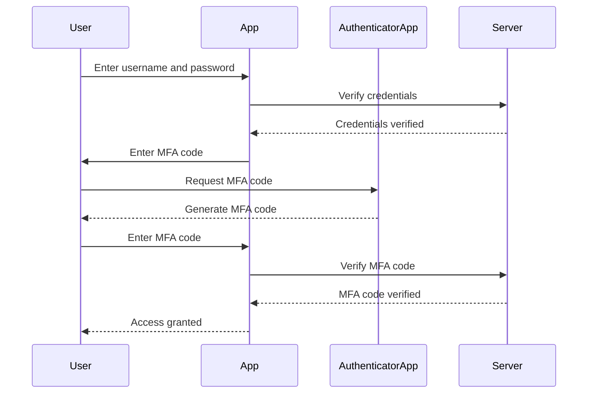

## Multi-Factor Authentication (MFA)

### Background Theory

Multi-Factor Authentication (MFA) is an authentication method that requires users to provide two or more verification factors to gain access to a resource such as an application or a website. MFA adds an extra layer of security beyond the traditional username and password combination.

### Why MFA Matters

With the increasing sophistication of cyberattacks, including brute-force attacks and phishing, relying solely on username and password combinations is no longer sufficient. MFA provides an additional barrier that makes it much harder for attackers to gain unauthorized access.

### How MFA Works Under the Hood

MFA typically involves three types of verification factors:
1. **Something you know** (e.g., password)
2. **Something you have** (e.g., mobile phone, hardware token)
3. **Something you are** (e.g., biometric data like fingerprint or facial recognition)

When a user attempts to log in, they are prompted to provide a second factor after entering their username and password. This second factor is usually sent to the user via a text message, email, or generated by an authenticator app.

#### Example of MFA Implementation



### Common Pitfalls

One common pitfall is relying solely on SMS-based MFA, which can be intercepted by attackers. More secure methods include using authenticator apps or hardware tokens.

### Real-World Examples

The Twitter hack in 2020, where high-profile accounts were compromised, highlighted the importance of MFA. The attackers gained access to the accounts by bypassing weak security measures, emphasizing the need for robust MFA implementations.

### How to Prevent / Defend

#### Detection

Organizations can monitor login attempts and flag suspicious activity, such as repeated failed login attempts or logins from unusual locations.

#### Prevention

Implementing MFA is crucial. Organizations should encourage users to enable MFA and provide guidance on how to set it up securely. Using authenticator apps or hardware tokens is recommended over SMS-based MFA.

#### Secure Coding Fix

Here is an example of a secure coding approach to implementing MFA:

```python
import pyotp

def generate_mfa_secret():
    return pyotp.random_base32()

def verify_mfa_code(secret, code):
    totp = pyotp.TOTP(secret)
    return totp.verify(code)

# Example usage
secret = generate_mfa_secret()
print(f"MFA secret: {secret}")

code = input("Enter MFA code: ")
if verify_mfa_code(secret, code):
    print("MFA code verified")
else:
    print("Invalid MFA code")
```

### Summary

MFA is a critical component of modern security practices. By requiring users to provide an additional verification factor, MFA significantly enhances the security of user accounts against various types of attacks.

---
<!-- nav -->
[[10-Multi-Factor Authentication (MFA) Part 1|Multi-Factor Authentication (MFA) Part 1]] | [[DevSecOps/DevSecOps Bootcamp/03-Identity & Access Management/04-Security Essentials/OWASP top 10 Part 2/00-Overview|Overview]] | [[12-Password Strength Requirements|Password Strength Requirements]]
