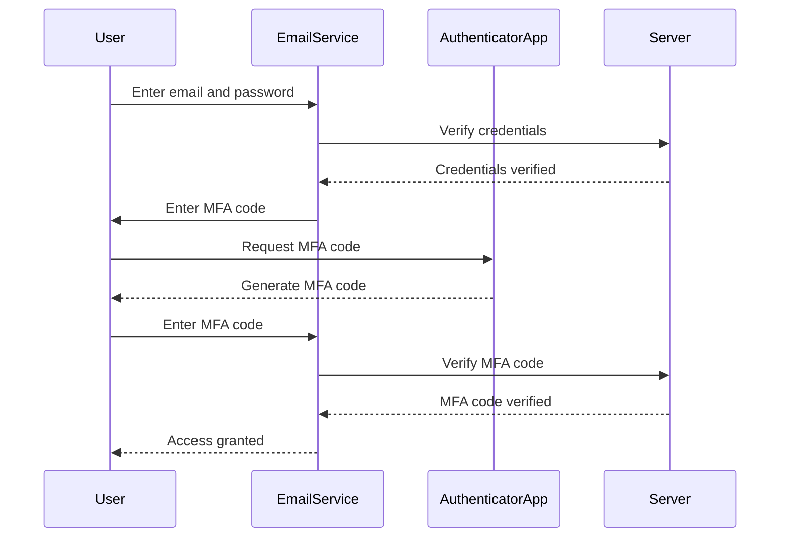

## Protecting Primary Email Addresses

### Background Theory

Primary email addresses are often used across multiple platforms and services. If an attacker gains access to a user's primary email account, they can potentially compromise all other accounts associated with that email address.

### Why Protecting Primary Email Addresses Matters

Many services use email addresses for password resets and account recovery. If an attacker can access a user's primary email account, they can reset passwords and take control of other accounts. Therefore, securing the primary email address is crucial for overall account security.

### How to Protect Primary Email Addresses

Protecting primary email addresses involves several steps:
1. **Enforcing Strong Password Policies**: Ensure that the email account itself uses a strong password.
2. **Implementing MFA**: Enable MFA on the email account to add an extra layer of security.
3. **Monitoring Account Activity**: Regularly check account activity logs for any suspicious behavior.

#### Example of Securing an Email Account



### Common Pitfalls

One common pitfall is using the same password across multiple accounts, including the primary email account. This can lead to a domino effect where compromising one account leads to compromising others.

### Real-World Examples

The Yahoo data breach in 2013, where hackers accessed over 500 million user accounts, demonstrated the risks of weak security measures. Many users had reused passwords across multiple accounts, leading to widespread account compromises.

### How to Prevent / Defend

#### Detection

Organizations can monitor login attempts and flag suspicious activity, such as repeated failed login attempts or logins from unusual locations.

#### Prevention

Implementing strong password policies and enabling MFA on primary email accounts is crucial. Users should also avoid reusing passwords across multiple accounts.

#### Secure Coding Fix

Here is an example of a secure coding approach to implementing MFA for an email account:

```python
import pyotp

def generate_mfa_secret():
    return pyotp.random_base32()

def verify_mfa_code(secret, code):
    totp = pyotp.TOTP(secret)
    return totp.verify(code)

# Example usage
email = "user@example.com"
password = "strongpassword"
secret = generate_mfa_secret()
print(f"MFA secret: {secret}")

code = input("Enter MFA code: ")
if verify_mfa_code(secret, code):
    print("MFA code verified")
else:
    1 print("Invalid MFA code")
```

### Summary

Protecting primary email addresses is essential for maintaining overall account security. By enforcing strong password policies and implementing MFA, organizations can significantly reduce the risk of account compromises.

---
<!-- nav -->
[[12-Password Strength Requirements|Password Strength Requirements]] | [[DevSecOps/DevSecOps Bootcamp/03-Identity & Access Management/04-Security Essentials/OWASP top 10 Part 2/00-Overview|Overview]] | [[14-Server-Side Request Forgery (SSRF)|Server-Side Request Forgery (SSRF)]]
