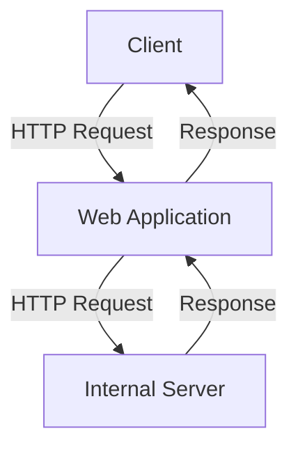
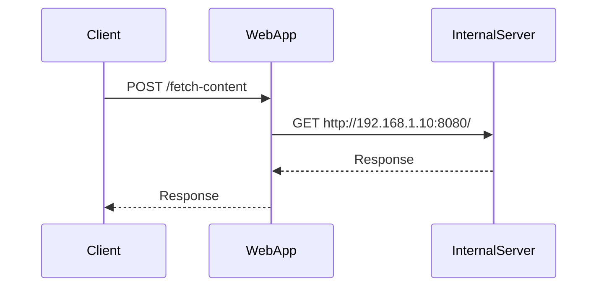

## Server-Side Request Forgery (SSRF)

### Introduction to SSRF

Server-Side Request Forgery (SSRF) is a type of web security vulnerability that occurs when an application takes input from a user and includes it in an HTTP request made by the server. This can lead to unauthorized access to internal systems, such as databases, secrets managers, and other services that are typically protected from external access. The primary issue with SSRF is that the server has elevated privileges compared to the client (browser), allowing attackers to leverage these privileges to perform malicious actions.

### Why SSRF Matters

SSRF is particularly dangerous because it allows attackers to bypass security measures such as Web Application Firewalls (WAFs) and Network Access Control Lists (NACLs). These security mechanisms are designed to protect against external threats but may not be effective against internal attacks initiated by the server itself. By exploiting SSRF, attackers can:

- **Scan Internal Networks**: Identify open ports and services running on internal servers.
- **Access Internal Resources**: Retrieve sensitive data from internal systems, such as password files or configuration settings.
- **Exploit Other Vulnerabilities**: Use the SSRF vulnerability to chain attacks and exploit other vulnerabilities within the internal network.

### How SSRF Works

#### Scenario: Port Scanning

One common scenario for SSRF is port scanning. Attackers can use SSRF to send HTTP requests to various ports on internal servers to determine which services are running and accessible. This is done by sending a URL that the server will execute, often through a parameter in a form or API endpoint.

For example, consider a web application that allows users to specify a URL to fetch content from. An attacker could craft a request to scan ports on an internal server:

```http
POST /fetch-content HTTP/1.1
Host: vulnerable-app.com
Content-Type: application/x-www-form-urlencoded

url=http://192.168.1.10:8080/
```

The server would then make an HTTP request to `http://192.168.1.10:8080/` and return the result to the attacker. If the port is open, the server might receive a successful response; otherwise, it might receive a connection timeout or rejection.

#### Example: Probing Open Ports

Here’s a detailed example of how an attacker might use SSRF to probe open ports:

```http
POST /fetch-content HTTP/1.1
Host: vulnerable-app.com
Content-Type: application/x-www-form-urlencoded

url=http://192.168.1.10:22/
```

If the server responds with a successful HTTP response, it indicates that port 22 is open, possibly indicating an SSH service. If the server times out or returns a connection error, it suggests that the port is closed.

### Real-World Examples

#### Recent Breaches Involving SSRF

Several high-profile breaches have involved SSRF vulnerabilities. One notable example is the breach of a major cloud provider in 2021, where attackers exploited an SSRF vulnerability to gain unauthorized access to internal systems. The attackers used SSRF to scan internal networks and identify open ports, leading to further exploitation of other vulnerabilities.

Another example is the exploitation of SSRF in a popular web application framework, which allowed attackers to read sensitive files from the file system and gain unauthorized access to internal services.

### Detection and Prevention

#### How to Detect SSRF

Detecting SSRF vulnerabilities requires monitoring and analyzing HTTP requests made by the server. Tools such as WAFs and intrusion detection systems (IDS) can help identify suspicious patterns in HTTP requests. Additionally, regular security audits and penetration testing can help identify potential SSRF vulnerabilities.

#### How to Prevent SSRF

Preventing SSRF involves several steps:

1. **Input Validation**: Ensure that user-provided URLs are validated and sanitized to prevent malicious input.
2. **Whitelisting**: Restrict the server to only allow requests to specific, trusted domains and IP addresses.
3. **Network Segmentation**: Use network segmentation to isolate internal systems and limit the scope of potential damage.
4. **Secure Coding Practices**: Implement secure coding practices to avoid common vulnerabilities such as SSRF.

#### Secure Code Fix

Here’s an example of how to implement secure coding practices to prevent SSRF:

**Vulnerable Code:**

```python
from flask import Flask, request

app = Flask(__name__)

@app.route('/fetch-content', methods=['POST'])
def fetch_content():
    url = request.form['url']
    response = requests.get(url)
    return response.text
```

**Fixed Code:**

```python
from flask import Flask, request
import requests

app = Flask(__name__)

@app.route('/fetch-content', methods=['POST'])
def fetch_content():
    url = request.form['url']
    if not url.startswith('https://example.com'):
        return "Invalid URL", 400
    response = requests.get(url)
    return response.text
```

In the fixed code, we validate the URL to ensure it only points to a trusted domain (`https://example.com`). This prevents attackers from using SSRF to access internal systems.

### Mermaid Diagrams

#### Network Topology



This diagram shows the flow of an HTTP request from the client to the web application, which then makes an HTTP request to an internal server.

#### Sequence Diagram



This sequence diagram illustrates the steps involved in an SSRF attack, showing the interaction between the client, web application, and internal server.

### Hands-On Labs

To practice and understand SSRF vulnerabilities, you can use the following labs:

- **PortSwigger Web Security Academy**: Offers interactive labs to learn about SSRF and other web security vulnerabilities.
- **OWASP Juice Shop**: A deliberately insecure web application for practicing web security skills.
- **DVWA (Damn Vulnerable Web Application)**: A PHP/MySQL web application that is riddled with vulnerabilities for educational purposes.

These labs provide a safe environment to explore SSRF and other web security concepts.

### Conclusion

Server-Side Request Forgery (SSRF) is a serious web security vulnerability that can lead to unauthorized access to internal systems. Understanding how SSRF works, detecting and preventing it, and implementing secure coding practices are crucial for maintaining the security of web applications. By following the steps outlined in this chapter, you can effectively mitigate the risks associated with SSRF and protect your applications from potential attacks.

---
<!-- nav -->
[[13-Protecting Primary Email Addresses|Protecting Primary Email Addresses]] | [[DevSecOps/DevSecOps Bootcamp/03-Identity & Access Management/04-Security Essentials/OWASP top 10 Part 2/00-Overview|Overview]] | [[15-Session Management and Inactivity Timeout|Session Management and Inactivity Timeout]]
