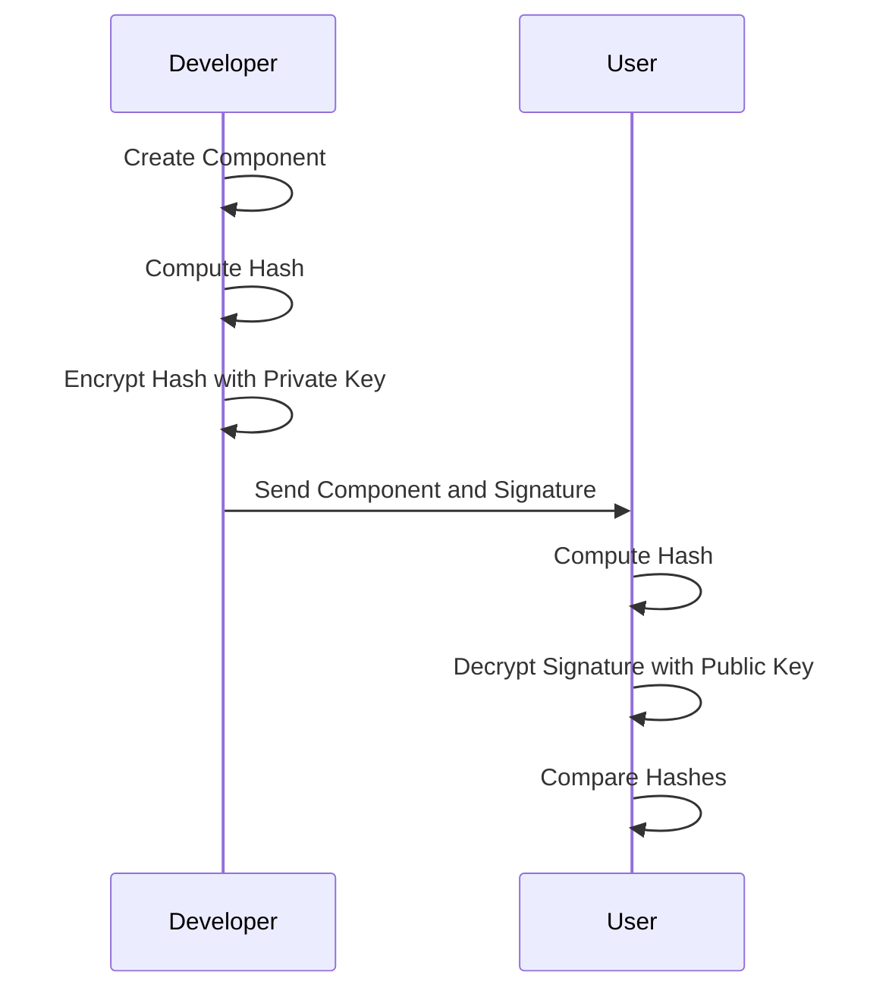
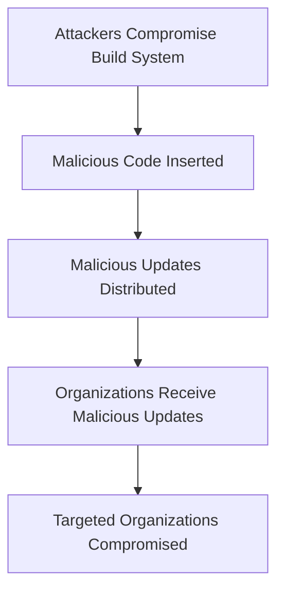
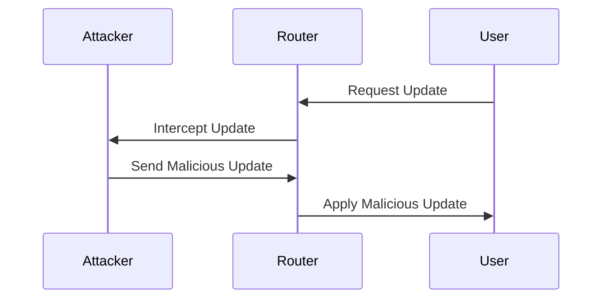
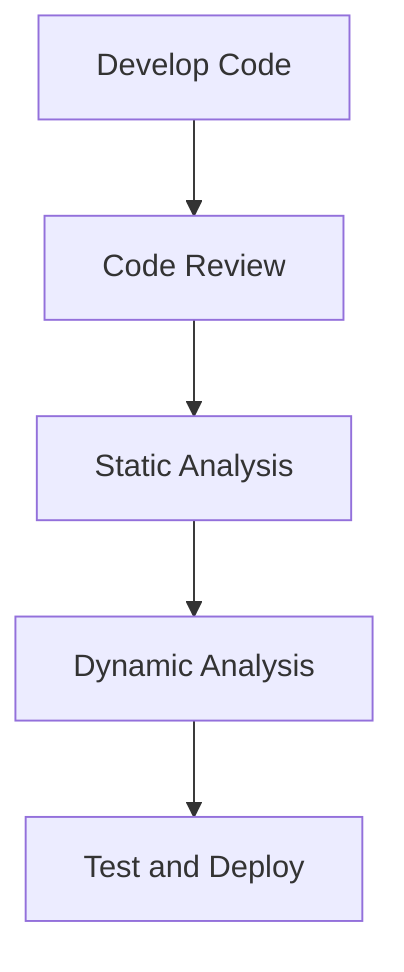
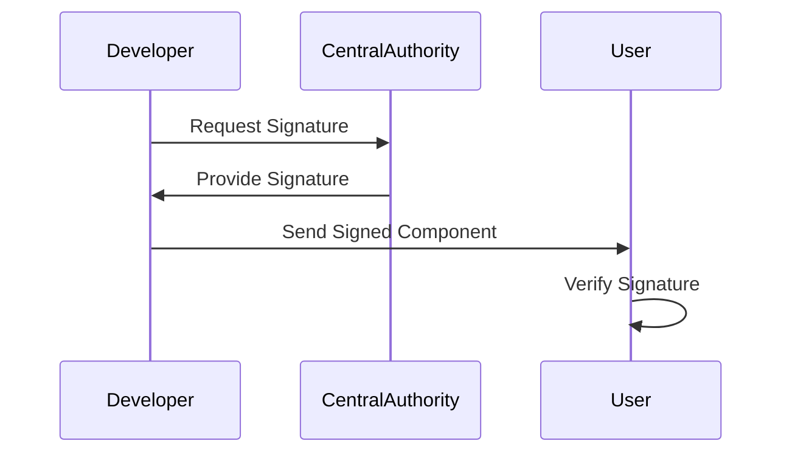
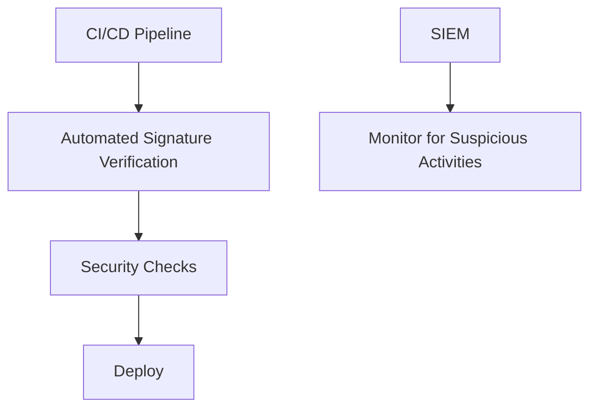

## Software Supply Chain Security

### Introduction to Software Supply Chain Attacks

Software supply chain attacks involve compromising the integrity of software components or updates during their development, distribution, or deployment phases. These attacks can occur at various points in the software lifecycle, including the initial creation of code, the integration of third-party libraries, and the distribution of final products. Attackers can manipulate or inject malicious code into trusted repositories, leading to widespread compromise across multiple installations.

### Digital Signatures and Their Importance

Digital signatures play a crucial role in ensuring the integrity and authenticity of software components. A digital signature is a cryptographic mechanism that verifies the identity of the signer and ensures that the signed data has not been altered. This is achieved through a combination of public key cryptography and hash functions.

#### How Digital Signatures Work

1. **Hash Function**: The software component is first processed through a hash function, which generates a unique hash value (digest) based on the content of the component.
2. **Signature Creation**: The hash value is then encrypted using the private key of the signer. This encrypted hash value forms the digital signature.
3. **Verification**: During verification, the recipient uses the signer’s public key to decrypt the signature, obtaining the original hash value. The recipient also computes the hash of the received component and compares it with the decrypted hash value. If they match, the component is considered authentic and unaltered.

### Real-World Examples of Supply Chain Attacks

One of the most notable examples of a supply chain attack is the SolarWinds Orion incident. In this case, attackers managed to insert a backdoor into the SolarWinds Orion software, which was then distributed to thousands of organizations. The attackers exploited the trust in SolarWinds, a reputable software vendor, to gain access to sensitive systems.

#### SolarWinds Orion Attack Details

- **Attack Vector**: The attackers compromised SolarWinds’ build system and inserted malicious code into the Orion software updates.
- **Impact**: Over 18,000 organizations received the malicious updates, with around 100 being actively targeted.
- **Timeline**: The attack went undetected for several months, highlighting the stealth and sophistication of the attackers.

### Unsigned Software and Firmware

Unsigned software and firmware lack the cryptographic guarantees provided by digital signatures. This makes them particularly vulnerable to tampering and manipulation. Many consumer devices, such as home routers and IoT devices, often rely on unsigned firmware updates, making them attractive targets for attackers.

#### Example: Home Routers and IoT Devices

Home routers and IoT devices frequently receive firmware updates that are not signed. This allows attackers to intercept and modify these updates, potentially gaining control over the devices. For instance, a router update could be intercepted and replaced with a malicious version that establishes a backdoor for remote access.

### Detection and Prevention Strategies

To mitigate the risks associated with software supply chain attacks, organizations should implement robust detection and prevention mechanisms.

#### Secure Coding Practices

Secure coding practices ensure that software is developed with security in mind from the outset. This includes:

- **Code Reviews**: Regularly reviewing code for security vulnerabilities.
- **Static Analysis Tools**: Using tools like SonarQube or Fortify to identify potential issues.
- **Dynamic Analysis Tools**: Employing tools like Burp Suite or ZAP to test applications in runtime environments.

#### Digital Signature Verification

Implementing strict digital signature verification policies ensures that only authenticated and unaltered software components are deployed. This involves:

- **Automated Verification**: Automating the process of verifying digital signatures during deployment.
- **Centralized Signing Authority**: Establishing a centralized authority responsible for signing and managing digital certificates.

#### Regular Audits and Monitoring

Regular audits and continuous monitoring help detect and respond to potential supply chain attacks. This includes:

- **Continuous Integration/Continuous Deployment (CI/CD)**: Implementing CI/CD pipelines that automatically verify signatures and perform security checks.
- **Security Information and Event Management (SIEM)**: Utilizing SIEM tools to monitor for suspicious activities related to software updates and deployments.

### Hands-On Labs for Practice

For hands-on practice in securing software supply chains, consider the following labs:

- **PortSwigger Web Security Academy**: Offers modules on secure coding practices and supply chain security.
- **OWASP Juice Shop**: Provides a vulnerable application for practicing secure coding and supply chain security.
- **DVWA (Damn Vulnerable Web Application)**: Useful for learning about various web application vulnerabilities, including those related to software supply chains.

These labs provide practical experience in identifying and mitigating supply chain attacks, helping to reinforce theoretical knowledge with real-world scenarios.

### Conclusion

Ensuring the security of the software supply chain is critical in today’s interconnected world. By implementing strong digital signature verification, secure coding practices, and regular audits, organizations can significantly reduce the risk of supply chain attacks. Understanding the mechanics of these attacks and the importance of cryptographic guarantees is essential for maintaining the integrity and security of software components.

---
<!-- nav -->
[[15-Session Management and Inactivity Timeout|Session Management and Inactivity Timeout]] | [[DevSecOps/DevSecOps Bootcamp/03-Identity & Access Management/04-Security Essentials/OWASP top 10 Part 2/00-Overview|Overview]] | [[17-Standardized Authentication Frameworks|Standardized Authentication Frameworks]]
