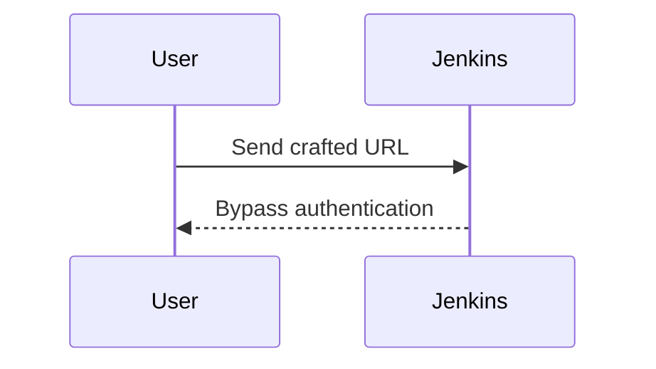
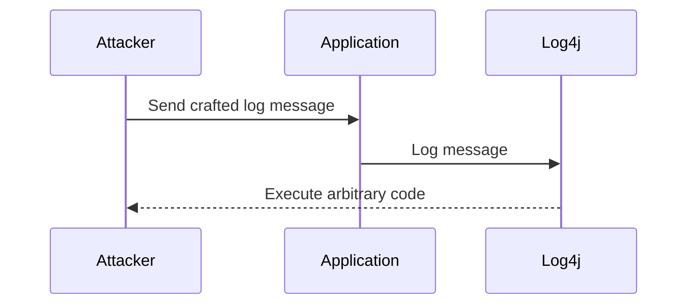

## Standardized Authentication Frameworks

### Background Theory

Authentication is a critical component of any application, ensuring that users are who they claim to be. Implementing authentication correctly requires a deep understanding of security principles, cryptographic techniques, and potential attack vectors. However, developing a robust authentication mechanism from scratch is complex and error-prone. This is where standardized authentication frameworks come into play.

Standardized authentication frameworks provide pre-built solutions that handle the intricate details of user authentication, including session management, token generation, and token revocation. These frameworks are developed by security experts who have extensive experience in creating secure systems. By leveraging these frameworks, developers can focus on their core business logic rather than reinventing the wheel for authentication.

### Why Use Standardized Authentication Frameworks?

Using standardized authentication frameworks offers several advantages:

1. **Security Expertise**: Frameworks are developed by security professionals who understand the latest threats and countermeasures. They incorporate best practices and security features that might be overlooked by individual developers.
   
2. **Reduced Development Time**: Implementing authentication from scratch requires significant time and effort. Using a framework allows developers to quickly integrate secure authentication mechanisms into their applications.

3. **Maintenance and Updates**: Frameworks are regularly updated to address new vulnerabilities and security issues. Developers benefit from these updates without having to manually patch their custom implementations.

4. **Community Support**: Popular frameworks have large communities of users and contributors. This community support means that issues are identified and resolved quickly, and best practices are shared widely.

### Common Vulnerabilities in Custom Authentication

Custom authentication implementations often suffer from common vulnerabilities such as:

- **Weak Password Storage**: Storing passwords in plaintext or using weak hashing algorithms like MD5.
- **Insecure Session Management**: Poor handling of session IDs, leading to session hijacking.
- **Token Revocation Issues**: Inadequate mechanisms for revoking compromised tokens.

### Real-World Example: CVE-2021-21972

A notable example of a vulnerability in a custom authentication implementation is CVE-2021-21972, which affected the Jenkins Continuous Integration server. Jenkins allowed attackers to bypass authentication by manipulating certain parameters in the URL. This vulnerability was due to a lack of proper input validation and session management.



### How to Prevent / Defend

#### Secure Authentication Implementation

To prevent such vulnerabilities, developers should:

1. **Use Established Frameworks**: Leverage well-known authentication frameworks like OAuth, OpenID Connect, or Spring Security.
2. **Strong Password Policies**: Enforce strong password policies, including minimum length, complexity requirements, and regular password changes.
3. **Secure Token Handling**: Use secure methods for generating and managing tokens, such as JWT (JSON Web Tokens) with proper signing and encryption.
4. **Regular Audits**: Conduct regular security audits and penetration testing to identify and mitigate vulnerabilities.

#### Example: Secure Authentication with Spring Security

Here’s an example of how to implement secure authentication using Spring Security:

```java
@Configuration
@EnableWebSecurity
public class SecurityConfig extends WebSecurityConfigurerAdapter {

    @Autowired
    private UserDetailsService userDetailsService;

    @Override
    protected void configure(AuthenticationManagerBuilder auth) throws Exception {
        auth.userDetailsService(userDetailsService).passwordEncoder(passwordEncoder());
    }

    @Override
    protected void configure(HttpSecurity http) throws Exception {
        http
            .authorizeRequests()
                .antMatchers("/login").permitAll()
                .anyRequest().authenticated()
                .and()
            .formLogin()
                .loginPage("/login")
                .defaultSuccessUrl("/")
                .permitAll()
                .and()
            .logout()
                .logoutUrl("/logout")
                .logoutSuccessUrl("/login?logout")
                .invalidateHttpSession(true)
                .deleteCookies("JSESSIONID");
    }

    @Bean
    public PasswordEncoder passwordEncoder() {
        return new BCryptPasswordEncoder();
    }
}
```

### Vulnerable vs. Secure Code Comparison

#### Vulnerable Code

```java
// Vulnerable code: Storing passwords in plaintext
public class UserRepository {

    public void save(User user) {
        // Store user details in database
        // Password stored in plaintext
        jdbcTemplate.update("INSERT INTO users (username, password) VALUES (?, ?)", 
                             user.getUsername(), user.getPassword());
    }
}
```

#### Secure Code

```java
// Secure code: Using BCryptPasswordEncoder to hash passwords
public class UserRepository {

    private final PasswordEncoder passwordEncoder;

    public UserRepository(PasswordEncoder passwordEncoder) {
        this.passwordEncoder = passwordEncoder;
    }

    public void save(User user) {
        String hashedPassword = passwordEncoder.encode(user.getPassword());
        jdbcTemplate.update("INSERT INTO users (username, password) VALUES (?, ?)", 
                             user.getUsername(), hashedPassword);
    }
}
```

### Non-Validated Sources

### Background Theory

Another critical aspect of application security is the use of code libraries, plugins, and tools from trusted sources. Applications often rely on third-party components to extend functionality, but these components can introduce significant risks if they come from unverified sources.

### Why Use Trusted Sources?

Using components from trusted sources ensures that the code has been vetted for security vulnerabilities and is maintained by reputable organizations. This reduces the likelihood of introducing malicious code into your application.

### Common Vulnerabilities in Untrusted Components

Using untrusted components can lead to various security issues, including:

- **Malicious Code Execution**: Plugins or libraries from untrusted sources may contain backdoors or other malicious code.
- **Unauthorized Access**: Components from untrusted sources may grant unauthorized access to sensitive data or system resources.
- **Platform Compromise**: Integrating untrusted components can result in the compromise of the entire application or platform.

### Real-World Example: Log4j Vulnerability (CVE-2021-44228)

The Log4j vulnerability (CVE-2021-44228) is a prime example of the risks associated with using untrusted components. Log4j is a widely used logging library that was found to have a critical vulnerability allowing remote code execution. Many applications that relied on Log4j were affected, leading to widespread exploitation.



### How to Prevent / Defend

#### Secure Component Usage

To prevent such vulnerabilities, developers should:

1. **Use Trusted Repositories**: Only use components from trusted repositories such as Maven Central, npmjs, or PyPI.
2. **Regularly Update Components**: Keep all components up to date with the latest security patches.
3. **Dependency Scanning**: Use tools like OWASP Dependency-Check or Snyk to scan dependencies for known vulnerabilities.
4. **Code Reviews**: Conduct thorough code reviews to ensure that all components are from trusted sources.

#### Example: Secure Component Usage with Maven

Here’s an example of how to ensure secure component usage with Maven:

```xml
<project>
    <modelVersion>4.0.0</modelVersion>
    <groupId>com.example</groupId>
    <artifactId>secure-app</artifactId>
    <version>1.0-SNAPSHOT</version>

    <dependencies>
        <dependency>
            <groupId>org.apache.logging.log4j</groupId>
            <artifactId>log4j-core</artifactId>
            <version>2.17.1</version>
        </dependency>
    </dependencies>

    <build>
        <plugins>
            <plugin>
                <groupId>org.owasp</groupId>
                <artifactId>dependency-check-maven</artifactId>
                <version>6.5.2</version>
                <executions>
                    <execution>
                        <goals>
                            <goal>check</goal>
                        </goals>
                    </execution>
                </executions>
            </plugin>
        </plugins>
    </build>
</project>
```

### Vulnerable vs. Secure Code Comparison

#### Vulnerable Code

```xml
<!-- Vulnerable code: Using outdated and potentially vulnerable dependency -->
<dependency>
    <groupId>org.apache.logging.log4j</groupId>
    <artifactId>log4j-core</artifactId>
    <version>2.14.1</version>
</dependency>
```

#### Secure Code

```xml
<!-- Secure code: Using the latest version of the dependency -->
<dependency>
    <groupId>org.apache.logging.log4j</groupId>
    <artifactId>log4j-core</artifactId>
    <version>2.17.1</version>
</dependency>
```

### Conclusion

By leveraging standardized authentication frameworks and using components from trusted sources, developers can significantly enhance the security of their applications. Understanding the risks associated with custom authentication and untrusted components, and implementing appropriate defenses, is crucial for maintaining a secure development environment.

### Practice Labs

For hands-on practice with these concepts, consider the following labs:

- **PortSwigger Web Security Academy**: Offers comprehensive labs on secure authentication and dependency management.
- **OWASP Juice Shop**: Provides a vulnerable web application for practicing secure coding and dependency scanning.
- **CloudGoat**: Focuses on cloud security and includes scenarios for securing authentication mechanisms and managing dependencies in cloud environments.

These labs will help reinforce the theoretical knowledge gained from this chapter and provide practical experience in implementing secure authentication and managing dependencies.

---
<!-- nav -->
[[16-Software Supply Chain Security|Software Supply Chain Security]] | [[DevSecOps/DevSecOps Bootcamp/03-Identity & Access Management/04-Security Essentials/OWASP top 10 Part 2/00-Overview|Overview]] | [[18-Understanding Multi-Step Attacks|Understanding Multi-Step Attacks]]
