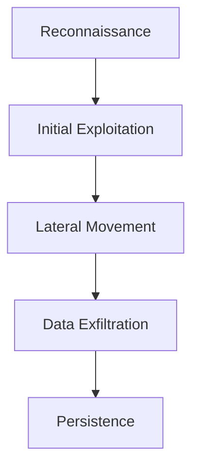

## Understanding Multi-Step Attacks

### What Are Multi-Step Attacks?

Multi-step attacks are sophisticated cyberattacks that involve a series of coordinated actions to achieve a specific goal, such as gaining unauthorized access to a system, stealing sensitive data, or disrupting services. Unlike single-step attacks, which rely on a single exploit or vulnerability, multi-step attacks require the attacker to perform multiple actions over an extended period. These actions can range from reconnaissance and initial exploitation to lateral movement and data exfiltration.

### Why Do Multi-Step Attacks Matter?

Multi-step attacks are significant because they are often more difficult to detect and mitigate than single-step attacks. Attackers can blend their activities with normal network traffic, making it challenging for security systems to identify malicious behavior. Additionally, these attacks can leverage multiple vulnerabilities or weaknesses, increasing the likelihood of success.

### How Do Multi-Step Attacks Work?

To understand how multi-step attacks work, let's break down the process:

1. **Reconnaissance**: The attacker gathers information about the target system, including network topology, open ports, running services, and potential vulnerabilities.
2. **Initial Exploitation**: The attacker uses the gathered information to exploit a vulnerability, gaining initial access to the system.
3. **Lateral Movement**: Once inside, the attacker moves laterally within the network to gain deeper access and control over critical resources.
4. **Data Exfiltration**: The attacker extracts sensitive data from the system, often using encryption or other techniques to avoid detection.
5. **Persistence**: To maintain long-term access, the attacker may install backdoors or other mechanisms to regain access even after being detected.

### Real-World Examples

#### Example 1: Target Data Breach (2013)

In 2013, hackers breached Target's payment systems, stealing data from up to 40 million credit and debit card accounts. The attack involved multiple steps:

1. **Reconnaissance**: The attackers gained access to Target's network through a HVAC vendor's credentials.
2. **Initial Exploitation**: They used the stolen credentials to gain access to Target's internal network.
3. **Lateral Movement**: The attackers moved laterally within the network, eventually reaching the point-of-sale (POS) systems.
4. **Data Exfiltration**: They extracted credit card data from the POS systems and sent it out of the network.
5. **Persistence**: The attackers maintained access to the network for months, allowing them to continue their activities undetected.

#### Example 2: Equifax Data Breach (2017)

In 2017, Equifax suffered a massive data breach that exposed personal information of approximately 143 million consumers. The attack involved multiple steps:

1. **Reconnaissance**: The attackers identified a vulnerability in Apache Struts, a web application framework used by Equifax.
2. **Initial Exploitation**: They exploited the vulnerability to gain access to Equifax's network.
3. **Lateral Movement**: The attackers moved laterally within the network, accessing various systems and databases.
4. **Data Exfiltration**: They extracted sensitive data, including Social Security numbers, birth dates, and addresses.
5. **Persistence**: The attackers maintained access to the network for weeks, allowing them to continue their activities undetected.

### Detailed Attack Chain Diagram

Let's visualize the attack chain using a mermaid diagram:



### Common Pitfalls

#### Lack of Monitoring and Detection

One of the most significant pitfalls in defending against multi-step attacks is the lack of effective monitoring and detection mechanisms. Without proper monitoring, organizations are blind to the activities of attackers, allowing them to proceed undetected.

#### Insufficient Logging and Auditing

Insufficient logging and auditing can also hinder the ability to detect and respond to multi-step attacks. Logs provide crucial information about the activities performed on a system, and without comprehensive logging, it is difficult to trace the steps taken by an attacker.

#### Weak Authentication and Authorization

Weak authentication and authorization mechanisms can make it easier for attackers to gain initial access and move laterally within a network. Strong authentication and authorization controls are essential to preventing unauthorized access.

### How to Prevent / Defend Against Multi-Step Attacks

#### Detection

Effective detection of multi-step attacks requires a combination of real-time monitoring, logging, and anomaly detection. Here are some key strategies:

1. **Real-Time Monitoring**: Implement real-time monitoring tools to detect unusual activity on the network and systems. Tools like SIEM (Security Information and Event Management) can help aggregate and analyze logs from various sources.
2. **Logging and Auditing**: Ensure comprehensive logging and auditing across all systems and networks. Logs should capture detailed information about user activities, system events, and network traffic.
3. **Anomaly Detection**: Use machine learning and statistical methods to detect anomalies in network traffic and system behavior. Anomalies can indicate the presence of an attacker.

#### Prevention

Preventing multi-step attacks involves implementing robust security controls and practices. Here are some key strategies:

1. **Network Segmentation**: Segment the network to limit the spread of an attack. By isolating critical systems and data, you can reduce the impact of an attack.
2. **Strong Authentication and Authorization**: Implement strong authentication mechanisms, such as multi-factor authentication (MFA), and enforce strict authorization policies to control access to resources.
3. **Patch Management**: Regularly update and patch systems to address known vulnerabilities. Automated patch management tools can help ensure that systems are kept up-to-date.
4. **Secure Configuration**: Follow secure configuration guidelines for all systems and applications. Hardening guides and frameworks like CIS (Center for Internet Security) can provide best practices for securing systems.

#### Secure Coding Fixes

Here is an example of a vulnerable code snippet and its secure counterpart:

**Vulnerable Code:**

```python
import os

def read_file(filename):
    with open(filename, 'r') as f:
        return f.read()

filename = input("Enter filename: ")
content = read_file(filename)
print(content)
```

**Secure Code:**

```python
import os

def read_file(filename):
    if os.path.isfile(filename):
        with open(filename, 'r') as f:
            return f.read()
    else:
        raise FileNotFoundError("File does not exist")

filename = input("Enter filename: ")
try:
    content = read_file(filename)
    print(content)
except FileNotFoundError as e:
    print(e)
```

### Complete Example: Full HTTP Request and Response

Let's consider a scenario where an attacker is attempting to exploit a SQL injection vulnerability. Here is a complete example of the HTTP request and response:

**HTTP Request:**

```http
POST /search.php HTTP/1.1
Host: example.com
Content-Type: application/x-www-form-urlencoded
Content-Length: 29

query=1' OR '1'='1
```

**HTTP Response:**

```http
HTTP/1.1 200 OK
Date: Mon, 23 Jan 2023 12:00:00 GMT
Server: Apache/2.4.41 (Ubuntu)
Content-Type: text/html; charset=UTF-8
Content-Length: 1234

<!DOCTYPE html>
<html>
<head>
    <title>Search Results</title>
</head>
<body>
    <h1>Search Results</h1>
    <ul>
        <li>User 1</li>
        <li>User 2</li>
        <li>User 3</li>
        <!-- More results -->
    </ul>
</body>
</html>
```

### How to Detect and Mitigate SQL Injection

#### Detection

To detect SQL injection attacks, you can implement the following measures:

1. **Web Application Firewall (WAF)**: Use a WAF to filter out malicious SQL injection payloads.
2. **Input Validation**: Validate all user inputs to ensure they conform to expected formats and patterns.
3. **Error Handling**: Implement proper error handling to prevent sensitive information from being exposed in error messages.

#### Mitigation

To mitigate SQL injection attacks, follow these best practices:

1. **Parameterized Queries**: Use parameterized queries to separate SQL code from user inputs.
2. **Stored Procedures**: Use stored procedures to encapsulate SQL logic and prevent direct execution of SQL statements.
3. **Least Privilege Principle**: Ensure that database users have the minimum privileges necessary to perform their tasks.

### Hands-On Labs

For hands-on practice with multi-step attacks, consider the following labs:

- **PortSwigger Web Security Academy**: Offers interactive labs covering various web security topics, including multi-step attacks.
- **OWASP Juice Shop**: A deliberately insecure web application for practicing web security skills.
- **DVWA (Damn Vulnerable Web Application)**: A PHP/MySQL web application that demonstrates common web application vulnerabilities.

By thoroughly understanding and implementing these strategies, organizations can significantly improve their ability to detect and prevent multi-step attacks.

---
<!-- nav -->
[[17-Standardized Authentication Frameworks|Standardized Authentication Frameworks]] | [[DevSecOps/DevSecOps Bootcamp/03-Identity & Access Management/04-Security Essentials/OWASP top 10 Part 2/00-Overview|Overview]] | [[19-Vulnerable External Third-Party Components|Vulnerable External Third-Party Components]]
