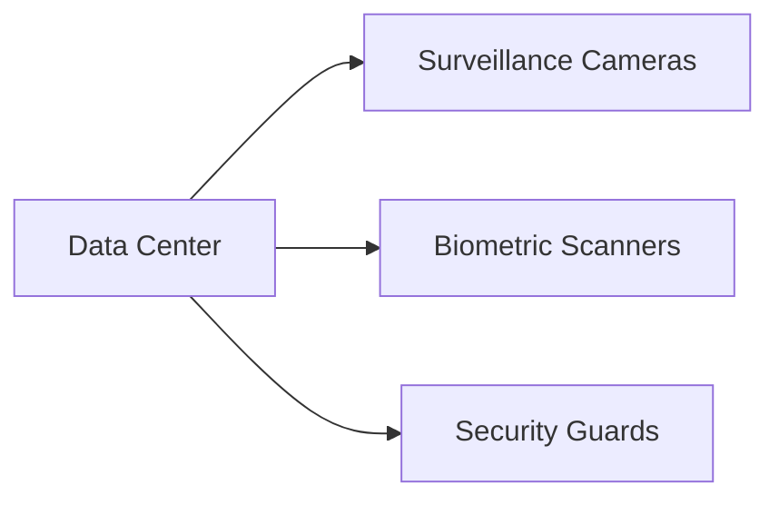
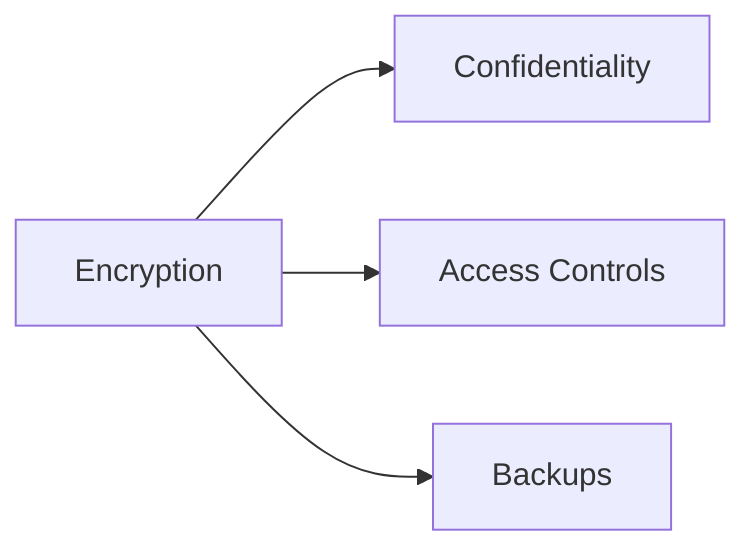
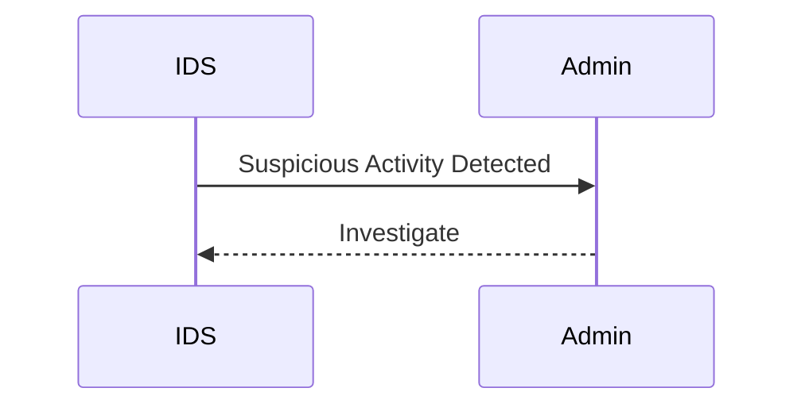
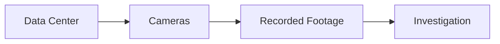

## Security in Layers

### Introduction to Layered Security

Layered security, also known as defense-in-depth, is a strategy that involves implementing multiple layers of security controls to protect an organization's assets. This approach is analogous to securing a house with multiple layers of protection: a sturdy wall, a locked front door, locked rooms, and a vault within those rooms. Each layer serves as a barrier against potential threats, and even if one layer is compromised, others remain intact to provide continued protection.

### Conceptual Framework

#### Physical Security

Physical security is the first line of defense. In the context of a house, this includes walls, fences, and gates. In a digital environment, physical security might involve securing data centers, servers, and network equipment. 

**Example**: A data center might employ biometric scanners, security guards, and surveillance cameras to ensure that unauthorized individuals cannot access the physical infrastructure.



#### Network Security

Network security involves protecting the communication channels between different parts of the system. This includes firewalls, intrusion detection systems (IDS), and intrusion prevention systems (IPS).

**Example**: A firewall can be configured to allow only specific types of traffic and block malicious packets. An IDS can monitor network traffic for suspicious patterns and alert administrators.

```mermaid
graph LR
    A[Firewall] --> B[Intrusion Detection System (IDS)]
    A --> C[Intrusion Prevention System (IPS)]
```

#### Application Security

Application security focuses on securing the software applications themselves. This includes input validation, authentication mechanisms, and encryption.

**Example**: Input validation ensures that user inputs are sanitized to prevent SQL injection attacks. Authentication mechanisms like multi-factor authentication (MFA) add an extra layer of security.

```mermaid
graph LR
    A[Input Validation] --> B[SQL Injection Prevention]
    A --> C[Multifactor Authentication (MFA)]
```

#### Data Security

Data security involves protecting the confidentiality, integrity, and availability of data. This includes encryption, access controls, and backups.

**Example**: Encryption ensures that data is unreadable to unauthorized users. Access controls limit who can view or modify data. Backups ensure that data can be restored in case of loss or corruption.



### Real-World Examples

#### Recent Breaches

One notable breach is the Capital One data breach in 2019, where a hacker accessed sensitive information of over 100 million customers. The breach occurred due to misconfigured web application firewall rules, which allowed unauthorized access to the data.

**Vulnerable Code**:

```python
# Vulnerable code snippet
def handle_request(request):
    if request.method == 'GET':
        return get_data()
    elif request.method == 'POST':
        return post_data(request.data)
```

**Secure Code**:

```python
# Secure code snippet
def handle_request(request):
    if request.method == 'GET':
        if is_authorized(request.user):
            return get_data()
        else:
            return "Unauthorized"
    elif request.method == 'POST':
        if is_authorized(request.user):
            return post_data(request.data)
        else:
            return "Unauthorized"
```

#### How to Prevent / Defend

**Detection**:
- Implement logging and monitoring tools to detect unusual activity.
- Use intrusion detection systems (IDS) to identify potential threats.

**Prevention**:
- Harden configurations by following security best practices.
- Regularly update and patch systems to address vulnerabilities.

**Secure Coding**:
- Validate all user inputs to prevent injection attacks.
- Use strong authentication mechanisms like MFA.

**Configuration Hardening**:
- Configure firewalls to allow only necessary traffic.
- Enable encryption for sensitive data.

### Monitoring and Alerting

Monitoring and alerting are crucial components of layered security. They help detect and respond to security incidents in real-time.

**Example**: An intrusion detection system (IDS) can monitor network traffic for signs of malicious activity and trigger alerts when suspicious behavior is detected.



### Camera Surveillance

Camera surveillance provides visual evidence of security breaches and helps in identifying perpetrators.

**Example**: Installing cameras in critical areas of a data center can help in detecting unauthorized access and recording the activities of intruders.



### Hands-On Labs

For practical experience in implementing layered security, consider the following labs:

- **PortSwigger Web Security Academy**: Offers hands-on exercises to learn about web application security.
- **OWASP Juice Shop**: A deliberately insecure web application for practicing web security skills.
- **DVWA (Damn Vulnerable Web Application)**: Another intentionally vulnerable web application for learning security concepts.

### Conclusion

Layered security is a comprehensive approach to protecting an organization's assets. By implementing multiple layers of security controls, organizations can significantly reduce the risk of security breaches. Understanding and applying the principles of layered security is essential for maintaining robust security in both physical and digital environments.

---
<!-- nav -->
[[DevSecOps/DevSecOps Bootcamp/03-Identity & Access Management/04-Security Essentials/Security in Layers/01-Layered Security in DevSecOps|Layered Security in DevSecOps]] | [[DevSecOps/DevSecOps Bootcamp/03-Identity & Access Management/04-Security Essentials/Security in Layers/00-Overview|Overview]] | [[03-Security in Layers Part 2|Security in Layers Part 2]]
