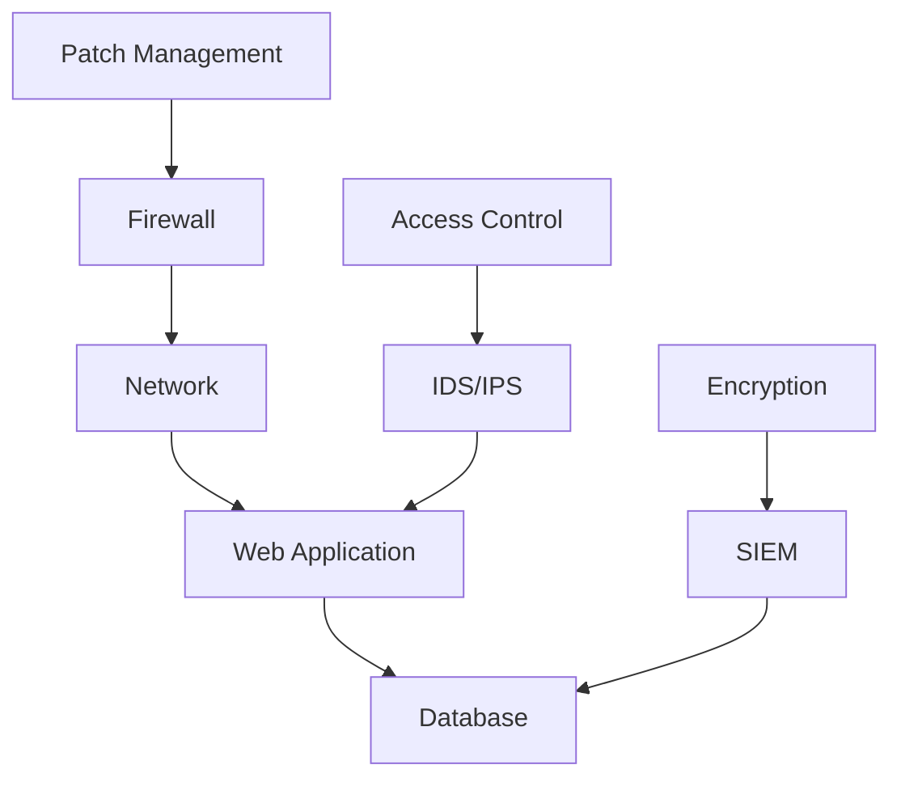
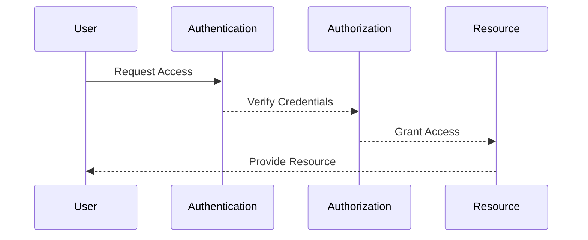
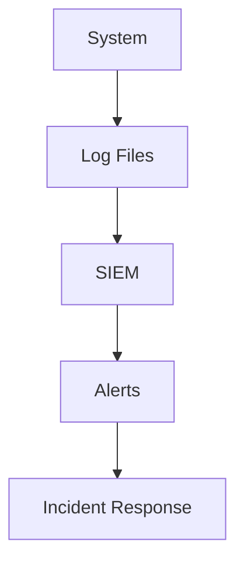
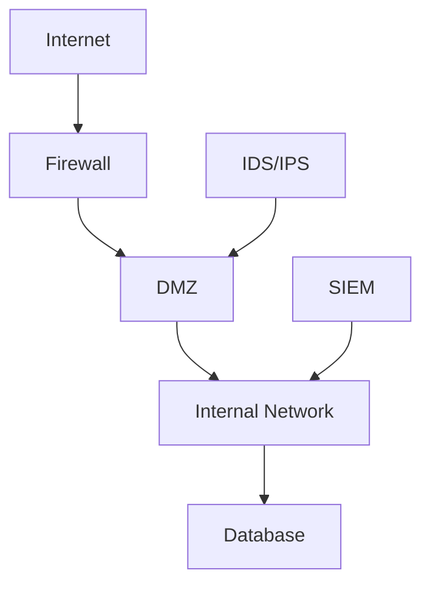
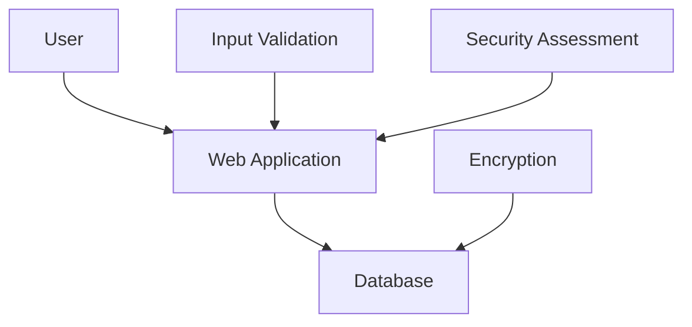
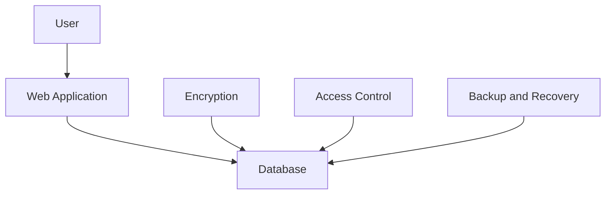

## Security in Layers

### Introduction to Layered Security

Layered security, often referred to as defense-in-depth, is a comprehensive approach to protecting information systems and networks. This strategy involves implementing multiple layers of security controls to mitigate risks and protect against various types of threats. Each layer serves a specific purpose and contributes to the overall security posture of an organization. The analogy used in the lecture compares different aspects of physical security to cybersecurity measures, helping to illustrate the importance of each layer.

### Physical Security Analogy

Let's break down the analogy used in the lecture:

- **Open Port**: An open port, such as port 22 for SSH access, is akin to an unlocked door in a house. If left unsecured, it provides an easy entry point for unauthorized individuals.
  
- **Main House Entrance**: This represents user accounts and login credentials. Just as you would secure the main entrance to your house with locks and alarms, you need to secure user accounts with strong authentication mechanisms.

- **Room with Precious Stuff**: Data storage areas are critical components of any system. They contain valuable information that needs to be protected.

- **Safe**: The database, which holds the actual data, is like a safe. Access to this safe should be tightly controlled, similar to how you would manage the combination to a physical safe.

- **Access Management**: Careful management of who has access to these systems, databases, and services is crucial. This is analogous to managing who has keys to your house and ensuring that only trusted individuals have access.

- **Cameras and Alarms**: These represent logging and monitoring systems. Just as cameras and alarms provide visibility and alerts in a physical environment, logging and monitoring systems help detect and respond to security incidents in a digital environment.

### Importance of Layered Security

The primary goal of layered security is to ensure that even if one layer is compromised, other layers remain intact, providing continued protection. This approach is essential because no single security measure can provide complete protection against all possible threats. By implementing multiple layers, organizations can create a robust security framework that is resilient to various types of attacks.

#### Real-World Example: Equifax Breach (CVE-2017-5638)

In 2017, Equifax suffered a massive data breach that exposed sensitive personal information of millions of customers. The breach was caused by a vulnerability in Apache Struts, a widely used web application framework. The attackers exploited this vulnerability to gain access to the Equifax network and steal data.

**What Went Wrong:**
- **Lack of Patch Management**: Equifax failed to apply a critical security patch for the Apache Struts vulnerability, leaving their systems exposed.
- **Insufficient Monitoring**: There were no effective monitoring systems in place to detect the unauthorized access and exfiltration of data.

**How to Prevent / Defend:**
- **Patch Management**: Implement a robust patch management process to ensure that all systems are up-to-date with the latest security patches.
- **Monitoring and Logging**: Deploy comprehensive logging and monitoring solutions to detect and respond to suspicious activities promptly.

### Access Management

Access management is a critical component of layered security. It involves controlling who has access to resources within an organization and ensuring that access is granted based on the principle of least privilege. This means that users should only have the minimum level of access necessary to perform their job functions.

#### Real-World Example: Capital One Breach (CVE-2019-11510)

In 2019, Capital One suffered a data breach that exposed the personal information of over 100 million customers. The breach was caused by a misconfigured web application firewall (WAF) that allowed an attacker to gain unauthorized access to the company's cloud infrastructure.

**What Went Wrong:**
- **Improper Configuration**: The WAF was improperly configured, allowing the attacker to bypass security controls and access sensitive data.
- **Insufficient Access Controls**: The attacker was able to escalate privileges due to weak access controls, leading to the exposure of customer data.

**How to Prevent / Defend:**
- **Proper Configuration**: Ensure that all security devices, such as firewalls and WAFs, are properly configured and regularly audited.
- **Least Privilege Access**: Implement strict access controls and enforce the principle of least privilege to minimize the risk of unauthorized access.

### Logging and Monitoring

Logging and monitoring are essential components of layered security. They provide visibility into the activities occurring within a system and enable timely detection and response to security incidents.

#### Real-World Example: Yahoo Breach (CVE-2017-5638)

In 2013 and 2014, Yahoo suffered two major data breaches that exposed the personal information of billions of users. The breaches were caused by vulnerabilities in Yahoo's systems that were exploited by hackers.

**What Went Wrong:**
- **Lack of Logging**: Yahoo had inadequate logging mechanisms in place, making it difficult to detect and investigate the breaches.
- **Insufficient Monitoring**: There were no effective monitoring systems to detect and respond to suspicious activities in a timely manner.

**How to Prevent / Defend:**
- **Comprehensive Logging**: Implement comprehensive logging across all systems to capture detailed information about activities and events.
- **Real-Time Monitoring**: Deploy real-time monitoring solutions to detect and respond to security incidents promptly.

### Network Security

Network security involves protecting the integrity, confidentiality, and availability of data transmitted over a network. This includes securing network infrastructure, implementing firewalls, and deploying intrusion detection and prevention systems (IDS/IPS).

#### Real-World Example: Target Breach (CVE-2013-7449)

In 2013, Target suffered a massive data breach that exposed the credit card information of millions of customers. The breach was caused by a vulnerability in Target's network infrastructure that allowed the attackers to gain unauthorized access.

**What Went Wrong:**
- **Weak Network Segmentation**: Target's network was not properly segmented, allowing the attackers to move laterally and access sensitive data.
- **Insufficient Firewall Configuration**: The firewalls were not properly configured to block malicious traffic and prevent unauthorized access.

**How to Prevent / Defend:**
- **Network Segmentation**: Implement proper network segmentation to isolate sensitive data and limit the spread of attacks.
- **Firewall Configuration**: Ensure that firewalls are properly configured to block malicious traffic and prevent unauthorized access.

### Application Security

Application security involves protecting web applications and other software from vulnerabilities and attacks. This includes implementing secure coding practices, conducting regular security assessments, and deploying security controls such as input validation and encryption.

#### Real-World Example: Equifax Breach (CVE-2017-5638)

In 2017, Equifax suffered a massive data breach that exposed sensitive personal information of millions of customers. The breach was caused by a vulnerability in Apache Struts, a widely used web application framework.

**What Went Wrong:**
- **Vulnerabilities in Code**: Equifax's web application contained vulnerabilities that were exploited by the attackers.
- **Lack of Input Validation**: The application did not properly validate user inputs, allowing the attackers to inject malicious code.

**How to Prevent / Defend:**
- **Secure Coding Practices**: Implement secure coding practices to prevent common vulnerabilities such as SQL injection and cross-site scripting (XSS).
- **Input Validation**: Validate all user inputs to prevent malicious code injection and other attacks.

### Data Protection

Data protection involves safeguarding sensitive data from unauthorized access, theft, and loss. This includes implementing encryption, access controls, and backup and recovery procedures.

#### Real-World Example: Marriott Breach (CVE-2018-12611)

In 2018, Marriott suffered a data breach that exposed the personal information of millions of customers. The breach was caused by a vulnerability in the Starwood reservation system that allowed the attackers to gain unauthorized access.

**What Went Wrong:**
- **Weak Encryption**: The data was not properly encrypted, allowing the attackers to access sensitive information.
- **Insufficient Access Controls**: The attackers were able to access sensitive data due to weak access controls.

**How to Prevent / Defend:**
- **Strong Encryption**: Implement strong encryption to protect sensitive data at rest and in transit.
- **Access Controls**: Implement strict access controls to ensure that only authorized individuals have access to sensitive data.

### Conclusion

Layered security is a comprehensive approach to protecting information systems and networks. By implementing multiple layers of security controls, organizations can create a robust security framework that is resilient to various types of attacks. Each layer serves a specific purpose and contributes to the overall security posture of an organization. By following best practices and implementing the principles of layered security, organizations can significantly reduce the risk of security breaches and protect their valuable assets.

### Practice Labs

For hands-on experience with layered security, consider the following practice labs:

- **PortSwigger Web Security Academy**: Offers a variety of challenges and exercises to learn about web application security.
- **OWASP Juice Shop**: A deliberately insecure web application for practicing web security skills.
- **DVWA (Damn Vulnerable Web Application)**: A PHP/MySQL web application that demonstrates web application vulnerabilities.
- **WebGoat**: An interactive training application designed to teach web application security lessons.

These labs provide practical experience in implementing and testing layered security controls in a web application context.

---
<!-- nav -->
[[02-Security in Layers Part 1|Security in Layers Part 1]] | [[DevSecOps/DevSecOps Bootcamp/03-Identity & Access Management/04-Security Essentials/Security in Layers/00-Overview|Overview]] | [[04-Security in Layers Part 3|Security in Layers Part 3]]
