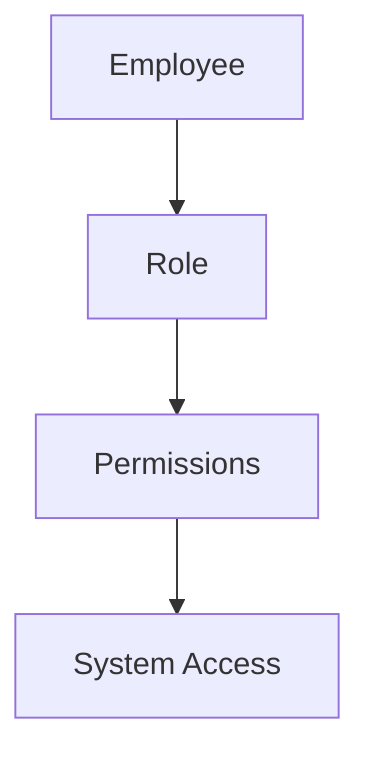
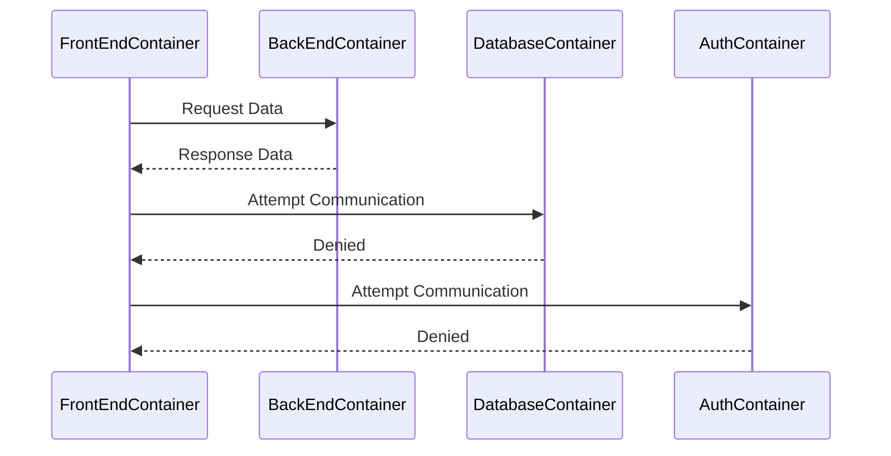
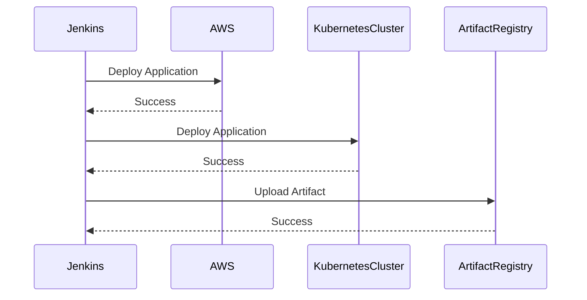

## Security in Layers

### Introduction to Layered Security

Layered security, also known as defense-in-depth, is a strategy that involves implementing multiple layers of security controls to protect information and systems. This approach ensures that even if one layer of security is breached, others remain intact, thereby reducing the overall risk. In the context of DevSecOps, layered security is crucial for protecting both the development environment and the deployed applications.

### Employee Access Control

#### Limited Access Permissions

One of the fundamental principles of layered security is limiting access permissions. This means that employees should only have access to the resources and systems necessary for their job functions. For instance, an engineer should not have administrative access to all services; instead, they should have limited privileges that are sufficient for their tasks.

**Why Limit Access?**

Limiting access permissions reduces the potential damage that can be caused by a compromised account. If an attacker gains access to an employee’s credentials, the damage is minimized because the attacker only has the same limited access as the employee.

**Real-World Example:**

In the Equifax breach (CVE-2017-5638), attackers exploited a vulnerability in Apache Struts and gained access to the system. Had the access permissions been properly restricted, the attackers would have had limited capabilities, potentially reducing the scope of the breach.

**How to Implement Limited Access:**

1. **Role-Based Access Control (RBAC):**
   - Define roles based on job functions.
   - Assign permissions to roles rather than individual users.
   - Ensure that roles are reviewed periodically to ensure they remain appropriate.

**Pitfalls:**

- Overly broad permissions can lead to significant vulnerabilities.
- Failure to review and update roles regularly can result in outdated permissions.

**How to Prevent / Defend:**

- **Regular Audits:** Conduct regular audits to ensure that access permissions align with current job functions.
- **Least Privilege Principle:** Always assign the minimum set of permissions required for a user to perform their job.
- **Secure Coding Practices:** Implement secure coding practices to minimize vulnerabilities that could be exploited.

### Service Access Control

#### Limited Access for Services

Another critical aspect of layered security is limiting the access permissions of services running within your systems. This includes containers, microservices, and other components of your infrastructure.

**Why Limit Service Access?**

By restricting the access of services, you can prevent a compromised service from causing widespread damage. For example, if a front-end container is compromised, it should only be able to communicate with the back-end container and not with other services like databases or authentication services.

**Real-World Example:**

In the Capital One breach (CVE-2019-11510), an attacker exploited a misconfigured web application firewall to gain unauthorized access to sensitive data. Had the access permissions of the web application been properly restricted, the attacker would have had limited capabilities.

**How to Implement Limited Access for Services:**

1. **Network Segmentation:**
   - Use network segmentation to isolate different services.
   - Configure firewalls to restrict communication between services.

2. **Service-to-Service Authentication:**
   - Implement mutual TLS or other forms of service-to-service authentication to ensure that only authorized services can communicate.

**Pitfalls:**

- Overly permissive network policies can allow unauthorized communication between services.
- Lack of proper authentication mechanisms can enable unauthorized access.

**How to Prevent / Defend:**

- **Network Policies:** Implement strict network policies to control communication between services.
- **Service-to-Service Authentication:** Use strong authentication mechanisms to ensure that only authorized services can communicate.
- **Regular Audits:** Conduct regular audits to ensure that network policies and authentication mechanisms are effective.

### CI/CD Pipeline Security

#### Limited Access for CI/CD Tools

CI/CD pipelines are critical components of modern software development. Ensuring that these tools have limited access is essential for maintaining the security of the entire development process.

**Why Limit Access for CI/CD Tools?**

CI/CD tools often have access to various services such as cloud platforms, artifact repositories, and deployment targets. If these tools are compromised, they can cause significant damage. By limiting their access, you can reduce the potential impact of a breach.

**Real-World Example:**

In the Jenkins breach (CVE-2018-1000301), attackers exploited a vulnerability in Jenkins to gain unauthorized access. Had the access permissions of Jenkins been properly restricted, the attackers would have had limited capabilities.

**How to Implement Limited Access for CI/CD Tools:**

1. **Minimal Permissions:**
   - Assign the minimum set of permissions required for the CI/CD tool to function.
   - Avoid granting administrative access unless absolutely necessary.

2. **Service Accounts:**
   - Use dedicated service accounts for CI/CD tools.
   - Ensure that these service accounts have the least privilege required.

**Pitfalls:**

- Overly broad permissions can lead to significant vulnerabilities.
- Using default or overly privileged service accounts can increase the risk of a breach.

**How to Prevent / Defend:**

- **Least Privilege Principle:** Always assign the minimum set of permissions required for the CI/CD tool to function.
- **Service Accounts:** Use dedicated service accounts with the least privilege required.
- **Regular Audits:** Conduct regular audits to ensure that permissions and service accounts are effective.

### Hands-On Labs

To gain practical experience with implementing layered security, consider the following labs:

- **PortSwigger Web Security Academy:** Offers hands-on labs for web application security, including access control and service-to-service communication.
- **OWASP Juice Shop:** A deliberately insecure web application for practicing web security techniques.
- **DVWA (Damn Vulnerable Web Application):** A PHP/MySQL web application that demonstrates web application vulnerabilities.
- **WebGoat:** An interactive, gamified training application for learning about web application security.

These labs provide real-world scenarios and challenges that help reinforce the concepts covered in this chapter.

### Conclusion

Layered security is a critical component of DevSecOps. By implementing limited access permissions for employees, services, and CI/CD tools, you can significantly reduce the potential damage caused by a breach. Regular audits, the least privilege principle, and strong authentication mechanisms are essential for maintaining the security of your systems. Through hands-on practice and continuous improvement, you can ensure that your organization remains resilient against security threats.

---
<!-- nav -->
[[03-Security in Layers Part 2|Security in Layers Part 2]] | [[DevSecOps/DevSecOps Bootcamp/03-Identity & Access Management/04-Security Essentials/Security in Layers/00-Overview|Overview]] | [[05-Security in Layers Part 4|Security in Layers Part 4]]
