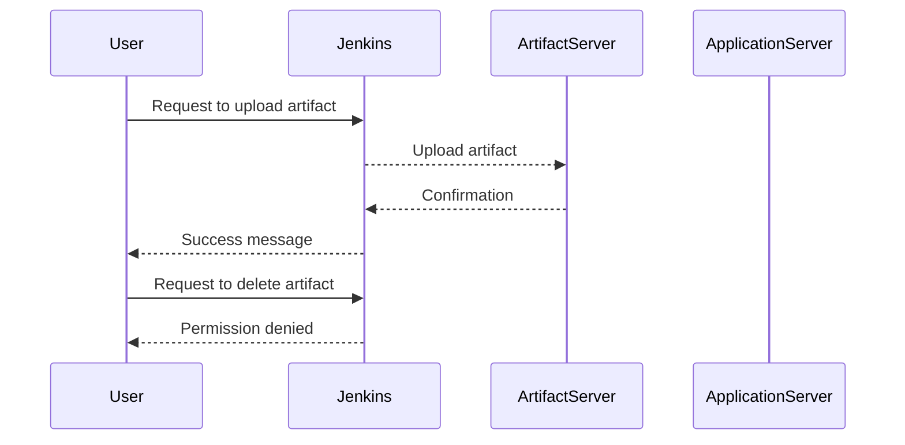
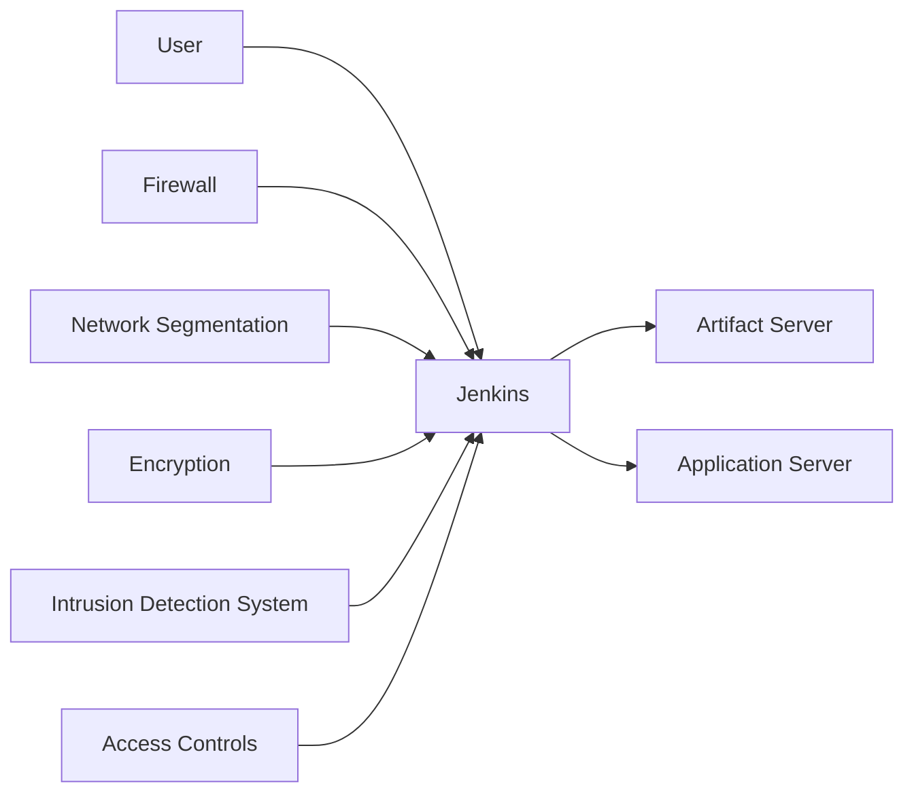
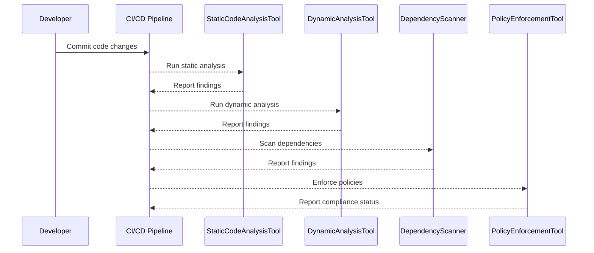
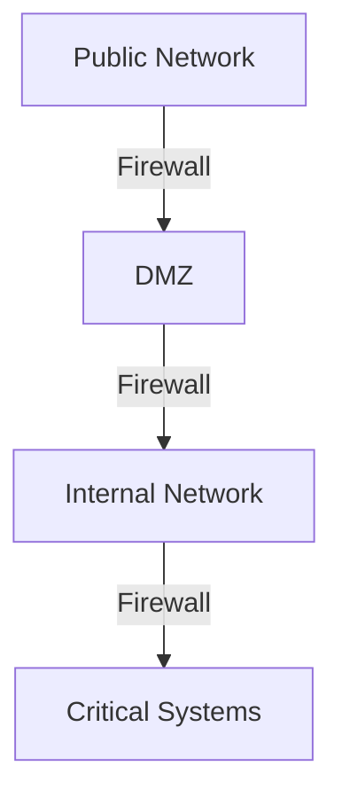
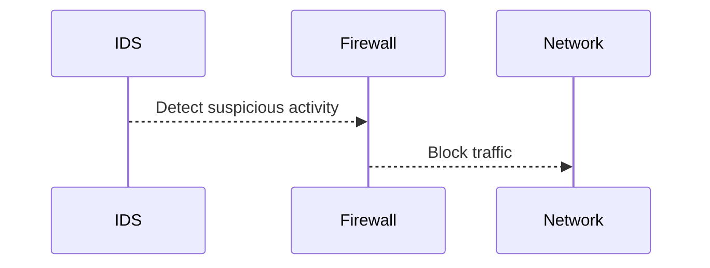
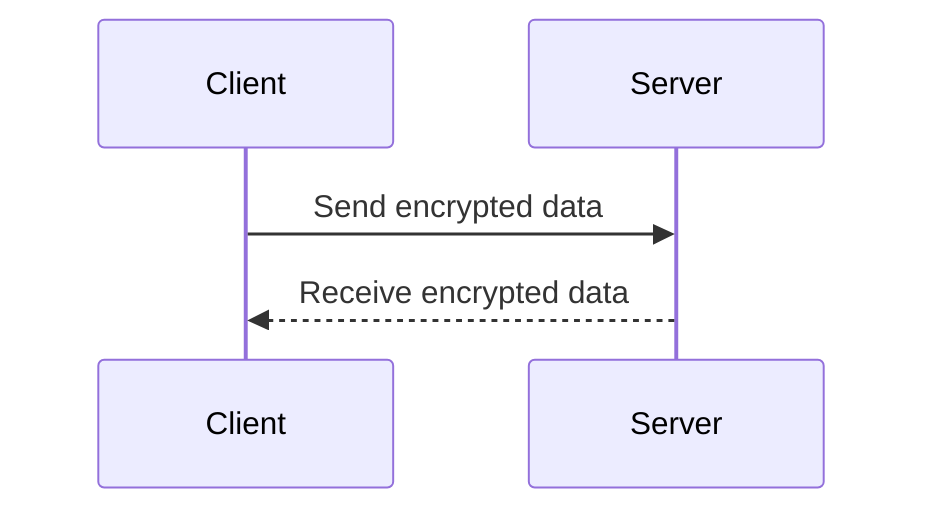

## Security in Layers

### Introduction to Layered Security

Layered security, often referred to as defense-in-depth, is a fundamental principle in cybersecurity. This approach involves implementing multiple layers of security controls to protect information assets. Each layer adds an additional barrier that an attacker must overcome, making it significantly more difficult and time-consuming to breach the system. This concept is analogous to an onion, where each layer provides an additional level of protection.

#### Why Layered Security Matters

In today’s complex IT environments, relying on a single security measure is insufficient. A single point of failure can compromise the entire system. By implementing multiple layers of security, organizations can mitigate risks and enhance their overall security posture. This is particularly important in DevSecOps, where continuous integration and deployment processes require robust security measures to ensure that applications remain secure throughout their lifecycle.

### Example: Jenkins Security

Let's consider a practical example using Jenkins, a popular open-source automation server used for continuous integration and delivery. Jenkins can be configured to restrict user permissions, ensuring that users can perform specific actions without compromising the system.

#### User Permissions in Jenkins

In Jenkins, user permissions can be finely controlled to limit what actions users can perform. For instance:

- **Upload Artifact**: Users can be restricted to uploading artifacts but not deleting them.
- **Deploy Application**: Users can be allowed to deploy applications but not update or remove resources.
- **Access Control**: Users can be limited to accessing only the application they are working on and not other resources.

This granular control ensures that even if a user account is compromised, the damage is limited to the scope of their permissions.



### Multiple Layers of Security

Even if Jenkins is compromised, additional layers of security can protect the core data. These layers might include:

- **Network Segmentation**: Isolating critical systems from less secure networks.
- **Firewalls**: Blocking unauthorized access.
- **Encryption**: Protecting data in transit and at rest.
- **Intrusion Detection Systems (IDS)**: Monitoring for suspicious activities.
- **Access Controls**: Limiting who can access sensitive data.

Each layer adds an additional hurdle for an attacker, making it much harder to breach the system.



### Automating Security Checks in DevSecOps

In DevSecOps, security checks are automated to ensure that all layers of security are implemented and in place. This includes:

- **Static Code Analysis**: Analyzing code for potential security vulnerabilities.
- **Dynamic Analysis**: Testing applications in a runtime environment.
- **Dependency Scanning**: Checking for known vulnerabilities in third-party libraries.
- **Policy Enforcement**: Ensuring that security policies are followed during development and deployment.

These automated checks provide visibility into the security posture of the system, allowing teams to identify and address vulnerabilities proactively.



### Security Posture Visualization

DevSecOps tools provide a comprehensive view of the security posture across the entire system. This visualization helps teams understand the current state of security and identify areas that need improvement.

#### Real-World Examples

Recent breaches and vulnerabilities highlight the importance of layered security. For example:

- **CVE-2021-2109** (Apache Log4j): This vulnerability allowed remote code execution through log messages. Organizations that had multiple layers of security, such as network segmentation and intrusion detection, were better protected against this exploit.
- **SolarWinds Supply Chain Attack (CVE-2020-1014)**: This attack compromised multiple organizations due to a vulnerability in SolarWinds software. Layered security measures, including monitoring and access controls, helped mitigate the impact.

### How to Prevent / Defend

To effectively implement layered security, organizations should follow these steps:

#### 1. Define Security Policies

Clearly define security policies and ensure they are enforced across all layers of the system. This includes:

- **Network Policies**: Define rules for network traffic.
- **Access Control Policies**: Define who can access what resources.
- **Data Encryption Policies**: Define how data should be encrypted.

#### 2. Implement Granular Access Controls

Use role-based access control (RBAC) to ensure that users have only the permissions necessary to perform their tasks. This reduces the risk of privilege escalation attacks.

```yaml
# Example of RBAC in Jenkins
securityRealm:
  local:
    users:
      - id: developer
        password: <password>
        fullName: Developer
        email: developer@example.com
        groups: [developers]

authorizationStrategy:
  global:
    permissions:
      - id: hudson.model.Hudson.Administer
        group: administrators
      - id: hudson.model.Item.Build
        group: developers
      - id: hudson.model.Item.Configure
        group: developers
      - id: hudson.model.Item.Delete
        group: administrators
```

#### 3. Use Network Segmentation

Segment the network to isolate critical systems from less secure networks. This limits the spread of attacks and makes it harder for attackers to move laterally within the network.



#### 4. Implement Intrusion Detection Systems (IDS)

Use IDS to monitor for suspicious activities and alert security teams when potential threats are detected. This helps in early detection and mitigation of attacks.



#### 5. Encrypt Data

Encrypt data both in transit and at rest to protect it from unauthorized access. Use strong encryption algorithms and manage encryption keys securely.



### Conclusion

Layered security is a critical component of DevSecOps, providing multiple barriers that attackers must overcome. By implementing granular access controls, network segmentation, intrusion detection systems, and encryption, organizations can significantly enhance their security posture. Automated security checks and visualization tools help teams identify and address vulnerabilities proactively, ensuring that systems remain secure throughout their lifecycle.

### Practice Labs

For hands-on practice with layered security concepts, consider the following labs:

- **PortSwigger Web Security Academy**: Offers interactive labs to learn about web security and penetration testing.
- **OWASP Juice Shop**: A deliberately insecure web application for learning about web security.
- **DVWA (Damn Vulnerable Web Application)**: A PHP/MySQL web application that is riddled with vulnerabilities for educational purposes.
- **WebGoat**: An interactive, gamified training application designed to teach web application security.

These labs provide practical experience in implementing and testing layered security measures, helping to reinforce the theoretical concepts covered in this chapter.

---
<!-- nav -->
[[04-Security in Layers Part 3|Security in Layers Part 3]] | [[DevSecOps/DevSecOps Bootcamp/03-Identity & Access Management/04-Security Essentials/Security in Layers/00-Overview|Overview]] | [[06-Security in Layers Part 5|Security in Layers Part 5]]
