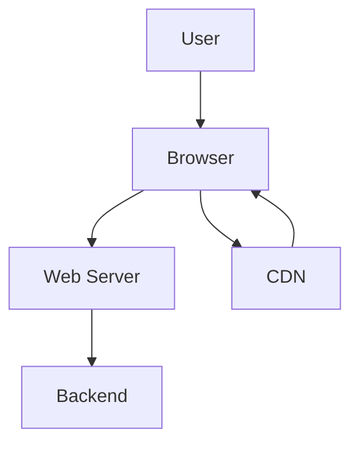
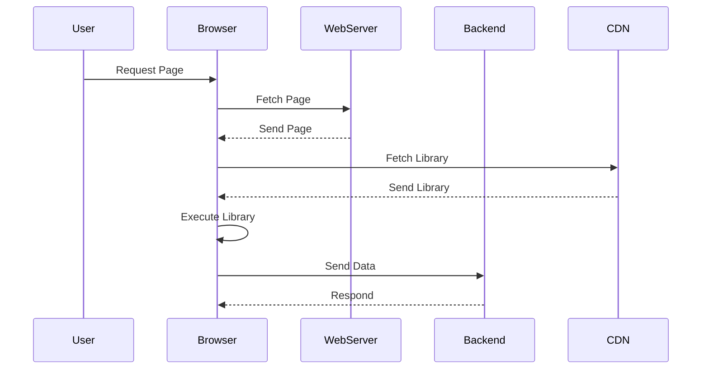

## Introduction to Application Security Vulnerabilities

When discussing security incidents, one of the most critical aspects to consider is the financial and reputational impact of a breach. A security incident can lead to significant costs in terms of time and resources required to fix the issues, contain the damage, and mitigate the scope of the damage. This can result in substantial financial losses and severe damage to the organization's reputation. Therefore, it is crucial to understand the types of security attacks and how they can be exploited to compromise applications.

### Common Application Vulnerabilities

One of the most common issues in application security is when the front end of the application allows for the execution of external JavaScript. This can occur due to poor coding practices by developers, leading to security holes in the application. In modern web applications, the user interface (UI) is often written in JavaScript, which is executed by the browser. The browser loads the JavaScript from the backend and executes it to render the UI. However, this JavaScript can also come from other sources, such as third-party libraries hosted on the internet or Content Delivery Networks (CDNs).

#### Example: External JavaScript Execution

Consider a scenario where a web application uses a third-party JavaScript library hosted on a CDN. The application fetches this library dynamically from the internet and executes it within the context of the application. This can introduce several security risks:

1. **Malicious Code Execution**: If the third-party library is compromised, it can execute malicious code within the context of the application.
2. **Data Leakage**: The library might access sensitive data stored in the application's memory or cookies.
3. **Cross-Site Scripting (XSS)**: Malicious scripts can inject additional code into the application, leading to XSS attacks.

### Real-World Examples

Several recent breaches highlight the risks associated with external JavaScript execution:

- **CVE-2021-44228 (Log4j)**: Although not directly related to JavaScript, this vulnerability demonstrates the importance of securing external dependencies. Log4j is a widely used logging framework that was found to be vulnerable to remote code execution (RCE) attacks. This highlights the need to carefully manage and secure all external dependencies.
- **CVE-2022-22965 (Spring Framework)**: Another example of a critical vulnerability in a widely used framework. This vulnerability allowed attackers to execute arbitrary code, similar to the risks associated with external JavaScript execution.

### Detailed Example: Fetching JavaScript Libraries

Let's look at a detailed example of how a web application might fetch and execute a JavaScript library from a CDN. Consider the following HTML and JavaScript code:

```html
<!DOCTYPE html>
<html lang="en">
<head>
    <meta charset="UTF-8">
    <title>Example App</title>
    <script src="https://cdn.example.com/library.js"></script>
</head>
<body>
    <div id="app"></div>
    <script>
        // Main application logic
        function initApp() {
            const appElement = document.getElementById('app');
            appElement.innerHTML = '<h1>Welcome to the App!</h1>';
        }
        initApp();
    </script>
</body>
</html>
```

In this example, the application fetches a JavaScript library from `https://cdn.example.com/library.js`. This library is executed within the context of the application, potentially introducing security risks.

### How to Prevent / Defend Against External JavaScript Execution

To prevent and defend against the risks associated with external JavaScript execution, several best practices can be followed:

1. **Content Security Policy (CSP)**: Implement a strict CSP to control the sources from which scripts can be loaded. This helps prevent the execution of unauthorized scripts.

    ```http
    Content-Security-Policy: script-src 'self' https://cdn.example.com;
    ```

2. **Subresource Integrity (SRI)**: Use SRI to ensure that the fetched resources have not been tampered with. This involves specifying a hash of the expected resource in the HTML.

    ```html
    <script src="https://cdn.example.com/library.js" integrity="sha384-abc123def456ghi789jklmnopqrstu01234567890" crossorigin="anonymous"></script>
    ```

3. **Secure Coding Practices**: Ensure that developers follow secure coding practices, such as validating and sanitizing inputs, and avoiding the use of eval() and similar functions.

4. **Dependency Management**: Use tools like Snyk or OWASP Dependency-Check to monitor and manage external dependencies for known vulnerabilities.

### Secure Code Example

Here is a comparison between the insecure and secure versions of the code:

**Insecure Version:**

```html
<!DOCTYPE html>
<html lang="en">
<head>
    <meta charset="UTF-8">
    <title>Insecure App</title>
    <script src="https://cdn.example.com/library.js"></script>
</head>
<body>
    <div id="app"></div>
    <script>
        function initApp() {
            const appElement = document.getElementById('app');
            appElement.innerHTML = '<h1>Welcome to the App!</h1>';
        }
        initApp();
    </script>
</body>
</html>
```

**Secure Version:**

```html
<!DOCTYPE html>
<html lang="en">
<head>
    <meta charset="UTF-8">
    <title>Secure App</title>
    <script src="https://cdn.example.com/library.js" integrity="sha384-abc123def456ghi789jklmnopqrstu01234567890" crossorigin="anonymous"></script>
    <meta http-equiv="Content-Security-Policy" content="script-src 'self' https://cdn.example.com;">
</head>
<body>
    <div id="app"></div>
    <script>
        function initApp() {
            const appElement = document.getElementById('app');
            appElement.innerHTML = '<h1>Welcome to the App!</h1>';
        }
        initApp();
    </script>
</body>
</html>
```

### Mermaid Diagrams

#### Network Topology



This diagram shows the interaction between the user, browser, web server, backend, and CDN. The browser fetches the JavaScript library from the CDN, which is then executed within the context of the application.

#### Sequence Diagram



This sequence diagram illustrates the steps involved in fetching and executing a JavaScript library from a CDN.

### Hands-On Labs

For hands-on practice with these concepts, consider the following labs:

- **PortSwigger Web Security Academy**: Offers interactive labs on various web security topics, including CSP and SRI.
- **OWASP Juice Shop**: A deliberately insecure web application for practicing web security skills.
- **DVWA (Damn Vulnerable Web Application)**: Another intentionally vulnerable web application for learning web security.

By understanding and implementing these best practices, organizations can significantly reduce the risk of security incidents caused by external JavaScript execution.

---
<!-- nav -->
[[DevSecOps/DevSecOps Bootcamp/03-Identity & Access Management/04-Security Essentials/Types of Security Attacks Part 1/00-Overview|Overview]] | [[DevSecOps/DevSecOps Bootcamp/03-Identity & Access Management/04-Security Essentials/Types of Security Attacks Part 1/02-Introduction to Session Management and Token Revocation|Introduction to Session Management and Token Revocation]]
