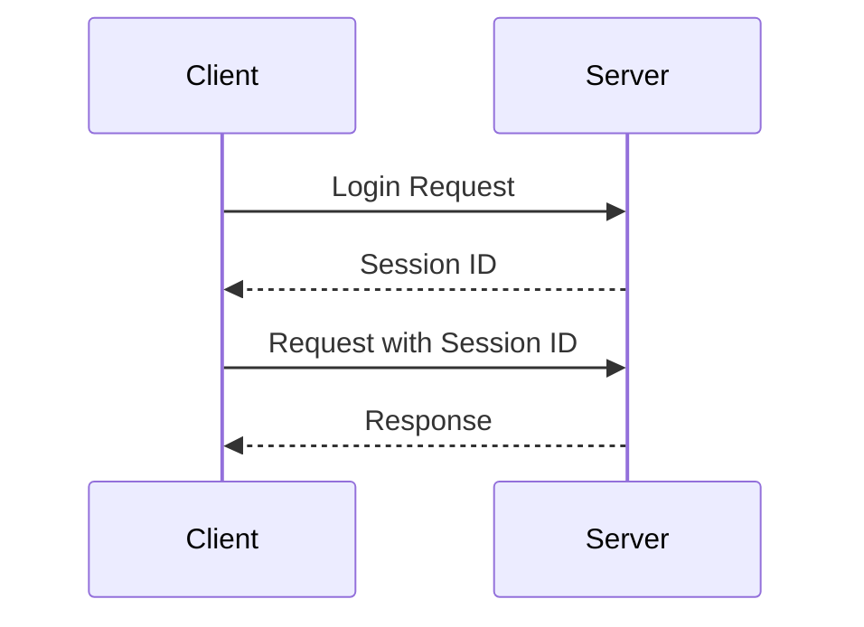
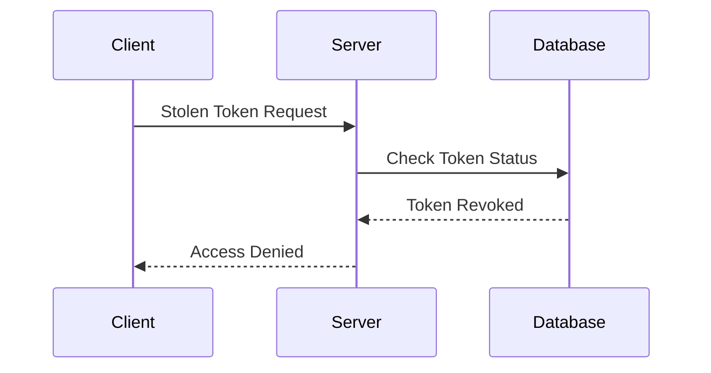

## Introduction to Session Management and Token Revocation

Session management and token revocation are critical components of securing applications and systems. These mechanisms ensure that unauthorized users cannot access sensitive resources even if they manage to obtain valid credentials. This section delves into the concepts of session management, token revocation, and the risks associated with improper revocation. We will also explore recent real-world examples, complete code snippets, and detailed diagrams to illustrate these principles.

### What is Session Management?

Session management refers to the process of tracking user sessions in an application. A session is a temporary connection between a client and a server that allows the server to maintain information about the client across multiple requests. This is crucial for maintaining state in stateless protocols like HTTP.

#### Why is Session Management Important?

Session management is important because it helps to:

- **Maintain User State:** Keep track of user-specific data such as login status, preferences, and shopping cart contents.
- **Authenticate Users:** Ensure that only authenticated users can access certain parts of the application.
- **Authorize Actions:** Control what actions a user can perform based on their role and permissions.

#### How Does Session Management Work?

When a user logs into an application, the server generates a unique session identifier (session ID) and sends it back to the client. The client then includes this session ID in subsequent requests to the server. The server uses this session ID to look up the user's session data and verify their identity.



### What is Token Revocation?

Token revocation is the process of invalidating a session token or access token. This is necessary to prevent unauthorized access if a token is compromised. Proper token revocation ensures that even if an attacker obtains a valid token, they cannot use it indefinitely.

#### Why is Token Revocation Important?

Token revocation is important because it:

- **Prevents Unauthorized Access:** Ensures that stolen tokens cannot be used to access the system.
- **Maintains Security Posture:** Helps in maintaining a strong security posture by quickly invalidating compromised tokens.
- **Supports Compliance Requirements:** Many compliance standards require proper token revocation mechanisms.

#### How Does Token Revocation Work?

When a token is compromised, the system should immediately invalidate it. This can be done by marking the token as revoked in a database or by using a token blacklist. The system should then deny access to any requests containing the revoked token.



### Real-World Examples of Improper Token Revocation

Improper token revocation can lead to serious security vulnerabilities. Here are some recent real-world examples:

#### Example 1: Capital One Data Breach (CVE-2019-11510)

In 2019, Capital One suffered a massive data breach where an attacker accessed sensitive customer data. One of the contributing factors was improper handling of session tokens. The attacker was able to use a stolen token to access the system for an extended period.

#### Example 2: Equifax Data Breach (CVE-2017-5638)

The Equifax data breach in 2017 exposed personal data of millions of customers. One of the issues was the lack of proper token revocation mechanisms, which allowed attackers to maintain access to the system even after the initial compromise.

### Pitfalls of Improper Token Revocation

Improper token revocation can lead to several security issues:

- **Persistent Access:** Attackers can maintain access to the system for an extended period.
- **Data Exposure:** Sensitive data can be accessed and exfiltrated.
- **Reputation Damage:** Companies can suffer significant reputational damage due to data breaches.

### How to Prevent / Defend Against Improper Token Revocation

To prevent improper token revocation, follow these best practices:

#### Secure Coding Practices

Ensure that your application has robust mechanisms for token revocation. Here is an example of how to implement token revocation in a secure manner:

```python
# Vulnerable Code
def revoke_token(token_id):
    # Insecure implementation
    pass

# Secure Code
def revoke_token(token_id):
    # Mark the token as revoked in the database
    db.execute("UPDATE tokens SET revoked = TRUE WHERE id = %s", (token_id,))
```

#### Detection Mechanisms

Implement monitoring and logging to detect unauthorized access attempts. Here is an example of how to log token usage:

```python
import logging

logger = logging.getLogger(__name__)

def check_token(token_id):
    # Check if the token is revoked
    result = db.execute("SELECT revoked FROM tokens WHERE id = %s", (token_id,))
    if result[0][0]:
        logger.warning(f"Access attempt with revoked token {token_id}")
        return False
    return True
```

#### Configuration Hardening

Ensure that your application's configuration files are hardened against unauthorized access. Here is an example of a secure configuration file:

```yaml
security:
  session:
    token_revocation:
      enabled: true
      timeout: 3600
```

### Complete Example: Full HTTP Request and Response

Here is a complete example of a full HTTP request and response demonstrating token revocation:

```http
POST /api/revoke-token HTTP/1.1
Host: example.com
Content-Type: application/json

{
  "token_id": "abc123"
}
```

```http
HTTP/1.1 200 OK
Content-Type: application/json

{
  "status": "success",
  "message": "Token abc123 has been revoked."
}
```

### Practice Labs

For hands-on practice with session management and token revocation, consider the following labs:

- **PortSwigger Web Security Academy:** Offers interactive labs on session management and token revocation.
- **OWASP Juice Shop:** Provides a vulnerable web application for practicing security techniques.
- **DVWA:** A deliberately insecure web application for learning about web application security.

By thoroughly understanding and implementing proper session management and token revocation mechanisms, you can significantly enhance the security of your applications and protect against unauthorized access.

---
<!-- nav -->
[[DevSecOps/DevSecOps Bootcamp/03-Identity & Access Management/04-Security Essentials/Types of Security Attacks Part 1/01-Introduction to Application Security Vulnerabilities|Introduction to Application Security Vulnerabilities]] | [[DevSecOps/DevSecOps Bootcamp/03-Identity & Access Management/04-Security Essentials/Types of Security Attacks Part 1/00-Overview|Overview]] | [[DevSecOps/DevSecOps Bootcamp/03-Identity & Access Management/04-Security Essentials/Types of Security Attacks Part 1/03-Introduction to Social Engineering Attacks|Introduction to Social Engineering Attacks]]
