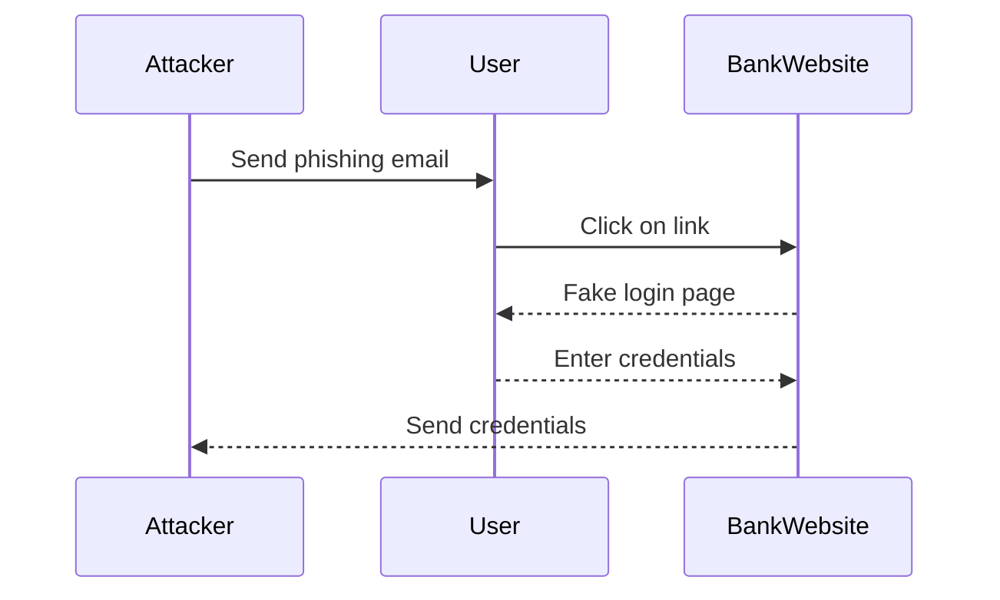
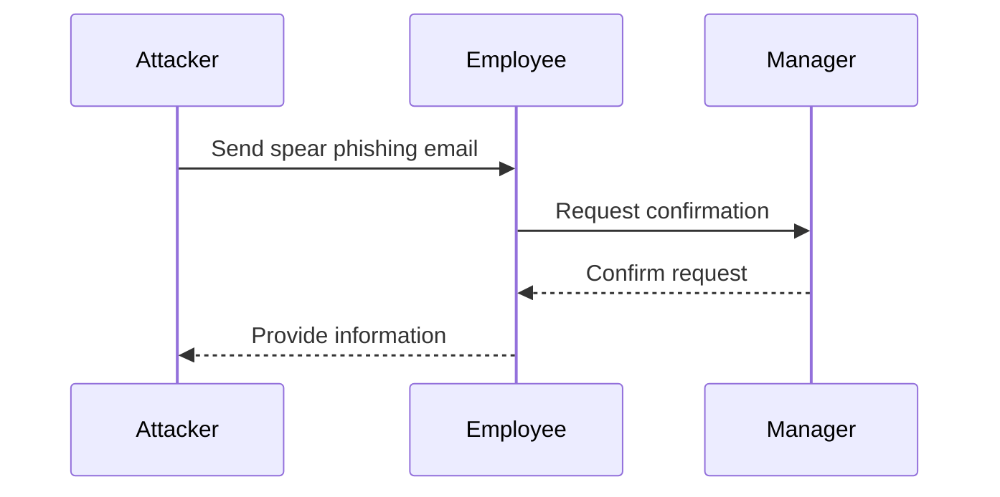
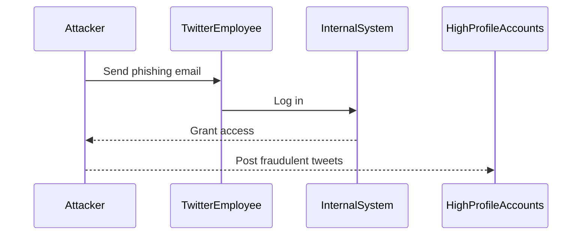

## Introduction to Social Engineering Attacks

Social engineering attacks are a class of cyberattacks that rely on human interaction and manipulation to trick individuals into breaking normal security procedures. These attacks exploit the psychological weaknesses of individuals rather than targeting technical vulnerabilities. In the digital age, where much of our lives are conducted online, social engineering poses a significant threat due to the lack of physical visibility and the ease with which attackers can operate remotely.

### Why Cybersecurity Is More Difficult Than Physical Security

Cybersecurity is inherently more challenging than physical security because:

1. **Visibility**: In the physical world, we can see and physically interact with threats. In the digital realm, threats are invisible and can originate from anywhere in the world.
2. **Digital Nature**: Digital attacks can be automated and scaled up easily, making them harder to trace and defend against.
3. **Human Factor**: People are often the weakest link in security. They can be tricked into revealing sensitive information or performing actions that compromise security.

### Types of Social Engineering Attacks

#### Phishing

Phishing is one of the most common forms of social engineering attacks. It involves sending fraudulent communications that appear to come from a reputable source, usually through email. The goal is to steal sensitive data such as login credentials, financial information, or to install malware on the victim's device.

**Example:**
Consider an email that appears to come from a bank asking the recipient to verify their account details by clicking on a link. The link leads to a fake website designed to capture the user's login credentials.



#### Spear Phishing

Spear phishing is a targeted form of phishing where the attacker crafts a highly personalized message to increase the likelihood of success. This type of attack often targets specific individuals within an organization.

**Example:**
An attacker might send an email to an employee pretending to be a colleague or superior, asking for confidential information or requesting a wire transfer.



### Real-World Example: Twitter Hack (2020)

In July 2020, Twitter suffered a significant phishing attack that compromised high-profile accounts, including those of Barack Obama, Elon Musk, and Bill Gates. The attackers gained access to the internal tools used by Twitter employees to manage user accounts and posted fraudulent tweets soliciting Bitcoin donations.

**Details:**
- **Attack Vector**: The attackers used a combination of social engineering and technical exploits to gain access to Twitter's internal systems.
- **Impact**: The attack resulted in the theft of sensitive data and caused significant reputational damage to Twitter.



### How to Prevent / Defend Against Social Engineering Attacks

#### Detection

To detect social engineering attacks, organizations should implement robust monitoring and alerting mechanisms. This includes:

1. **Email Filtering**: Use advanced email filtering solutions to detect and block phishing emails.
2. **Behavioral Analysis**: Implement behavioral analysis tools to identify unusual patterns of activity that could indicate a social engineering attack.

#### Prevention

Preventing social engineering attacks requires a multi-layered approach:

1. **Security Awareness Training**: Regularly train employees on how to recognize and avoid social engineering attacks.
2. **Two-Factor Authentication (2FA)**: Require 2FA for accessing critical systems and services.
3. **Least Privilege Principle**: Ensure that employees have the minimum level of access necessary to perform their job functions.

#### Secure Coding Fixes

Here is an example of how to securely handle user input to prevent phishing attacks:

**Vulnerable Code:**

```python
def process_email(email):
    if "bank.com" in email:
        print("This is a phishing email")
    else:
        print("This is a safe email")
```

**Secure Code:**

```python
import re

def process_email(email):
    phishing_pattern = r"(?i)\b(?:bank\.com|secure-login\.net)\b"
    if re.search(phishing_pattern, email):
        print("This is a phishing email")
    else:
        print("This is a safe email")
```

### Hands-On Labs

For practical experience in defending against social engineering attacks, consider the following labs:

- **PortSwigger Web Security Academy**: Offers interactive labs to practice identifying and preventing phishing attacks.
- **OWASP Juice Shop**: Provides a vulnerable web application to test and learn about various security vulnerabilities, including social engineering.

By understanding the nature of social engineering attacks and implementing robust preventive measures, organizations can significantly reduce the risk of falling victim to these sophisticated threats.

---
<!-- nav -->
[[DevSecOps/DevSecOps Bootcamp/03-Identity & Access Management/04-Security Essentials/Types of Security Attacks Part 1/02-Introduction to Session Management and Token Revocation|Introduction to Session Management and Token Revocation]] | [[DevSecOps/DevSecOps Bootcamp/03-Identity & Access Management/04-Security Essentials/Types of Security Attacks Part 1/00-Overview|Overview]] | [[DevSecOps/DevSecOps Bootcamp/03-Identity & Access Management/04-Security Essentials/Types of Security Attacks Part 1/04-Phishing Attacks Overview|Phishing Attacks Overview]]
