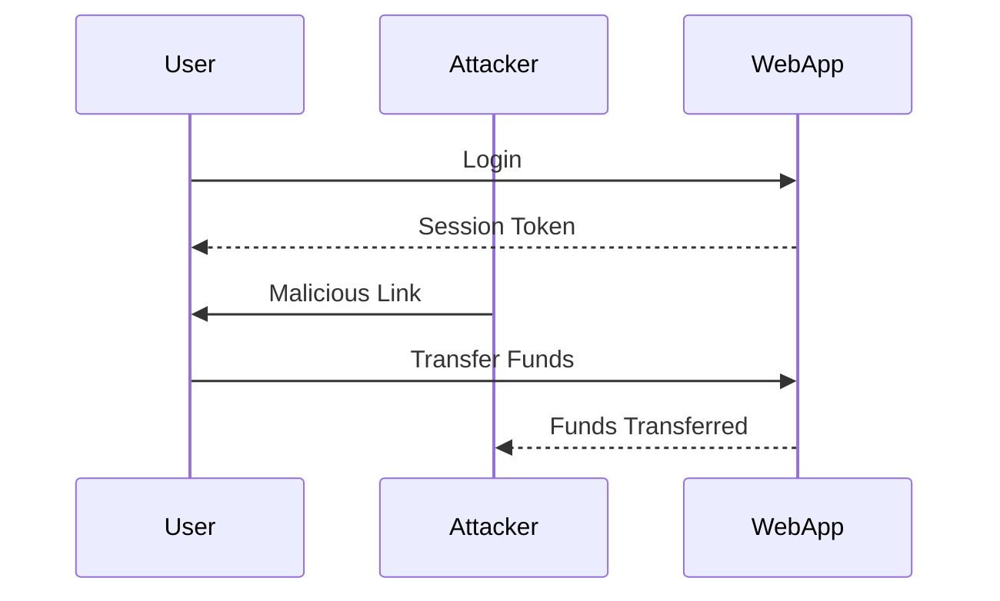
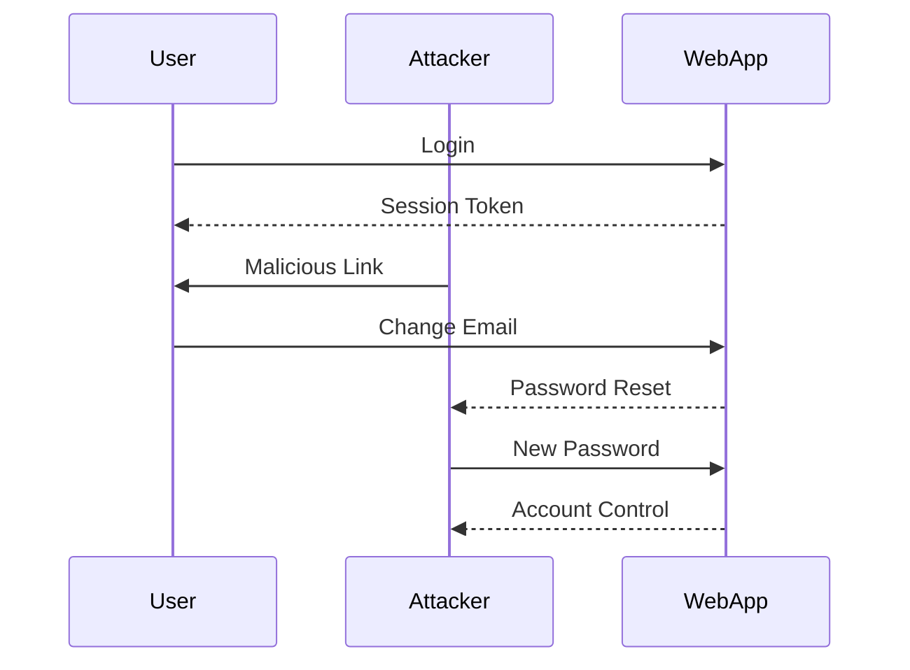

## Client-Side Request Forgery (CSRF)

### What is Client-Side Request Forgery?

Client-Side Request Forgery (CSRF) is a type of attack where an attacker tricks a victim into performing unwanted actions on a web application in which they are authenticated. This occurs when the attacker crafts a malicious request that appears to come from the authenticated user. The web application does not distinguish between legitimate and forged requests, leading to unauthorized actions being performed.

### Why Does CSRF Matter?

CSRF attacks are significant because they leverage the trust that a web application places in its users. If an attacker can successfully forge a request, they can perform actions such as changing email addresses, resetting passwords, transferring funds, or posting unauthorized content. These actions can lead to severe consequences, including financial loss, data theft, and reputational damage.

### How Does CSRF Work?

To understand how CSRF works, let's break down the process:

1. **Authentication**: The user logs into a web application and receives a session token or authentication token.
2. **Malicious Request**: An attacker crafts a malicious request that includes the user's session token.
3. **Victim Interaction**: The attacker tricks the victim into clicking on a link or visiting a page that triggers the malicious request.
4. **Action Execution**: The web application processes the request as if it came from the authenticated user, leading to unauthorized actions.

### Real-World Examples

#### Example 1: Financial Services

In 2019, a CSRF vulnerability was discovered in a popular cryptocurrency exchange platform. Attackers could craft a malicious link that, when clicked by a logged-in user, would transfer funds from the user's account to the attacker's account. This led to significant financial losses for several users.



#### Example 2: Social Media

In 2020, a social media platform faced a CSRF attack where attackers took over accounts of public figures. The attackers crafted a malicious link that, when clicked by the victim, changed the email address associated with the account. The attackers then reset the password and gained full control of the account, using it to post unauthorized content and trick followers into clicking on malicious links.



### Detailed Mechanics

Let's delve deeper into the mechanics of a CSRF attack:

1. **Session Tokens**:
   - **What**: A session token is a unique identifier that a web application uses to track a user's session.
   - **Why**: Without session tokens, it would be difficult to maintain state across multiple requests.
   - **How**: When a user logs in, the web application generates a session token and sends it to the user's browser. The browser stores the token and sends it with each subsequent request.

2. **Malicious Requests**:
   - **What**: A malicious request is crafted by an attacker to appear as if it comes from an authenticated user.
   - **Why**: The goal is to trick the web application into performing unauthorized actions.
   - **How**: The attacker crafts a request that includes the user's session token. This can be done through various methods, such as embedding the request in an image tag or using JavaScript to trigger the request.

3. **Victim Interaction**:
   - **What**: The victim is tricked into interacting with the malicious request.
   - **Why**: The attacker needs the victim to trigger the request to ensure it appears legitimate.
   - **How**: The attacker can trick the victim into clicking on a link, visiting a malicious website, or even embedding the request in a seemingly harmless web page.

4. **Action Execution**:
   - **What**: The web application processes the request as if it came from the authenticated user.
   - **Why**: The web application trusts the session token and does not verify the origin of the request.
   - **How**: The web application executes the requested action, leading to unauthorized changes.

### Full HTTP Example

Let's look at a complete HTTP example of a CSRF attack:

#### Vulnerable Scenario

1. **User Logs In**:
   ```http
   POST /login HTTP/1.1
   Host: example.com
   Content-Type: application/x-www-form-urlencoded

   username=admin&password=secret
   ```

   ```http
   HTTP/1.1 200 OK
   Set-Cookie: session_token=abc123; Path=/; HttpOnly
   ```

2. **Attacker Crafts Malicious Request**:
   ```html
   
   ```

3. **Victim Clicks on Malicious Link**:
   ```http
   GET /change-email?new_email=attacker@example.com&session_token=abc123 HTTP/1.1
   Host: example.com
   Cookie: session_token=abc123
   ```

   ```http
   HTTP/1.1 200 OK
   Content-Type: text/html

   Email changed successfully.
   ```

#### Secure Scenario

1. **User Logs In**:
   ```http
   POST /login HTTP/1.1
   Host: example.com
   Content-Type: application/x-www-form-urlencoded

   username=admin&password=secret
   ```

   ```http
   HTTP/1.1 200 OK
   Set-Cookie: session_token=abc123; Path=/; HttpOnly
   ```

2. **Attacker Crafts Malicious Request**:
   ```html
   
   ```

3. **Victim Clicks on Malicious Link**:
   ```http
   GET /change-email?new_email=attacker@example.com&csrf_token=xyz789 HTTP/1.1
   Host: example.com
   Cookie: session_token=abc123
   ```

   ```http
   HTTP/1.1 403 Forbidden
   Content-Type: text/html

   Invalid CSRF token.
   ```

### Common Pitfalls

1. **Lack of CSRF Protection**:
   - **What**: Not implementing CSRF protection mechanisms.
   - **Why**: This leaves the application vulnerable to CSRF attacks.
   - **How**: Always implement CSRF protection, such as using CSRF tokens.

2. **Insecure Session Management**:
   - **What**: Poorly managed session tokens.
   - **Why**: This can lead to session hijacking and CSRF attacks.
   - **How**: Ensure session tokens are securely stored and transmitted.

3. **Insufficient Input Validation**:
   - **What**: Failing to validate input properly.
   - **Why**: This can allow attackers to craft malicious requests.
   - **How**: Implement strict input validation and sanitization.

### How to Prevent / Defend

#### Detection

1. **Logging and Monitoring**:
   - **What**: Monitor access logs for suspicious activity.
   - **Why**: This helps identify potential CSRF attacks.
   - **How**: Set up logging and monitoring tools to detect unusual patterns.

2. **Behavioral Analysis**:
   - **What**: Analyze user behavior to detect anomalies.
   - **Why**: This helps identify unauthorized actions.
   - **How**: Use behavioral analysis tools to detect deviations from normal user behavior.

#### Prevention

1. **CSRF Tokens**:
   - **What**: Use CSRF tokens to validate requests.
   - **Why**: This ensures that requests are legitimate.
   - **How**: Generate a unique CSRF token for each session and validate it on the server side.

   ```mermaid
sequenceDiagram
       participant User
       participant WebApp
       participant Attacker
       User->>WebApp: Login
       WebApp-->>User: Session Token
       WebApp-->>User: CSRF Token
       Attacker->>User: Malicious Link
       User->>WebApp: Change Email
       WebApp-->>Attacker: Invalid CSRF Token
```

2. **SameSite Cookies**:
   - **What**: Use SameSite cookies to restrict cross-site requests.
   - **Why**: This prevents malicious requests from being sent.
   - **How**: Set the `SameSite` attribute on cookies to `Strict` or `Lax`.

   ```http
   Set-Cookie: session_token=abc123; Path=/; HttpOnly; SameSite=Strict
   ```

3. **Content Security Policy (CSP)**:
   - **What**: Use CSP to restrict sources of content.
   - **Why**: This prevents malicious scripts from being executed.
   - **How**: Implement CSP to restrict sources of content and scripts.

   ```http
   Content-Security-Policy: default-src 'self'
   ```

#### Secure Coding Fixes

1. **Vulnerable Code**:
   ```python
   @app.route('/change-email', methods=['POST'])
   def change_email():
       new_email = request.form['new_email']
       session_token = request.form['session_token']
       # Change email logic
       return "Email changed successfully."
   ```

2. **Secure Code**:
   ```python
   @app.route('/change-email', methods=['POST'])
   def change_email():
       new_email = request.form['new_email']
       session_token = request.cookies.get('session_token')
       csrf_token = request.form['csrf_token']
       if not validate_csrf(csrf_token):
           return "Invalid CSRF token.", 403
       # Change email logic
       return "Email changed successfully."
   ```

#### Configuration Hardening

1. **Web Server Configuration**:
   - **What**: Harden web server configurations.
   - **Why**: This reduces the attack surface.
   - **How**: Configure web servers to enforce secure settings, such as disabling unnecessary modules and services.

   ```nginx
   server {
       listen 80;
       server_name example.com;

       location / {
           add_header X-Frame-Options DENY;
           add_header X-Content-Type-Options nosniff;
           add_header Content-Security-Policy "default-src 'self'";
       }
   }
   ```

2. **Application Configuration**:
   - **What**: Harden application configurations.
   - **Why**: This ensures that the application is secure by default.
   - **How**: Configure applications to enforce secure settings, such as enabling CSRF protection and setting secure cookie attributes.

   ```json
   {
       "security": {
           "csrfProtection": true,
           "cookieSettings": {
               "httpOnly": true,
               "sameSite": "Strict"
           }
       }
   }
   ```

### Practice Labs

For hands-on practice with CSRF attacks and defenses, consider the following labs:

- **PortSwigger Web Security Academy**: Offers comprehensive labs on CSRF attacks and defenses.
- **OWASP Juice Shop**: Provides a vulnerable web application for practicing various security attacks, including CSRF.
- **DVWA (Damn Vulnerable Web Application)**: Includes labs for practicing CSRF attacks and defenses.

By thoroughly understanding the mechanics of CSRF attacks and implementing robust defenses, you can protect your web applications from these types of vulnerabilities.

---
<!-- nav -->
[[DevSecOps/DevSecOps Bootcamp/03-Identity & Access Management/04-Security Essentials/Types of Security Attacks Part 1/04-Phishing Attacks Overview|Phishing Attacks Overview]] | [[DevSecOps/DevSecOps Bootcamp/03-Identity & Access Management/04-Security Essentials/Types of Security Attacks Part 1/00-Overview|Overview]] | [[06-Cross-Site Scripting (XSS) Part 1|Cross-Site Scripting (XSS) Part 1]]
