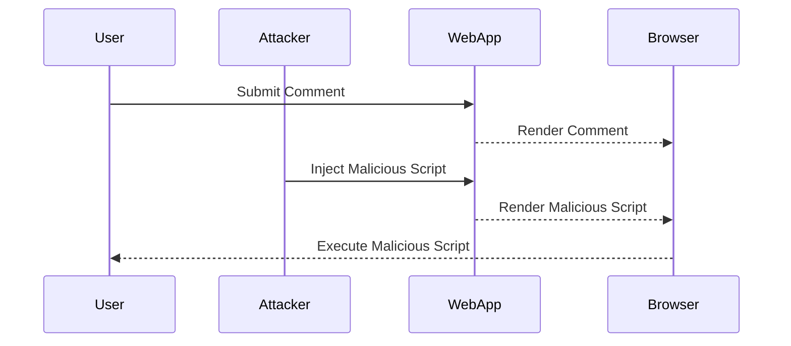

## Cross-Site Scripting (XSS)

### What is Cross-Site Scripting (XSS)?

Cross-Site Scripting (XSS) is a type of security vulnerability that occurs when an attacker injects malicious scripts into a trusted website. These scripts are then executed by unsuspecting users' browsers, leading to potential security risks such as data theft, session hijacking, and unauthorized actions.

### Why Does XSS Matter?

XSS attacks are significant because they leverage the trust users place in websites. When a user visits a compromised site, their browser executes the malicious script, which can interact with the user's session, steal sensitive information, or even take control of the user's account. This can lead to severe consequences, including financial loss, identity theft, and reputational damage.

### How Does XSS Work?

To understand how XSS works, let's break down the process:

1. **Injection**: An attacker finds a way to inject malicious JavaScript code into a webpage. This can happen through various means, such as user input fields, URL parameters, or cookies.
2. **Execution**: When a user visits the compromised webpage, their browser loads the injected JavaScript code along with the legitimate content.
3. **Exploitation**: The malicious script executes within the context of the user's session, potentially accessing sensitive data, performing unauthorized actions, or redirecting the user to malicious sites.

### Example Scenario: Blog Website with User Comments

Consider a blog website that allows users to post comments. If the website does not properly validate and sanitize user input, an attacker could submit a comment containing malicious JavaScript code. When other users visit the page and load the comments, their browsers execute the injected code, leading to potential security issues.

#### Real-World Example: CVE-2021-21972

In 2021, a critical XSS vulnerability was discovered in the popular WordPress plugin "WPForms." The vulnerability allowed attackers to inject malicious scripts into forms, which would then be executed by unsuspecting users. This led to the potential theft of user data and session hijacking.

### Detailed Example: Injecting Malicious Code

Let's consider a simple example where an attacker injects a malicious script into a comment field on a blog website.

```html
<!-- Vulnerable Comment Field -->
<form action="/submit-comment" method="POST">
    <textarea name="comment"></textarea>
    <input type="submit" value="Submit">
</form>

<!-- Malicious Comment Submitted by Attacker -->
<script>alert('XSS Attack!');</script>
```

When another user visits the page, their browser will execute the injected script, displaying an alert box with the message "XSS Attack!".

### Full HTTP Request and Response

Here is a complete example of the HTTP request and response for submitting a comment with malicious JavaScript code.

#### HTTP Request

```http
POST /submit-comment HTTP/1.1
Host: example.com
Content-Type: application/x-www-form-urlencoded
Content-Length: 32

comment=%3Cscript%3Ealert(%27XSS%20Attack!%27)%3B%3C%2Fscript%3E
```

#### HTTP Response

```http
HTTP/1.1 200 OK
Date: Mon, 20 Mar 2023 12:00:00 GMT
Server: Apache/2.4.41 (Ubuntu)
Content-Length: 154
Content-Type: text/html; charset=UTF-8

<!DOCTYPE html>
<html>
<head>
    <title>Comment Submitted</title>
</head>
<body>
    <h1>Your comment has been submitted!</h1>
    <div id="comments">
        <p><script>alert('XSS Attack!');</script></p>
    </div>
</body>
</html>
```

### Common Impacts of XSS

One of the most common impacts of XSS is stealing user identity and making requests on users' behalf. By executing JavaScript on the client side, attackers can access information stored on the client side, such as cookies, local storage, and session tokens.

### How to Prevent / Defend Against XSS

#### Detection

To detect XSS vulnerabilities, you can use automated tools such as static application security testing (SAST) and dynamic application security testing (DAST) tools. These tools can scan your application for potential injection points and identify areas where user input is not properly sanitized.

#### Prevention

To prevent XSS attacks, follow these best practices:

1. **Input Validation and Sanitization**: Ensure that all user inputs are validated and sanitized before being used in the application. This includes both server-side and client-side validation.
2. **Content Security Policy (CSP)**: Implement a Content Security Policy (CSP) to restrict the sources of executable scripts. This can help mitigate the impact of XSS attacks.
3. **Use of Libraries and Frameworks**: Utilize libraries and frameworks that provide built-in protection against XSS, such as AngularJS, React, and Vue.js.

#### Secure Coding Fixes

Here is an example of how to securely handle user input in a comment form using PHP and HTML.

##### Vulnerable Code

```php
<?php
$comment = $_POST['comment'];
echo "<p>$comment</p>";
?>
```

##### Secure Code

```php
<?php
$comment = htmlspecialchars($_POST['comment'], ENT_QUOTES, 'UTF-8');
echo "<p>$comment</p>";
?>
```

### Mermaid Diagrams

#### Attack Chain Diagram



### Conclusion

Cross-Site Scripting (XSS) is a serious security vulnerability that can have significant consequences for both users and organizations. By understanding how XSS works and implementing proper security measures, you can protect your applications from these types of attacks.

### Practice Labs

For hands-on practice with XSS attacks and defenses, consider the following labs:

- **PortSwigger Web Security Academy**: Offers interactive labs on XSS and other web security topics.
- **OWASP Juice Shop**: A deliberately insecure web application for practicing web security skills.
- **DVWA (Damn Vulnerable Web Application)**: A PHP/MySQL web application that demonstrates web application vulnerabilities.

By engaging with these resources, you can gain practical experience in identifying and mitigating XSS vulnerabilities.

---
<!-- nav -->
[[06-Cross-Site Scripting (XSS) Part 1|Cross-Site Scripting (XSS) Part 1]] | [[DevSecOps/DevSecOps Bootcamp/03-Identity & Access Management/04-Security Essentials/Types of Security Attacks Part 1/00-Overview|Overview]] | [[08-External JavaScript Injection|External JavaScript Injection]]
