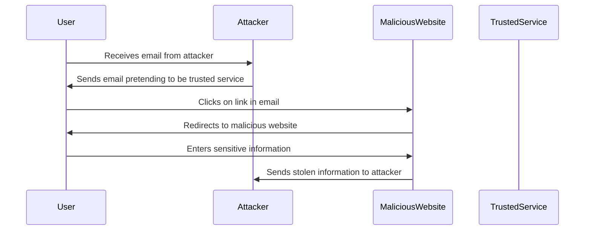
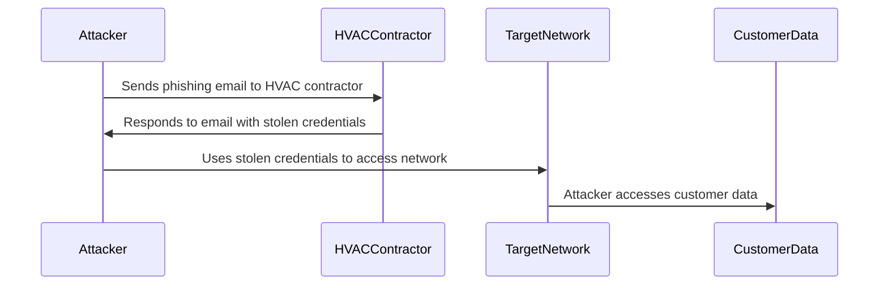

## Social Engineering Attacks

### Introduction to Social Engineering

Social engineering attacks are a class of security threats that rely on human interaction and manipulation to gain access to sensitive information or systems. Unlike traditional cyberattacks that focus on exploiting technical vulnerabilities, social engineering exploits the psychological weaknesses of individuals. These attacks are often referred to as "social hacking" or "phishing attacks."

### Phishing Attacks

Phishing attacks are one of the most common forms of social engineering. They involve tricking users into clicking on malicious links or downloading harmful attachments, typically through emails or messages. The goal is to steal sensitive information such as passwords, credit card details, or other personal data.

#### How Phishing Works

1. **Initial Contact**: An attacker sends an email or message that appears to be from a trusted source, such as a bank, a popular service provider, or a colleague.
2. **Manipulation**: The message often includes urgent language or a sense of urgency to prompt immediate action. For example, it might claim that the user's account has been compromised or that they need to verify their identity.
3. **Malicious Link**: The email or message contains a link that leads to a malicious website designed to look legitimate. When the user clicks on the link, they are directed to a page that may ask for sensitive information or download malware onto their device.
4. **Execution**: Once the user interacts with the malicious link, the attacker can gain control of the user's device or steal their credentials.

#### Real-World Example: BEC Scams

Business Email Compromise (BEC) scams are a form of phishing that targets businesses. In these attacks, attackers impersonate company executives or vendors to trick employees into transferring money or revealing sensitive information. According to the FBI’s Internet Crime Complaint Center (IC3), BEC scams have resulted in losses exceeding $1.7 billion globally.



### Offline Social Engineering

Offline social engineering involves manipulating individuals in physical environments to gain unauthorized access to restricted areas or information. This can include:

1. **Tailgating**: Following someone into a secure area without proper authorization.
2. **Impersonation**: Pretending to be an employee or a vendor to gain access to sensitive areas.
3. **Dumpster Diving**: Searching through trash to find sensitive documents or information.

#### Real-World Example: Target Data Breach

In 2013, Target suffered a massive data breach that affected millions of customers. The breach was initially attributed to a phishing attack on a third-party HVAC contractor. The attacker used stolen credentials to gain access to Target's network, leading to the theft of sensitive customer data.



### Detection and Prevention

#### How to Detect Phishing Attempts

1. **Suspicious Links**: Hover over links to see the actual URL before clicking. Phishing links often redirect to suspicious or unfamiliar domains.
2. **Urgency and Threats**: Be wary of messages that create a sense of urgency or threaten negative consequences if you do not act immediately.
3. **Poor Grammar and Spelling**: Many phishing emails contain grammatical errors or poor spelling, which can be a red flag.

#### Secure Coding Practices

To prevent phishing attacks, organizations should implement secure coding practices and educate employees about the risks of social engineering. Here are some secure coding practices:

1. **Input Validation**: Validate all inputs to ensure they meet expected formats and constraints.
2. **Output Encoding**: Encode all outputs to prevent injection attacks.
3. **Least Privilege Principle**: Ensure that applications run with the least privileges necessary to perform their tasks.

#### Example: Secure Email Handling

Here is an example of how to handle email securely using Python:

```python
import re

def validate_email(email):
    # Regular expression to match email format
    email_regex = r'^[a-zA-Z0-9._%+-]+@[a-zA-Z0-9.-]+\.[a-zA-Z]{2,}$'
    
    if re.match(email_regex, email):
        return True
    else:
        return False

# Example usage
email = "example@example.com"
if validate_email(email):
    print("Valid email")
else:
    print("Invalid email")
```

#### Example: Secure Link Handling

Here is an example of how to handle links securely using JavaScript:

```javascript
function validateLink(link) {
    // Regular expression to match URL format
    const urlRegex = /^(https?:\/\/)[\w.-]+(?:\.[\w.-]+)+[\w.,@?^=%&:/~+#-]*$/;
    
    if (urlRegex.test(link)) {
        return true;
    } else {
        return false;
    }
}

// Example usage
const link = "https://example.com";
if (validateLink(link)) {
    console.log("Valid link");
} else {
    console.log("Invalid link");
}
```

### Physical Security Measures

To prevent offline social engineering attacks, organizations should implement robust physical security measures:

1. **Access Control**: Use biometric authentication, key cards, or other secure methods to control access to restricted areas.
2. **Surveillance**: Install cameras and other surveillance equipment to monitor access points and detect suspicious activity.
3. **Employee Training**: Educate employees about the risks of social engineering and train them to recognize and report suspicious behavior.

### Conclusion

Social engineering attacks pose a significant threat to both online and offline security. By understanding the mechanisms behind these attacks and implementing robust detection and prevention strategies, organizations can significantly reduce their risk of falling victim to social engineering. Regular training and awareness programs are essential to ensuring that employees remain vigilant against these sophisticated threats.

### Practice Labs

For hands-on practice with social engineering attacks, consider the following labs:

- **PortSwigger Web Security Academy**: Offers interactive labs that simulate various types of phishing attacks.
- **OWASP Juice Shop**: A deliberately insecure web application that includes social engineering challenges.
- **DVWA (Damn Vulnerable Web Application)**: Provides a variety of web application vulnerabilities, including social engineering scenarios.

By engaging with these labs, you can gain practical experience in identifying and defending against social engineering attacks.

---
<!-- nav -->
[[12-Social Engineering Attacks Part 1|Social Engineering Attacks Part 1]] | [[DevSecOps/DevSecOps Bootcamp/03-Identity & Access Management/04-Security Essentials/Types of Security Attacks Part 1/00-Overview|Overview]] | [[14-Types of Security Attacks Part 1 SQL Injection and Data Manipulation|Types of Security Attacks Part 1 SQL Injection and Data Manipulation]]
