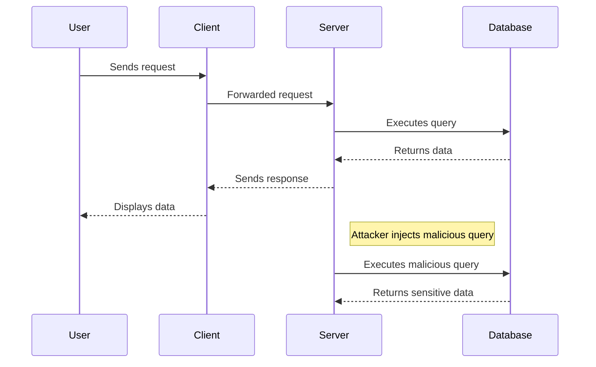
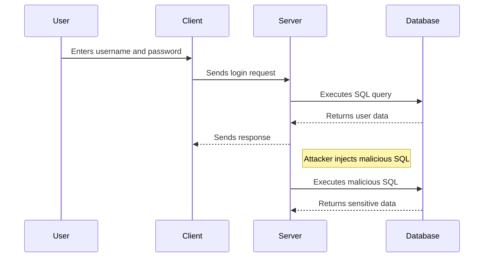

## Types of Security Attacks Part 1

### Introduction to Security Attacks

In the realm of DevSecOps, understanding various types of security attacks is crucial for developing robust and secure applications. One of the primary categories of attacks involves manipulating the application's frontend and backend to gain unauthorized access or perform malicious actions. These attacks can range from simple client-side manipulations to complex server-side exploits. In this section, we will delve into two significant types of attacks: **Server-Side Forgery** and **SQL Injection**.

### Server-Side Forgery

#### What is Server-Side Forgery?

Server-side forgery refers to attacks where an adversary manipulates the server-side logic to execute unauthorized actions. Unlike client-side attacks, which typically target individual user data, server-side forgery can have far-reaching consequences due to the elevated privileges of the server.

#### Why is Server-Side Forgery Dangerous?

The primary reason server-side forgery is particularly dangerous is the level of access a server typically has. While a client usually has access only to their own data, a server often has access to all user data and may even have administrative privileges. This means that if an attacker can impersonate the server, they can potentially access and manipulate all data stored within the application, leading to severe data breaches and system compromises.

#### How Does Server-Side Forgery Work?

Server-side forgery can occur through various mechanisms, such as exploiting vulnerabilities in server-side code, manipulating input parameters, or injecting malicious scripts. For instance, if a server-side script is not properly validated or sanitized, an attacker might be able to inject arbitrary commands or queries that the server will execute.

#### Real-World Example: Equifax Data Breach

One of the most notable examples of server-side forgery is the Equifax data breach in 2017. The breach was caused by a vulnerability in Apache Struts, a popular web application framework. Attackers exploited a flaw in the framework to execute arbitrary code on the server, leading to the theft of sensitive personal information of approximately 143 million individuals. This incident underscores the catastrophic potential of server-side forgery.

#### How to Prevent / Defend Against Server-Side Forgery

To prevent server-side forgery, several best practices should be followed:

1. **Input Validation**: Ensure all input parameters are thoroughly validated and sanitized to prevent injection attacks.
2. **Least Privilege Principle**: Run server processes with the least privilege necessary to minimize the potential damage if an attack occurs.
3. **Regular Updates and Patch Management**: Keep all software components up-to-date to mitigate known vulnerabilities.
4. **Security Testing**: Conduct regular security testing, including penetration testing and code reviews, to identify and address potential vulnerabilities.



### SQL Injection

#### What is SQL Injection?

SQL injection is a type of attack where an attacker manipulates SQL queries to gain unauthorized access to or modify data within a database. This attack exploits vulnerabilities in the application's input handling, allowing the attacker to inject malicious SQL code that the server executes.

#### Why is SQL Injection Dangerous?

SQL injection is particularly dangerous because databases often contain the most valuable and sensitive data within an application. By successfully executing a SQL injection attack, an attacker can retrieve, modify, or delete data, leading to severe data breaches and operational disruptions.

#### How Does SQL Injection Work?

SQL injection typically occurs when an application fails to properly validate or sanitize user inputs before using them in SQL queries. For example, consider a login form where the username and password are used to construct a SQL query:

```sql
SELECT * FROM users WHERE username = 'username' AND password = 'password';
```

If the application does not properly sanitize the input, an attacker could inject a malicious SQL statement. For instance, an attacker might enter the following as the username:

```plaintext
' OR '1'='1
```

This would result in the following SQL query being executed:

```sql
SELECT * FROM users WHERE username = '' OR '1'='1' AND password = 'password';
```

Since `'1'='1'` is always true, the query would return all rows from the `users` table, effectively bypassing authentication.

#### Real-World Example: Capital One Data Breach

A notable example of SQL injection is the Capital One data breach in 2019. An attacker exploited a misconfigured web application firewall to access sensitive customer data. Although the breach was primarily due to misconfiguration, it highlights the importance of securing all aspects of an application, including database interactions.

#### How to Prevent / Defend Against SQL Injection

To prevent SQL injection, several best practices should be followed:

1. **Parameterized Queries**: Use parameterized queries or prepared statements to ensure that user inputs are treated as data rather than executable code.
2. **Input Validation**: Validate and sanitize all user inputs to prevent injection of malicious SQL code.
3. **Least Privilege Principle**: Limit database permissions to the minimum necessary to perform required operations.
4. **Security Testing**: Regularly test applications for SQL injection vulnerabilities using tools like SQLMap or Burp Suite.



### Vulnerable vs. Secure Code Examples

#### Vulnerable Code Example

Consider the following vulnerable code snippet that constructs a SQL query based on user input:

```python
# Vulnerable code
username = request.form['username']
password = request.form['password']

query = f"SELECT * FROM users WHERE username = '{username}' AND password = '{password}';"
cursor.execute(query)
```

#### Secure Code Example

Here is the corresponding secure code using parameterized queries:

```python
# Secure code
username = request.form['username']
password = request.form['password']

query = "SELECT * FROM users WHERE username = %s AND password = %s;"
cursor.execute(query, (username, password))
```

### Conclusion

Understanding and preventing server-side forgery and SQL injection attacks is essential for developing secure applications. By following best practices such as input validation, using parameterized queries, and conducting regular security testing, developers can significantly reduce the risk of these attacks. Additionally, staying informed about recent real-world examples and vulnerabilities helps in maintaining a proactive approach to security.

### Hands-On Labs

For practical experience with these concepts, consider the following labs:

- **PortSwigger Web Security Academy**: Offers interactive labs on SQL injection and other web application security topics.
- **OWASP Juice Shop**: A deliberately insecure web application for practicing various security attacks and defenses.
- **DVWA (Damn Vulnerable Web Application)**: Provides a variety of web application vulnerabilities, including SQL injection, for hands-on learning.

By engaging with these resources, you can gain a deeper understanding of how to identify and mitigate security threats in real-world scenarios.

---
<!-- nav -->
[[14-Types of Security Attacks Part 1 SQL Injection and Data Manipulation|Types of Security Attacks Part 1 SQL Injection and Data Manipulation]] | [[DevSecOps/DevSecOps Bootcamp/03-Identity & Access Management/04-Security Essentials/Types of Security Attacks Part 1/00-Overview|Overview]] | [[16-Weak Authentication Checks|Weak Authentication Checks]]
