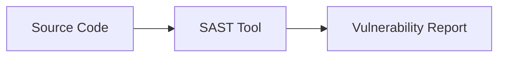
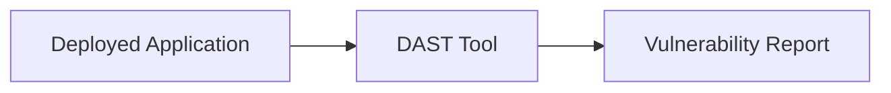
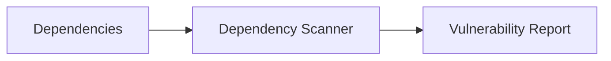
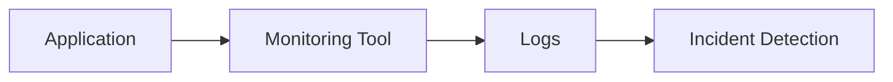
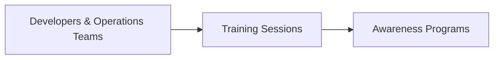

## Introduction to DevSecOps and Security Essentials

### What is DevSecOps?

DevSecOps is a methodology that integrates security practices into the DevOps lifecycle. Traditionally, security was often an afterthought, added late in the development cycle. However, with DevSecOps, security is embedded throughout the entire software development and deployment process. This ensures that applications are secure from the initial design phase through continuous integration, testing, and deployment.

### Importance of DevSecOps

The primary goal of DevSecOps is to ensure that applications remain secure throughout their lifecycle. This is achieved by automating security checks, integrating security tools into the CI/CD pipeline, and fostering a culture of security awareness among developers and operations teams.

### Example: Apache Struts Vulnerability

One of the most notable examples of a security vulnerability that could have been mitigated with robust DevSecOps practices is the Apache Struts vulnerability (CVE-2017-5638). This vulnerability led to one of the largest data breaches in history, affecting Equifax and exposing sensitive personal information of millions of individuals.

#### Background on Apache Struts

Apache Struts is a popular open-source framework used for developing Java-based web applications. The vulnerability in question was a remote code execution flaw in the Jakarta Multipart parser component of Apache Struts. Attackers could exploit this vulnerability by sending specially crafted HTTP requests to a server running an affected version of Apache Struts.

#### Impact of the Apache Struts Breach

The Equifax breach, which occurred in 2017, exposed the personal information of approximately 147 million consumers. The attackers exploited the Apache Struts vulnerability to gain unauthorized access to Equifax’s systems, leading to the theft of sensitive data such as Social Security numbers, birth dates, and addresses.

### How DevSecOps Can Mitigate Such Vulnerabilities

By integrating security into the DevOps process, organizations can detect and mitigate vulnerabilities much earlier in the development cycle. This reduces the likelihood of such vulnerabilities making it to production environments.

### Key Components of DevSecOps

To understand how DevSecOps can help mitigate security vulnerabilities, let's break down the key components:

1. **Security Automation**: Automating security checks and tests as part of the CI/CD pipeline.
2. **Security Tools Integration**: Integrating security tools like static application security testing (SAST), dynamic application security testing (DAST), and dependency scanning.
3. **Security Policies and Compliance**: Implementing security policies and ensuring compliance with regulatory requirements.
4. **Continuous Monitoring and Logging**: Continuously monitoring and logging application behavior to detect anomalies and potential security incidents.
5. **Security Training and Awareness**: Educating developers and operations teams about security best practices and common vulnerabilities.

### Step-by-Step Implementation of DevSecOps

Let's walk through the steps involved in implementing DevSecOps, using the Apache Struts vulnerability as a case study.

#### Step 1: Static Application Security Testing (SAST)

Static Application Security Testing (SAST) involves analyzing the source code of an application to identify potential security vulnerabilities. This is typically done before the code is compiled or deployed.



**Example SAST Tool**: SonarQube

SonarQube is a popular SAST tool that can be integrated into the CI/CD pipeline. Here’s an example of how to configure SonarQube in a Jenkins pipeline:

```groovy
pipeline {
    agent any
    stages {
        stage('Build') {
            steps {
                sh 'mvn clean package'
            }
        }
        stage('Test') {
            steps {
                sh 'mvn test'
            }
        }
        stage('SonarQube Analysis') {
            steps {
                withSonarQubeEnv('SonarQube') {
                    sh 'mvn sonar:sonar'
                }
            }
        }
    }
}
```

#### Step 2: Dynamic Application Security Testing (DAST)

Dynamic Application Security Testing (DAST) involves testing the application in a runtime environment to identify security vulnerabilities. This is typically done after the application is deployed.



**Example DAST Tool**: OWASP ZAP

OWASP ZAP is a popular DAST tool that can be integrated into the CI/CD pipeline. Here’s an example of how to configure OWASP ZAP in a Jenkins pipeline:

```groovy
pipeline {
    agent any
    stages {
        stage('Build') {
            steps {
                sh 'mvn clean package'
            }
        }
        stage('Test') {
            steps {
                sh 'mvn test'
            }
        }
        stage('ZAP Scan') {
            steps {
                script {
                    def zap = new hudson.plugins.zap.ZapPlugin()
                    def zapScan = zap.scan('http://localhost:8080', 'target')
                    echo "ZAP Scan Results: ${zapScan}"
                }
            }
        }
    }
}
```

#### Step 3: Dependency Scanning

Dependency scanning involves analyzing the dependencies of an application to identify potential security vulnerabilities. This is typically done during the build process.



**Example Dependency Scanner**: OWASP Dependency-Check

OWASP Dependency-Check is a popular dependency scanner that can be integrated into the CI/CD pipeline. Here’s an example of how to configure OWASP Dependency-Check in a Maven project:

```xml
<build>
    <plugins>
        <plugin>
            <groupId>org.owasp</groupId>
            <artifactId>dependency-check-maven</artifactId>
            <version>6.5.1</version>
            <executions>
                <execution>
                    <goals>
                        <goal>check</goal>
                    </goals>
                </execution>
            </executions>
        </plugin>
    </plugins>
</build>
```

#### Step 4: Continuous Monitoring and Logging

Continuous monitoring and logging involve continuously monitoring the application and its environment to detect potential security incidents. This is typically done in real-time.



**Example Monitoring Tool**: ELK Stack (Elasticsearch, Logstash, Kibana)

The ELK Stack is a popular monitoring tool that can be used to collect and analyze logs from an application. Here’s an example of how to configure Logstash to collect logs from an application:

```json
input {
  beats {
    port => 5044
  }
}

filter {
  grok {
    match => { "message" => "%{COMBINEDAPACHELOG}" }
  }
}

output {
  elasticsearch {
    hosts => ["localhost:9200"]
    index => "app-logs-%{+YYYY.MM.dd}"
  }
}
```

#### Step 5: Security Training and Awareness

Security training and awareness involve educating developers and operations teams about security best practices and common vulnerabilities. This is typically done through regular training sessions and security awareness programs.



### How to Prevent / Defend Against the Apache Struts Vulnerability

#### Detection

To detect the Apache Struts vulnerability, you can use a combination of SAST, DAST, and dependency scanning tools. These tools can help identify the presence of the vulnerable versions of Apache Struts in your application.

#### Prevention

To prevent the Apache Struts vulnerability, you should:

1. **Keep Dependencies Up-to-Date**: Ensure that all dependencies, including Apache Struts, are kept up-to-date with the latest security patches.
2. **Use Secure Coding Practices**: Follow secure coding practices to avoid introducing vulnerabilities in your code.
3. **Implement Security Policies**: Implement security policies and ensure compliance with regulatory requirements.

#### Secure-Coding Fixes

Here’s an example of how to fix the Apache Struts vulnerability in your code:

**Vulnerable Code**:
```java
import org.apache.struts2.dispatcher.ng.filter.StrutsPrepareAndExecuteFilter;

public class MyServlet extends HttpServlet {
    @Override
    public void init() throws ServletException {
        FilterConfig filterConfig = getFilterConfig();
        StrutsPrepareAndExecuteFilter strutsFilter = new StrutsPrepareAndExecuteFilter();
        strutsFilter.init(filterConfig);
    }
}
```

**Fixed Code**:
```java
import org.apache.struts2.dispatcher.ng.filter.StrutsPrepareAndExecuteFilter;

public class MyServlet extends HttpServlet {
    @Override
    public void init() throws ServletException {
        FilterConfig filterConfig = getFilterConfig();
        StrutsPrepareAndExecuteFilter strutsFilter = new StrutsPrepareAndExecuteFilter();
        strutsFilter.init(filterConfig);
        
        // Additional security measures
        System.setProperty("struts.i18n.encoding", "UTF-8");
        System.setProperty("struts.multipart.saveDir", "/tmp");
    }
}
```

#### Configuration Hardening

To harden the configuration of Apache Struts, you can make the following changes:

1. **Set Encoding**: Set the encoding to UTF-8 to prevent character encoding attacks.
2. **Set Save Directory**: Set the save directory to a temporary location to prevent directory traversal attacks.

**Example Configuration**:
```properties
struts.i18n.encoding=UTF-8
struts.multipart.saveDir=/tmp
```

### Real-World Examples and Recent CVEs

#### Recent CVEs Involving Apache Struts

- **CVE-2017-5638**: Remote Code Execution in Apache Struts Jakarta Multipart parser.
- **CVE-2018-11776**: Remote Code Execution in Apache Struts OGNL expression evaluation.

#### Real-World Breaches Involving Apache Struts

- **Equifax Breach (2017)**: Exploited the Apache Struts vulnerability to steal sensitive personal information.
- **Under Armour MyFitnessPal Breach (2018)**: Exploited the Apache Struts vulnerability to steal user credentials.

### Hands-On Labs

To practice and reinforce the concepts covered in this chapter, you can use the following hands-on labs:

- **PortSwigger Web Security Academy**: Offers interactive labs to practice web security techniques.
- **OWASP Juice Shop**: A deliberately insecure web application to practice web security.
- **DVWA (Damn Vulnerable Web Application)**: A PHP/MySQL web application that contains numerous security vulnerabilities.

### Conclusion

In conclusion, DevSecOps is a critical methodology for ensuring the security of applications throughout their lifecycle. By integrating security practices into the DevOps process, organizations can detect and mitigate vulnerabilities much earlier in the development cycle, reducing the likelihood of security incidents in production environments. The Apache Struts vulnerability serves as a stark reminder of the importance of DevSecOps and the need to implement robust security practices in modern software development.

---

This expanded chapter provides a comprehensive overview of DevSecOps and its role in mitigating security vulnerabilities, using the Apache Struts vulnerability as a case study. It covers the key components of DevSecOps, step-by-step implementation, real-world examples, and hands-on labs to reinforce the concepts.

---
<!-- nav -->
[[DevSecOps/DevSecOps Bootcamp/03-Identity & Access Management/04-Security Essentials/Types of Security Attacks Part 2/00-Overview|Overview]] | [[DevSecOps/DevSecOps Bootcamp/03-Identity & Access Management/04-Security Essentials/Types of Security Attacks Part 2/02-Introduction to Security Attacks and Data Breaches|Introduction to Security Attacks and Data Breaches]]
