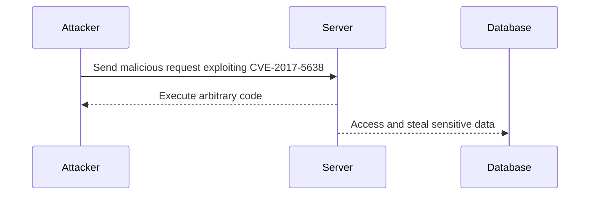
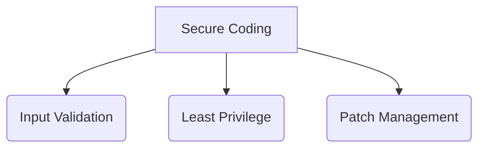

## Introduction to Security Attacks and Data Breaches

In the realm of cybersecurity, data breaches are among the most devastating types of attacks. They can lead to significant financial losses, reputational damage, and legal consequences for organizations. One such notable breach occurred with Equifax, a major consumer credit reporting agency, which exposed the personal information of millions of individuals. This incident highlights the critical importance of understanding the types of security attacks, the vulnerabilities they exploit, and the measures necessary to prevent such breaches.

### Background on the Equifax Data Breach

The Equifax data breach, discovered in July 2017, involved the theft of sensitive personal information from approximately 147 million consumers. The attackers exploited a vulnerability in Apache Struts, a widely used open-source web application framework. This breach underscores the significance of securing third-party frameworks and the potential consequences of failing to do so.

#### What is Apache Struts?

Apache Struts is an open-source framework for developing Java-based web applications. It provides a robust set of tools and utilities to streamline the development process. However, like any software, it can have vulnerabilities that, if left unpatched, can be exploited by attackers.

##### Vulnerability Exploited: CVE-2017-5638

One of the critical vulnerabilities exploited in the Equifax breach was CVE-2017-5638, a remote code execution flaw in Apache Struts. This vulnerability allowed attackers to execute arbitrary code on the server, leading to unauthorized access and data theft.



### Understanding Personally Identifiable Information (PII)

Personally Identifiable Information (PII) is any data that can be used to identify a specific individual. Examples of PII include:

- Full name
- Social Security number
- Driver’s license number
- Credit card number
- Email address

PII is crucial because it can be used to uniquely identify a person and is often used in various contexts, such as financial transactions, healthcare records, and government identification.

#### Importance of Protecting PII

Protecting PII is essential due to the following reasons:

- **Identity Theft**: Unauthorized access to PII can lead to identity theft, where attackers impersonate victims to commit fraud.
- **Financial Losses**: Stolen financial information can result in unauthorized transactions and significant financial losses.
- **Reputational Damage**: Data breaches involving PII can severely damage an organization's reputation and customer trust.

### Real-World Examples of Data Breaches Involving PII

Several high-profile data breaches have involved the theft of PII. Here are some recent examples:

- **Equifax (CVE-2017-5638)**: As mentioned earlier, the Equifax breach exposed the PII of millions of individuals, including names, social security numbers, and credit card details.
- **Capital One (CVE-2019-11510)**: In 2019, Capital One suffered a data breach affecting over 100 million customers. The attacker exploited a misconfigured web application firewall, gaining access to sensitive customer data.
- **Marriott International (CVE-2018-1257)**: In 2018, Marriott disclosed a breach that affected up to 500 million guests. The attackers accessed PII, including passport numbers and payment card information.

### How to Prevent and Defend Against Data Breaches

Preventing data breaches requires a multi-faceted approach, including secure coding practices, regular vulnerability assessments, and robust security policies.

#### Secure Coding Practices

Secure coding practices are essential to prevent vulnerabilities from being exploited. Here are some key principles:

- **Input Validation**: Validate all user inputs to ensure they meet expected formats and constraints.
- **Least Privilege Principle**: Ensure that applications and services run with the minimum privileges necessary to perform their tasks.
- **Patch Management**: Regularly update and patch all software components, including third-party libraries and frameworks.



#### Example of Secure Coding: Input Validation

Consider a simple web application that accepts user input for a search query. Without proper validation, an attacker could inject malicious code.

**Vulnerable Code:**

```java
public String search(String query) {
    // Perform search using the provided query
    return database.search(query);
}
```

**Secure Code:**

```java
public String search(String query) {
    // Validate the input to prevent SQL injection
    if (!isValidQuery(query)) {
        throw new IllegalArgumentException("Invalid query");
    }
    return database.search(query);
}

private boolean isValidQuery(String query) {
    // Implement validation logic to ensure the query is safe
    return query.matches("[a-zA-Z0-9 ]+");
}
```

#### Regular Vulnerability Assessments

Regular vulnerability assessments help identify and mitigate potential security weaknesses. Tools like static code analyzers and dynamic application scanners can be used to detect vulnerabilities.

**Example of a Static Code Analysis Tool:**

```bash
# Run a static code analysis using SonarQube
sonar-scanner -Dsonar.projectKey=myproject -Dsonar.sources=src
```

**Example of a Dynamic Application Scanner:**

```bash
# Run a dynamic application scan using OWASP ZAP
zap-cli --target http://localhost:8080 --spider --scan-all --report
```

#### Robust Security Policies

Implementing robust security policies is crucial to protect against data breaches. Key policies include:

- **Data Encryption**: Encrypt sensitive data both at rest and in transit.
- **Access Controls**: Implement strict access controls to ensure that only authorized personnel can access PII.
- **Incident Response Plan**: Develop and maintain an incident response plan to quickly respond to security incidents.

**Example of Data Encryption:**

```bash
# Encrypt a file using GPG
gpg --encrypt --recipient user@example.com sensitive_data.txt
```

**Example of Access Controls:**

```json
{
  "Version": "2012-10-17",
  "Statement": [
    {
      "Sid": "AllowAccessToSensitiveData",
      "Effect": "Allow",
      "Principal": {
        "AWS": "arn:aws:iam::123456789012:user/admin"
      },
      "Action": "s3:GetObject",
      "Resource": "arn:aws:s3:::mybucket/sensitive-data/*"
    }
  ]
}
```

### Detection and Monitoring

Detecting and monitoring security incidents is essential to quickly identify and respond to potential breaches. Tools like intrusion detection systems (IDS) and security information and event management (SIEM) systems can be used for this purpose.

**Example of an IDS Configuration:**

```bash
# Configure Snort IDS rules
snort -c /etc/snort/snort.conf -T
```

**Example of a SIEM Configuration:**

```bash
# Configure Splunk to monitor security events
./splunk enable boot-start
./splunk start
```

### Conclusion

Understanding the types of security attacks and the importance of protecting PII is crucial for preventing data breaches. By implementing secure coding practices, conducting regular vulnerability assessments, and maintaining robust security policies, organizations can significantly reduce the risk of such incidents. Additionally, effective detection and monitoring mechanisms are essential to quickly identify and respond to security threats.

### Practice Labs

For hands-on experience with web application security, consider the following labs:

- **PortSwigger Web Security Academy**: Offers interactive labs covering various web security topics, including SQL injection, cross-site scripting (XSS), and other vulnerabilities.
- **OWASP Juice Shop**: An intentionally insecure web application designed for security training and research.
- **DVWA (Damn Vulnerable Web Application)**: A PHP/MySQL web application that demonstrates web application vulnerabilities.

These labs provide practical experience in identifying and mitigating security vulnerabilities, helping to reinforce the theoretical concepts covered in this chapter.

---
<!-- nav -->
[[DevSecOps/DevSecOps Bootcamp/03-Identity & Access Management/04-Security Essentials/Types of Security Attacks Part 2/01-Introduction to DevSecOps and Security Essentials|Introduction to DevSecOps and Security Essentials]] | [[DevSecOps/DevSecOps Bootcamp/03-Identity & Access Management/04-Security Essentials/Types of Security Attacks Part 2/00-Overview|Overview]] | [[DevSecOps/DevSecOps Bootcamp/03-Identity & Access Management/04-Security Essentials/Types of Security Attacks Part 2/03-Introduction to Security Essentials in DevSecOps|Introduction to Security Essentials in DevSecOps]]
