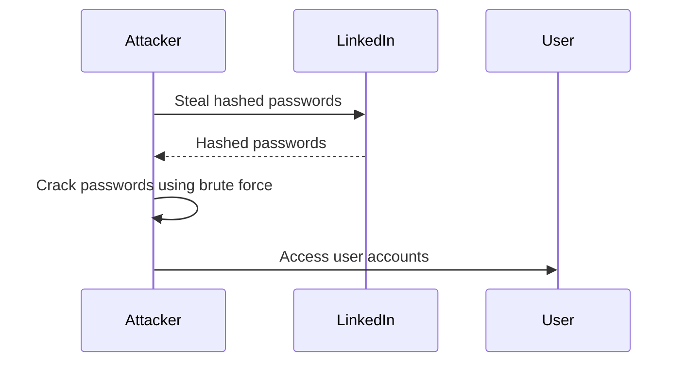
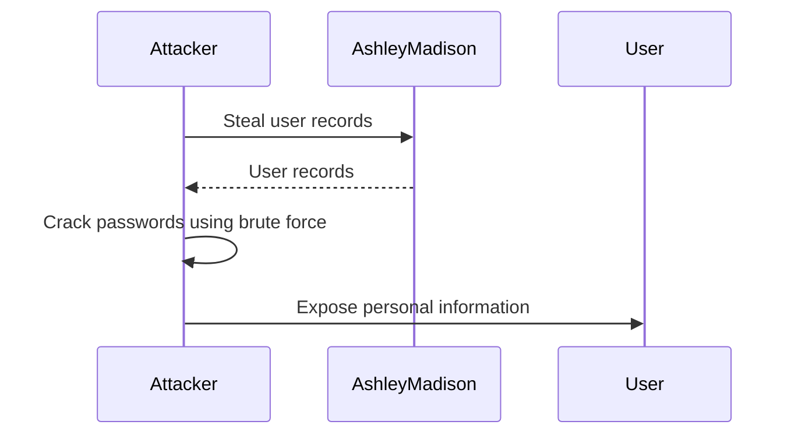
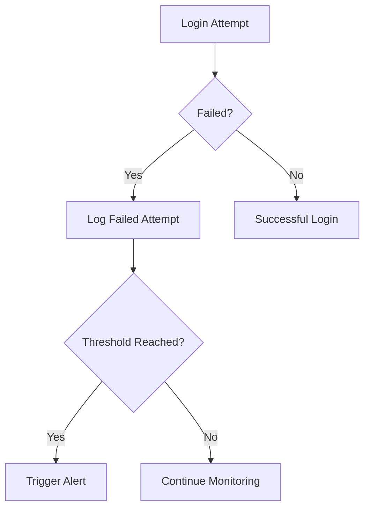

## Brute Force Attacks

### What is a Brute Force Attack?

A brute force attack is a method used by attackers to gain unauthorized access to a system by systematically trying all possible combinations of passwords until the correct one is found. This type of attack is particularly effective against systems with weak or commonly used passwords. The attacker typically starts with a list of potential passwords, often derived from leaked databases or commonly used passwords, and tries each one until the correct password is discovered.

### Why Are Brute Force Attacks Common?

Brute force attacks are common because they do not require sophisticated hacking skills. Anyone with basic knowledge of password cracking tools and access to a list of potential passwords can attempt such an attack. Additionally, many users tend to use weak or easily guessable passwords, making brute force attacks more likely to succeed.

### How Does a Brute Force Attack Work?

The process of a brute force attack involves the following steps:

1. **Gathering Password Lists**: Attackers often start by collecting lists of commonly used passwords. These lists can be obtained from various sources, including data breaches, forums, and specialized websites that compile such information.

2. **Choosing Targets**: Once the attacker has a list of potential passwords, they choose a target system. This could be a website, a server, or any other system that requires authentication.

3. **Automated Password Guessing**: Using automated tools, the attacker systematically tries each password from the list against the target system. This process can be time-consuming but is often successful due to the prevalence of weak passwords.

4. **Success**: If the correct password is found, the attacker gains unauthorized access to the system. From there, they can perform various malicious activities, such as stealing sensitive data, modifying configurations, or spreading malware.

### Real-World Examples

#### Example 1: LinkedIn Data Breach (CVE-2012-0908)

In 2012, LinkedIn suffered a massive data breach where approximately 6.5 million hashed passwords were stolen. These passwords were later cracked using brute force techniques, leading to widespread unauthorized access to user accounts. This incident highlights the importance of using strong, unique passwords and implementing robust password hashing mechanisms.



#### Example 2: Ashley Madison Data Breach (2015)

In 2015, the dating site Ashley Madison was hacked, resulting in the theft of over 36 million user records. The attackers used brute force techniques to crack the hashed passwords stored in the database. This breach led to significant privacy concerns and legal issues for affected users.



### How to Prevent / Defend Against Brute Force Attacks

#### Detection

To detect brute force attacks, organizations should implement monitoring and logging mechanisms that track login attempts. Suspicious patterns, such as multiple failed login attempts from the same IP address, should trigger alerts.



#### Prevention

1. **Strong Password Policies**: Enforce strong password policies that require users to create complex passwords. This includes requiring a minimum length, the use of special characters, and prohibiting the use of common phrases.

    ```plaintext
    Vulnerable Policy:
    Minimum Length: 6 characters
    
    Secure Policy:
    Minimum Length: 12 characters
    Require Special Characters
    Prohibit Common Phrases
    ```

2. **Account Lockout Mechanisms**: Implement account lockout mechanisms that temporarily disable an account after a certain number of failed login attempts. This can significantly reduce the effectiveness of brute force attacks.

    ```mermaid
sequenceDiagram
        participant User
        participant System
        User->>System: First Failed Login
        System-->>User: Allow Login
        User->>System: Second Failed Login
        System-->>User: Allow Login
        User->>System: Third Failed Login
        System-->>User: Lock Account
```

3. **Multi-Factor Authentication (MFA)**: Implement multi-factor authentication to add an additional layer of security. Even if an attacker manages to guess the password, they will still need the second factor to gain access.

    ```mermaid
sequenceDiagram
        participant User
        participant System
        participant MFA Device
        User->>System: Enter Password
        System-->>User: Request MFA Code
        User->>MFA Device: Generate Code
        MFA Device-->>User: Provide Code
        User->>System: Enter MFA Code
        System-->>User: Successful Login
```

4. **Rate Limiting**: Implement rate limiting to restrict the number of login attempts within a given time frame. This can slow down brute force attacks and make them less effective.

    ```mermaid
sequenceDiagram
        participant User
        participant System
        User->>System: First Login Attempt
        System-->>User: Allow Login
        User->>System: Second Login Attempt
        System-->>User: Allow Login
        User->>System: Third Login Attempt
        System-->>User: Rate Limit Exceeded
```

### Secure Coding Practices

When developing applications, it is crucial to follow secure coding practices to prevent brute force attacks. This includes:

1. **Password Storage**: Store passwords securely using strong hashing algorithms like bcrypt or Argon2. Avoid storing passwords in plain text or using weak hashing algorithms like MD5 or SHA-1.

    ```plaintext
    Vulnerable Code:
    password = "password123"
    hash = hashlib.md5(password.encode()).hexdigest()
    
    Secure Code:
    password = "password123"
    salt = bcrypt.gensalt()
    hash = bcrypt.hashpw(password.encode(), salt)
    ```

2. **Input Validation**: Validate user input to ensure that passwords meet the required complexity criteria. This can help prevent users from creating weak passwords.

    ```python
    import re

    def validate_password(password):
        if len(password) < 12:
            return False
        if not re.search("[!@#$%^&*()_+-]", password):
            return False
        if re.search(r"\bpassword\b", password.lower()):
            return False
        return True
    ```

### Hands-On Labs

For practical experience with preventing brute force attacks, consider the following labs:

- **PortSwigger Web Security Academy**: Offers modules on password cracking and securing authentication mechanisms.
- **OWASP Juice Shop**: Provides a vulnerable web application that can be used to practice identifying and mitigating brute force attacks.
- **DVWA (Damn Vulnerable Web Application)**: Includes scenarios where brute force attacks can be simulated and defended against.

By understanding the mechanics of brute force attacks and implementing robust preventive measures, organizations can significantly reduce the risk of unauthorized access and protect their systems from such attacks.

---
<!-- nav -->
[[DevSecOps/DevSecOps Bootcamp/03-Identity & Access Management/04-Security Essentials/Types of Security Attacks Part 2/05-Background on Apache Struts and Its Vulnerabilities|Background on Apache Struts and Its Vulnerabilities]] | [[DevSecOps/DevSecOps Bootcamp/03-Identity & Access Management/04-Security Essentials/Types of Security Attacks Part 2/00-Overview|Overview]] | [[DevSecOps/DevSecOps Bootcamp/03-Identity & Access Management/04-Security Essentials/Types of Security Attacks Part 2/07-Common Vulnerabilities and Exposures (CVE)|Common Vulnerabilities and Exposures (CVE)]]
