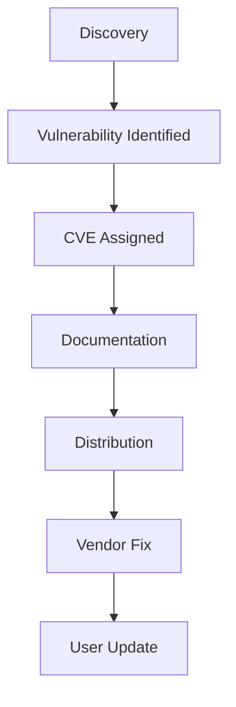
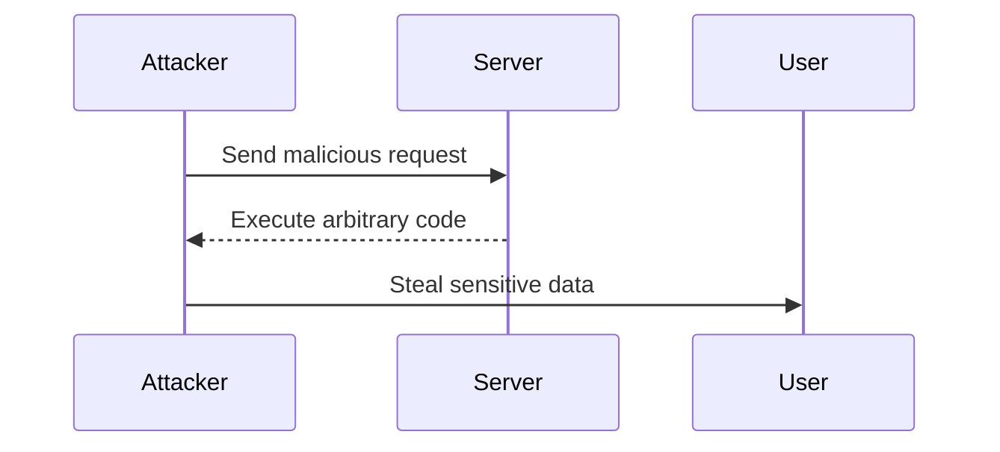

## Common Vulnerabilities and Exposures (CVE)

### What is CVE?

CVE stands for Common Vulnerabilities and Exposures. It is a standardized system used to identify and catalog publicly known cybersecurity vulnerabilities and exposures. Each CVE entry contains a unique identifier, a description of the vulnerability, and references to other resources that provide more detailed information about the issue.

### Why is CVE Important?

CVE is crucial for several reasons:

1. **Standardization**: It provides a consistent format for identifying vulnerabilities, making it easier for organizations to track and manage security issues.
2. **Transparency**: By cataloging vulnerabilities, CVE helps ensure that everyone has access to the same information, promoting a more secure environment.
3. **Vendor Support**: Vendors can use CVE identifiers to communicate about vulnerabilities and their fixes, ensuring that users are aware of the necessary updates.

### How Does CVE Work?

When a vulnerability is discovered, it is assigned a unique CVE identifier. This identifier is then used across various platforms and databases to refer to the specific vulnerability. Here’s a step-by-step breakdown of the process:

1. **Discovery**: A vulnerability is identified by researchers, security teams, or automated tools.
2. **Assignment**: The vulnerability is assigned a CVE identifier by a CVE Numbering Authority (CNA).
3. **Documentation**: Details about the vulnerability, including its severity, affected software versions, and potential impacts, are documented.
4. **Distribution**: The CVE entry is distributed to various security databases and repositories, such as the National Vulnerability Database (NVD).

### Example of a CVE Entry

Let’s look at a recent CVE entry for a hypothetical vulnerability:

```plaintext
CVE-2023-12345
Description: Buffer overflow in XYZ library version 1.2.3
Affected Versions: 1.2.3 and earlier
Severity: High
References: 
- https://example.com/security/advisory/XYZ-12345
- https://github.com/example/XYZ/issues/123
```

### Real-World Examples

#### Equifax Data Breach

One of the most notable examples involving CVE is the Equifax data breach in 2017. The breach was caused by a vulnerability in the Apache Struts framework, specifically CVE-2017-5638. This vulnerability allowed attackers to execute arbitrary code on the server.

**Details of the Vulnerability:**

- **CVE Identifier**: CVE-2017-5638
- **Description**: Remote Code Execution vulnerability in Apache Struts
- **Affected Versions**: Apache Struts 2.3.x < 2.3.32, 2.5.x < 2.5.16
- **Impact**: The vulnerability led to the theft of sensitive personal information of approximately 143 million individuals.

**HTTP Request Exploiting the Vulnerability:**

```http
POST / HTTP/1.1
Host: vulnerable.example.com
Content-Type: application/x-www-form-urlencoded
Content-Length: 100

Content-Type=application/x-www-form-urlencoded&Content-Disposition=inline&cmd=id
```

**HTTP Response:**

```http
HTTP/1.1 200 OK
Date: Mon, 18 Sep 2017 12:00:00 GMT
Server: Apache/2.4.25 (Unix)
Content-Type: text/html; charset=UTF-8
Content-Length: 100

uid=1000(user) gid=1000(user) groups=1000(user)
```

### Outdated Versions and Unverified Sources

Another significant issue is the use of outdated versions of libraries and tools. Many organizations fail to update their software to the latest versions, leaving them vulnerable to known exploits. Additionally, downloading libraries from unverified sources can introduce malicious code into the system.

### Example of a Malicious Library

Consider a scenario where a developer downloads a library from an untrusted source. The library might contain a backdoor that allows attackers to gain unauthorized access to the system.

**Malicious Library Code:**

```python
# malicious_library.py
import os

def backdoor():
    os.system("rm -rf /")

def normal_function():
    print("This is a normal function.")
```

**Secure Library Code:**

```python
# secure_library.py
def normal_function():
    print("This is a normal function.")
```

### How to Prevent / Defend

#### Detection

1. **Vulnerability Scanning**: Regularly scan your systems for known vulnerabilities using tools like Nessus, OpenVAS, or Qualys.
2. **Dependency Checkers**: Use tools like `npm audit`, `pip-audit`, or `DepCheck` to identify outdated dependencies in your projects.

#### Prevention

1. **Patch Management**: Implement a robust patch management process to ensure that all software is kept up-to-date with the latest security patches.
2. **Source Verification**: Only download libraries and tools from trusted sources. Verify the authenticity of the files using checksums or digital signatures.

#### Secure Coding Practices

1. **Code Reviews**: Conduct regular code reviews to identify and fix security issues.
2. **Static Analysis Tools**: Use static analysis tools like SonarQube, Fortify, or Veracode to detect security vulnerabilities in your code.

### Mermaid Diagrams

#### Vulnerability Lifecycle



#### Attack Chain



### Conclusion

Understanding and managing vulnerabilities through systems like CVE is critical for maintaining the security of software systems. By staying informed about known vulnerabilities, regularly updating software, and following secure coding practices, organizations can significantly reduce their exposure to security threats.

### Practice Labs

For hands-on experience with these concepts, consider the following labs:

- **PortSwigger Web Security Academy**: Offers interactive labs on various web security topics, including vulnerability scanning and patch management.
- **OWASP Juice Shop**: A deliberately insecure web application for practicing web security skills.
- **DVWA (Damn Vulnerable Web Application)**: Another intentionally vulnerable web app for learning web security.

By engaging with these resources, you can gain practical experience in identifying and mitigating security vulnerabilities.

---
<!-- nav -->
[[DevSecOps/DevSecOps Bootcamp/03-Identity & Access Management/04-Security Essentials/Types of Security Attacks Part 2/06-Brute Force Attacks|Brute Force Attacks]] | [[DevSecOps/DevSecOps Bootcamp/03-Identity & Access Management/04-Security Essentials/Types of Security Attacks Part 2/00-Overview|Overview]] | [[DevSecOps/DevSecOps Bootcamp/03-Identity & Access Management/04-Security Essentials/Types of Security Attacks Part 2/08-Denial of Service (DoS) Attacks|Denial of Service (DoS) Attacks]]
