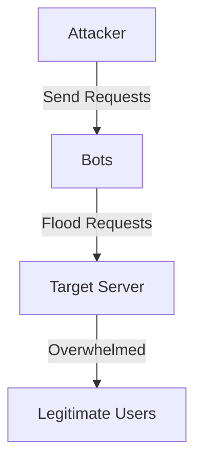

## Denial of Service (DoS) Attacks

### Introduction to DoS Attacks

Denial of Service (DoS) attacks are a type of cyberattack where attackers aim to make a machine or network resource unavailable to its intended users. This is typically achieved by overwhelming the target with a flood of incoming messages, requests, or packets, causing the system to slow down or crash. In essence, a DoS attack aims to disrupt the normal functioning of a service by making it inaccessible to legitimate users.

### How DoS Attacks Work

In a typical DoS attack, hackers use multiple computers that have been infected with malicious code, often referred to as "bots." These bots act as clients and send automated requests to the target server. Unlike a legitimate user who might manually type a URL into a browser and request a webpage, these bots send millions of requests per minute. When multiple such bots are involved, the number of requests can escalate to billions, effectively overwhelming the server's capacity to handle legitimate traffic.

#### Example Scenario

Consider an e-commerce website that handles thousands of transactions daily. During a DoS attack, the server could be flooded with so many requests that it becomes unable to process legitimate customer orders. This not only affects the business's revenue but also damages its reputation due to the unavailability of services.

### Real-World Examples of DoS Attacks

Several high-profile DoS attacks have occurred in recent years, highlighting the severity of this threat:

1. **GitHub DDoS Attack (February 2018)**: GitHub was hit by one of the largest DDoS attacks ever recorded, peaking at 1.35 terabits per second. The attack used a network of compromised IoT devices to overwhelm GitHub's servers.

2. **Dyn DNS Attack (October 2016)**: This attack targeted Dyn, a major DNS provider, affecting popular websites such as Twitter, Netflix, and Reddit. The attack was carried out using a botnet of IoT devices, demonstrating the vulnerability of connected devices.

3. **Marriott Data Breach (September 2018)**: While primarily a data breach, Marriott also experienced a DoS attack that disrupted their systems, further complicating their response efforts.

### Detailed Mechanics of a DoS Attack

To understand the mechanics of a DoS attack, let's break down the process step-by-step:

1. **Botnet Creation**: Hackers first create a botnet by infecting multiple computers with malware. These infected machines become bots that can be controlled remotely by the attacker.

2. **Target Identification**: The attacker identifies the target server or network resource that they want to disrupt.

3. **Request Flooding**: The bots send a large volume of requests to the target server. These requests can be simple HTTP GET requests, SYN packets, or other types of network traffic.

4. **Resource Exhaustion**: As the server receives these requests, it allocates resources to process them. Eventually, the server's resources (CPU, memory, bandwidth) are exhausted, leading to a slowdown or complete failure.

### HTTP Request Example

Here is an example of an HTTP GET request that a bot might send to a server:

```http
GET /index.html HTTP/1.1
Host: www.example.com
User-Agent: Mozilla/5.0 (Windows NT 10.0; Win64; x64) AppleWebKit/537.36 (KHTML, like Gecko) Chrome/58.0.3029.110 Safari/537.3
Accept: text/html,application/xhtml+xml,application/xml;q=0.9,image/webp,*/*;q=0.8
Accept-Encoding: gzip, deflate, br
Connection: keep-alive
```

In a DoS attack, thousands of such requests would be sent in rapid succession, overwhelming the server.

### Network Topology Diagram

A mermaid diagram can help visualize the network topology during a DoS attack:



### Impact of DoS Attacks

The impact of a DoS attack can be severe, especially for businesses that rely heavily on online services. Some of the key impacts include:

1. **Revenue Loss**: Unavailability of services can lead to lost sales and revenue.
2. **Reputation Damage**: Customers may lose trust in the business if services are frequently unavailable.
3. **Operational Disruption**: Internal operations may be affected, leading to delays and inefficiencies.
4. **Cost of Recovery**: Businesses may incur significant costs to recover from the attack and restore services.

### How to Prevent / Defend Against DoS Attacks

#### Detection

Detecting a DoS attack involves monitoring network traffic for unusual patterns. Tools like intrusion detection systems (IDS) and security information and event management (SIEM) systems can help identify suspicious activity.

##### Example IDS Configuration

Here is an example of configuring an IDS to detect abnormal traffic:

```yaml
# Snort IDS Configuration
alert tcp $EXTERNAL_NET any -> $HOME_NET any (msg:"Possible DoS attack"; threshold:type limit, track by_src, count 100, seconds 60; sid:1000001; rev:1;)
```

This rule alerts if more than 100 TCP connections are made from a single IP address within 60 seconds.

#### Prevention

Preventing DoS attacks involves implementing various security measures to mitigate the risk. Here are some key strategies:

1. **Rate Limiting**: Implement rate limiting on incoming requests to prevent a single IP address from overwhelming the server.
2. **Firewall Rules**: Configure firewalls to block suspicious traffic patterns.
3. **Load Balancing**: Use load balancers to distribute traffic across multiple servers, reducing the impact of a single point of failure.
4. **Web Application Firewalls (WAF)**: Deploy WAFs to filter out malicious traffic before it reaches the server.

##### Example Rate Limiting Configuration

Here is an example of configuring rate limiting using Nginx:

```nginx
http {
    limit_req_zone $binary_remote_addr zone=one:10m rate=1r/s;

    server {
        location / {
            limit_req zone=one burst=5 nodelay;
            proxy_pass http://backend;
        }
    }
}
```

This configuration limits the rate of requests from a single IP address to 1 request per second, with a burst allowance of 5 requests.

#### Secure Coding Fixes

Secure coding practices can help prevent DoS vulnerabilities. Here is an example of a vulnerable code snippet and its secure counterpart:

**Vulnerable Code**

```python
def handle_request(request):
    # Process request
    pass
```

**Secure Code**

```python
from flask import Flask, request
from werkzeug.exceptions import abort

app = Flask(__name__)

@app.route('/')
def handle_request():
    if request.remote_addr in blocked_ips:
        abort(403)
    # Process request
    return "Request processed"
```

In the secure version, we check if the remote IP address is in a list of blocked IPs before processing the request.

#### Infrastructure Hardening

Hardening the infrastructure involves securing the underlying systems and networks. Here are some steps to consider:

1. **Patch Management**: Keep all systems up-to-date with the latest security patches.
2. **Network Segmentation**: Segment the network to isolate critical systems from less secure parts.
3. **Access Control**: Implement strict access control policies to limit who can access sensitive systems.

##### Example Patch Management Script

Here is an example script to automate patch management:

```bash
#!/bin/bash

# Update package lists
sudo apt-get update

# Upgrade installed packages
sudo apt-get upgrade -y

# Install security updates
sudo apt-get dist-upgrade -y

# Remove unnecessary packages
sudo apt-get autoremove -y
```

### Hands-On Labs

For practical experience with DoS attacks and defenses, consider the following labs:

- **PortSwigger Web Security Academy**: Offers interactive labs on various web security topics, including DoS attacks.
- **OWASP Juice Shop**: A deliberately insecure web application for practicing web security skills.
- **DVWA (Damn Vulnerable Web Application)**: Another intentionally vulnerable web app for learning web security.

These labs provide a safe environment to practice detecting and defending against DoS attacks.

### Conclusion

Denial of Service (DoS) attacks pose a significant threat to the availability of online services. By understanding the mechanics of these attacks and implementing robust detection, prevention, and mitigation strategies, organizations can better protect themselves from the disruptive effects of DoS attacks.

---
<!-- nav -->
[[DevSecOps/DevSecOps Bootcamp/03-Identity & Access Management/04-Security Essentials/Types of Security Attacks Part 2/07-Common Vulnerabilities and Exposures (CVE)|Common Vulnerabilities and Exposures (CVE)]] | [[DevSecOps/DevSecOps Bootcamp/03-Identity & Access Management/04-Security Essentials/Types of Security Attacks Part 2/00-Overview|Overview]] | [[DevSecOps/DevSecOps Bootcamp/03-Identity & Access Management/04-Security Essentials/Types of Security Attacks Part 2/09-Strong Password Policy and Multi-Factor Authentication|Strong Password Policy and Multi-Factor Authentication]]
