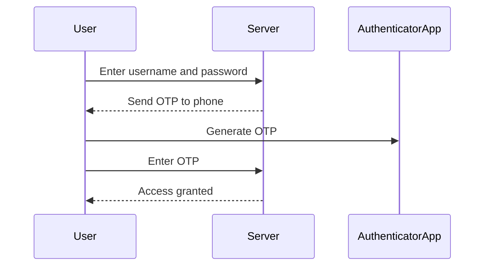
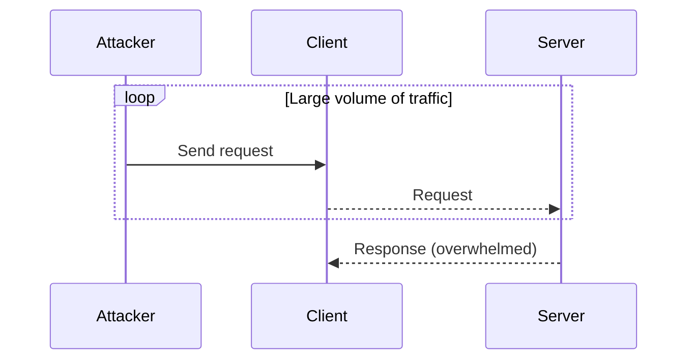

## Strong Password Policy and Multi-Factor Authentication

### Background Theory

In the realm of cybersecurity, ensuring the integrity and confidentiality of user credentials is paramount. A strong password policy is a foundational element in securing user accounts. However, even the strongest passwords can be compromised through various means such as brute force attacks, dictionary attacks, or social engineering. Therefore, multi-factor authentication (MFA) is often employed to add an additional layer of security.

### What Is a Strong Password?

A strong password is one that is difficult to guess or crack. It should meet the following criteria:

- **Length**: At least 12 characters long.
- **Complexity**: Includes a mix of uppercase and lowercase letters, numbers, and special characters.
- **Unpredictability**: Avoids common words, phrases, or patterns.

### Why Strong Passwords Matter

Strong passwords are crucial because they significantly increase the time and computational resources required to crack them. This makes brute force attacks less feasible. For instance, a password like `Password123!` is relatively weak because it follows common patterns and uses easily guessable words. In contrast, a password like `B3l7&*mX9zQw` is much stronger due to its length and complexity.

### How to Create Strong Passwords

Creating strong passwords can be challenging, especially when users need to remember multiple passwords. Tools like password managers can help generate and store complex passwords securely. Here’s an example of how to generate a strong password using Python:

```python
import random
import string

def generate_password(length=12):
    characters = string.ascii_letters + string.digits + string.punctuation
    password = ''.join(random.choice(characters) for i in range(length))
    return password

print(generate_password())
```

### Multi-Factor Authentication (MFA)

Multi-factor authentication adds an extra layer of security by requiring users to provide two or more verification factors to gain access to a resource. These factors typically fall into three categories:

- **Something you know** (e.g., password)
- **Something you have** (e.g., smartphone, token)
- **Something you are** (e.g., biometric data)

### Why MFA Matters

MFA significantly reduces the risk of unauthorized access even if a password is compromised. For example, if an attacker gains access to a user's password, they would still need the second factor (such as a one-time code sent to the user's phone) to authenticate successfully.

### How MFA Works

Here’s a simplified example of how MFA might work using a one-time password (OTP):

1. User enters their username and password.
2. The system sends a one-time code to the user's registered phone number.
3. User enters the one-time code.
4. System verifies both the password and the one-time code.

### Real-World Example: LinkedIn Breach

In 2012, LinkedIn suffered a massive breach where over 167 million user accounts were compromised. Many of these accounts had weak passwords, which were easily cracked. Had MFA been in place, the impact of this breach could have been significantly reduced.

### How to Implement MFA

Implementing MFA involves several steps:

1. **Choose an MFA Method**: Decide whether to use SMS-based OTPs, authenticator apps, hardware tokens, or biometrics.
2. **Configure the System**: Set up the MFA system to integrate with existing authentication mechanisms.
3. **Educate Users**: Ensure users understand how to use MFA and the importance of keeping their devices secure.

### How to Prevent / Defend Against Weak Passwords and Lack of MFA

#### Detection

- **Password Strength Checkers**: Use tools that check the strength of passwords and provide feedback.
- **MFA Adoption Metrics**: Monitor the adoption rate of MFA across the organization.

#### Prevention

- **Enforce Strong Password Policies**: Require passwords to meet certain complexity and length requirements.
- **Implement MFA**: Make MFA mandatory for all user accounts, especially those with elevated privileges.

#### Secure Coding Fixes

**Vulnerable Code Example**:
```python
# Vulnerable code: No MFA implementation
def authenticate(username, password):
    if check_password(username, password):
        return True
    else:
        return False
```

**Fixed Code Example**:
```python
# Fixed code: MFA implementation
def authenticate(username, password, otp):
    if check_password(username, password):
        if verify_otp(username, otp):
            return True
    return False
```

### Denial of Service (DoS) Attack

### Background Theory

A Denial of Service (DoS) attack is a type of cyberattack where the attacker aims to make a machine or network resource unavailable to its intended users by overwhelming it with a flood of traffic. This can result in the target becoming slow or unresponsive, effectively denying service to legitimate users.

### How DoS Attacks Work

In a typical DoS attack scenario, the attacker sends a large volume of traffic to the target server, causing it to become overwhelmed and unable to process legitimate requests. This can be achieved through various methods, including:

- **SYN Flood**: Sending a large number of SYN packets to initiate TCP connections without completing the handshake.
- **UDP Flood**: Sending a large number of UDP packets to the target, often to specific ports.
- **ICMP Flood**: Sending a large number of ICMP echo request packets to the target.

### Real-World Example: GitHub DDoS Attack

In February 2015, GitHub was hit by one of the largest DDoS attacks ever recorded, with traffic peaking at 1.35 terabits per second. The attack was orchestrated using a botnet of IoT devices, demonstrating the potential scale and impact of modern DDoS attacks.

### How to Prevent / Defend Against DoS Attacks

#### Detection

- **Traffic Monitoring**: Use tools like intrusion detection systems (IDS) to monitor network traffic for unusual patterns.
- **Log Analysis**: Regularly review logs for signs of suspicious activity, such as a sudden spike in traffic.

#### Prevention

- **Rate Limiting**: Implement rate limiting to restrict the number of requests a client can make within a given time frame.
- **Load Balancing**: Distribute incoming traffic across multiple servers to reduce the load on any single server.
- **Firewall Rules**: Configure firewall rules to block known malicious IP addresses and traffic patterns.

#### Secure Coding Fixes

**Vulnerable Code Example**:
```python
# Vulnerable code: No rate limiting
@app.route('/api/data')
def get_data():
    return jsonify(data)
```

**Fixed Code Example**:
```python
# Fixed code: Rate limiting implemented
from flask_limiter import Limiter

limiter = Limiter(app, key_func=get_remote_address)

@app.route('/api/data')
@limiter.limit("100 per minute")
def get_data():
    return jsonify(data)
```

### Mermaid Diagrams

#### MFA Flow Diagram



#### DoS Attack Diagram



### Practice Labs

For hands-on experience with implementing strong password policies and MFA, consider the following labs:

- **PortSwigger Web Security Academy**: Offers modules on password security and MFA.
- **OWASP Juice Shop**: Provides scenarios where you can implement and test MFA.
- **CloudGoat**: Focuses on cloud security practices, including MFA implementation.

For DoS attack prevention and mitigation, consider:

- **Kubernetes Goat**: Offers scenarios involving network security and DoS protection.
- **AWS Well-Architected Labs**: Provides hands-on experience with implementing security best practices in cloud environments.

By thoroughly understanding and implementing these security measures, organizations can significantly enhance their defense against common cyber threats.

---
<!-- nav -->
[[DevSecOps/DevSecOps Bootcamp/03-Identity & Access Management/04-Security Essentials/Types of Security Attacks Part 2/08-Denial of Service (DoS) Attacks|Denial of Service (DoS) Attacks]] | [[DevSecOps/DevSecOps Bootcamp/03-Identity & Access Management/04-Security Essentials/Types of Security Attacks Part 2/00-Overview|Overview]] | [[DevSecOps/DevSecOps Bootcamp/03-Identity & Access Management/04-Security Essentials/Types of Security Attacks Part 2/10-Third-Party Libraries and Frameworks A Double-Edged Sword|Third-Party Libraries and Frameworks A Double-Edged Sword]]
