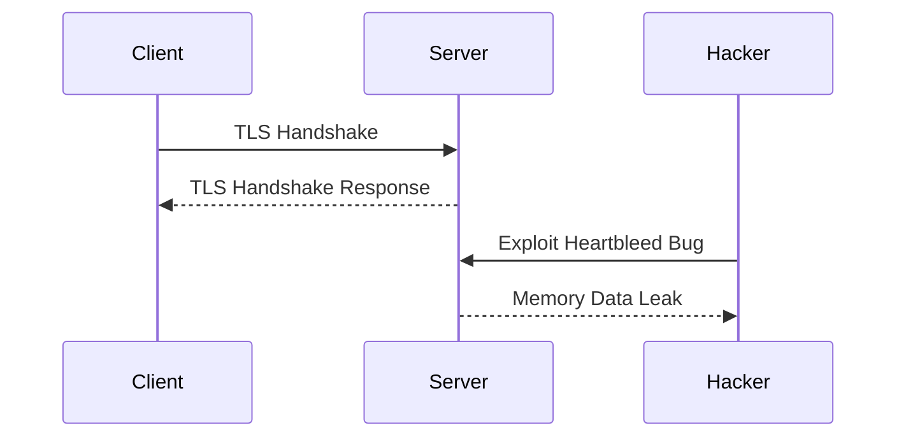
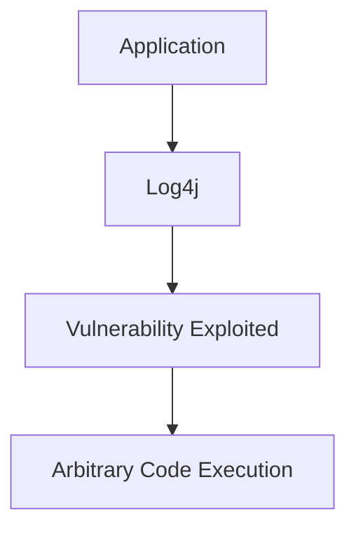
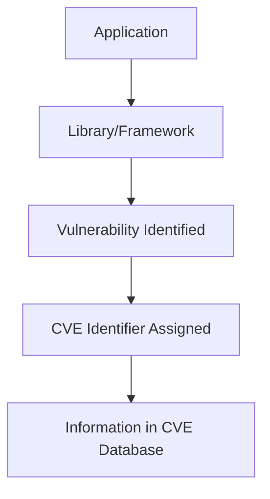
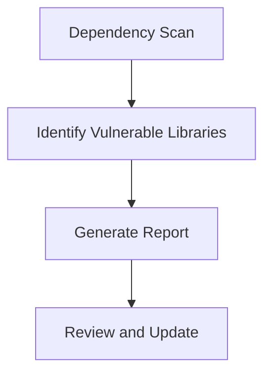
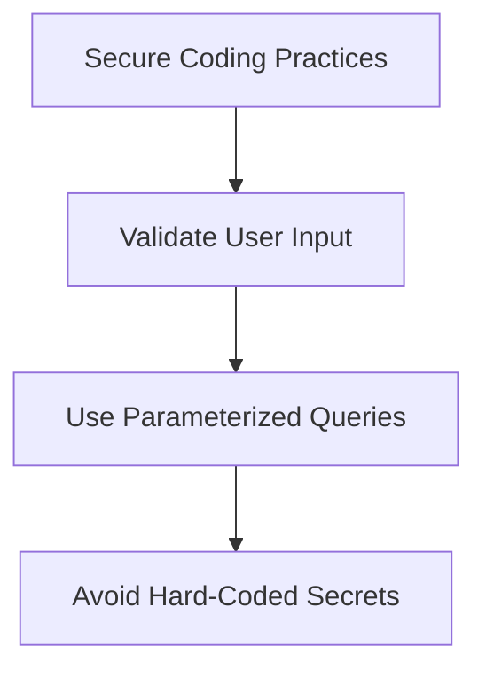
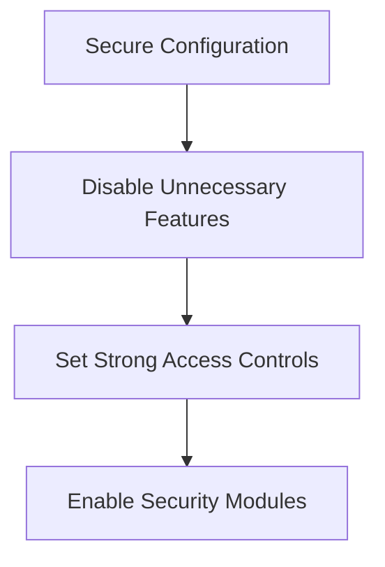
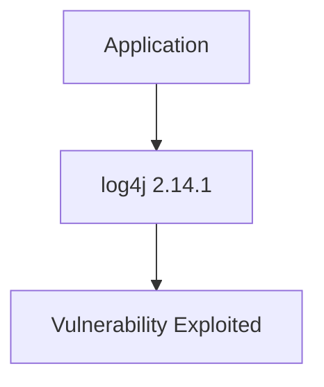
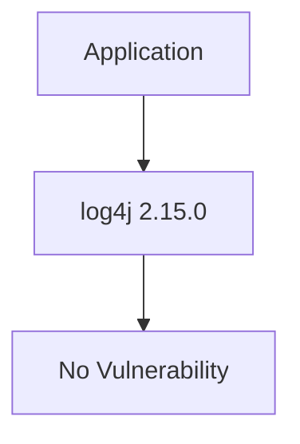

## Understanding Security Vulnerabilities in Libraries and Frameworks

### Introduction

In the realm of DevSecOps, one of the most critical aspects is ensuring that the software libraries and frameworks used in an application are secure. Libraries and frameworks are reusable components that simplify development by providing pre-written code for common tasks. However, these components can also introduce security vulnerabilities if they are not kept up to date.

### Importance of Keeping Libraries and Frameworks Updated

When a security vulnerability is discovered in a library or framework, it is crucial to update to the latest version as soon as possible. This ensures that the application remains protected against potential attacks. Hackers often exploit known vulnerabilities in outdated libraries and frameworks, making it essential to stay ahead of these threats.

#### Why Vulnerabilities Occur

Libraries and frameworks are developed by teams of programmers who may inadvertently introduce security flaws. These flaws can range from simple coding errors to complex design issues. Once a vulnerability is identified, the maintainers of the library or framework release a patch or a new version that addresses the issue.

#### Example: Heartbleed Bug

One of the most famous examples of a security vulnerability in a widely-used library is the Heartbleed bug, which affected OpenSSL. OpenSSL is a cryptographic library used extensively in web servers to implement HTTPS. The Heartbleed bug allowed attackers to read sensitive data from the memory of systems using OpenSSL, including private keys, passwords, and other confidential information.



### Staying Up to Date with Library Versions

To ensure that your application is secure, it is essential to stay up to date with the latest versions of the libraries and frameworks you use. This involves regularly checking for updates and applying them promptly.

#### How to Stay Informed

Maintainers of libraries and frameworks typically announce new versions through their official channels, such as GitHub repositories, mailing lists, or dedicated websites. Additionally, many organizations use tools like Dependabot or Renovate to automatically check for and apply updates to dependencies.

#### Real-World Example: Log4j Vulnerability

The Log4j vulnerability (CVE-2021-44228) is a recent example of a widespread security issue. Log4j is a logging utility used in Java applications. The vulnerability allowed attackers to execute arbitrary code on affected systems, leading to a significant security risk. Many organizations were caught off guard because they were using outdated versions of Log4j.



### Public Databases for Known Issues

Managing the security of hundreds of libraries in an application can be overwhelming. Fortunately, there are public databases that catalog known vulnerabilities, making it easier to track and address them.

#### CVE Database

The Common Vulnerabilities and Exposures (CVE) database is a widely-used resource for tracking known security vulnerabilities. Each vulnerability is assigned a unique CVE identifier, which helps in identifying and managing the issue.

##### Example: CVE-2021-44228

The Log4j vulnerability was assigned the CVE identifier CVE-2021-44228. By searching for this identifier in the CVE database, organizations can find detailed information about the vulnerability, including its severity, affected versions, and recommended mitigation steps.



### How to Prevent / Defend Against Vulnerabilities

#### Detection

Regularly scanning your application for known vulnerabilities is crucial. Tools like OWASP Dependency Check, Snyk, and WhiteSource can help identify outdated or vulnerable libraries.



#### Prevention

Keeping your libraries and frameworks up to date is the primary defense against vulnerabilities. Automating this process with tools like Dependabot or Renovate can help ensure that updates are applied promptly.

##### Secure Coding Practices

In addition to keeping libraries up to date, following secure coding practices can help mitigate risks. This includes validating user input, using parameterized queries, and avoiding hard-coded secrets.



#### Secure Configuration

Properly configuring your application and its dependencies can also enhance security. For example, disabling unnecessary features and setting strong access controls can reduce the attack surface.



### Complete Example: Updating a Vulnerable Library

Consider an application that uses the `log4j` library, which has been identified as having the CVE-2021-44228 vulnerability. The following steps demonstrate how to update the library to a secure version.

#### Vulnerable Version



#### Secure Version



#### Maven Configuration

Here is an example of how to update the `log4j` dependency in a Maven `pom.xml` file:

```xml
<!-- Vulnerable Version -->
<dependencies>
    <dependency>
        <groupId>org.apache.logging.log4j</groupId>
        <artifactId>log4j-core</artifactId>
        <version>2.14.1</version>
    </dependency>
</dependencies>

<!-- Secure Version -->
<dependencies>
    <dependency>
        <groupId>org.apache.logging.log4j</groupId>
        <artifactId>log4j-core</artifactId>
        <version>2.15.0</version>
    </dependency>
</dependencies>
```

### Hands-On Labs

For practical experience with securing libraries and frameworks, consider the following labs:

- **PortSwigger Web Security Academy**: Offers modules on securing web applications, including handling dependencies.
- **OWASP Juice Shop**: A deliberately insecure web application for practicing security skills.
- **DVWA (Damn Vulnerable Web Application)**: Another intentionally vulnerable web app for learning security concepts.

These labs provide real-world scenarios and challenges that can help reinforce the concepts discussed in this chapter.

### Conclusion

Staying up to date with the latest versions of libraries and frameworks is crucial for maintaining the security of your application. By leveraging public databases like the CVE database and following secure coding and configuration practices, you can significantly reduce the risk of vulnerabilities being exploited. Regularly scanning your application and automating updates can help ensure that your application remains secure against known threats.

---
<!-- nav -->
[[DevSecOps/DevSecOps Bootcamp/03-Identity & Access Management/04-Security Essentials/Types of Security Attacks Part 2/11-Third-Party Service Providers and Security Risks|Third-Party Service Providers and Security Risks]] | [[DevSecOps/DevSecOps Bootcamp/03-Identity & Access Management/04-Security Essentials/Types of Security Attacks Part 2/00-Overview|Overview]] | [[DevSecOps/DevSecOps Bootcamp/03-Identity & Access Management/04-Security Essentials/Types of Security Attacks Part 2/13-Vendor Hacking and Its Impact on Your Application|Vendor Hacking and Its Impact on Your Application]]
