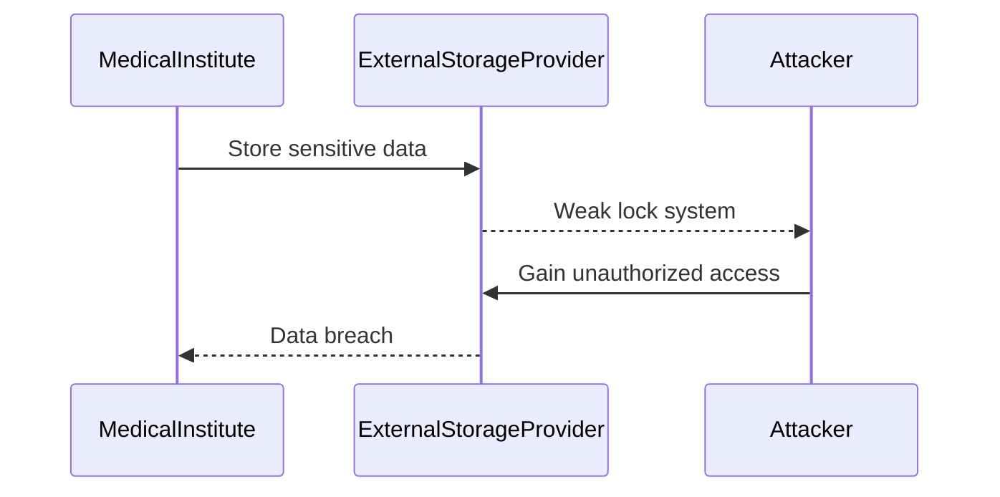
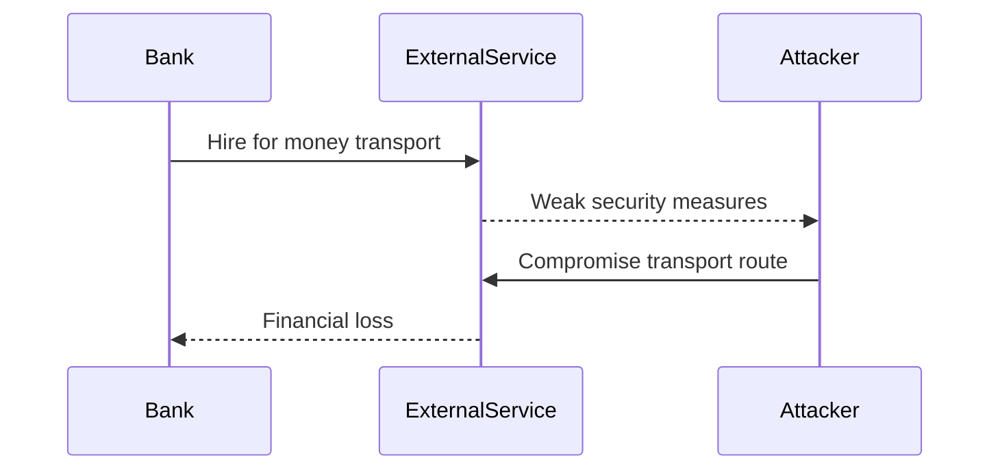
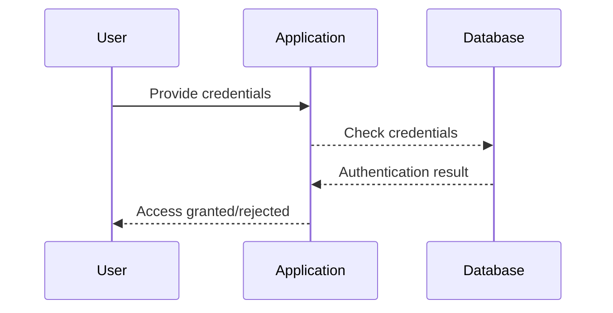

## Vendor Hacking and Its Impact on Your Application

### Introduction

When discussing security essentials in the context of DevSecOps, one critical aspect to consider is the potential impact of a vendor being hacked. A vendor is a third-party company that provides specific functionalities or services to your application. If a vendor experiences a security breach, it can have severe consequences for your application and its end-users. This scenario highlights the importance of ensuring that all vendors adhere to stringent security practices.

### Understanding Vendor Hacking

#### What is Vendor Hacking?

Vendor hacking occurs when a third-party service provider, which offers critical functionalities to your application, is compromised. This compromise can result in unauthorized access to sensitive data or services that the vendor manages on behalf of your organization. The impact of such a breach can be far-reaching, affecting not only the vendor but also the organizations that rely on them.

#### Why Does Vendor Hacking Matter?

Vendor hacking matters because it can lead to significant security vulnerabilities in your application. If a vendor is hacked, the attacker can potentially gain access to sensitive data or services that your application relies on. This can result in data breaches, loss of customer trust, and financial losses. Therefore, it is crucial to understand the risks associated with vendor hacking and take appropriate measures to mitigate these risks.

### Real-World Examples of Vendor Hacking

#### Recent Breaches

Several recent breaches highlight the severity of vendor hacking:

1. **SolarWinds Supply Chain Attack (CVE-2020-1014)**:
   - In December 2020, SolarWinds, a widely used IT management software provider, was hacked. The attackers inserted malicious code into the SolarWinds Orion software updates, which were then distributed to thousands of customers, including government agencies and private companies.
   - This attack compromised numerous high-profile organizations, including the U.S. Department of Homeland Security and Microsoft.
   - The impact was significant, leading to widespread distrust in supply chain security and prompting many organizations to re-evaluate their vendor relationships.

2. **Kaseya VSA Ransomware Attack (CVE-2021-30116)**:
   - In July 2021, Kaseya, a software company that provides remote monitoring and management solutions, experienced a ransomware attack. The attackers exploited a vulnerability in Kaseya’s VSA software, which affected thousands of small businesses worldwide.
   - This attack demonstrated the potential for a single vendor breach to impact a large number of downstream customers.

These examples illustrate the critical nature of vendor security and the potential consequences of a breach.

### Detailed Explanation of Vendor Hacking Scenarios

#### Scenario 1: External Storage Provider

Imagine a medical institute that stores patient records and other sensitive information in an external storage provider. This external storage provider acts as a repository for the institute's data, similar to renting a large building where other companies can store their stuff.

**Security Vulnerabilities:**
- **Compromised Lock System**: If the external storage provider's lock system is not secure enough, it can be easily bypassed by an attacker. For instance, if the lock system uses weak encryption or has known vulnerabilities, an attacker could exploit these weaknesses to gain unauthorized access.
- **Employee Mistakes**: If an employee of the storage provider forgets to lock the entrance of the building, it creates an opportunity for an attacker to enter and access the stored data.

**Example Code:**

```python
# Example of a weak encryption implementation in a lock system
def encrypt_data(data, key):
    # Weak encryption algorithm
    encrypted_data = ""
    for char in data:
        encrypted_data += chr(ord(char) ^ ord(key))
    return encrypted_data

# Correct implementation using strong encryption
from cryptography.fernet import Fernet

def encrypt_data_securely(data, key):
    cipher_suite = Fernet(key)
    encrypted_data = cipher_suite.encrypt(data.encode())
    return encrypted_data

# Vulnerable code
key = "weak_key"
data = "Sensitive patient records"
encrypted_data = encrypt_data(data, key)

# Secure code
secure_key = Fernet.generate_key()
secure_encrypted_data = encrypt_data_securely(data, secure_key)
```

**Mermaid Diagram:**



#### Scenario 2: External Service for Money Transport

Consider a scenario where a bank hires an external service to safely transport money from one location to another. This external service is responsible for ensuring the security of the transport process.

**Security Vulnerabilities:**
- **Weak Security Measures**: If the external service does not have robust security measures in place, it can be easily compromised. For example, if the service uses a predictable transport route or does not properly secure sensitive documents, an attacker can exploit these weaknesses.
- **Employee Mistakes**: If an employee of the external service forgets to secure a secret transport route map, it can fall into the hands of unauthorized individuals, leading to a security breach.

**Example Code:**

```python
# Example of a predictable transport route
def generate_transport_route():
    # Predictable route generation
    route = ["Location A", "Location B", "Location C"]
    return route

# Correct implementation using randomization
import random

def generate_transport_route_securely():
    locations = ["Location A", "Location B", "Location C", "Location D", "Location E"]
    random.shuffle(locations)
    return locations[:3]

# Vulnerable code
transport_route = generate_transport_route()

# Secure code
secure_transport_route = generate_transport_route_securely()
```

**Mermaid Diagram:**



### How to Prevent / Defend Against Vendor Hacking

#### Detection

To detect potential vendor hacking, organizations should implement continuous monitoring and logging mechanisms. This includes:

- **Monitoring Vendor Activities**: Regularly monitor the activities of vendors to ensure they are adhering to agreed-upon security protocols.
- **Logging and Auditing**: Maintain detailed logs of all interactions with vendors and conduct regular audits to identify any suspicious activity.

#### Prevention

To prevent vendor hacking, organizations should take the following steps:

- **Background Checks**: Conduct thorough background checks on vendors to ensure they have a strong security posture.
- **Contractual Agreements**: Include strict security requirements in contracts with vendors, specifying the security controls they must implement.
- **Regular Assessments**: Perform regular security assessments of vendors to identify and address any vulnerabilities.

#### Secure Coding Fixes

To demonstrate secure coding practices, consider the following examples:

**Vulnerable Code:**

```python
# Example of a weak authentication mechanism
def authenticate_user(username, password):
    # Weak authentication
    if username == "admin" and password == "password":
        return True
    return False
```

**Secure Code:**

```python
from werkzeug.security import check_password_hash, generate_password_hash

# Example of a strong authentication mechanism
def authenticate_user_securely(username, stored_password_hash, provided_password):
    # Strong authentication
    if check_password_hash(stored_password_hash, provided_password):
        return True
    return False

# Storing passwords securely
stored_password_hash = generate_password_hash("strong_password")
```

**Comparison:**



### Conclusion

Vendor hacking is a significant concern in the realm of DevSecOps. By understanding the potential risks and implementing robust security measures, organizations can mitigate the impact of a vendor breach. Continuous monitoring, thorough background checks, and regular assessments are essential steps to ensure the security of your application and its end-users.

### Practice Labs

For hands-on experience with vendor security, consider the following labs:

- **PortSwigger Web Security Academy**: Offers modules on supply chain attacks and vendor security.
- **OWASP Juice Shop**: Provides scenarios involving third-party services and their security implications.
- **DVWA (Damn Vulnerable Web Application)**: Includes exercises related to third-party service integration and security.

By engaging in these labs, you can gain practical experience in identifying and mitigating vendor-related security risks.

---
<!-- nav -->
[[DevSecOps/DevSecOps Bootcamp/03-Identity & Access Management/04-Security Essentials/Types of Security Attacks Part 2/12-Understanding Security Vulnerabilities in Libraries and Frameworks|Understanding Security Vulnerabilities in Libraries and Frameworks]] | [[DevSecOps/DevSecOps Bootcamp/03-Identity & Access Management/04-Security Essentials/Types of Security Attacks Part 2/00-Overview|Overview]] | [[DevSecOps/DevSecOps Bootcamp/03-Identity & Access Management/04-Security Essentials/Types of Security Attacks Part 2/14-Practice Questions & Answers|Practice Questions & Answers]]
