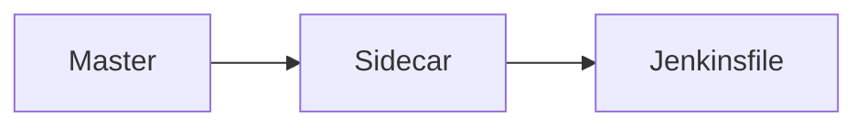

## Introduction to Automating Infrastructure Security Testing

In the realm of DevSecOps, automating infrastructure security testing is a critical component of ensuring that applications and systems remain secure throughout their lifecycle. This chapter delves into the implementation of OWASP Zed Attack Proxy (ZAP) as part of an automated security testing pipeline. We will explore the setup, execution, and interpretation of ZAP scans, comparing them with other tools like Nikto, and integrating these tools into a continuous integration/continuous deployment (CI/CD) pipeline.

### Background Theory

#### What is OWASP ZAP?

OWASP ZAP is a free and open-source web application security scanner that helps identify vulnerabilities in web applications. It operates by intercepting HTTP(S) traffic between the user and the server, allowing it to analyze and test the application for various security issues such as SQL injection, cross-site scripting (XSS), and others.

#### Why Use OWASP ZAP?

OWASP ZAP is widely used because it provides a comprehensive set of features for both manual and automated testing. It supports a wide range of attack vectors and can be integrated into CI/CD pipelines, making it an essential tool for DevSecOps teams.

### Setting Up OWASP ZAP in a CI/CD Pipeline

To integrate OWASP ZAP into a CI/CD pipeline, we will use Jenkins as our CI/CD tool. The process involves modifying the Jenkinsfile to include the necessary steps for running ZAP scans.

#### Branching Strategy

Instead of branching off from the `master` branch, we will branch off from a `sidecar` branch. The `sidecar` pattern is a design pattern where a separate container is used to run security tests alongside the main application container. This approach ensures that the security tests do not interfere with the main application and can be easily managed and scaled.



### Modifying the Jenkinsfile

Let's open the Jenkinsfile and modify it to include the necessary steps for running OWASP ZAP scans.

#### Step 1: Define the Image

We will use a third-party Docker image for OWASP ZAP. The image we will use is `owasp/zap2docker-weekly`.

```yaml
pipeline {
    agent { docker 'owasp/zap2docker-weekly' }
    stages {
        stage('Security Test') {
            steps {
                sh 'zap-baseline.py -t http://localhost:8080 -r report.html'
            }
        }
    }
}
```

#### Explanation of the Code

- **agent**: Specifies the Docker image to use for the pipeline. Here, we use `owasp/zap2docker-weekly`.
- **stage**: Defines a stage in the pipeline. In this case, we define a `Security Test` stage.
- **steps**: Contains the commands to be executed within the stage. We use `zap-baseline.py` to perform a baseline scan against the application running on `http://localhost:8080`.

#### Mapping Directories

We need to map the `/zap/work` directory of the ZAP container to the workspace directory of the Jenkins job. This allows us to store the scan results and other files in the workspace.

```yaml
pipeline {
    agent { docker 'owasp/zap2docker-weekly' }
    environment {
        ZAP_WORKSPACE = '/zap/work'
    }
    stages {
        stage('Security Test') {
            steps {
                sh 'zap-baseline.py -t http://localhost:8080 -r ${ZAP_WORKSPACE}/report.html'
            }
        }
    }
}
```

#### Explanation of the Code

- **environment**: Defines an environment variable `ZAP_WORKSPACE` that points to the `/zap/work` directory.
- **sh**: Executes the `zap-baseline.py` command, specifying the target URL and the output report location.

### Running the Scan

The `zap-baseline.py` script performs a baseline scan against the specified target URL. The scan results are stored in the `report.html` file, which can be accessed from the Jenkins job workspace.

#### Example of a Full HTTP Request and Response

Here is an example of a full HTTP request and response:

```http
GET / HTTP/1.1
Host: localhost:8080
User-Agent: Mozilla/5.0 (Windows NT 10.0; Win64; x64) AppleWebKit/537.36 (KHTML, like Gecko) Chrome/91.0.4472.124 Safari/537.36
Accept: text/html,application/xhtml+xml,application/xml;q=0.9,image/avif,image/webp,image/apng,*/*;q=0.8,application/signed-exchange;v=b3;q=0.9
Accept-Encoding: gzip, deflate
Accept-Language: en-US,en;q=0.9
Connection: close

HTTP/1.1 200 OK
Date: Mon, 20 Jun 2022 12:00:00 GMT
Server: Apache/2.4.41 (Ubuntu)
Content-Type: text/html; charset=UTF-8
Content-Length: 1234
Connection: close

<!DOCTYPE html>
<html>
<head>
    <title>Home Page</title>
</head>
<body>
    <h1>Welcome to the Home Page</h1>
</body>
</html>
```

### Interpreting the Results

After running the scan, the `report.html` file contains detailed information about the vulnerabilities found in the application. This report can be reviewed to understand the nature of the vulnerabilities and take appropriate actions to mitigate them.

### Comparing with Nikto

In the previous demo, we used Nikto for scanning the application. Nikto is another popular web application security scanner that focuses on finding common vulnerabilities and misconfigurations.

#### Example of Nikto Scan

Here is an example of a Nikto scan:

```http
GET / HTTP/1.1
Host: localhost:8080
User-Agent: Nikto/2.1.6
Accept: */*
Connection: close

HTTP/1.1 200 OK
Date: Mon, 20 Jun 2022 12:00:00 GMT
Server: Apache/2.4.41 (Ubuntu)
Content-Type: text/html; charset=UTF-8
Content-Length: 1234
Connection: close

<!DOCTYPE html>
<html>
<head>
    <title>Home Page</title>
</head>
<body>
    <h1>Welcome to the Home Page</h1>
</body>
</html>
```

### How to Prevent / Defend

#### Secure Coding Practices

To prevent vulnerabilities identified by OWASP ZAP and Nikto, follow these secure coding practices:

1. **Input Validation**: Validate all user inputs to ensure they meet expected formats and lengths.
2. **Output Encoding**: Encode all outputs to prevent XSS attacks.
3. **Parameterized Queries**: Use parameterized queries to prevent SQL injection attacks.

#### Example of Vulnerable vs. Secure Code

**Vulnerable Code**

```python
import sqlite3

def get_user_data(username):
    conn = sqlite3.connect('database.db')
    cursor = conn.cursor()
    query = f"SELECT * FROM users WHERE username = '{username}'"
    cursor.execute(query)
    result = cursor.fetchone()
    conn.close()
    return result
```

**Secure Code**

```python
import sqlite3

def get_user_data(username):
    conn = sqlite3.connect('database.db')
    cursor = conn.cursor()
    query = "SELECT * FROM users WHERE username = ?"
    cursor.execute(query, (username,))
    result = cursor.fetchone()
    conn.close()
    return result
```

### Real-World Examples

#### Recent CVEs and Breaches

- **CVE-2021-44228 (Log4j)**: This vulnerability allowed attackers to execute arbitrary code on affected systems. OWASP ZAP can help identify similar vulnerabilities by scanning for known patterns and configurations.
- **SolarWinds Supply Chain Attack**: This attack involved the compromise of SolarWinds software, leading to widespread breaches. Automated security testing tools like OWASP ZAP can help detect and mitigate such vulnerabilities.

### Conclusion

Automating infrastructure security testing with tools like OWASP ZAP is crucial for maintaining the security of web applications. By integrating these tools into a CI/CD pipeline, organizations can ensure that security is a core part of their development process. Regularly reviewing and interpreting the results of these scans can help identify and mitigate vulnerabilities before they can be exploited.

### Practice Labs

For hands-on practice with OWASP ZAP and automated security testing, consider the following labs:

- **PortSwigger Web Security Academy**: Offers interactive labs for learning web security concepts and techniques.
- **OWASP Juice Shop**: A deliberately insecure web application for practicing web security skills.
- **DVWA (Damn Vulnerable Web Application)**: Another intentionally vulnerable web application for learning and testing security tools.

By following these steps and practicing with real-world examples, you can gain a deep understanding of how to effectively automate infrastructure security testing in a DevSecOps environment.

---
<!-- nav -->
[[DevSecOps/DevSecOps Bootcamp/04-Infrastructure Security/01-Automating Infrastructure Security Testing/02-Demo Implementing OWASP ZAP and All Automated Security Tests/00-Overview|Overview]] | [[DevSecOps/DevSecOps Bootcamp/04-Infrastructure Security/01-Automating Infrastructure Security Testing/02-Demo Implementing OWASP ZAP and All Automated Security Tests/02-Automating Infrastructure Security Testing|Automating Infrastructure Security Testing]]
