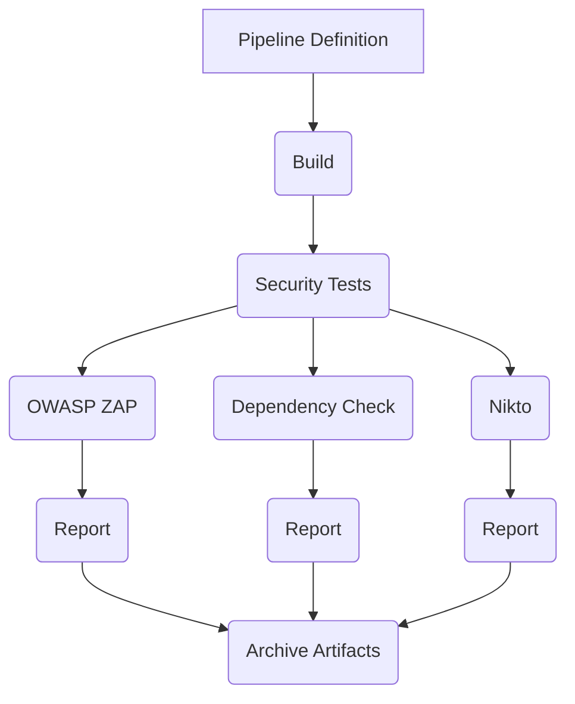

## Automating Infrastructure Security Testing

### Introduction to Automated Security Testing

Automated security testing is a critical component of modern DevSecOps practices. It involves using tools and scripts to automatically scan and test applications and infrastructure for vulnerabilities and security weaknesses. This approach helps ensure that security is integrated into the development lifecycle, reducing the risk of security breaches and ensuring compliance with security policies and regulations.

In this section, we will focus on implementing automated security testing using OWASP ZAP and other tools. We will cover the setup, execution, and interpretation of these tests within a continuous integration/continuous delivery (CI/CD) pipeline.

### Setting Up the Pipeline Definition

To integrate automated security testing into your CI/CD pipeline, you need to define the steps in your pipeline configuration file. For this example, we will use Jenkins, a popular CI/CD tool.

#### Jenkinsfile Example

Here is an example of a `Jenkinsfile` that includes steps for running security tests:

```groovy
pipeline {
    agent any
    stages {
        stage('Build') {
            steps {
                sh 'mvn clean package'
            }
        }
        stage('Security Tests') {
            steps {
                script {
                    // Run OWASP ZAP
                    sh 'zap-baseline.py -t http://localhost:8080 -r report.html'
                    
                    // Run Dependency Check
                    sh 'dependency-check --project MyProject --scan . --out results.xml'
                    
                    // Run Nikto
                    sh 'nikto -h http://localhost:8080 > nikto_report.txt'
                }
            }
        }
    }
    post {
        always {
            archiveArtifacts artifacts: '**/report.html, **/results.xml, **/nikto_report.txt', allowEmptyArchive: true
        }
    }
}
```

### Explanation of Each Step

1. **Build Stage**: This stage compiles and packages the application using Maven.
2. **Security Tests Stage**: This stage runs several security tests:
   - **OWASP ZAP**: A powerful security scanner that can detect various types of vulnerabilities.
   - **Dependency Check**: A tool that checks for known vulnerabilities in project dependencies.
   - **Nikto**: An open-source web server scanner that performs comprehensive tests against web servers.
3. **Post Actions**: After the pipeline completes, the security reports are archived and made available for review.

### Running Security Tests Asynchronously

Running all security tests after each commit can be time-consuming and may slow down the development process. Therefore, it is often beneficial to run these tests asynchronously. This means that the tests are executed in a separate job or stage that does not block the main build process.

#### Example of Asynchronous Execution

```groovy
pipeline {
    agent any
    stages {
        stage('Build') {
            steps {
                sh 'mvn clean package'
            }
        }
        stage('Security Tests') {
            parallel {
                stage('OWASP ZAP') {
                    steps {
                        sh 'zap-baseline.py -t http://localhost:8080 -r report.html'
                    }
                }
                stage('Dependency Check') {
                    steps {
                        sh 'dependency-check --project MyProject --scan . --out results.xml'
                    }
                }
                stage('Nikto') {
                    steps {
                        sh 'nikto -h http://localhost:8080 > nikto_report.txt'
                    }
                }
            }
        }
    }
    post {
        always {
            archiveArtifacts artifacts: '**/report.html, **/results.xml, **/nikto_report.txt', allowEmptyArchive: true
        }
    }
}
```

### Interpreting Test Results

Once the security tests are completed, the results are available for review. The pipeline archives the reports generated by each tool, making them accessible for further analysis.

#### Example Reports

- **OWASP ZAP Report**: This HTML report details any vulnerabilities found during the scan.
- **Dependency Check Report**: This XML report lists any known vulnerabilities in the project dependencies.
- **Nikto Report**: This text file contains the results of the web server scan performed by Nikto.

### Handling Unstable Builds

If any of the security tests find issues, the build may be marked as unstable. This indicates that there are potential security vulnerabilities that need to be addressed.

#### Example of Handling Unstable Builds

```groovy
pipeline {
    agent any
    stages {
        stage('Build') {
            steps {
                sh 'mvn clean package'
            }
        }
        stage('Security Tests') {
            parallel {
                stage('OWASP ZAP') {
                    steps {
                        sh 'zap-baseline.py -t http://localhost:8080 -r report.html'
                    }
                }
                stage('Dependency Check') {
                    steps {
                        sh 'dependency-check --project MyProject --scan . --out results.xml'
                    }
                }
                stage('Nikto') {
                    steps {
                        sh 'nikto -h http://localhost:8080 > nikto_report.txt'
                    }
                }
            }
        }
    }
    post {
        always {
            archiveArtifacts artifacts: '**/report.html, **/results.xml, **/nikto_report.txt', allowEmptyArchive: true
        }
        unstable {
            echo 'Some security tests found issues.'
        }
    }
}
```

### How to Prevent / Defend

To prevent security vulnerabilities and ensure that your application remains secure, follow these best practices:

1. **Regularly Update Dependencies**: Keep all project dependencies up-to-date to avoid known vulnerabilities.
2. **Use Secure Coding Practices**: Follow secure coding guidelines to minimize the risk of introducing vulnerabilities.
3. **Implement Security Policies**: Enforce security policies and guidelines throughout the development process.
4. **Continuous Monitoring**: Continuously monitor your application and infrastructure for security threats.

#### Example of Secure Coding Practices

```java
// Vulnerable Code
public String getUsername(String input) {
    return input;
}

// Secure Code
public String getUsername(String input) {
    if (input == null || input.isEmpty()) {
        throw new IllegalArgumentException("Input cannot be empty");
    }
    return input.trim();
}
```

### Real-World Examples

Recent real-world examples of security breaches highlight the importance of automated security testing:

- **CVE-2021-44228 (Log4Shell)**: This vulnerability in the Apache Log4j library allowed attackers to execute arbitrary code on affected systems. Regular security testing could have helped identify and mitigate such vulnerabilities.
- **SolarWinds Supply Chain Attack**: This attack involved the compromise of SolarWinds software, which was then used to gain access to numerous organizations. Automated security testing could have helped detect and prevent such supply chain attacks.

### Conclusion

Automating infrastructure security testing is essential for maintaining the security of your applications and infrastructure. By integrating tools like OWASP ZAP, Dependency Check, and Nikto into your CI/CD pipeline, you can ensure that security is an integral part of your development process. This approach helps identify and address vulnerabilities early, reducing the risk of security breaches and ensuring compliance with security policies and regulations.

### Practice Labs

For hands-on practice with automated security testing, consider the following labs:

- **PortSwigger Web Security Academy**: Offers interactive labs for learning web security concepts and techniques.
- **OWASP Juice Shop**: A deliberately insecure web application for practicing web security skills.
- **DVWA (Damn Vulnerable Web Application)**: A PHP/MySQL web application that is riddled with vulnerabilities for educational purposes.
- **WebGoat**: An interactive training application designed to teach web application security lessons.

These labs provide practical experience in identifying and mitigating security vulnerabilities, helping you to become proficient in automating infrastructure security testing.



This diagram illustrates the flow of the pipeline definition, highlighting the stages and steps involved in running security tests and archiving the results.

---
<!-- nav -->
[[DevSecOps/DevSecOps Bootcamp/04-Infrastructure Security/01-Automating Infrastructure Security Testing/02-Demo Implementing OWASP ZAP and All Automated Security Tests/01-Introduction to Automating Infrastructure Security Testing|Introduction to Automating Infrastructure Security Testing]] | [[DevSecOps/DevSecOps Bootcamp/04-Infrastructure Security/01-Automating Infrastructure Security Testing/02-Demo Implementing OWASP ZAP and All Automated Security Tests/00-Overview|Overview]] | [[03-Parameterizing User ID and Group ID in Jenkins|Parameterizing User ID and Group ID in Jenkins]]
