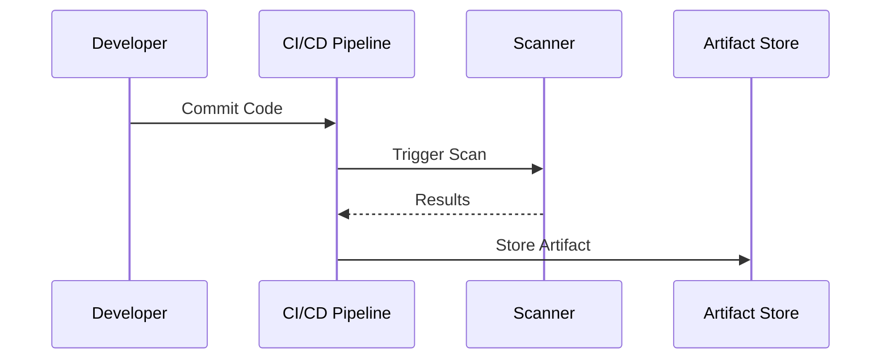
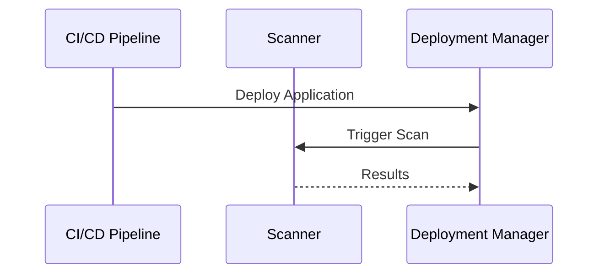
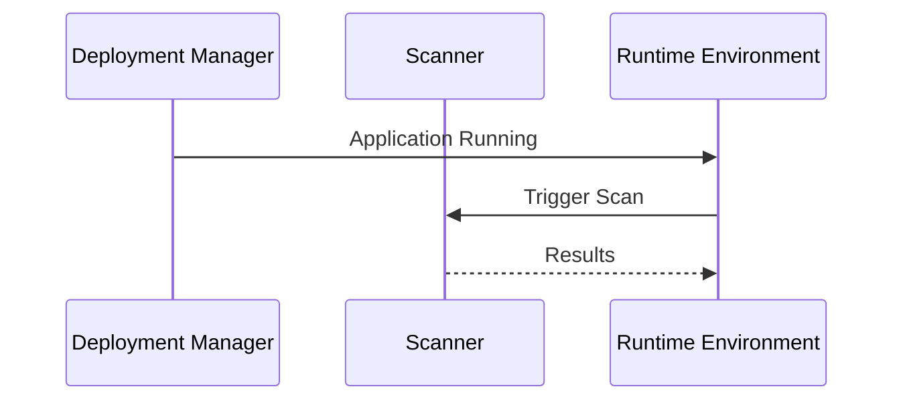
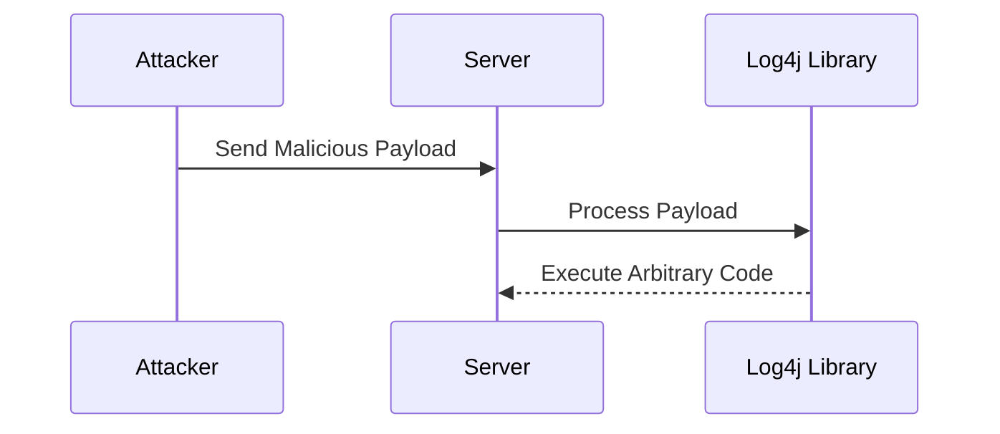

## Introduction to Infrastructure Scanning in DevSecOps

Infrastructure scanning is a critical component of the DevSecOps pipeline, aimed at identifying vulnerabilities and ensuring the security of applications and infrastructure. This process involves using specialized tools to scan both the application and the underlying infrastructure for potential security weaknesses. The goal is to catch these issues early in the development lifecycle, thereby reducing the risk of security breaches once the application is deployed in a production environment.

### Why Focus on Quality Over Speed?

When selecting an infrastructure scanner, it is essential to prioritize quality over speed. A high-quality scanner will provide more accurate and comprehensive results, whereas a fast scanner might miss critical vulnerabilities due to its focus on speed. The trade-off between speed and accuracy is crucial because missing even a single vulnerability can lead to significant security risks.

### When to Perform Infrastructure Scanning

Infrastructure scanning should be performed at multiple stages of the DevSecOps pipeline to ensure thorough coverage:

1. **Build Phase**: When the application is built and the release artifact is ready for deployment.
2. **Deploy Phase**: Immediately after the application or container is deployed.
3. **Post-Deployment Phase**: Once the application or infrastructure is running.

#### Build Phase

During the build phase, the scanner should analyze the release artifact, which could be an application, a container, or a complete infrastructure. This ensures that any vulnerabilities present in the code or configuration are identified before the application is deployed.



#### Deploy Phase

In the deploy phase, the scanner should verify the integrity of the deployed application or container. This ensures that the deployment process did not introduce any new vulnerabilities.



#### Post-Deployment Phase

After the application is deployed and running, the scanner should continue to monitor the infrastructure for any runtime vulnerabilities. This ensures that the application remains secure throughout its operational lifecycle.



### Which Environment to Test?

The choice of which environment to test for security defects is a critical decision. Typically, organizations have multiple environments such as development, test, acceptance, and production. Each environment serves a different purpose, and the security testing strategy should align with the goals of each environment.

#### Development Environment

The development environment is where the initial coding and unit testing take place. Shifting security left means performing security testing as early as possible in the development cycle. This approach helps identify and fix vulnerabilities early, reducing the overall cost and effort required for security.

#### Test Environment

The test environment is used for integration and system testing. While it is important to test this environment, it may not fully represent the production environment due to differences in configurations and data.

#### Acceptance Environment

The acceptance environment is used for user acceptance testing (UAT). This environment should closely resemble the production environment to ensure that the application behaves as expected in a real-world scenario.

#### Production Environment

The production environment is where the application is deployed for actual use. Testing this environment is crucial because it represents the final state of the application. However, testing in production can be risky due to the potential impact on live systems.

### Best Practices for Infrastructure Scanning

To ensure effective infrastructure scanning, follow these best practices:

1. **Use High-Quality Scanners**: Prioritize scanners that provide accurate and comprehensive results.
2. **Integrate Scanning into CI/CD Pipeline**: Ensure that scanning is automated and integrated into the continuous integration and continuous deployment (CI/CD) pipeline.
3. **Test Multiple Environments**: Perform security testing across different environments to ensure thorough coverage.
4. **Shift Security Left**: Perform security testing as early as possible in the development cycle.
5. **Monitor Post-Deployment**: Continuously monitor the application and infrastructure for runtime vulnerabilities.

### Real-World Examples and Recent CVEs

Recent breaches and CVEs highlight the importance of infrastructure scanning. For instance, the Log4j vulnerability (CVE-2021-44228) affected numerous applications and infrastructures worldwide. This vulnerability underscores the need for continuous monitoring and proactive security measures.

#### Example: Log4j Vulnerability

The Log4j vulnerability was a critical remote code execution flaw in the Apache Log4j library. This vulnerability allowed attackers to execute arbitrary code on the server, leading to widespread exploitation.



### How to Prevent / Defend

To prevent and defend against infrastructure vulnerabilities, follow these steps:

1. **Regularly Update and Patch**: Keep all software and libraries up to date with the latest security patches.
2. **Implement Secure Configurations**: Use secure configurations for all components of the infrastructure.
3. **Use Security Tools**: Utilize security tools such as static application security testing (SAST) and dynamic application security testing (DAST) to identify vulnerabilities.
4. **Monitor and Audit**: Continuously monitor and audit the infrastructure for any suspicious activity.

#### Secure Configuration Example

Here is an example of a secure configuration for an Nginx server:

**Vulnerable Configuration:**

```nginx
server {
    listen 80;
    server_name example.com;

    location / {
        root /var/www/html;
        index index.html index.htm;
    }
}
```

**Secure Configuration:**

```nginx
server {
    listen 80 default_server;
    server_name _;

    location / {
        root /var/www/html;
        index index.html index.htm;
        autoindex off;
        deny all;
    }

    location ~* \.(php|jsp|cgi)$ {
        deny all;
    }
}
```

### Hands-On Labs

To gain practical experience with infrastructure scanning, consider the following labs:

- **PortSwigger Web Security Academy**: Offers a variety of labs focused on web application security.
- **OWASP Juice Shop**: A deliberately insecure web application for security training.
- **DVWA (Damn Vulnerable Web Application)**: A PHP/MySQL web application that is riddled with vulnerabilities.
- **WebGoat**: An interactive, gamified training application for learning about web application security.

These labs provide a safe environment to practice and learn about infrastructure scanning and security testing.

### Conclusion

Infrastructure scanning is a vital component of the DevSecOps pipeline, helping to identify and mitigate security vulnerabilities early in the development cycle. By prioritizing quality over speed, integrating scanning into the CI/CD pipeline, and testing multiple environments, organizations can significantly reduce the risk of security breaches. Continuous monitoring and proactive security measures are essential to maintaining the security of applications and infrastructure.

---
<!-- nav -->
[[DevSecOps/DevSecOps Bootcamp/04-Infrastructure Security/01-Automating Infrastructure Security Testing/04-Infrastructure Scanning/00-Overview|Overview]] | [[02-Introduction to Infrastructure Scanning|Introduction to Infrastructure Scanning]]
