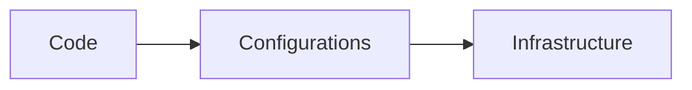

## Introduction to Automating Infrastructure Security Testing

In the realm of DevSecOps, automating infrastructure security testing is a critical component of ensuring the overall security posture of an organization. This chapter delves deep into the principles, practices, and tools involved in automating security testing across different layers of infrastructure, from code to containers and beyond.

### Change Frequency and Scanning Frequency

One of the foundational concepts in automating infrastructure security testing is understanding the relationship between change frequency and scanning frequency. In typical development environments, code changes most frequently, followed by configurations, and then infrastructure. Conversely, infrastructure changes least often.



Given this hierarchy, the scanning frequency should align accordingly. Code should be scanned most frequently, followed by configurations, and then infrastructure. This alignment ensures that security vulnerabilities are caught early in the development lifecycle, minimizing the risk of introducing them into production.

### Triability of Tools

The ease of trialing different security tools is another crucial aspect. Code security scanning tools are generally easier to trial and integrate into the development process. For example, static application security testing (SAST) tools like SonarQube or Fortify can be easily integrated into continuous integration/continuous deployment (CI/CD) pipelines.

#### Example: SonarQube Integration

SonarQube is a popular open-source platform for continuous inspection of code quality. Here’s how you can integrate it into a CI/CD pipeline:

```yaml
# Jenkinsfile
pipeline {
    agent any
    stages {
        stage('Build') {
            steps {
                sh 'mvn clean package'
            }
        }
        stage('SonarQube Analysis') {
            steps {
                withSonarQubeEnv('SonarQube') {
                    sh 'mvn sonar:sonar'
                }
            }
        }
    }
}
```

This Jenkinsfile snippet shows how to run a Maven build and then perform a SonarQube analysis. The `withSonarQubeEnv` step ensures that the necessary environment variables are set for the SonarQube analysis.

### Detecting Codes and Secrets

One of the quick wins in automating infrastructure security testing is detecting codes and secrets. Tools like TruffleHog or GitGuardian can help identify sensitive data such as API keys, passwords, and other credentials that might have been accidentally committed to version control systems.

#### Example: TruffleHog Usage

TruffleHog is a tool designed to find high entropy strings and secret patterns in your codebase. Here’s how you can use it:

```bash
trufflehog --regex --entropy=False git://github.com/user/repo.git
```

This command scans the specified repository for potential secrets. The `--regex` flag enables regular expression-based detection, and `--entropy=False` disables entropy-based detection.

### Configuring Tools

While trialing tools is straightforward, configuring them effectively requires careful consideration. Misconfigured tools can lead to false positives, false negatives, and information overload. It’s essential to understand the specific requirements and constraints of your environment.

#### Example: Configuring SonarQube

To configure SonarQube effectively, you need to define rules and quality profiles that match your project’s needs. Here’s an example of a custom quality profile:

```json
{
  "profile": {
    "name": "Custom Quality Profile",
    "language": "java",
    "rules": [
      {
        "key": "squid:S1066",
        "severity": "MAJOR"
      },
      {
        "key": "squid:S1068",
        "severity": "MINOR"
      }
    ]
  }
}
```

This JSON snippet defines a custom quality profile with specific rules and severities. By tailoring the rules to your project, you can ensure that the analysis provides meaningful results.

### Real-World Examples

Recent real-world examples highlight the importance of automating infrastructure security testing. For instance, the SolarWinds breach (CVE-2020-1014) demonstrated the risks of supply chain attacks. By integrating security testing into the CI/CD pipeline, organizations can detect and mitigate such vulnerabilities early.

#### Example: SolarWinds Breach

The SolarWinds breach involved a malicious update to the Orion software, which was distributed to customers. This incident underscores the need for robust security testing practices, including automated scanning of dependencies and third-party libraries.

### How to Prevent / Defend

To prevent and defend against security vulnerabilities, it’s crucial to implement a comprehensive strategy that includes detection, prevention, and mitigation.

#### Detection

Detection involves using tools to identify potential security issues. For example, using SAST tools like SonarQube can help detect code vulnerabilities.

#### Prevention

Prevention involves implementing secure coding practices and ensuring that security is integrated into the development process. This includes using tools like SonarQube to enforce coding standards and detect vulnerabilities.

#### Mitigation

Mitigation involves taking steps to reduce the impact of security vulnerabilities. This includes patch management, regular security audits, and implementing security controls such as firewalls and intrusion detection systems.

### Complete Example: Automated Security Testing Pipeline

Here’s a complete example of an automated security testing pipeline using Jenkins, SonarQube, and TruffleHog:

#### Jenkinsfile

```yaml
pipeline {
    agent any
    stages {
        stage('Build') {
            steps {
                sh 'mvn clean package'
            }
        }
        stage('SonarQube Analysis') {
            steps {
                withSonarQubeEnv('SonarQube') {
                    sh 'mvn sonar:sonar'
                }
            }
        }
        stage('Secret Detection') {
            steps {
                sh 'trufflehog --regex --entropy=False .'
            }
        }
    }
}
```

#### SonarQube Configuration

```json
{
  "profile": {
    "name": "Custom Quality Profile",
    "language": "java",
    "rules": [
      {
        "key": "squid:S1066",
        "severity": "MAJOR"
      },
      {
        “key”: “squid:S1068”,
        “severity”: “MINOR”
      }
    ]
  }
}
```

#### TruffleHog Command

```bash
trufflehog --regex --entropy=False .
```

### Conclusion

Automating infrastructure security testing is a vital practice in DevSecOps. By understanding the relationship between change frequency and scanning frequency, trialing and configuring tools effectively, and implementing a comprehensive strategy for detection, prevention, and mitigation, organizations can significantly enhance their security posture.

### Hands-On Labs

For hands-on practice, consider the following labs:

- **PortSwigger Web Security Academy**: Offers interactive labs for web application security.
- **OWASP Juice Shop**: A deliberately insecure web application for security training.
- **DVWA (Damn Vulnerable Web Application)**: Another web application for security training.
- **WebGoat**: An interactive training application for learning about web application security.

These labs provide practical experience in applying the concepts discussed in this chapter.

---
<!-- nav -->
[[DevSecOps/DevSecOps Bootcamp/04-Infrastructure Security/01-Automating Infrastructure Security Testing/05-Module and Course Summary/00-Overview|Overview]] | [[02-Automated Security Testing in DevSecOps|Automated Security Testing in DevSecOps]]
