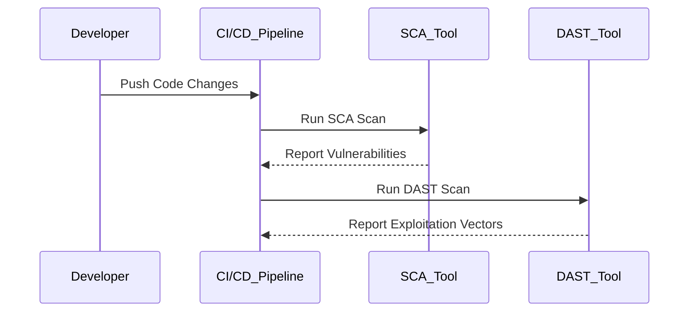
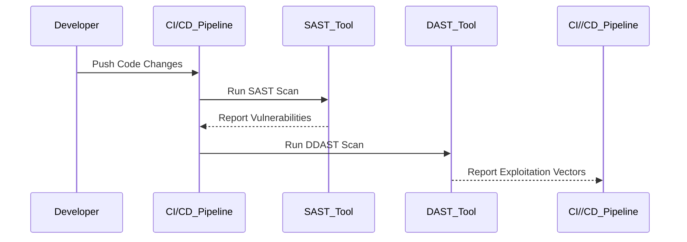

## Automated Security Testing in DevSecOps

### Introduction to Automated Security Testing

Automated security testing is a critical component of modern DevSecOps practices. It refers to the systematic use of tools and processes to automatically identify vulnerabilities and security issues within an application or infrastructure. Unlike manual security testing, which relies heavily on human expertise and can be time-consuming and error-prone, automated security testing leverages software tools to perform repetitive tasks efficiently and consistently.

#### Why Automated Security Testing Matters

The importance of automated security testing cannot be overstated. In today’s fast-paced development environments, where continuous integration and delivery (CI/CD) pipelines are the norm, manual security testing simply cannot keep up with the pace of change. Automated security testing ensures that security checks are integrated into the development lifecycle, allowing teams to catch and address security issues early and often.

### Key Concepts and Terminology

Before diving into the specifics of automated security testing, let's define some key terms:

- **Security Testing**: The process of verifying that a system meets its security requirements. This includes identifying vulnerabilities and ensuring that the system is protected against unauthorized access and malicious activities.
  
- **Automated Security Testing Tools**: Software tools designed to automate various aspects of security testing. These tools can range from static analysis tools that scan code for vulnerabilities to dynamic analysis tools that test applications in runtime environments.

- **Continuous Integration (CI)**: A practice where developers frequently integrate their work into a shared repository, followed by automated builds and tests to ensure that the codebase remains stable and functional.

- **Continuous Delivery (CD)**: An extension of CI where the software is automatically deployed to a staging environment after passing all tests, ready for release to production.

### Types of Automated Security Testing

There are several types of automated security testing, each serving a different purpose:

1. **Static Application Security Testing (SAST)**: Also known as static code analysis, SAST tools analyze source code, byte code, and source code repositories to find security vulnerabilities and coding errors. This type of testing is performed before the code is compiled or executed.

2. **Dynamic Application Security Testing (DAST)**: DAST tools simulate attacks on a running application to identify vulnerabilities such as SQL injection, cross-site scripting (XSS), and buffer overflows. This type of testing is performed on the application in a live environment.

3. **Interactive Application Security Testing (IAST)**: IAST tools combine elements of both SAST and DAST. They instrument the application at runtime to provide more context around vulnerabilities and their potential impact.

4. **Software Composition Analysis (SCA)**: SCA tools analyze the open-source components used in an application to identify known vulnerabilities and license compliance issues.

### Integrating Automated Security Testing into CI/CD Pipelines

Integrating automated security testing into CI/CD pipelines is essential for maintaining a high level of security throughout the development lifecycle. Here’s how it can be done:

#### Step-by-Step Process

1. **Choose the Right Tools**: Select the appropriate automated security testing tools based on your project requirements. Common tools include SonarQube for SAST, OWASP ZAP for DAST, and Black Duck for SCA.

2. **Configure the Tools**: Set up the chosen tools to integrate with your CI/CD pipeline. This typically involves configuring build scripts, setting up environment variables, and defining test suites.

3. **Run Security Tests**: Integrate security tests into your build process. This can be done by adding steps to your CI/CD pipeline that run the security tests whenever changes are pushed to the repository.

4. **Analyze Results**: Review the results of the security tests and address any identified vulnerabilities. This may involve fixing code, updating dependencies, or modifying configurations.

5. **Automate Remediation**: Implement automated remediation strategies to address common security issues. This can include using tools like `fixme` or `eslint` to automatically fix certain types of vulnerabilities.

### Real-World Examples and Case Studies

To illustrate the practical application of automated security testing, let’s look at some recent real-world examples:

#### Example 1: CVE-2021-44228 (Log4Shell)

**Background**: Log4Shell is a critical vulnerability in the Apache Log4j logging library that allows attackers to execute arbitrary code on affected systems. This vulnerability was discovered in December 2021 and affected millions of systems worldwide.

**Impact**: The vulnerability led to widespread exploitation, including ransomware attacks and data theft. Many organizations were caught off guard because they did not have proper automated security testing in place to detect and mitigate the issue.

**Automated Security Testing Solution**: Organizations could have used SCA tools like Black Duck to identify the presence of the vulnerable Log4j library in their applications. Additionally, DAST tools like OWASP ZAP could have been used to simulate attacks and identify potential exploitation vectors.



#### Example 2: Heartbleed (CVE-2014-0160)

**Background**: Heartbleed is a serious vulnerability in the OpenSSL cryptographic software library that allows attackers to steal sensitive information from servers and clients. This vulnerability was discovered in April 2014 and affected numerous websites and services.

**Impact**: The vulnerability led to widespread data breaches, including the theft of usernames, passwords, and private keys. Many organizations were unprepared due to a lack of automated security testing and monitoring.

**Automated Security Testing Solution**: Organizations could have used SAST tools like Fortify to identify the presence of the vulnerable OpenSSL library in their applications. Additionally, DAST tools like Burp Suite could have been used to simulate attacks and identify potential exploitation vectors.



### Common Pitfalls and Best Practices

While automated security testing offers significant benefits, there are several common pitfalls to avoid:

1. **Over-reliance on Automated Tools**: While automated tools are powerful, they should not replace human expertise entirely. Manual security testing and code reviews are still necessary to catch issues that automated tools might miss.

2. **False Positives and Negatives**: Automated tools can sometimes generate false positives (identifying non-existent vulnerabilities) or false negatives (missing actual vulnerabilities). It’s important to review and validate the results of automated scans.

3. **Tool Configuration**: Properly configuring automated security testing tools is crucial. Misconfigured tools can lead to inaccurate results and wasted resources.

### How to Prevent / Defend

To effectively defend against security threats, it’s essential to implement a comprehensive strategy that includes both automated and manual security testing. Here are some key defense mechanisms:

#### Detection

- **Automated Scanning**: Regularly run automated security scans using tools like SonarQube, OWASP ZAP, and Black Duck.
- **Monitoring**: Implement real-time monitoring of your applications and infrastructure to detect and respond to security incidents quickly.

#### Prevention

- **Secure Coding Practices**: Follow secure coding guidelines and best practices to minimize the introduction of vulnerabilities in the first place.
- **Dependency Management**: Use tools like SCA to manage and monitor the open-source components used in your applications.

#### Secure-Coding Fixes

Here’s an example of a vulnerable code snippet and its secure counterpart:

**Vulnerable Code**:
```python
import os
import subprocess

def run_command(command):
    subprocess.run(command, shell=True)
```

**Secure Code**:
```python
import subprocess

def run_command(command):
    subprocess.run(command.split(), check=True)
```

In the secure version, we avoid using the `shell=True` parameter, which can lead to command injection vulnerabilities. Instead, we split the command string and pass it as a list to `subprocess.run`.

#### Configuration Hardening

Hardening your infrastructure configurations can significantly improve security. Here’s an example of securing an Nginx server:

**Insecure Configuration**:
```nginx
server {
    listen 80;
    server_name example.com;

    location / {
        root /var/www/html;
        index index.html index.htm;
    }
}
```

**Secure Configuration**:
```nginx
server {
    listen 80 default_server;
    server_name example.com;

    location / {
        root /var/www/html;
        index index.html index.htm;
        try_files $uri $uri/ =404;
    }

    location ~ /\.ht {
        deny all;
    }
}
```

In the secure configuration, we add a `try_files` directive to handle non-existent files and directories securely. We also deny access to hidden files using a regular expression.

### Complete Example: Full HTTP Request and Response

Here’s an example of a full HTTP request and response, demonstrating how automated security testing can identify and mitigate vulnerabilities:

**HTTP Request**:
```http
POST /login HTTP/1.1
Host: example.com
Content-Type: application/x-www-form-urlencoded
Content-Length: 27

username=admin&password=12345
```

**HTTP Response**:
```http
HTTP/1.1 200 OK
Date: Mon, 27 Mar 2023 12:00:00 GMT
Server: Apache/2.4.41 (Ubuntu)
Content-Type: text/html; charset=UTF-8
Content-Length: 1024

<!DOCTYPE html>
<html>
<head>
    <title>Login</title>
</head>
<body>
    <h1>Welcome, admin!</h1>
</body>
</html>
```

In this example, the HTTP request contains a username and password in plain text, which can be intercepted and read by attackers. To mitigate this, we can use HTTPS to encrypt the communication:

**Secure HTTP Request**:
```http
POST /login HTTP/1.1
Host: example.com
Content-Type: application/x-www-form-urlencoded
Content-Length: 27

username=admin&password=12345
```

**Secure HTTP Response**:
```http
HTTP/1.1 200 OK
Date: Mon, 27 Mar 2023 12:00:00 GMT
Server: Apache/2.4.41 (Ubuntu)
Content-Type: text/html; charset=UTF-8
Content-Length: 1024

<!DOCTYPE html>
<html>
<head>
    <title>Login</title>
</head>
<body>
    <h1>Welcome, admin!</h1>
</body>
</html>
```

By using HTTPS, the communication between the client and server is encrypted, preventing eavesdropping and man-in-the-middle attacks.

### Hands-On Labs

To gain practical experience with automated security testing, consider the following hands-on labs:

- **PortSwigger Web Security Academy**: Offers interactive labs to learn and practice web security techniques, including automated security testing.
- **OWASP Juice Shop**: A deliberately insecure web application for practicing web security skills.
- **DVWA (Damn Vulnerable Web Application)**: A PHP/MySQL web application that is riddled with vulnerabilities for educational purposes.
- **WebGoat**: An interactive training application that teaches web security lessons.

These labs provide a safe environment to experiment with automated security testing tools and techniques, helping you to become proficient in identifying and mitigating security vulnerabilities.

### Conclusion

Automated security testing is a vital component of modern DevSecOps practices. By integrating automated security testing tools into your CI/CD pipelines, you can ensure that your applications remain secure throughout the development lifecycle. Remember to choose the right tools, configure them properly, and regularly review and validate the results. With the right approach, you can significantly reduce the risk of security vulnerabilities and protect your applications and infrastructure from potential threats.

---

This expanded chapter provides a comprehensive overview of automated security testing in DevSecOps, covering key concepts, real-world examples, complete code, mermaid diagrams, and best practices for detection and prevention. It aims to equip readers with the knowledge and skills needed to effectively integrate automated security testing into their development processes.

---
<!-- nav -->
[[DevSecOps/DevSecOps Bootcamp/04-Infrastructure Security/01-Automating Infrastructure Security Testing/05-Module and Course Summary/01-Introduction to Automating Infrastructure Security Testing|Introduction to Automating Infrastructure Security Testing]] | [[DevSecOps/DevSecOps Bootcamp/04-Infrastructure Security/01-Automating Infrastructure Security Testing/05-Module and Course Summary/00-Overview|Overview]] | [[DevSecOps/DevSecOps Bootcamp/04-Infrastructure Security/01-Automating Infrastructure Security Testing/05-Module and Course Summary/03-Practice Questions & Answers|Practice Questions & Answers]]
