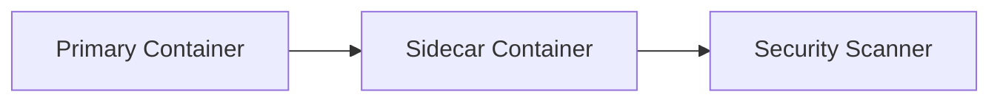
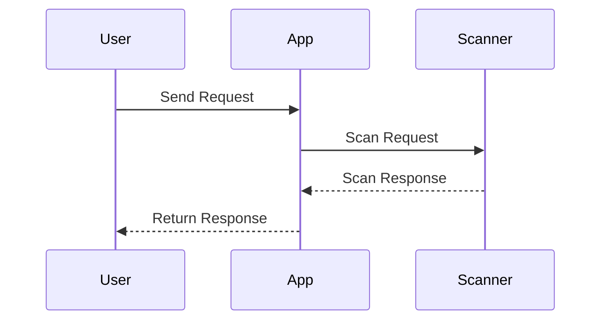

## Workflow for Using Infrastructure Scanners

### Starting the Application as Sidecar

In the context of DevSecOps, one of the key practices is to integrate security testing into the continuous integration/continuous deployment (CI/CD) pipeline. One effective way to achieve this is by using infrastructure scanners as sidecars. A sidecar is a container that runs alongside the main application container, providing additional functionality such as monitoring, logging, or in this case, security scanning.

#### What is a Sidecar?

A sidecar is a design pattern in container orchestration where a helper container is attached to a primary container. This helper container, or sidecar, provides additional services or capabilities to the primary container. In the context of security, a sidecar can be used to perform security scans on the primary application container.

#### Why Use a Sidecar?

Using a sidecar for security scanning offers several benefits:

1. **Isolation**: The sidecar container is isolated from the primary application container, reducing the risk of introducing vulnerabilities.
2. **Flexibility**: The sidecar can be easily updated or replaced without affecting the primary application.
3. **Consistency**: The sidecar ensures that security scans are performed consistently across different environments.

#### How to Implement a Sidecar

To implement a sidecar for security scanning, you need to define the sidecar container in your orchestration tool (e.g., Kubernetes). Here’s an example of how to define a sidecar in a Kubernetes deployment:

```yaml
apiVersion: apps/v1
kind: Deployment
metadata:
  name: my-app-deployment
spec:
  replicas: 1
  selector:
    matchLabels:
      app: my-app
  template:
    metadata:
      labels:
        app: my-app
    spec:
      containers:
      - name: my-app-container
        image: my-app-image:latest
        ports:
        - containerPort: 8080
      - name: security-scanner-sidecar
        image: security-scanner-image:latest
        env:
        - name: SCAN_TARGET
          value: "http://my-app-container:8080"
```

In this example, `security-scanner-sidecar` is the sidecar container that performs security scans on `my-app-container`.

### Ensuring Test Resembles Production

One of the critical aspects of using infrastructure scanners is ensuring that the test environment closely resembles the production environment. This is crucial because differences between the test and production environments can lead to false negatives or false positives.

#### What is a False Negative?

A false negative occurs when a security issue exists in the production environment but is not detected in the test environment. This can happen due to differences in configurations, dependencies, or runtime environments.

#### What is a False Positive?

A false positive occurs when the scanner detects a security issue in the test environment that does not exist in the production environment. This can happen due to differences in configurations, dependencies, or runtime environments.

#### How to Ensure Test Resembles Production

To ensure that the test environment closely resembles the production environment, you should:

1. **Use the Same Configuration**: Ensure that the test environment uses the same configuration files, environment variables, and dependencies as the production environment.
2. **Use the Same Data**: If possible, use the same data in the test environment as in the production environment. This includes both static data and dynamic data.
3. **Use the Same Runtime Environment**: Ensure that the test environment uses the same runtime environment as the production environment. This includes the operating system, libraries, and other dependencies.

### Scanning the Application

Once the test environment is set up, the next step is to scan the application using the infrastructure scanner. This involves configuring the scanner and running the scan.

#### Configuring the Scanner

Configuring the scanner is a critical step because it determines the effectiveness of the scan. The scanner needs to be configured to scan the correct targets and to use the correct settings.

Here’s an example of how to configure a scanner using a command-line interface:

```bash
scanner --target http://my-app-container:8080 --config my-config.yaml
```

In this example, `--target` specifies the target URL to scan, and `--config` specifies the configuration file to use.

#### Running the Scan

Running the scan involves executing the scanner and analyzing the results. The scanner will generate a report that lists the security issues found in the application.

### Filtering Out False Positives

After running the scan, the next step is to filter out false positives. False positives can occur due to differences between the test and production environments or due to limitations in the scanner.

#### What is a False Positive?

A false positive occurs when the scanner detects a security issue in the test environment that does not exist in the production environment. This can happen due to differences in configurations, dependencies, or runtime environments.

#### How to Filter Out False Positives

To filter out false positives, you need to analyze the scan results and determine which issues are valid and which are not. This involves:

1. **Reviewing the Scan Results**: Review the scan results and determine which issues are valid and which are not.
2. **Reproducing the Issues**: Reproduce the issues in the production environment to determine whether they are valid.
3. **Adjusting the Scanner Settings**: Adjust the scanner settings to reduce the number of false positives.

### Formal Configuration of the Scanner

Formal configuration of the scanner is necessary to ensure that it provides useful results. This involves configuring the scanner to scan the correct targets and to use the correct settings.

#### What is Formal Configuration?

Formal configuration involves setting up the scanner to scan the correct targets and to use the correct settings. This includes specifying the target URL, specifying the configuration file, and specifying the settings.

#### How to Configure the Scanner

To configure the scanner, you need to specify the target URL, specify the configuration file, and specify the settings. Here’s an example of how to configure a scanner using a command-line interface:

```bash
scanner --target http://my-app-container:8080 --config my-config.yaml --settings my-settings.json
```

In this example, `--target` specifies the target URL to scan, `--config` specifies the configuration file to use, and `-settings` specifies the settings file to use.

### Advantages of Infrastructure Scanning

Infrastructure scanning has several advantages, including finding security misconfigurations before the application is deployed to production.

#### Finding Security Misconfigurations

Security misconfigurations are one of the most common causes of security issues in applications. Infrastructure scanning can help identify these misconfigurations before the application is deployed to production.

#### Example of Security Misconfiguration

An example of a security misconfiguration is a misconfigured firewall rule that allows unauthorized access to the application. Infrastructure scanning can help identify such misconfigurations before the application is deployed to production.

### Compatibility of Infrastructure Scanners

Most web interfaces can be scanned using infrastructure scanners. However, user sessions are more difficult to scan.

#### What is User Session?

A user session is a period of interaction between a user and an application. During a user session, the user interacts with the application and performs various actions.

#### Why User Sessions are Difficult to Scan?

User sessions are difficult to scan because they involve interactions between the user and the application. These interactions can involve complex workflows and can be difficult to simulate.

#### How to Scan User Sessions

To scan user sessions, you need to simulate user interactions with the application. This involves creating test cases that simulate user interactions and running the scanner against these test cases.

### Trialability of Infrastructure Scanners

Trialability refers to how easy it is to try out infrastructure scanners. It is moderately easy to add infrastructure scanners to a CI/CD pipeline.

#### What is Trialability?

Trialability refers to how easy it is to try out a new technology. In the context of infrastructure scanners, trialability refers to how easy it is to try out infrastructure scanners.

#### How to Add Infrastructure Scanners to a CI/CD Pipeline

To add infrastructure scanners to a CI/CD pipeline, you need to define the scanner as a step in the pipeline. This involves defining the scanner as a sidecar container and running the scanner as part of the pipeline.

### Real-World Examples

#### Recent CVEs and Breaches

Recent CVEs and breaches have highlighted the importance of infrastructure scanning. For example, the Log4j vulnerability (CVE-2021-44228) was exploited by attackers to gain unauthorized access to systems. Infrastructure scanning could have helped identify and mitigate this vulnerability before it was exploited.

#### Real-World Example: Equifax Breach

The Equifax breach in 2017 was caused by a vulnerability in the Apache Struts framework. Infrastructure scanning could have helped identify and mitigate this vulnerability before it was exploited.

### How to Prevent / Defend

#### Detection

Detection involves identifying security issues in the application. This can be done using infrastructure scanning tools.

#### Prevention

Prevention involves mitigating security issues in the application. This can be done using secure coding practices and infrastructure hardening.

#### Secure Coding Practices

Secure coding practices involve writing code that is secure by design. This includes using secure coding patterns, avoiding common security pitfalls, and following best practices.

#### Infrastructure Hardening

Infrastructure hardening involves securing the infrastructure to prevent unauthorized access. This includes securing the operating system, securing the network, and securing the applications.

### Complete Example

#### Vulnerable Code

Here’s an example of vulnerable code:

```python
from flask import Flask, request

app = Flask(__name__)

@app.route('/login', methods=['POST'])
def login():
    username = request.form['username']
    password = request.form['password']
    if username == 'admin' and password == 'password':
        return 'Login successful'
    else:
        return 'Login failed'

if __name__ == '__main__':
    app.run()
```

#### Secure Code

Here’s an example of secure code:

```python
from flask import Flask, request
from werkzeug.security import check_password_hash

app = Flask(__name__)

@app.route('/login', methods=['POST'])
def login():
    username = request.form['username']
    password = request.form['password']
    if username == 'admin' and check_password_hash(password, 'hashed_password'):
        return 'Login successful'
    else:
        return 'Login failed'

if __name__ == '__main__':
    app.run()
```

### Mermaid Diagrams

#### Sidecar Architecture



#### Request/Response Flow



### Practice Labs

For hands-on practice with infrastructure scanning, consider the following labs:

- **PortSwigger Web Security Academy**: Offers a variety of labs focused on web application security, including infrastructure scanning.
- **OWASP Juice Shop**: A deliberately insecure web application designed for security training.
- **DVWA (Damn Vulnerable Web Application)**: A PHP/MySQL web application that is riddled with vulnerabilities for educational purposes.
- **WebGoat**: An interactive, gamified training application for learning about web application security.

These labs provide practical experience with infrastructure scanning and help reinforce the concepts covered in this chapter.

### Conclusion

In conclusion, integrating infrastructure scanning into the CI/CD pipeline is a critical practice in DevSecOps. By using infrastructure scanners as sidecars, ensuring that the test environment closely resembles the production environment, and formalizing the scanner configuration, you can effectively identify and mitigate security issues before the application is deployed to production. Additionally, by understanding the compatibility and trialability of infrastructure scanners, you can ensure that they are integrated seamlessly into your development process. Finally, by practicing secure coding and infrastructure hardening, you can further enhance the security of your applications.

---
<!-- nav -->
[[DevSecOps/DevSecOps Bootcamp/04-Infrastructure Security/01-Automating Infrastructure Security Testing/06-Workflow and Conclusion of Infrastructure Scanning/00-Overview|Overview]] | [[DevSecOps/DevSecOps Bootcamp/04-Infrastructure Security/01-Automating Infrastructure Security Testing/06-Workflow and Conclusion of Infrastructure Scanning/02-Practice Questions & Answers|Practice Questions & Answers]]
