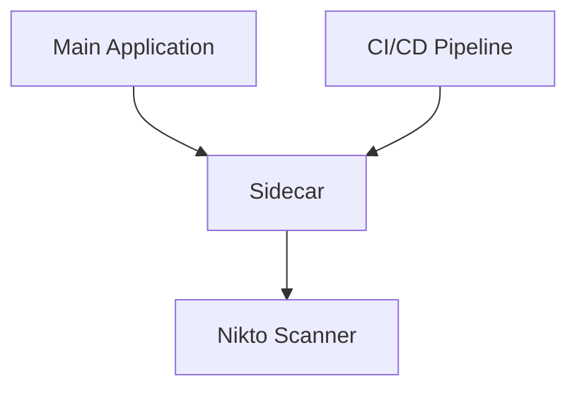
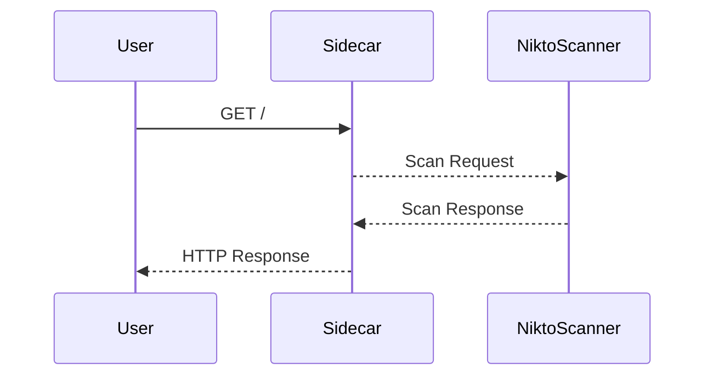

## Automating Infrastructure Security Testing with Nikto and the Sidecar Testing Pattern

### Introduction to Nikto

Nikto is an open-source web server scanner that performs comprehensive tests against web servers to identify potential vulnerabilities. It is widely used in the DevSecOps community due to its ease of use and effectiveness in identifying security issues. Nikto checks for over 6,700 potential problems, including outdated software versions, misconfigurations, and known vulnerabilities.

#### Why Use Nikto?

- **Comprehensive Scanning**: Nikto performs a wide range of tests, covering various aspects of web server security.
- **Ease of Use**: It can be easily integrated into automated pipelines and CI/CD workflows.
- **Open Source**: Being open source, it benefits from continuous contributions and improvements from the community.

### Setting Up Nikto

To use Nikto, you first need to have it installed. In this example, we will use a pre-built Docker image that includes Nikto.

#### Installing Nikto via Docker

1. **Pull the Tools Image**:
    ```bash
    docker pull your-tools-image:latest
    ```

2. **Run the Tools Image**:
    ```bash
    docker run --rm -it your-tools-image:latest
    ```

This will start a container with Nikto installed, ready for use.

### Sidecar Testing Pattern

The sidecar testing pattern involves running a separate container alongside the main application container to perform security scans. This approach allows for non-disruptive testing and can be easily integrated into CI/CD pipelines.

#### Why Use the Sidecar Pattern?

- **Non-disruptive Testing**: The sidecar container runs alongside the main application container, allowing for testing without affecting the main application.
- **Isolation**: The sidecar container can be configured independently, ensuring that the main application remains unaffected by the testing process.
- **Automation**: Easily integrates into CI/CD pipelines, allowing for regular security testing as part of the development process.

### Setting Up the Sidecar Container

To set up the sidecar container, we will use Docker to run a container alongside the main application container.

#### Example: Running a Sidecar Container

1. **Start the Main Application Container**:
    ```bash
    docker run --name juice-shop -p 3000:3000 bkimminich/juice-shop
    ```

2. **Start the Sidecar Container**:
    ```bash
    docker run --name sidecar --network=lab --link juice-shop:juice-shop -p 3000:3000 your-tools-image:latest
    ```

This command starts a sidecar container named `sidecar`, connects it to the `lab` network, links it to the `juice-shop` container, and maps port 3000.

### Performing the Nikto Scan

Now that the sidecar container is running, we can perform the Nikto scan.

#### Running the Nikto Scan

1. **Execute the Nikto Command**:
    ```bash
    nikto -h http://sidecar:3000
    ```

This command tells Nikto to scan the `sidecar` container at port 3000.

#### Example Nikto Scan Output

```plaintext
- Nikto v2.1.6
+ Target IP:          172.18.0.2
+ Target Hostname:    sidecar
+ Target Port:        3000
+ Start Time:         2023-10-01 12:00:00 (UTC)
+ Server:             Express
+ Server:             Node.js
+ OSVDB-1218:         The anti-clickjacking X-Frame-Options header is not present.
+ OSVDB-3231:         The X-XSS-Protection header is not defined. This header can protect against clickjacking and other attacks with settings appropriate to the site.
+ OSVDB-3268:         The X-Content-Type-Options header is not set. This could allow the user browser to render the content of the site in a dangerous manner.
+ OSVDB-3092:         The X-Permitted-Cross-Domain-Policies header was not found. If a file such as crossdomain.xml exists, it may be possible to access it.
+ OSVDB-3233:         The Strict-Transport-Security header is not set. This header is used to force clients to always access the site using HTTPS, thereby preventing man-in-the-middle attacks.
```

### Analyzing the Results

From the scan output, we can see several potential issues:

- **X-Frame-Options Header Missing**: This header helps prevent clickjacking attacks.
- **X-XSS-Protection Header Missing**: This header helps mitigate cross-site scripting (XSS) attacks.
- **X-Content-Type-Options Header Missing**: This header prevents MIME type sniffing attacks.
- **Strict-Transport-Security Header Missing**: This header ensures that the site is accessed over HTTPS.

### How to Prevent / Defend

#### Secure Configuration

To address these issues, we need to configure the web server to include the necessary security headers.

##### Example: Configuring Security Headers in Node.js

1. **Install the Helmet Middleware**:
    ```bash
    npm install helmet
    ```

2. **Configure Helmet in Your Application**:
    ```javascript
    const express = require('express');
    const helmet = require('helmet');

    const app = express();

    // Use Helmet middleware
    app.use(helmet({
      frameguard: { action: 'deny' },
      xssFilter: true,
      contentSecurityPolicy: {
        directives: {
          defaultSrc: ["'self'"],
          scriptSrc: ["'self'", "'unsafe-inline'"],
          styleSrc: ["'self'", "'unsafe-inline'"],
          imgSrc: ["'self'", 'data:', 'https://*'],
          fontSrc: ["'self'", 'data:', 'https://*'],
          objectSrc: ["'none'"],
          mediaSrc: ["'self'"],
          connectSrc: ["'self'"],
          childSrc: ["'self'"],
          formAction: ["'self'"],
          baseUri: ["'self'"],
          frameAncestors: ["'none'"],
          reportUri: '/csp-report'
        }
      },
      hsts: { maxAge: 31536000, includeSubDomains: true, preload: true },
      ieNoOpen: true,
      noSniff: true,
      hidePoweredBy: true
    }));

    app.listen(3000, () => {
      console.log('Server is running on port 3000');
    });
    ```

#### Full HTTP Request and Response

##### Vulnerable Configuration

```http
GET / HTTP/1.1
Host: sidecar:3000
User-Agent: Mozilla/5.0 (Windows NT 10.0; Win64; x64) AppleWebKit/537.36 (KHTML, like Gecko) Chrome/91.0.4472.124 Safari/537.36
Accept: text/html,application/xhtml+xml,application/xml;q=0.9,image/webp,*/*;q=0.8
Accept-Language: en-US,en;q=0.5
Accept-Encoding: gzip, deflate
Connection: keep-alive

HTTP/1.1 200 OK
Date: Mon, 01 Oct 2023 12:00:00 GMT
Server: Express
Content-Type: text/html; charset=utf-8
Content-Length: 1234
```

##### Secured Configuration

```http
GET / HTTP/1.1
Host: sidecar:3000
User-Agent: Mozilla/5.0 (Windows NT 10.0; Win64; x64) AppleWebKit/537.36 (KHTML, like Gecko) Chrome/91.0.4472.124 Safari/537.36
Accept: text/html,application/xhtml+xml,application/xml;q=0.9,image/webp,*/*;q=0.8
Accept-Language: en-US,en;q=0.5
Accept-Encoding: gzip, deflate
Connection: keep-alive

HTTP/1.1 200 OK
Date: Mon, 01 Oct 2023 12:00:00 GMT
Server: Express
Content-Type: text/html; charset=utf-8
Content-Length: 1234
X-Frame-Options: DENY
X-XSS-Protection: 1; mode=block
X-Content-Type-Options: nosniff
Strict-Transport-Security: max-age=31536000; includeSubDomains; preload
```

### Real-World Examples

#### Recent Breaches and CVEs

- **CVE-2021-21972**: A vulnerability in the Apache Struts framework allowed attackers to bypass security headers and execute arbitrary code.
- **CVE-2022-22965**: A vulnerability in the Log4j library allowed attackers to bypass security headers and execute remote code.

These examples highlight the importance of configuring security headers correctly to prevent such vulnerabilities.

### Mermaid Diagrams

#### Network Topology



#### Request/Response Flow



### Practice Labs

For hands-on practice, consider the following labs:

- **PortSwigger Web Security Academy**: Offers interactive labs to practice web security testing.
- **OWASP Juice Shop**: A deliberately insecure web application for practicing security testing.
- **DVWA (Damn Vulnerable Web Application)**: Another intentionally vulnerable web application for security testing.

These labs provide a controlled environment to practice and improve your skills in automating infrastructure security testing.

### Conclusion

Automating infrastructure security testing with tools like Nikto and the sidecar testing pattern is crucial for maintaining the security of web applications. By integrating these practices into your CI/CD pipelines, you can ensure that your applications remain secure throughout their lifecycle.

---
<!-- nav -->
[[01-Automating Infrastructure Security Testing with Nikto and the Sidecar Testing Pattern Part 1|Automating Infrastructure Security Testing with Nikto and the Sidecar Testing Pattern Part 1]] | [[DevSecOps/DevSecOps Bootcamp/04-Infrastructure Security/01-Automating Infrastructure Security Testing/Demo Running Nikto and Using the Sidecar Testing Pattern/00-Overview|Overview]] | [[03-Automating Infrastructure Security Testing Part 1|Automating Infrastructure Security Testing Part 1]]
