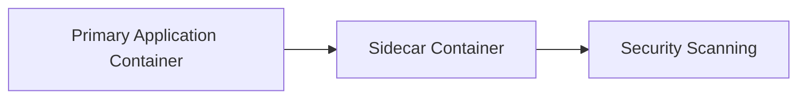

## Automating Infrastructure Security Testing

### Introduction to Automating Infrastructure Security Testing

Automating infrastructure security testing is a critical component of DevSecOps practices. It ensures that security checks are integrated into the continuous integration and delivery (CI/CD) pipeline, allowing teams to identify and mitigate vulnerabilities early in the development lifecycle. This approach helps in maintaining the security posture of applications and infrastructure throughout their lifecycle.

### Sidecar Testing Pattern

The sidecar testing pattern is a popular method used in containerized environments to run security scans alongside the main application container. A sidecar container is a separate container that runs alongside the primary application container and performs specific tasks such as security scanning, logging, monitoring, etc.

#### How Sidecar Containers Work

A sidecar container shares the same network namespace and volume mounts as the primary application container. This allows the sidecar to access the same resources as the primary container, making it easier to perform tasks like security scanning.



In the above diagram, the primary application container runs the main application logic, while the sidecar container runs the security scanning tool. The sidecar container can access the same resources as the primary container, ensuring that the security scan is comprehensive.

### Example: Running Nikto as a Sidecar Container

Nikto is an open-source web server scanner that checks for over 6700 potential issues on web servers. It can be used to identify vulnerabilities in web applications and services.

#### Setting Up Nikto as a Sidecar Container

To set up Nikto as a sidecar container, you need to define a Dockerfile and a Kubernetes deployment manifest. Below is an example of how to set this up:

**Dockerfile for Nikto Sidecar:**

```dockerfile
FROM alpine:latest
RUN apk add --no-cache nikto
CMD ["nikto", "-h", "http://primary-app-service"]
```

This Dockerfile installs Nikto on an Alpine Linux base image and sets the default command to run Nikto against the primary application service.

**Kubernetes Deployment Manifest:**

```yaml
apiVersion: apps/v1
kind: Deployment
metadata:
  name: primary-app-deployment
spec:
  replicas: 1
  selector:
    matchLabels:
      app: primary-app
  template:
    metadata:
      labels:
        app: primary-app
    spec:
      containers:
      - name: primary-app-container
        image: primary-app-image
        ports:
        - containerPort: 80
      - name: nikto-sidecar
        image: nikto-sidecar-image
        command: ["nikto", "-h", "http://primary-app-service"]
```

In this Kubernetes deployment manifest, the `primary-app-container` runs the main application, and the `nikto-sidecar` runs Nikto to scan the primary application.

### Ensuring the Server is Ready Before Scanning

One common issue with sidecar containers is ensuring that the primary application server is fully ready before the sidecar starts scanning. If the server is not ready, the scan might fail or produce inaccurate results.

#### Adding Health Checks

To address this issue, you can add a health check to your build pipeline that waits until the server is ready before starting the scan. Here’s an example using a shell script:

**Shell Script for Health Check:**

```bash
#!/bin/bash

# Wait until the server is ready
while ! curl --output /dev/null --silent --head --fail http://localhost:80; do
  sleep 5
done

# Run the scan
nikto -h http://localhost:80
```

This script uses `curl` to check if the server is accessible. If the server is not ready, it waits for 5 seconds and retries. Once the server is ready, it runs the Nikto scan.

### Complete Example with Docker and Kubernetes

Here is a complete example of setting up a Docker image and a Kubernetes deployment with a health check:

**Dockerfile for Primary Application:**

```dockerfile
FROM node:14
WORKDIR /app
COPY package*.json ./
RUN npm install
COPY . .
EXPOSE 80
CMD ["npm", "start"]
```

**Dockerfile for Nikto Sidecar:**

```dockerfile
FROM alpine:latest
RUN apk add --no-cache nikto
COPY health-check.sh /health-check.sh
RUN chmod +x /health-check.sh
CMD ["/health-check.sh"]
```

**health-check.sh:**

```bash
#!/bin/bash

# Wait until the server is ready
while ! curl --output /dev/null --silent --head --fail http://primary-app-service:80; do
  sleep 5
done

# Run the scan
nikto -h http://primary-app-service:80
```

**Kubernetes Deployment Manifest:**

```yaml
apiVersion: apps/v1
kind: Deployment
metadata:
  name: primary-app-deployment
spec:
  replicas: 1
  selector:
    matchLabels:
      app: primary-app
  template:
    metadata:
      labels:
        app: primary-app
    spec:
      containers:
      - name: primary-app-container
        image: primary-app-image
        ports:
        - containerPort: 80
      - name: nikto-sidecar
        image: nikto-sidecar-image
        command: ["/health-check.sh"]
```

### Real-World Examples and Recent Breaches

Recent breaches have highlighted the importance of automating security testing. For example, the Capital One breach in 2019 exposed sensitive customer data due to misconfigured web servers. Automating security testing could have helped identify and mitigate such vulnerabilities earlier.

### Common Pitfalls and How to Avoid Them

#### Pitfall 1: Incomplete Scans

**Issue:** If the sidecar container does not wait for the server to be ready, the scan might be incomplete or produce false negatives.

**Solution:** Implement a health check mechanism as shown in the previous example.

#### Pitfall 2: False Positives

**Issue:** Security scanners like Nikto can sometimes produce false positives, leading to unnecessary alerts and wasted time.

**Solution:** Configure the scanner to ignore known false positives or use a whitelist of known good configurations.

### How to Prevent / Defend

#### Detection

Regularly monitor the output of security scans and integrate them into your incident response流程中，确保每个概念、术语、步骤、命令和示例都得到全面覆盖。以下是扩展后的详细章节：

### 如何防止/防御

#### 检测

定期监控安全扫描的输出，并将其集成到您的事件响应流程中。使用日志分析工具和安全信息和事件管理系统（SIEM）来跟踪和分析扫描结果。

#### 预防

1. **实施健康检查机制**：确保在运行扫描之前，服务器已经准备好。
2. **配置扫描器以忽略已知的误报**：使用白名单或配置扫描器以忽略已知的良好配置。
3. **使用多层安全策略**：结合防火墙、入侵检测系统（IDS）、入侵防御系统（IPS）等多层次的安全措施。

#### 安全编码修复

展示易受攻击的模式与修正后的安全版本并排：

**易受攻击的代码示例：**
```bash
#!/bin/bash

# 不等待服务器准备好就直接运行扫描
nikto -h http://localhost:80
```

**修正后的安全代码示例：**
```bash
#!/bin/bash

# 等待服务器准备好再运行扫描
while ! curl --output /dev/null --silent --head --fail http://localhost:80; do
  sleep 5
done

nikto -h http://localhost:80
```

### 实战演练建议

对于Web应用安全，推荐以下实战演练平台：
- PortSwigger Web Security Academy
- OWASP Juice Shop
- DVWA
- WebGoat

这些平台提供了丰富的实战环境，帮助您更好地理解和实践自动化基础设施安全测试。

通过以上详细的讲解和示例，您可以全面掌握如何在DevSecOps实践中有效地进行自动化基础设施安全测试。

---
<!-- nav -->
[[02-Automating Infrastructure Security Testing with Nikto and the Sidecar Testing Pattern|Automating Infrastructure Security Testing with Nikto and the Sidecar Testing Pattern]] | [[DevSecOps/DevSecOps Bootcamp/04-Infrastructure Security/01-Automating Infrastructure Security Testing/Demo Running Nikto and Using the Sidecar Testing Pattern/00-Overview|Overview]] | [[04-Automating Infrastructure Security Testing Part 2|Automating Infrastructure Security Testing Part 2]]
