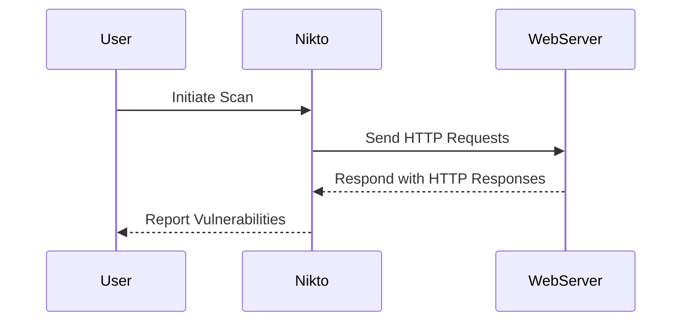

## Automating Infrastructure Security Testing

### Introduction to Infrastructure Security Testing

Infrastructure security testing is a critical component of DevSecOps, ensuring that the underlying infrastructure is secure and resilient against various threats. This involves scanning and analyzing the infrastructure for vulnerabilities, misconfigurations, and other security issues. One of the tools commonly used for this purpose is **Nikto**, an open-source web server scanner that checks for over 6,700 potential issues, including outdated software versions, dangerous files, and configuration errors.

### Understanding Nikto

**Nikto** is a popular web server scanner that helps identify security issues in web applications and servers. It performs a variety of tests, including checking for outdated software versions, dangerous files, and configuration errors. Nikto is particularly useful for identifying low-hanging fruit in terms of security vulnerabilities, which can be quickly remediated.

#### How Nikto Works

Nikto operates by sending HTTP requests to the target server and analyzing the responses. It uses a database of known vulnerabilities and patterns to identify potential security issues. The scanner can be configured to perform different types of scans, ranging from basic to comprehensive.



### Setting Up Nikto

To use Nikto effectively, you need to set up your environment correctly. This typically involves installing Nikto and configuring it to scan your target infrastructure.

#### Installation

Nikto can be installed via package managers or downloaded directly from its GitHub repository. For example, on a Debian-based system, you can install Nikto using `apt`:

```bash
sudo apt-get update
sudo apt-get install nikto
```

Alternatively, you can download the latest version from the GitHub repository:

```bash
git clone https://github.com/sullo/nikto.git
cd nikto
```

#### Basic Usage

Once installed, you can run Nikto against a target server using the following command:

```bash
nikto -h <target>
```

For example, to scan a local server running on port 3000:

```bash
nikto -h http://localhost:3000
```

### Analyzing Scan Results

When running Nikto, you will receive a series of notifications indicating potential vulnerabilities. These notifications can range from informational messages to critical vulnerabilities. It is crucial to carefully analyze these results to determine their validity and impact.

#### Example Scan Output

Here is an example of a Nikto scan output:

```plaintext
- Nikto v2.1.6
+ Target IP:          127.0.0.1
+ Target Hostname:    localhost
+ Target Port:        3000
+ Start Time:         2023-10-01 12:00:00 (UTC)
+ Server:             Apache/2.4.41 (Ubuntu)
+ SSL/TLS Info:       None
+ Retrieved x-powered-by: PHP/7.4.3
+ Server leaks inodes via ETags, header found with file /robots.txt, inode=12345, size=678, mtime=2023-09-30 12:00:00
+ OSVDB-3231: /server-status : Apache default 'server-status' page found, potentially revealing sensitive information.
+ OSVDB-3092: /phpmyadmin/: phpMyAdmin directory found
+ 445 items (152 warnings) checked: 0 error(s) and 3 item(s) reported on.
+ Done: Sun Oct  1 12:00:00 2023.
```

### Handling False Positives

One of the challenges in using tools like Nikto is dealing with false positives—notifications that indicate a potential vulnerability but turn out to be benign. It is essential to verify each notification to ensure that it is indeed a valid security issue.

#### Verifying Notifications

For example, consider the notification about the `/server-status` page:

```plaintext
+ OSVDB-3231: /server-status : Apache default 'server-status' page found, potentially revealing sensitive information.
```

To verify this, you can manually access the URL and inspect the contents:

```http
GET /server-status HTTP/1.1
Host: localhost:3000
```

If the page contains sensitive information, you should address this issue. Otherwise, you can mark it as a false positive.

### Configuring Scans to Avoid False Positives

After verifying the initial scan results, you may want to configure the scan to avoid future false positives. This can involve adjusting the scan parameters or excluding certain paths from the scan.

#### Adjusting Scan Parameters

You can specify additional options to control the behavior of Nikto. For example, to exclude certain paths from the scan, you can use the `-x` option:

```bash
nikto -h http://localhost:3000 -x /server-status
```

### Sidecar Testing Pattern

The sidecar testing pattern is a method for integrating security testing into your continuous integration/continuous deployment (CI/CD) pipeline. In this pattern, a separate container (the sidecar) runs alongside your application container to perform security tests.

#### Example Setup

Consider a scenario where you have a web application running on a server listening on port 3000. You can use a sidecar container to run Nikto against this server.

##### Dockerfile for Sidecar

Here is an example Dockerfile for the sidecar container:

```Dockerfile
FROM alpine:latest
RUN apk add --no-cache nikto
COPY entrypoint.sh /entrypoint.sh
ENTRYPOINT ["/entrypoint.sh"]
```

##### Entry Point Script

The entry point script (`entrypoint.sh`) can run Nikto against the main application container:

```sh
#!/bin/sh
nikto -h http://app:3000
```

##### Docker Compose Configuration

You can use Docker Compose to define the services:

```yaml
version: '3'
services:
  app:
    image: my-web-app
    ports:
      - "3000:3000"
  sidecar:
    build: .
    depends_on:
      - app
```

### Jenkins Pipeline Integration

To integrate the sidecar testing pattern into your CI/CD pipeline, you can modify your Jenkinsfile to include a stage for running the sidecar container.

#### Jenkinsfile Example

Here is an example Jenkinsfile that includes a sidecar testing stage:

```groovy
pipeline {
    agent any
    stages {
        stage('Lint') {
            steps {
                sh 'docker-compose run --rm linter'
            }
        }
        stage('Build') {
            steps {
                sh 'docker-compose build'
            }
        }
        stage('Push') {
            steps {
                sh 'docker-compose push'
            }
        }
        stage('Sidecar Test') {
            steps {
                sh 'docker-compose run --rm sidecar'
            }
        }
    }
}
```

### Real-World Examples

#### Recent Breaches and CVEs

Recent breaches and CVEs highlight the importance of infrastructure security testing. For example, the Log4j vulnerability (CVE-2021-44228) affected numerous systems due to insecure configurations and outdated software. By regularly scanning your infrastructure with tools like Nikto, you can identify and mitigate such vulnerabilities before they are exploited.

#### Case Study: Apache Struts Vulnerability

In 2017, a critical vulnerability in Apache Struts (CVE-2017-5638) led to several high-profile breaches. Organizations that had implemented regular security testing and monitoring were better prepared to respond to this threat.

### Common Pitfalls and Best Practices

#### Common Pitfalls

- **Ignoring False Positives**: It is tempting to dismiss notifications as false positives without proper verification. This can lead to overlooking actual vulnerabilities.
- **Overlooking Configuration Issues**: Misconfigurations can often be more subtle than obvious vulnerabilities. Regularly reviewing and updating configurations is essential.
- **Neglecting Regular Scanning**: Security threats evolve rapidly. Regularly scanning your infrastructure ensures that you stay ahead of emerging threats.

#### Best Practices

- **Regular Scanning**: Schedule regular scans using tools like Nikto to identify and address vulnerabilities promptly.
- **Automated Integration**: Integrate security testing into your CI/CD pipeline to ensure that security is a continuous process.
- **Verification Process**: Develop a systematic process for verifying scan results to distinguish between true vulnerabilities and false positives.

### How to Prevent / Defend

#### Detection

- **Regular Scanning**: Use tools like Nikto to regularly scan your infrastructure for vulnerabilities.
- **Monitoring Tools**: Implement monitoring tools to detect unusual activity and potential security incidents.

#### Prevention

- **Secure Configurations**: Ensure that all configurations are secure and up-to-date. Regularly review and update configurations to address known vulnerabilities.
- **Patch Management**: Keep all software and dependencies up-to-date with the latest security patches.

#### Secure Coding Fixes

Compare the vulnerable and secure versions of a configuration file:

**Vulnerable Configuration:**

```yaml
server:
  port: 3000
  contextPath: /
  error:
    path: /error
```

**Secure Configuration:**

```yaml
server:
  port: 3000
  contextPath: /
  error:
    path: /error
  security:
    enabled: true
    authentication:
      type: BASIC
```

#### Configuration Hardening

Hardening your infrastructure involves implementing best practices to reduce the attack surface. For example, disabling unnecessary services and securing network configurations.

### Practice Labs

To gain hands-on experience with automating infrastructure security testing, consider the following practice labs:

- **PortSwigger Web Security Academy**: Offers interactive labs for web application security testing.
- **OWASP Juice Shop**: A deliberately insecure web application for practicing security testing.
- **DVWA (Damn Vulnerable Web Application)**: A PHP/MySQL web application that demonstrates web application vulnerabilities.

By integrating these practices and tools into your DevSecOps workflow, you can significantly enhance the security of your infrastructure.

---

This chapter provides a comprehensive overview of automating infrastructure security testing using tools like Nikto and the sidecar testing pattern. It covers the theoretical background, practical implementation, and real-world examples to ensure a deep understanding of the topic.

---
<!-- nav -->
[[04-Automating Infrastructure Security Testing Part 2|Automating Infrastructure Security Testing Part 2]] | [[DevSecOps/DevSecOps Bootcamp/04-Infrastructure Security/01-Automating Infrastructure Security Testing/Demo Running Nikto and Using the Sidecar Testing Pattern/00-Overview|Overview]] | [[DevSecOps/DevSecOps Bootcamp/04-Infrastructure Security/01-Automating Infrastructure Security Testing/Demo Running Nikto and Using the Sidecar Testing Pattern/06-Practice Questions & Answers|Practice Questions & Answers]]
