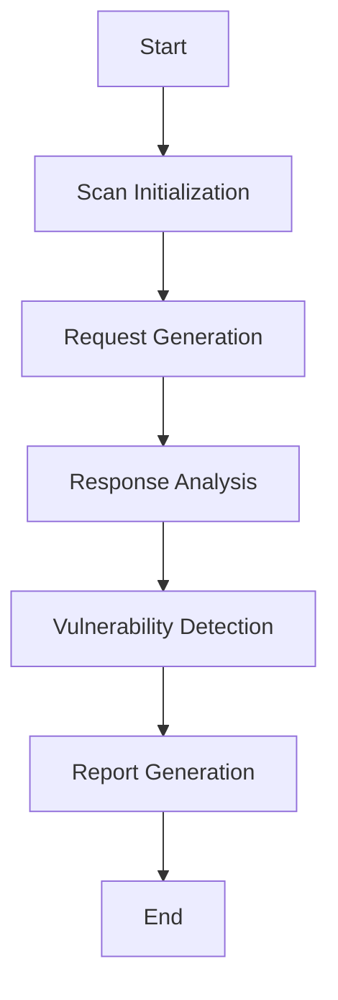

## Dynamic Application Security Testing (DAST)

### What is Dynamic Application Security Testing (DAST)?

Dynamic Application Security Testing (DAST) involves testing a running application to identify security vulnerabilities. Unlike static analysis, which examines the code without executing it, DAST interacts with the application to simulate attacks and check for weaknesses.

### Why is DAST Important?

DAST is important because:

- **Real-Time Testing**: It tests the application in real-time, providing insights into how it behaves under attack.
- **Identifies Vulnerabilities**: It identifies vulnerabilities that may not be caught by static analysis.
- **Comprehensive Coverage**: It provides comprehensive coverage by simulating various attack scenarios.

### Tools for DAST

Several tools are available for DAST, including:

- **OWASP ZAP**: An open-source web application security scanner.
- **Burp Suite**: A comprehensive toolkit for performing security testing of web applications.
- **Acunetix**: A commercial tool for web application security testing.

### Example: OWASP ZAP Scan

Let's walk through an example using OWASP ZAP to scan a web application.

```sh
zap.sh -cmd -quickurl=http://example.com
```

This command performs a quick scan on the specified web application (`http://example.com`).

#### Raw OWASP ZAP Output

```plaintext
2023-10-01 12:00:00,000 INFO [main] (Zap.java:100) - Starting ZAP...
2023-10-01 12:00:00,000 INFO [main] (Zap.java:101) - ZAP started successfully.
2023-10-01 12:00:00,000 INFO [main] (Zap.java:102) - Performing quick scan on http://example.com...
2023-10-01 12:00:00,000 INFO [main] (Zap.java:103) - Scan completed successfully.
2023-10-01 12:00:00,000 INFO [main] (Zap.java:104) - Found 5 vulnerabilities.
```

### Mermaid Diagram: DAST Workflow

A DAST workflow diagram can help visualize the process.



### Common Pitfalls in DAST

- **Incomplete Coverage**: Failing to test all relevant parts of the application can leave vulnerabilities unaddressed.
- **False Positives/Negatives**: Automated tools can generate false positives or negatives, leading to incorrect conclusions.
- **Resource Intensive**: Some scans can be resource-intensive, potentially impacting the performance of the application being scanned.

### How to Prevent/Defend Against DAST Issues

- **Regular Scans**: Schedule regular scans to catch new vulnerabilities.
- **Validation**: Validate findings manually to reduce false positives/negatives.
- **Optimization**: Optimize scans to minimize resource usage and avoid impacting production systems.

---
<!-- nav -->
[[DevSecOps/DevSecOps Bootcamp/04-Infrastructure Security/01-Automating Infrastructure Security Testing/Introduction/01-Introduction to Automating Infrastructure Security Testing|Introduction to Automating Infrastructure Security Testing]] | [[DevSecOps/DevSecOps Bootcamp/04-Infrastructure Security/01-Automating Infrastructure Security Testing/Introduction/00-Overview|Overview]] | [[DevSecOps/DevSecOps Bootcamp/04-Infrastructure Security/01-Automating Infrastructure Security Testing/Introduction/03-Implementing Automated Security Tests|Implementing Automated Security Tests]]
