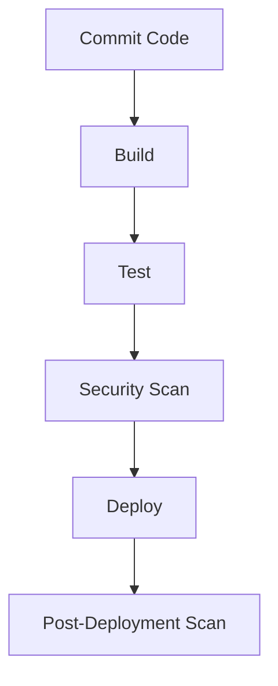

## Implementing Automated Security Tests

### What is Implementing Automated Security Tests?

Implementing automated security tests involves integrating security testing into the CI/CD pipeline to ensure that security is checked at every stage of development. This includes:

- **Code Scanning**: Integrating static analysis tools to check for vulnerabilities in the code.
- **Dependency Scanning**: Integrating tools to check for outdated or vulnerable third-party libraries.
- **Container Scanning**: Integrating tools to check for vulnerabilities in container images.
- **Infrastructure Scanning**: Integrating tools to check for vulnerabilities in the infrastructure.
- **DAST**: Integrating tools to check for vulnerabilities in the running application.

### Why is Implementing Automated Security Tests Important?

Implementing automated security tests is important because:

- **Continuous Security**: It ensures that security is checked continuously throughout the development lifecycle.
- **Early Detection**: It enables early detection of vulnerabilities, reducing the cost and complexity of fixing them.
- **Consistency**: It ensures consistency in security testing across different stages of development.

### Tools for Implementing Automated Security Tests

Several tools are available for implementing automated security tests, including:

- **SonarQube**: A static code analysis tool.
- **Snyk**: A tool for dependency scanning.
- **Trivy**: A tool for container image scanning.
- **Nmap**: A tool for infrastructure scanning.
- **OWASP ZAP**: A tool for DAST.

### Example: SonarQube Integration

Let's walk through an example of integrating SonarQube into a CI/CD pipeline.

```yaml
# .github/workflows/ci.yml
name: CI

on:
  push:
    branches: [ main ]
  pull_request:
    branches: [ main ]

jobs:
  build:
    runs-on: ubuntu-latest

    steps:
    - name: Checkout code
      uses: actions/checkout@v2

    - name: Set up JDK 11
      uses: actions/setup-java@v2
      with:
        java-version: '11'
        distribution: 'adopt'

    - name: Build with Maven
      run: mvn clean package -DskipTests

    - name: Run SonarQube Analysis
      env:
        GITHUB_TOKEN: ${{ secrets.GITHUB_TOKEN }}
        SONAR_TOKEN: ${{ secrets.SONAR_TOKEN }}
      run: |
        mvn sonar:sonar \
          -Dsonar.projectKey=my-project \
          -Dsonar.host.url=https://sonarqube.example.com \
          -Dsonar.login=${SONAR_TOKEN}
```

### Mermaid Diagram: CI/CD Pipeline with Security Tests

A CI/CD pipeline diagram can help visualize the process.



### Common Pitfalls in Implementing Automated Security Tests

- **Incomplete Coverage**: Failing to integrate all relevant security tests can leave vulnerabilities unaddressed.
- **False Positives/Negatives**: Automated tools can generate false positives or negatives, leading to incorrect conclusions.
- **Resource Intensive**: Some tests can be resource-intensive, potentially impacting the performance of the CI/CD pipeline.

### How to Prevent/Defend Against Implementation Issues

- **Regular Updates**: Keep all tools and configurations up-to-date to ensure they are catching the latest vulnerabilities.
- **Validation**: Validate findings manually to reduce false positives/negatives.
- **Optimization**: Optimize tests to minimize resource usage and avoid impacting the CI/CD pipeline.

---
<!-- nav -->
[[DevSecOps/DevSecOps Bootcamp/04-Infrastructure Security/01-Automating Infrastructure Security Testing/Introduction/02-Dynamic Application Security Testing (DAST)|Dynamic Application Security Testing (DAST)]] | [[DevSecOps/DevSecOps Bootcamp/04-Infrastructure Security/01-Automating Infrastructure Security Testing/Introduction/00-Overview|Overview]] | [[DevSecOps/DevSecOps Bootcamp/04-Infrastructure Security/01-Automating Infrastructure Security Testing/Introduction/04-Infrastructure Scanning|Infrastructure Scanning]]
