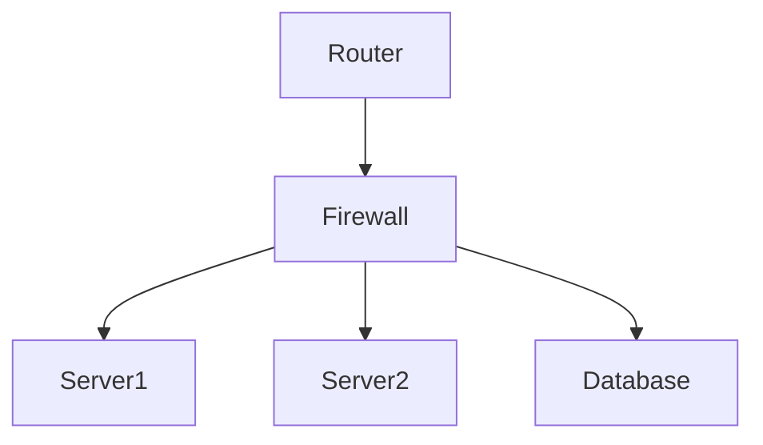

## Infrastructure Scanning

### What is Infrastructure Scanning?

Infrastructure scanning involves systematically examining the components of an IT infrastructure to identify potential security vulnerabilities and misconfigurations. These components can include servers, networks, firewalls, databases, and other services.

### Why is Infrastructure Scanning Important?

Infrastructure scanning is essential because:

- **Identifies Vulnerabilities**: It helps identify known vulnerabilities in software and hardware.
- **Detects Misconfigurations**: It detects misconfigurations that could lead to security breaches.
- **Ensures Compliance**: It ensures compliance with regulatory requirements and internal policies.
- **Reduces Risk**: It reduces the risk of security incidents by identifying and addressing issues proactively.

### Types of Infrastructure Scanning

There are two main types of infrastructure scanning:

1. **Static Scanning**: This type of scanning examines the infrastructure without interacting with it. It typically involves reviewing configuration files, network diagrams, and other static data.
2. **Dynamic Scanning**: This type of scanning involves actively interacting with the infrastructure to test its behavior and response to various inputs.

### Tools for Infrastructure Scanning

Several tools are available for infrastructure scanning, including:

- **Nmap**: A network scanning tool used to discover hosts and services on a network.
- **OpenVAS**: An open-source framework for vulnerability management.
- **Qualys**: A commercial tool for vulnerability scanning and management.
- **Tenable.io**: A cloud-based platform for vulnerability management and compliance.

### Example: Nmap Scan

Let's walk through an example using Nmap to scan a network.

```sh
nmap -sV 192.168.1.0/24
```

This command performs a version detection scan on the specified subnet (`192.168.1.0/24`). The `-sV` flag tells Nmap to try to determine the version of the services running on the target hosts.

#### Raw Nmap Output

```plaintext
Starting Nmap 7.92 ( https://nmap.org ) at 2023-10-01 12:00 UTC
Nmap scan report for 192.168.1.1
Host is up (0.00022s latency).
Not shown: 998 closed ports
PORT     STATE SERVICE VERSION
22/tcp   open  ssh     OpenSSH 8.3p1 Ubuntu 1 (Ubuntu Linux; protocol 2.0)
80/tcp   open  http    Apache httpd 2.4.41 ((Ubuntu))
MAC Address: 00:11:22:33:44:55 (Unknown)

Nmap done: 256 IP addresses (1 host up) scanned in 1.35 seconds
```

### Mermaid Diagram: Network Topology

A network topology diagram can help visualize the infrastructure being scanned.



### Common Pitfalls in Infrastructure Scanning

- **Incomplete Coverage**: Failing to scan all relevant components can leave vulnerabilities unaddressed.
- **False Positives/Negatives**: Automated tools can generate false positives or negatives, leading to incorrect conclusions.
- **Resource Intensive**: Some scans can be resource-intensive, potentially impacting the performance of the infrastructure being scanned.

### How to Prevent/Defend Against Infrastructure Scanning Issues

- **Regular Scans**: Schedule regular scans to catch new vulnerabilities and misconfigurations.
- **Validation**: Validate findings manually to reduce false positives/negatives.
- **Optimization**: Optimize scans to minimize resource usage and avoid impacting production systems.

---
<!-- nav -->
[[DevSecOps/DevSecOps Bootcamp/04-Infrastructure Security/01-Automating Infrastructure Security Testing/Introduction/03-Implementing Automated Security Tests|Implementing Automated Security Tests]] | [[DevSecOps/DevSecOps Bootcamp/04-Infrastructure Security/01-Automating Infrastructure Security Testing/Introduction/00-Overview|Overview]] | [[DevSecOps/DevSecOps Bootcamp/04-Infrastructure Security/01-Automating Infrastructure Security Testing/Introduction/05-Web Server Misconfiguration Scanning|Web Server Misconfiguration Scanning]]
