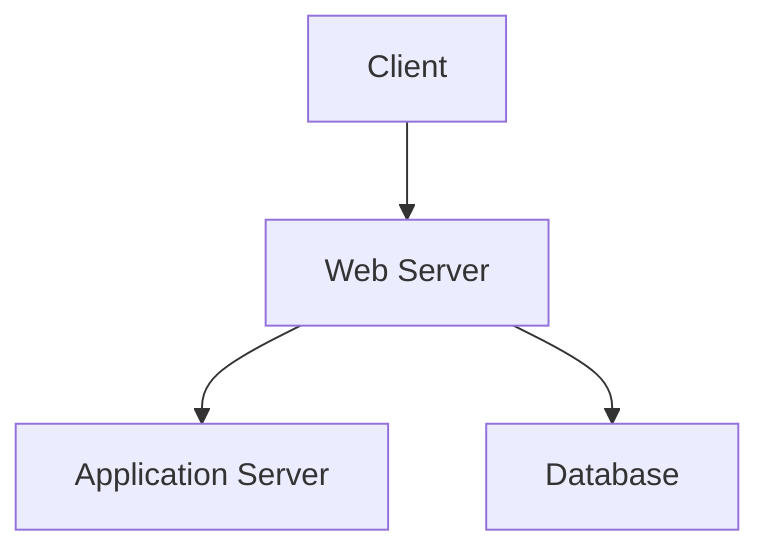

## Web Server Misconfiguration Scanning

### What is Web Server Misconfiguration Scanning?

Web server misconfiguration scanning involves checking web servers for improper settings that could lead to security vulnerabilities. Common misconfigurations include:

- **Directory Listing**: Allowing directory listings can expose sensitive information.
- **Default Credentials**: Using default credentials can make it easy for attackers to gain unauthorized access.
- **Sensitive Files**: Leaving sensitive files accessible can lead to data exposure.

### Why is Web Server Misconfiguration Scanning Important?

Misconfigured web servers can be exploited by attackers to gain unauthorized access, steal data, or launch attacks against other systems. Regularly scanning for misconfigurations helps mitigate these risks.

### Tools for Web Server Misconfiguration Scanning

Several tools are available for web server misconfiguration scanning, including:

- **Nikto**: A web server scanner that checks for over 6700 potentially dangerous files/CGIs, versions, and holes.
- **Burp Suite**: A comprehensive toolkit for performing security testing of web applications.
- **OWASP ZAP**: An open-source web application security scanner.

### Example: Nikto Scan

Let's walk through an example using Nikto to scan a web server.

```sh
nikto -h http://example.com
```

This command performs a scan on the specified web server (`http://example.com`).

#### Raw Nikto Output

```plaintext
- Nikto v2.1.6
+ Target IP:          192.168.1.10
+ Target Hostname:    example.com
+ Target Port:        80
+ Start Time:         2023-10-01 12:00:00 (GMT-4)
+ Server:             Apache/2.4.41 (Ubuntu)
+ Retrieved x-powered-by: PHP/7.4.3
+ Server leaks inodes via ETags, header found with file /robots.txt, inode=12345, size=678, mtime=2023-09-01 12:00:00
+ Server leaks inodes via ETags, header found with file /index.php, inode=12346, size=679, mtime=2023-09-01 12:00:00
+ Directory indexing is enabled on "/test/"
+ Allowed HTTP Methods: GET, HEAD, POST, OPTIONS
+ OSVDB-3231: /icons/README: Apache default file found.
+ OSVDB-3092: /server-status: Apache mod_status enabled (potential denial of service).
+ 2564 requests: 0 error(s) and 7 item(s) reported on remote host
+ End Time:           2023-10-01 12:01:00 (GMT-4) (60 seconds)
---------------------------------------------------------------------------
+ 1 host(s) tested
```

### Mermaid Diagram: Web Server Architecture

A web server architecture diagram can help visualize the components being scanned.



### Common Pitfalls in Web Server Misconfiguration Scanning

- **Incomplete Coverage**: Failing to scan all relevant directories and files can leave vulnerabilities unaddressed.
- **False Positives/Negatives**: Automated tools can generate false positives or negatives, leading to incorrect conclusions.
- **Resource Intensive**: Some scans can be resource-intensive, potentially impacting the performance of the web server being scanned.

### How to Prevent/Defend Against Web Server Misconfiguration Issues

- **Regular Scans**: Schedule regular scans to catch new misconfigurations.
- **Validation**: Validate findings manually to reduce false positives/negatives.
- **Optimization**: Optimize scans to minimize resource usage and avoid impacting production systems.

---
<!-- nav -->
[[DevSecOps/DevSecOps Bootcamp/04-Infrastructure Security/01-Automating Infrastructure Security Testing/Introduction/04-Infrastructure Scanning|Infrastructure Scanning]] | [[DevSecOps/DevSecOps Bootcamp/04-Infrastructure Security/01-Automating Infrastructure Security Testing/Introduction/00-Overview|Overview]] | [[DevSecOps/DevSecOps Bootcamp/04-Infrastructure Security/01-Automating Infrastructure Security Testing/Introduction/06-Module and Course Summary|Module and Course Summary]]
