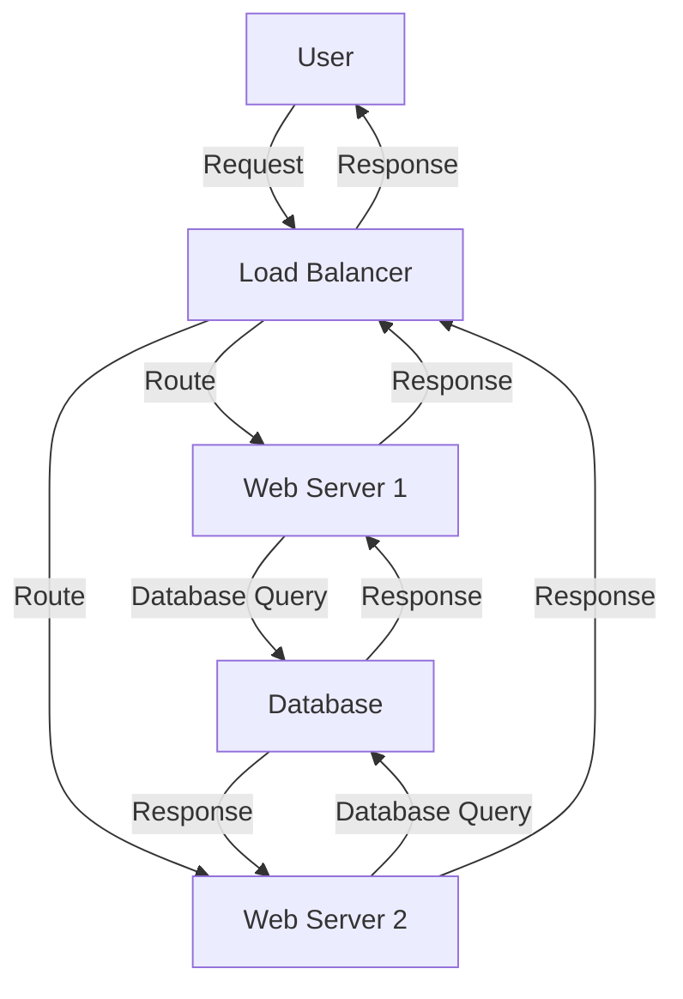

## Infrastructure as Code (IaC) and GitOps for DevSecOps

### Introduction to Infrastructure as Code (IaC)

Infrastructure as Code (IaC) is a practice of managing and provisioning computing infrastructure through machine-readable definition files, rather than physical hardware configuration or interactive configuration tools. This approach allows developers and operations teams to manage infrastructure in a more consistent, repeatable, and automated manner. By treating infrastructure as code, organizations can leverage version control systems like Git to track changes, collaborate, and roll back to previous states if necessary.

#### Why Use IaC?

1. **Consistency**: IaC ensures that environments are consistently deployed across different stages (development, testing, production). This reduces the risk of configuration drift, where environments diverge over time due to manual changes.
   
2. **Automation**: Automation is a key benefit of IaC. Once defined, infrastructure can be provisioned automatically, reducing the need for manual intervention and minimizing human error.

3. **Version Control**: Using version control systems like Git allows teams to track changes, revert to previous states, and collaborate effectively. This is particularly useful in large teams where multiple people might be working on the same infrastructure.

4. **Reproducibility**: IaC makes it easy to reproduce environments, which is crucial for testing and debugging. Developers can quickly spin up environments that mirror production, ensuring that bugs are caught early.

5. **Documentation**: IaC serves as living documentation. The code itself describes how the infrastructure is set up, making it easier for new team members to understand the environment.

### Cattle vs Pets: A Paradigm Shift in Infrastructure Management

In traditional infrastructure management, servers were often treated like pets—each one was unique and had a name, and significant effort was put into keeping them running. In contrast, the modern approach treats servers like cattle—identical and disposable. This shift is fundamental to understanding the benefits of IaC.

#### Traditional Approach: Pets

- **Unique Configuration**: Each server had its own unique configuration, making it difficult to replicate or replace.
- **Manual Maintenance**: Changes were made manually, leading to inconsistencies and potential errors.
- **High Maintenance Cost**: Significant effort was required to keep each server running, especially when issues arose.

#### Modern Approach: Cattle

- **Identical Instances**: Servers are identical and interchangeable. If one fails, it can be replaced without affecting the overall system.
- **Automated Deployment**: Changes are made through code, ensuring consistency and reducing the risk of human error.
- **Lower Maintenance Cost**: Since servers are disposable, the focus shifts from maintaining individual servers to maintaining the code that defines them.

### Example: Managing Infrastructure with IaC

Let's consider a simple example using Terraform, a popular IaC tool. We'll create a basic AWS EC2 instance.

```hcl
provider "aws" {
  region = "us-west-2"
}

resource "aws_instance" "example" {
  ami           = "ami-0c55b159cbfafe1f0"
  instance_type = "t2.micro"

  tags = {
    Name = "example-instance"
  }
}
```

This Terraform configuration defines an AWS EC2 instance. The `provider` block specifies the AWS provider and the region. The `resource` block defines the EC2 instance, including the AMI (Amazon Machine Image) and instance type.

#### Applying the Configuration

To apply the configuration, run:

```sh
terraform init
terraform apply
```

The `terraform init` command initializes the Terraform environment, and `terraform apply` applies the configuration, creating the EC2 instance.

#### Destroying the Infrastructure

If you need to destroy the infrastructure, simply run:

```sh
terraform destroy
```

This command will destroy the EC2 instance, leaving no trace behind. This is the essence of treating infrastructure like cattle—disposable and easily reproducible.

### Real-World Examples and Case Studies

#### Recent Breaches and CVEs

One notable example is the Capital One data breach in 2019, where a misconfigured firewall rule allowed unauthorized access to customer data. This breach highlights the importance of consistent and secure configuration management, which can be achieved through IaC.

#### Secure Configuration Management

To prevent such breaches, organizations should implement strict configuration management practices. This includes:

1. **Version Control**: Use version control systems to track changes and ensure that only authorized changes are made.
2. **Automated Testing**: Implement automated tests to verify that configurations meet security requirements.
3. **Least Privilege**: Ensure that configurations follow the principle of least privilege, granting only the necessary permissions.

### How to Prevent / Defend

#### Detection

1. **Monitoring**: Use monitoring tools to detect unauthorized changes to infrastructure. Tools like AWS CloudTrail can log API calls and provide alerts for suspicious activity.
2. **Configuration Drift Detection**: Use tools like Terraform's `terraform plan` to detect changes between the current state and the desired state. This helps identify unauthorized changes.

#### Prevention

1. **Immutable Infrastructure**: Treat infrastructure as immutable, meaning once deployed, it cannot be changed. Any changes require redeployment.
2. **Role-Based Access Control (RBAC)**: Implement RBAC to ensure that only authorized personnel can make changes to infrastructure.
3. **Secure Coding Practices**: Follow secure coding practices when writing IaC. This includes using parameterized inputs, validating user input, and avoiding hard-coded secrets.

#### Secure-Coding Fixes

Here’s an example of a vulnerable IaC configuration and its secure counterpart:

**Vulnerable Configuration**

```hcl
resource "aws_s3_bucket" "example" {
  bucket = "my-bucket"
  acl    = "public-read"
}
```

**Secure Configuration**

```hcl
resource "aws_s3_bucket" "example" {
  bucket = "my-bucket"
  acl    = "private"
}
```

In the secure configuration, the ACL is set to `private`, preventing public access to the S3 bucket.

### Complete Example: Full HTTP Request and Response

Consider a scenario where an application needs to interact with an external API. Here’s a complete example of an HTTP request and response:

#### HTTP Request

```http
POST /api/v1/users HTTP/1.1
Host: api.example.com
Content-Type: application/json
Authorization: Bearer <token>

{
  "username": "john_doe",
  "email": "john@example.com",
  "password": "secure_password"
}
```

#### HTTP Response

```http
HTTP/1.1 201 Created
Date: Mon, 20 Mar 2023 12:00:00 GMT
Content-Type: application/json
Content-Length: 58

{
  "id": 1,
  "username": "john_doe",
  "email": "john@example.com"
}
```

### Mermaid Diagrams

#### Infrastructure Architecture



### Hands-On Labs

For hands-on experience with IaC and GitOps, consider the following labs:

- **PortSwigger Web Security Academy**: Offers labs on securing web applications, including IaC and GitOps practices.
- **OWASP Juice Shop**: A deliberately insecure web application for practicing security skills, including IaC and GitOps.
- **CloudGoat**: A series of labs designed to help users learn about cloud security, including IaC and GitOps.

These labs provide practical experience in implementing and securing infrastructure as code, helping to solidify the concepts learned in this chapter.

### Conclusion

Infrastructure as Code (IaC) and the concept of cattle vs pets represent a paradigm shift in how infrastructure is managed. By treating infrastructure as code, organizations can achieve greater consistency, automation, and security. Understanding these concepts and implementing them effectively is crucial for modern DevSecOps practices.

---
<!-- nav -->
[[DevSecOps/DevSecOps Bootcamp/04-Infrastructure Security/02-IaC and GitOps for DevSecOps/01-Understand IaC Concept Cattle vs Pets/00-Overview|Overview]] | [[DevSecOps/DevSecOps Bootcamp/04-Infrastructure Security/02-IaC and GitOps for DevSecOps/01-Understand IaC Concept Cattle vs Pets/02-Practice Questions & Answers|Practice Questions & Answers]]
