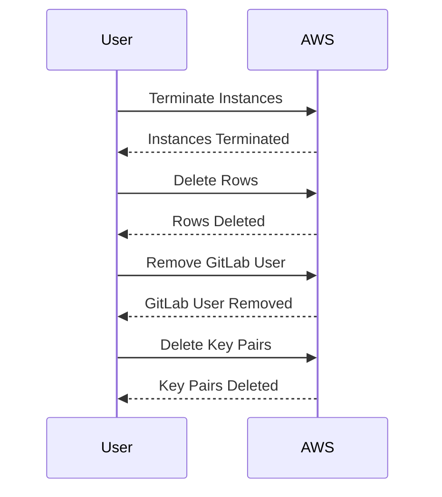

## Introduction to IaC and GitOps for DevSecOps

Infrastructure as Code (IaC) and GitOps are fundamental practices in modern DevSecOps environments. They enable teams to manage infrastructure and application deployments in a consistent, repeatable, and secure manner. This chapter delves into the process of replacing manually created infrastructure with automatically provisioned resources using Terraform, a popular IaC tool. We will cover the rationale behind this shift, the steps involved, potential pitfalls, and how to implement robust security measures throughout the process.

### What is Infrastructure as Code (IaC)?

Infrastructure as Code (IaC) is the practice of managing and provisioning computer data centers through machine-readable definition files, rather than physical hardware configuration or interactive configuration tools. This approach allows infrastructure to be treated as code, enabling version control, collaboration, and automated testing.

#### Why Use IaC?

- **Consistency**: Ensures that infrastructure is consistently deployed across different environments (development, staging, production).
- **Repeatability**: Automates the deployment process, reducing human error.
- **Version Control**: Allows tracking changes to infrastructure configurations over time.
- **Collaboration**: Facilitates teamwork by allowing multiple developers to contribute to infrastructure definitions.
- **Auditability**: Provides a clear history of changes, making it easier to audit and understand the infrastructure.

### What is GitOps?

GitOps is an operational framework that uses Git as a single source of truth for all infrastructure and application configurations. It extends the principles of IaC by incorporating continuous integration and delivery (CI/CD) practices to ensure that the desired state of the system is always reflected in the Git repository.

#### Why Use GitOps?

- **Centralized Management**: All infrastructure and application configurations are stored in a centralized Git repository.
- **Automated Deployment**: Changes to the Git repository trigger automated deployment pipelines.
- **Continuous Validation**: Ensures that the actual state of the system matches the desired state defined in the Git repository.
- **Rollback Mechanism**: Simplifies rollback processes by reverting to previous versions in the Git repository.

### Transitioning from Manual to Automated Infrastructure

The transition from manually created infrastructure to automatically provisioned resources is a significant step towards achieving a more efficient and secure DevSecOps environment. This section outlines the process of cleaning up existing manually created resources and setting up automated provisioning using Terraform.

#### Step-by-Step Process

1. **Clean Up Existing Resources**
2. **Provision New Resources Using Terraform**
3. **Verify the New State**

### Cleaning Up Existing Resources

Before transitioning to automated provisioning, it is crucial to clean up all existing manually created resources. This ensures that the new infrastructure is completely managed by the automation scripts.

#### Manual Cleanup Steps

1. **Terminate Instances**
2. **Delete Rows**
3. **Remove GitLab User**
4. **Delete Key Pairs**



#### Example of Deleting Resources in AWS

To illustrate the process, consider the following example of deleting resources in AWS using the AWS Management Console:

1. **Terminating Instances**:
   - Navigate to the EC2 Dashboard.
   - Select the instances to terminate.
   - Click "Actions" > "Instance State" > "Terminate".

2. **Deleting Rows**:
   - Navigate to the RDS Dashboard.
   - Select the database instances to delete.
   - Click "Actions" > "Delete".

3. **Removing GitLab User**:
   - Navigate to the GitLab dashboard.
   - Go to the Users section.
   - Select the user to remove.
   - Click "Remove".

4. **Deleting Key Pairs**:
   - Navigate to the EC2 Dashboard.
   - Go to the Key Pairs section.
   - Select the key pairs to delete.
   - Click "Delete".

### Provisioning New Resources Using Terraform

Once the existing resources are cleaned up, the next step is to provision new resources using Terraform. Terraform is an open-source infrastructure as code tool that enables you to define and provision your infrastructure using declarative configuration files.

#### Setting Up Terraform

1. **Install Terraform**: Ensure Terraform is installed on your local machine.
2. **Initialize Terraform**: Run `terraform init` to initialize the Terraform working directory.
3. **Define Resources**: Create Terraform configuration files (`*.tf`) to define the desired infrastructure.

#### Example Terraform Configuration

Here is an example of a Terraform configuration file (`main.tf`) to create an EC2 instance:

```hcl
provider "aws" {
  region = "us-west-2"
}

resource "aws_instance" "example" {
  ami           = "ami-0c55b159cbfafe1f0"
  instance_type = "t2.micro"

  tags = {
    Name = "example-instance"
  }
}
```

#### Running Terraform

1. **Plan**: Run `terraform plan` to preview the changes that will be made.
2. **Apply**: Run `terraform apply` to apply the changes and provision the resources.

### Verifying the New State

After provisioning the new resources, it is essential to verify that the new state matches the desired state. This ensures that the transition was successful and that the new infrastructure is functioning correctly.

#### Verification Steps

1. **Check EC2 Instances**: Verify that the new EC2 instances are running and accessible.
2. **Check Database Instances**: Verify that the new database instances are up and running.
3. **Check Application Pipeline**: Ensure that the application pipeline works without any issues.

### Potential Pitfalls and How to Prevent Them

Transitioning from manual to automated infrastructure can introduce several challenges. Here are some common pitfalls and how to prevent them:

#### Pitfall 1: Forgetting to Clean Up Resources

**Prevention**:
- Use Terraform's `destroy` command to ensure all resources are properly cleaned up.
- Implement automated cleanup scripts to handle this process.

#### Pitfall 2: Human Error During Manual Cleanup

**Prevention**:
- Use automated scripts to perform cleanup tasks.
- Implement checks to ensure all resources are properly deleted.

#### Pitfall 3: Inconsistent State Between Desired and Actual State

**Prevention**:
- Use GitOps practices to ensure the actual state matches the desired state.
- Implement continuous validation to detect discrepancies.

### Real-World Examples and Recent Breaches

Recent breaches and vulnerabilities highlight the importance of proper infrastructure management. For example, the Capital One breach in 2019 exposed sensitive customer data due to misconfigured infrastructure. Proper use of IaC and GitOps could have prevented such incidents by ensuring consistent and secure infrastructure configurations.

### Secure Coding Practices

To ensure the security of your infrastructure, follow these secure coding practices:

1. **Use Least Privilege Principle**: Grant minimal permissions necessary for operations.
2. **Implement Access Controls**: Use IAM roles and policies to restrict access.
3. **Enable Logging and Monitoring**: Monitor infrastructure for suspicious activities.
4. **Regularly Audit Configurations**: Perform regular audits to detect and fix security issues.

#### Example of Secure IAM Policy

Here is an example of a secure IAM policy:

```json
{
  "Version": "2012-10-17",
  "Statement": [
    {
      "Effect": "Allow",
      "Action": [
        "ec2:DescribeInstances",
        "ec2:StartInstances",
        "ec2:StopInstances"
      ],
      "Resource": "*"
    },
    {
      "Effect": "Deny",
      "Action": [
        "ec2:TerminateInstances"
      ],
      "Resource": "*"
    }
  ]
}
```

### Detection and Prevention Strategies

To detect and prevent security issues, implement the following strategies:

1. **Continuous Integration and Delivery (CI/CD)**: Use CI/CD pipelines to automate testing and deployment.
2. **Security Scanning Tools**: Integrate security scanning tools like Trivy or tfsec to detect vulnerabilities.
3. **Regular Audits**: Perform regular audits to ensure compliance with security policies.

#### Example of tfsec Scan

Here is an example of running tfsec to scan Terraform configurations:

```sh
$ tfsec .
```

### Hands-On Labs

To gain practical experience with IaC and GitOps, consider the following hands-on labs:

- **PortSwigger Web Security Academy**: Offers labs on web application security.
- **OWASP Juice Shop**: A deliberately insecure web application for security training.
- **DVWA (Damn Vulnerable Web Application)**: A PHP/MySQL web application that demonstrates web application vulnerabilities.
- **WebGoat**: An interactive, gamified training application for learning about web application security.

### Conclusion

Transitioning from manually created infrastructure to automatically provisioned resources using Terraform and GitOps is a critical step in modern DevSecOps environments. By following the steps outlined in this chapter, you can ensure a smooth and secure transition. Remember to implement robust security measures and regularly audit your infrastructure to maintain a high level of security.

By mastering these concepts, you will be well-equipped to manage complex infrastructure in a consistent, repeatable, and secure manner.

---
<!-- nav -->
[[DevSecOps/DevSecOps Bootcamp/04-Infrastructure Security/02-IaC and GitOps for DevSecOps/05-Replace Manually Created Infrastructure with Automatically Provisioned Resources/00-Overview|Overview]] | [[02-Introduction to Infrastructure as Code (IaC) and GitOps|Introduction to Infrastructure as Code (IaC) and GitOps]]
