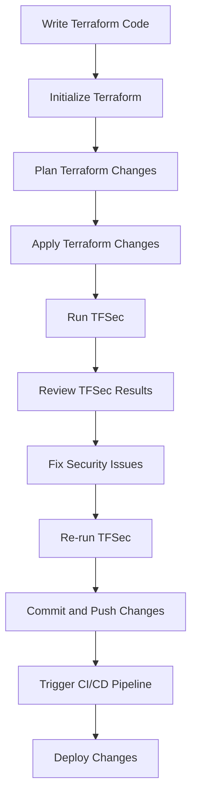

## Introduction to IaC and GitOps for DevSecOps

Infrastructure as Code (IaC) and GitOps are fundamental practices in modern DevSecOps environments. IaC allows developers and operations teams to manage and provision infrastructure through machine-readable definition files, rather than physical hardware configuration or interactive configuration tools. GitOps extends this by using Git as a single source of truth for all infrastructure configurations, enabling automated deployment pipelines and continuous integration/continuous delivery (CI/CD).

### What is IaC?

**Definition**: Infrastructure as Code (IaC) is the practice of managing and provisioning computer data centers through machine-readable definition files, rather than physical hardware configuration. This approach allows for automation, consistency, and version control of infrastructure configurations.

**Why IaC Matters**: 
- **Consistency**: Ensures that all environments (development, testing, production) are identical, reducing the risk of environment-specific bugs.
- **Automation**: Automates the provisioning and management of infrastructure, reducing human error and increasing efficiency.
- **Version Control**: Allows tracking changes to infrastructure configurations, making it easier to revert to previous states if something goes wrong.

**How IaC Works**:
- **Definition Files**: Infrastructure is defined using declarative languages like Terraform, Ansible, or CloudFormation.
- **Provisioning Tools**: Tools like Terraform read these definition files and apply the necessary changes to the infrastructure.
- **Version Control Systems**: Definition files are stored in version control systems like Git, allowing for collaboration and history tracking.

### What is GitOps?

**Definition**: GitOps is a set of practices that uses Git as a single source of truth for all infrastructure configurations. It leverages Git's features to manage and deploy infrastructure changes.

**Why GitOps Matters**:
- **Single Source of Truth**: Centralizes all infrastructure definitions in a Git repository, ensuring everyone is working from the same source.
- **Automated Deployment**: Integrates with CI/CD pipelines to automatically deploy changes when they are merged into the main branch.
- **Auditability**: Provides a clear audit trail of all changes made to the infrastructure, improving traceability and accountability.

**How GitOps Works**:
- **Git Repository**: All infrastructure definitions are stored in a Git repository.
- **CI/CD Pipelines**: Automated pipelines monitor the Git repository and trigger deployments when changes are pushed.
- **Convergence**: Tools like Flux or Argo CD ensure that the actual state of the infrastructure matches the desired state defined in the Git repository.

### Integrating Automated Security Scans into Terraform Infrastructure Code

When integrating automated security scans into Terraform infrastructure code, the goal is to catch potential security vulnerabilities early in the development process. This ensures that the infrastructure is secure before it is deployed.

#### Setting Up a Terraform Project

Let's start by setting up a basic Terraform project. Terraform is a popular IaC tool that allows you to define and provision infrastructure using declarative configuration files.

```hcl
# main.tf
provider "aws" {
  region = "us-west-2"
}

resource "aws_instance" "example" {
  ami           = "ami-0c55b159cbfafe1f0"
  instance_type = "t2.micro"
}
```

This `main.tf` file defines an AWS provider and an EC2 instance resource. The `provider` block specifies the AWS region, and the `resource` block defines an EC2 instance with a specific AMI and instance type.

#### Running Terraform Commands

To initialize and apply the Terraform configuration, run the following commands:

```bash
terraform init
terraform apply
```

The `terraform init` command initializes the Terraform working directory, downloading any necessary plugins and modules. The `terraform apply` command applies the configuration, creating the specified resources in the AWS account.

#### Adding Automated Security Scans

To integrate automated security scans into the Terraform project, we can use tools like TFSec. TFSec is a static analysis tool that checks Terraform code for security issues.

##### Installing TFSec

First, install TFSec by following the instructions on the [TFSec GitHub page](https://github.com/aquasecurity/tfsec).

##### Running TFSec

Run TFSec on the Terraform project to scan for security issues:

```bash
tfsec .
```

This command will analyze the Terraform code and report any security issues it finds.

### Example of a Security Issue Found by TFSec

Suppose TFSec reports a security issue related to the EC2 instance configuration. For example, it might flag the lack of a security group or an overly permissive security group.

#### Vulnerable Configuration

```hcl
# main.tf
resource "aws_instance" "example" {
  ami           = "ami-0c55b159cbfafe1f0"
  instance_type = "t2.micro"
}
```

#### Secure Configuration

To address this issue, we can add a security group to the EC2 instance configuration:

```hcl
# main.tf
resource "aws_security_group" "example" {
  name        = "example-sg"
  description = "Example security group"

  ingress {
    from_port   = 22
    to_port     = 22
    protocol    = "tcp"
    cidr_blocks = ["0.0.0.0/0"]
  }
}

resource "aws_instance" "example" {
  ami           = "ami-0c55b159cbfafe1f0"
  instance_type = "t2.micro"
  vpc_security_group_ids = [aws_security_group.example.id]
}
```

In this secure configuration, we define a security group (`aws_security_group`) and associate it with the EC2 instance (`aws_instance`). The security group allows SSH access from any IP address (`0.0.0.0/0`), which is generally not recommended for production environments. In a real-world scenario, you would restrict access to specific IP addresses or ranges.

### How to Prevent / Defend Against Security Issues

#### Detection

Use tools like TFSec to detect security issues in your Terraform code. These tools can help identify potential vulnerabilities before they are deployed.

#### Prevention

1. **Secure Configuration**: Ensure that all infrastructure configurations are secure by default. Use security groups, IAM roles, and other security mechanisms to restrict access and permissions.
2. **Code Reviews**: Implement code reviews for infrastructure configurations to catch potential security issues before they are deployed.
3. **Automated Testing**: Integrate automated security testing into your CI/CD pipelines to ensure that security issues are caught early in the development process.

#### Secure Coding Fixes

Compare the vulnerable and secure configurations side by side to understand the changes needed to address security issues.

**Vulnerable Configuration**

```hcl
# main.tf
resource "aws_instance" "example" {
  ami           = "ami-0c55b159cbfafe1f0"
  instance_type = "t2.micro"
}
```

**Secure Configuration**

```hcl
# main.tf
resource "aws_security_group" "example" {
  name        = "example-sg"
  description = "Example security group"

  ingress {
    from_port   = 22
    to_port     = .2
    protocol    = "tcp"
    cidr_blocks = ["0.0.0.0/0"]
  }
}

resource "aws_instance" "example" {
  ami           = "ami-0c55b159cbfafe1f0"
  instance_type = "t2.micro"
  vpc_security_group_ids = [aws_security_group.example.id]
}
```

### Real-World Examples and Recent Breaches

Recent breaches and CVEs highlight the importance of securing infrastructure configurations. For example, the Capital One breach in 2019 was caused by a misconfigured AWS S3 bucket, which allowed unauthorized access to sensitive customer data.

#### CVE Example

CVE-2021-39293: A misconfiguration in an AWS S3 bucket allowed unauthorized access to sensitive data. This type of vulnerability can be prevented by using tools like TFSec to detect and fix misconfigurations in Terraform code.

### Mermaid Diagrams

#### Terraform Workflow Diagram



This diagram illustrates the workflow for integrating automated security scans into a Terraform project. The process starts with writing Terraform code, initializing Terraform, planning changes, applying changes, running TFSec, reviewing results, fixing issues, re-running TFSec, committing and pushing changes, triggering a CI/CD pipeline, and deploying changes.

### Complete Example with Full HTTP Requests and Responses

#### Full HTTP Request and Response

```http
POST /api/v1/terraform/apply HTTP/1.1
Host: example.com
Content-Type: application/json
Authorization: Bearer <token>

{
  "project": "my-project",
  "changes": [
    {
      "resource": "aws_instance.example",
      "action": "create",
      "attributes": {
        "ami": "ami-0c55b159cbfafe1f0",
        "instance_type": "t2.micro"
      }
    }
  ]
}
```

```http
HTTP/1.1 200 OK
Date: Mon, 23 Jan 2023 12:00:00 GMT
Content-Type: application/json

{
  "status": "success",
  "message": "Terraform changes applied successfully",
  "result": {
    "project": "my-project",
    "changes": [
      {
        "resource": "aws_instance.example",
        "action": "create",
        "attributes": {
          "ami": "ami-0c55b159cbfafe1f0",
          "instance_type": "t2.micro"
        }
      }
    ]
  }
}
```

This example shows a full HTTP request and response for applying Terraform changes via an API. The request includes the project name and the changes to be applied, and the response confirms the success of the operation.

### Hands-On Labs

For hands-on practice with integrating automated security scans into Terraform infrastructure code, consider the following labs:

- **PortSwigger Web Security Academy**: Offers a series of labs focused on web application security, including IaC and GitOps practices.
- **OWASP Juice Shop**: A deliberately insecure web application for practicing web security skills, including IaC and GitOps.
- **DVWA (Damn Vulnerable Web Application)**: Another intentionally vulnerable web application for learning web security, including IaC and GitOps.
- **WebGoat**: An interactive training application for learning about web application security, including IaC and GitOps.

These labs provide practical experience in integrating automated security scans into Terraform infrastructure code, helping you master the skills needed for DevSecOps.

By following these steps and best practices, you can ensure that your infrastructure is secure and compliant with industry standards.

---
<!-- nav -->
[[02-Introduction to IaC and GitOps for DevSecOps Part 1|Introduction to IaC and GitOps for DevSecOps Part 1]] | [[DevSecOps/DevSecOps Bootcamp/04-Infrastructure Security/02-IaC and GitOps for DevSecOps/Add Automated Security Scan to TF Infrastructure Code/00-Overview|Overview]] | [[04-Introduction to IaC and GitOps for DevSecOps Part 3|Introduction to IaC and GitOps for DevSecOps Part 3]]
