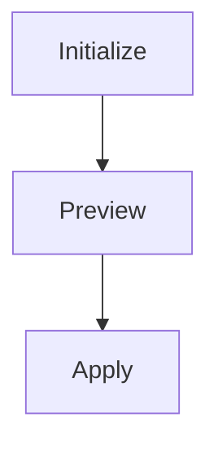
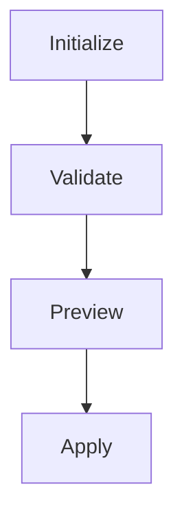
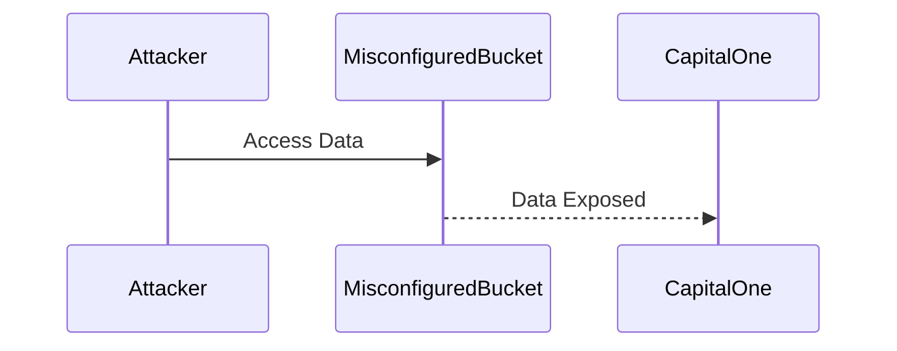

## Introduction to IaC and GitOps for DevSecOps

In the realm of modern software development, Infrastructure as Code (IaC) and GitOps have become essential practices for ensuring consistency, reliability, and security across the entire lifecycle of an application. This chapter delves into integrating automated security scans into your Terraform infrastructure code, transforming your basic IaC pipeline into a robust DevSecOps pipeline.

### What is Infrastructure as Code (IaC)?

Infrastructure as Code (IaC) is the practice of managing and provisioning computer data centers through machine-readable definition files, rather than physical hardware configuration or interactive configuration tools. This approach allows developers and operations teams to manage infrastructure in a more consistent and repeatable manner, reducing human error and increasing efficiency.

#### Why Use IaC?

- **Consistency**: Ensures that environments are consistently configured.
- **Reproducibility**: Allows you to recreate environments easily.
- **Version Control**: Enables tracking changes to infrastructure configurations.
- **Automation**: Facilitates automation of infrastructure management tasks.

### What is GitOps?

GitOps is a set of practices that uses Git as a single source of truth for all infrastructure and application configurations. It leverages Git's powerful features, such as branching, merging, and pull requests, to manage infrastructure changes in a controlled and auditable manner.

#### Why Use GitOps?

- **Centralized Management**: All infrastructure configurations are stored in a central Git repository.
- **Auditing and Compliance**: Changes are tracked and auditable.
- **Collaboration**: Teams can collaborate on infrastructure changes using familiar Git workflows.
- **Rollback Mechanism**: Easy rollback to previous states if something goes wrong.

### Integrating Automated Security Scans into Terraform

To transform your basic IaC pipeline into a DevSecOps pipeline, you need to integrate automated security scans into your Terraform infrastructure code. This ensures that your infrastructure is not only provisioned correctly but also adheres to security best practices.

#### Basic Pipeline Setup

Before diving into security scans, let's review the basic pipeline setup for a Terraform project:

1. **Initialize**: Set up the Terraform environment.
2. **Preview**: Review the changes that will be applied.
3. **Apply**: Apply the changes to the infrastructure.



#### Adding Validation and Security Checks

In DevSecOps, we want to automate validations and security checks for our infrastructure code. This ensures that the infrastructure is not only provisioned correctly but also adheres to security best practices.

##### Step 1: Add a Validate Stage

The first step is to add a validation stage to your pipeline. This stage will run before the preview and apply stages to ensure that the changes are valid and secure.



##### Step 2: Run `terraform validate` Command

Terraform provides a built-in command called `terraform validate` that checks the syntax and structure of your Terraform configuration files. This command helps catch common errors and ensures that your configuration files are syntactically correct.

```bash
terraform validate
```

This command will output any errors found in the configuration files. If no errors are found, it will indicate that the configuration files are valid.

#### Handling Failures Gracefully

It's important to handle failures gracefully in your pipeline. You want to know if there are any issues, but you also want to keep the pipeline running even if the `terraform validate` command fails. This is because the command may find false positives, and you don't want the pipeline to fail prematurely.

```yaml
jobs:
  - name: Initialize
    steps:
      - run: terraform init

  - name: Validate
    steps:
      - run: terraform validate
        allow_failure: true

  - name: Preview
    steps:
      - run: terraform plan

  - name: Apply
    steps:
      - run: terraform apply --auto-approve
```

### Real-World Examples and Recent Breaches

Recent breaches and vulnerabilities have highlighted the importance of integrating security into your IaC pipeline. For example, the Capital One breach in 2019 was caused by misconfigured AWS S3 buckets. This breach could have been prevented if the organization had integrated automated security scans into their IaC pipeline.

#### Example: Capital One Breach

In July 2019, Capital One announced a data breach that exposed sensitive information of approximately 100 million customers. The breach was caused by a misconfigured AWS S3 bucket, which allowed unauthorized access to customer data.



### How to Prevent / Defend

To prevent similar breaches, organizations should integrate automated security scans into their IaC pipeline. This includes:

1. **Automated Security Scans**: Use tools like Terrascan, Checkov, or tfsec to scan your Terraform configurations for security issues.
2. **Policy Enforcement**: Implement policies to enforce security best practices, such as least privilege access and encryption.
3. **Regular Audits**: Conduct regular audits of your infrastructure to identify and remediate security issues.

#### Example: Using Terrascan

Terrascan is a popular open-source tool that scans Terraform configurations for security issues. Here’s how you can integrate Terrascan into your pipeline:

1. **Install Terrascan**:
   ```bash
   curl -sSL https://get.terrascan.io | sh
   ```

2. **Run Terrascan**:
   ```bash
   terrascan scan --config-dir .
   ```

3. **Integrate into Pipeline**:
   ```yaml
   jobs:
     - name: Initialize
       steps:
         - run: terraform init

     - name: Validate
       steps:
         - run: terraform validate
           allow_failure: true
         - run: terrascan scan --config-dir .

     - name: Preview
       steps:
         - run: terraform plan

     - name: Apply
       steps:
         - run: terraform apply --auto-approve
   ```

### Common Pitfalls and Best Practices

#### Common Pitfalls

1. **Ignoring False Positives**: While it's important to handle failures gracefully, ignoring false positives can lead to security issues being overlooked.
2. **Incomplete Scans**: Ensure that your security scans cover all aspects of your infrastructure, including network configurations, IAM policies, and resource permissions.
3. **Manual Overrides**: Avoid manual overrides of security policies. Instead, use automated tools to enforce security best practices.

#### Best Practices

1. **Use Multiple Tools**: Use multiple security scanning tools to ensure comprehensive coverage.
2. **Regular Updates**: Keep your security scanning tools and policies up to date with the latest security best practices.
3. **Documentation**: Document your security policies and procedures to ensure that everyone on the team understands the importance of security.

### Hands-On Labs

To gain practical experience with integrating automated security scans into your Terraform infrastructure code, consider the following hands-on labs:

- **PortSwigger Web Security Academy**: Offers a variety of labs focused on web application security, including IaC and GitOps.
- **OWASP Juice Shop**: A deliberately insecure web application for security training.
- **DVWA (Damn Vulnerable Web Application)**: A PHP/MySQL web application that is riddled with vulnerabilities for educational purposes.
- **WebGoat**: An interactive, gamified security training application.

These labs provide a safe environment to practice and learn about integrating security into your IaC pipeline.

### Conclusion

Integrating automated security scans into your Terraform infrastructure code is a crucial step in transforming your basic IaC pipeline into a robust DevSecOps pipeline. By adding validation and security checks, you can ensure that your infrastructure is not only provisioned correctly but also adheres to security best practices. This chapter has provided a comprehensive guide to achieving this, including background theory, recent real-world examples, complete code, mermaid diagrams, pitfalls, and a clear 'How to Prevent / Defend' section.

---
<!-- nav -->
[[04-Introduction to IaC and GitOps for DevSecOps Part 3|Introduction to IaC and GitOps for DevSecOps Part 3]] | [[DevSecOps/DevSecOps Bootcamp/04-Infrastructure Security/02-IaC and GitOps for DevSecOps/Add Automated Security Scan to TF Infrastructure Code/00-Overview|Overview]] | [[06-Adding Automated Security Scans to Terraform Infrastructure Code|Adding Automated Security Scans to Terraform Infrastructure Code]]
