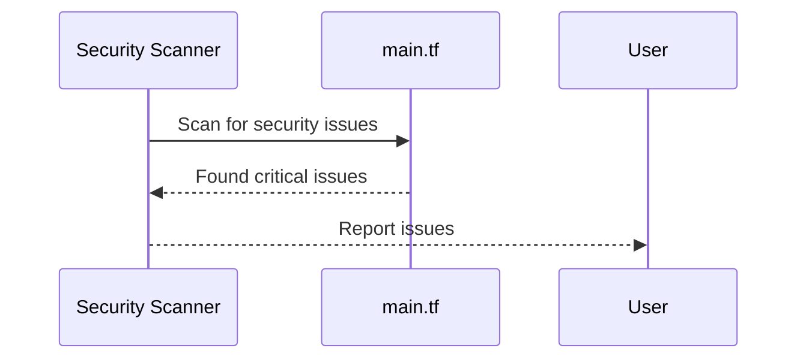

## Infrastructure as Code (IaC) and GitOps for DevSecOps

### Introduction to IaC and GitOps

Infrastructure as Code (IaC) is a practice where infrastructure is defined using declarative configuration files rather than manual processes. This allows for automation, consistency, and version control of infrastructure changes. GitOps is an extension of IaC that uses Git as a single source of truth for all infrastructure configurations. This approach ensures that all changes are tracked, reviewed, and deployed in a controlled manner.

### Automated Security Scans in IaC

Automated security scans are essential in ensuring that the infrastructure defined in IaC is secure. These scans can identify vulnerabilities, misconfigurations, and compliance issues before they are deployed to production environments. In the context of Terraform (TF), security scans can be integrated into the CI/CD pipeline to automatically check the infrastructure code for security issues.

#### Example: False Positives in Security Scans

Let's consider a scenario where a security scan identifies several issues in a Terraform configuration file (`main.tf`). One of the critical issues identified is related to the exposure of an application port to the public internet.



In the `main.tf` file, at line 173, the configuration allows ingress traffic from the public internet to the application port:

```hcl
resource "aws_security_group" "app_sg" {
  name        = "app-sg"
  description = "Security Group for Application"

  ingress {
    from_port   = 80
    to_port     = 80
    protocol    = "tcp"
    cidr_blocks = ["0.0.0.0/0"]
  }
}
```

This configuration exposes the application port to the public internet, which is flagged as a critical issue by the security scanner. However, this might be a false positive if the application is intended to be publicly accessible.

### Handling False Positives

To handle false positives, the security scanner can be configured with additional context. This can be done by providing rules or annotations that specify certain configurations as exceptions.

#### Example: Configuring Security Scanner to Handle False Positives

Suppose we want to configure the security scanner to recognize that the public access to the application port is intentional. We can add a comment or annotation in the Terraform configuration file to indicate this:

```hcl
resource "aws_security_group" "app_sg" {
  name        = "app-sg"
  description = "Security Group for Application"

  ingress {
    from_port   = 80
    to_port     = 80
    protocol    = "tcp"
    cidr_blocks = ["0.0.0.0/0"]
    # This is a public-facing web server, so public access is intentional
  }
}
```

Additionally, we can configure the security scanner to ignore this specific rule:

```json
{
  "rules": [
    {
      "id": "public-access",
      "ignore": true,
      "description": "Public access to web server is intentional"
    }
  ]
}
```

### Additional Critical Issues

The security scan also identified other critical issues related to security groups and other configurations. For example, another critical issue might be related to the lack of VPC flow logs.

#### Example: Enabling VPC Flow Logs

VPC flow logs provide detailed information about the network traffic within a VPC. Enabling VPC flow logs can help in monitoring and troubleshooting network issues.

To enable VPC flow logs, we can modify the Terraform configuration as follows:

```hcl
resource "aws_vpc" "example" {
  cidr_block = "10.0.0.0/16"
}

resource "aws_flow_log" "example" {
  iam_role_arn = aws_iam_role.flow_log.arn
  log_destination_type = "cloud-watch-logs"
  traffic_type = "ALL"
  vpc_id = aws_vpc.example.id
}
```

### Generating Reports and Saving Artifacts

After running the security scan, it is important to generate a report and save it as an artifact. This report can be used for auditing purposes and to track the progress of security improvements over time.

#### Example: Generating and Saving Reports

The security scan tool can generate a report in various formats such as JSON, HTML, or CSV. This report can be saved as an artifact in the CI/CD pipeline.

```bash
# Run security scan and generate report
tfsec . --format json > security_report.json

# Save report as an artifact
echo "Uploading security_report.json as an artifact..."
```

### Real-World Examples and Recent Breaches

Recent breaches and CVEs highlight the importance of automated security scans in IaC. For example, the Capital One breach in 2019 was partly due to misconfigured security groups in AWS, which allowed unauthorized access to sensitive data. By integrating automated security scans into the CI/CD pipeline, such misconfigurations can be detected and remediated before deployment.

### How to Prevent / Defend

#### Detection

To detect security issues in IaC, integrate automated security scanners into the CI/CD pipeline. Tools like `tfsec`, `checkov`, and `tflint` can be used to scan Terraform configurations for security issues.

#### Prevention

Prevent security issues by configuring the security scanner to handle false positives and by enabling features like VPC flow logs. Ensure that all security configurations are reviewed and approved before deployment.

#### Secure Coding Fixes

Compare the vulnerable and secure versions of the Terraform configuration:

**Vulnerable Configuration:**

```hcl
resource "aws_security_group" "app_sg" {
  name        = "app-sg"
  description = "Security Group for Application"

  ingress {
    from_port   = 80
    to_port     = 80
    protocol    = "tcp"
    cidr_blocks = ["0.0.0.0/0"]
  }
}
```

**Secure Configuration:**

```hcl
resource "aws_security_group" "app_sg" {
  name        = "app-sg"
  description = "Security Group for Application"

  ingress {
    from_port   = 80
    to_port     = 80
    protocol    = "tcp"
    cidr_blocks = ["0.0.0.0/0"]
    # This is a public-facing web server, so public access is intentional
  }
}
```

### Conclusion

Integrating automated security scans into the IaC and GitOps workflow is crucial for maintaining the security of infrastructure configurations. By handling false positives, enabling features like VPC flow logs, and generating comprehensive reports, organizations can ensure that their infrastructure is secure and compliant. Real-world examples and recent breaches underscore the importance of these practices.

### Practice Labs

For hands-on experience with IaC and GitOps for DevSecOps, consider the following labs:

- **PortSwigger Web Security Academy**: Focuses on web application security but includes modules on IaC and GitOps.
- **OWASP Juice Shop**: A deliberately insecure web application for practicing security testing and IaC.
- **CloudGoat**: A set of vulnerable AWS environments for learning cloud security and IaC.

These labs provide practical experience in integrating security scans into IaC and GitOps workflows.

---
<!-- nav -->
[[06-Adding Automated Security Scans to Terraform Infrastructure Code|Adding Automated Security Scans to Terraform Infrastructure Code]] | [[DevSecOps/DevSecOps Bootcamp/04-Infrastructure Security/02-IaC and GitOps for DevSecOps/Add Automated Security Scan to TF Infrastructure Code/00-Overview|Overview]] | [[08-Integrating Automated Security Scans into IaC|Integrating Automated Security Scans into IaC]]
