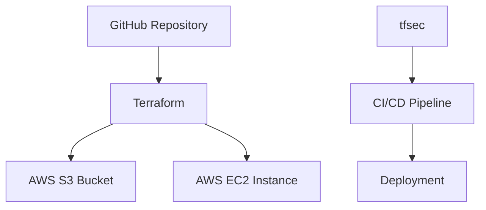

## Integrating Automated Security Scans into IaC

### Importance of Automated Security Scans

Automated security scans are essential in DevSecOps to identify potential security vulnerabilities and misconfigurations in infrastructure as code. These scans help ensure that the infrastructure is secure before it is deployed, reducing the risk of security breaches.

### Tools for Automated Security Scans

Several tools are available for performing automated security scans on IaC:

- **Terraform Security Scanner (tfsec)**: A static analysis tool that identifies security issues in Terraform code.
  
- **InSpec**: A testing framework that allows you to define compliance tests for infrastructure.
  
- **Trivy**: A vulnerability scanner that can be integrated into CI/CD pipelines to scan for known vulnerabilities in dependencies.

- **Checkov**: An open-source static code analysis tool that supports multiple IaC formats, including Terraform, CloudFormation, and Kubernetes.

### Example: Using tfsec with Terraform

Let's walk through an example of integrating `tfsec` into a Terraform-based IaC pipeline.

#### Step 1: Define Infrastructure in Terraform

First, create a Terraform configuration file (`main.tf`) that defines the infrastructure:

```hcl
provider "aws" {
  region = "us-west-2"
}

resource "aws_s3_bucket" "example" {
  bucket = "my-example-bucket"
  acl    = "public-read"
}
```

This configuration creates an S3 bucket with public read access.

#### Step 2: Install tfsec

Install `tfsec` using a package manager or download it from the official repository:

```sh
# Using Homebrew (macOS)
brew install tfsec

# Using Chocolatey (Windows)
choco install tfsec

# Using apt (Linux)
sudo apt-get install tfsec
```

#### Step 3: Run tfsec

Run `tfsec` to scan the Terraform configuration:

```sh
tfsec .
```

The output will show any security issues found in the configuration:

```plaintext
[INFO] Analyzing main.tf
[WARNING] aws_s3_bucket.example: S3 Bucket Public Access: The S3 bucket is configured with public read access. This could potentially expose sensitive data to unauthorized users. (https://docs.bridgecrew.io/remediation-guides/terraform/aws/aws_s3_bucket_public_access)
```

#### Step 4: Fix Security Issues

Based on the findings, modify the Terraform configuration to address the security issue:

```hcl
resource "aws_s3_bucket" "example" {
  bucket = "my-example-bucket"
  acl    = "private"
}
```

Set the ACL to `private` to restrict access to the bucket.

#### Step 5: Integrate tfsec into CI/CD Pipeline

To ensure that security scans are performed automatically, integrate `tfsec` into the CI/CD pipeline. Here’s an example using GitHub Actions:

```yaml
name: Terraform Security Scan

on:
  push:
    branches:
      - main
  pull_request:
    branches:
      - main

jobs:
  terraform-security-scan:
    runs-on: ubuntu-latest

    steps:
    - name: Checkout code
      uses: actions/checkout@v2

    - name: Install tfsec
      run: |
        curl -sSf https://raw.githubusercontent.com/aquasecurity/tfsec/master/install.sh | sh

    - name: Run tfsec
      run: |
        tfsec .
```

This workflow will run `tfsec` whenever changes are pushed to the `main` branch or a pull request is opened.

### How to Prevent / Defend Against Misconfigurations

#### Detection

- **Static Analysis Tools**: Use tools like `tfsec`, `checkov`, and `InSpec` to perform static analysis on IaC configurations.
  
- **Continuous Integration**: Integrate security scans into the CI/CD pipeline to automatically detect issues before deployment.

#### Prevention

- **Secure Coding Practices**: Follow secure coding guidelines when writing IaC. For example, avoid setting permissions to `public-read` unless absolutely necessary.
  
- **Configuration Management**: Use version control to manage infrastructure configurations and enforce peer reviews before merging changes.

- **Automated Remediation**: Implement automated remediation scripts to fix identified issues. For example, if `tfsec` detects a misconfigured S3 bucket, a script can automatically update the configuration to set the ACL to `private`.

#### Secure-Coding Fixes

Here’s an example of a vulnerable configuration and its secure counterpart:

**Vulnerable Configuration**

```hcl
resource "aws_s3_bucket" "example" {
  bucket = "my-example-bucket"
  acl    = "public-read"
}
```

**Secure Configuration**

```hcl
resource "aws_s3_bucket" "example" {
  bucket = "my-example-bucket"
  acl    = "private"
}
```

### Real-World Examples

#### CVE-2021-20225: AWS S3 Bucket Misconfiguration

In 2021, a misconfiguration in AWS S3 buckets led to the exposure of sensitive data. The issue was caused by setting the ACL to `public-read`, allowing unauthorized access to the data.

**Detection**

Using `tfsec`, the misconfiguration would be detected and flagged:

```plaintext
[WARNING] aws_s3_bucket.example: S3 Bucket Public Access: The S3 bucket is configured with public read access. This could potentially expose sensitive data to unauthorized users.
```

**Prevention**

By setting the ACL to `private`, the exposure can be prevented:

```hcl
resource "aws_s3_bucket" "example" {
  bucket = "my-example-bucket"
  acl    = "private"
}
```

### Network Topology Diagram

A network topology diagram can help visualize the infrastructure and understand how different components interact. Here’s an example using Mermaid:



### Common Pitfalls and Best Practices

#### Common Pitfalls

- **Ignoring Security Warnings**: Ignoring warnings from security tools can lead to undetected vulnerabilities.
  
- **Manual Configuration**: Relying on manual configuration instead of IaC can introduce inconsistencies and errors.

- **Insufficient Testing**: Not thoroughly testing the infrastructure in a staging environment can result in unexpected issues in production.

#### Best Practices

- **Regular Audits**: Regularly audit the infrastructure to ensure compliance with security policies.
  
- **Peer Reviews**: Implement peer reviews for all changes to the infrastructure configuration.
  
- **Automated Testing**: Use automated testing frameworks like InSpec to validate the infrastructure against compliance standards.

### Hands-On Labs

For hands-on practice with integrating automated security scans into IaC, consider the following labs:

- **PortSwigger Web Security Academy**: Offers a variety of labs focused on web application security, including IaC and GitOps concepts.
  
- **OWASP Juice Shop**: A deliberately insecure web application for practicing security skills, including IaC and GitOps.

- **DVWA (Damn Vulnerable Web Application)**: Another popular web application for learning security practices, including IaC and GitOps.

These labs provide practical experience in applying DevSecOps principles to real-world scenarios.

### Conclusion

Integrating automated security scans into IaC is a critical component of DevSecOps. By leveraging tools like `tfsec`, `InSpec`, and `Trivy`, you can ensure that your infrastructure is secure before deployment. Following best practices and regularly auditing the infrastructure can further enhance security. By combining these practices with GitOps principles, you can achieve a robust and secure DevSecOps pipeline.

---

This expanded chapter provides a comprehensive overview of integrating automated security scans into IaC within the context of DevSecOps. It covers the theoretical foundations, practical implementation, real-world examples, and best practices to ensure a deep understanding of the topic.

---
<!-- nav -->
[[07-Infrastructure as Code (IaC) and GitOps for DevSecOps|Infrastructure as Code (IaC) and GitOps for DevSecOps]] | [[DevSecOps/DevSecOps Bootcamp/04-Infrastructure Security/02-IaC and GitOps for DevSecOps/Add Automated Security Scan to TF Infrastructure Code/00-Overview|Overview]] | [[DevSecOps/DevSecOps Bootcamp/04-Infrastructure Security/02-IaC and GitOps for DevSecOps/Add Automated Security Scan to TF Infrastructure Code/09-Practice Questions & Answers|Practice Questions & Answers]]
