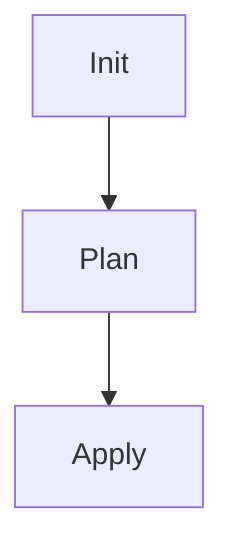

## Introduction to IaC and GitOps for DevSecOps

Infrastructure as Code (IaC) and GitOps are fundamental concepts in modern DevSecOps practices. IaC refers to the practice of managing and provisioning infrastructure through machine-readable definition files, rather than physical hardware configuration or interactive configuration tools. GitOps, on the other hand, extends IaC by using Git as a single source of truth for declarative infrastructure and application configurations. This approach ensures that all changes go through a pull request process, providing a transparent and auditable history of infrastructure changes.

### Key Concepts

#### Infrastructure as Code (IaC)

**What is IaC?**
Infrastructure as Code (IaC) is the practice of managing and provisioning infrastructure through machine-readable definition files. These files describe the desired state of the infrastructure, which can be deployed and managed using automation tools like Terraform, Ansible, or CloudFormation.

**Why is IaC important?**
- **Consistency**: Ensures that environments are consistently configured.
- **Reproducibility**: Allows for easy recreation of environments.
- **Version Control**: Facilitates tracking changes and rollbacks.
- **Automation**: Enables automated deployment and management of infrastructure.

**How does IaC work?**
IaC tools read the definition files and compare the current state of the infrastructure with the desired state. If there are discrepancies, the tools apply the necessary changes to align the current state with the desired state.

#### GitOps

**What is GitOps?**
GitOps is an operational framework that uses Git as a single source of truth for declarative infrastructure and application configurations. It extends IaC by incorporating continuous integration and delivery principles into infrastructure management.

**Why is GitOps important?**
- **Auditable History**: Provides a transparent and auditable history of infrastructure changes.
- **Collaboration**: Facilitates collaboration among teams through pull requests.
- **Automated Deployment**: Enables automated deployment and rollback processes.
- **Security**: Enhances security by ensuring that all changes go through a review process.

**How does GitOps work?**
In GitOps, the desired state of the infrastructure is stored in a Git repository. Any changes to the infrastructure are made through pull requests, which are reviewed and merged into the main branch. Once merged, the changes are automatically applied to the live environment.

### Setting Up a CI/CD Pipeline Using GitOps Principles

To build a CI/CD pipeline for infrastructure code using GitOps principles, we need to set up several components:

1. **Source Control Repository**: Store the infrastructure code in a Git repository.
2. **CI/CD Tool**: Use a CI/CD tool like GitLab CI/CD, Jenkins, or CircleCI to automate the build, test, and deploy processes.
3. **Runner Registration Token**: Securely manage the runner registration token used to authenticate runners in the CI/CD pipeline.

#### Source Control Repository

The first step is to set up a Git repository to store the infrastructure code. This repository will serve as the single source of truth for the infrastructure configurations.

```markdown
# Example Git Repository Structure

```
infrastructure/
├── README.md
├── .gitignore
├── main.tf
├── variables.tf
└── outputs.tf
```

- `README.md`: Contains documentation for the infrastructure code.
- `.gitignore`: Specifies files and directories to ignore during Git operations.
- `main.tf`: Main Terraform configuration file.
- `variables.tf`: Defines variables used in the Terraform configuration.
- `outputs.tf`: Defines outputs generated by the Terraform configuration.

#### CI/CD Tool Configuration

Next, we need to configure the CI/CD tool to automate the build, test, and deploy processes. In this example, we will use GitLab CI/CD.

##### Runner Registration Token

A runner registration token is used to authenticate runners in the CI/CD pipeline. This token should be securely managed to prevent unauthorized access.

```yaml
# .gitlab-ci.yml

stages:
  - init
  - plan
  - apply

variables:
  TF_VAR_runner_registration_token: $RUNNER_REGISTRATION_TOKEN

init:
  stage: init
  script:
    - terraform init
  artifacts:
    paths:
      - .terraform/

plan:
  stage: plan
  script:
    - terraform plan
  dependencies:
    - init

apply:
  stage: apply
  script:
    - terraform apply -auto-approve
  dependencies:
    - plan
```

- `TF_VAR_runner_registration_token`: Variable to store the runner registration token.
- `init`: Stage to initialize the Terraform configuration.
- `plan`: Stage to generate a Terraform plan.
- `apply`: Stage to apply the Terraform configuration.

### Terraform Init Command

The `terraform init` command initializes the Terraform working directory and downloads the necessary plugins and modules.

```bash
# Example Terraform Init Command

terraform init
```

When you run `terraform init`, Terraform performs the following actions:

1. **Download Plugins**: Downloads the required plugins for the providers specified in the configuration.
2. **Initialize State**: Initializes the state file to track the resources created by Terraform.
3. **Generate .terraform Directory**: Generates the `.terraform` directory, which contains the downloaded plugins and modules.

### Artifacts vs Cache

In the context of CI/CD pipelines, artifacts and cache are two mechanisms used to store and share data between stages.

#### Artifacts

Artifacts are files that are produced by a job and can be passed to subsequent jobs. They are stored in the CI/CD server and can be accessed by other jobs.

```yaml
# Example Artifacts Configuration

artifacts:
  paths:
    - .terraform/
```

- `paths`: Specifies the paths of the files to be stored as artifacts.

#### Cache

Cache is a mechanism used to store and reuse data between builds. It is typically used to speed up builds by avoiding the re-download of large dependencies.

```yaml
# Example Cache Configuration

cache:
  key: ${CI_COMMIT_REF_SLUG}
  paths:
    - .terraform/
```

- `key`: Specifies the key used to identify the cache.
- `paths`: Specifies the paths of the files to be cached.

### Comparison Between Artifacts and Cache

- **Ease of Use**: Artifacts are easier to use for passing multiple files between stages. Cache requires additional configuration to manage the cache keys and paths.
- **Persistence**: Artifacts are stored in the CI/CD server and can be accessed by other jobs. Cache is stored on the runner and is only available for subsequent builds.
- **Use Case**: Artifacts are typically used to pass build outputs between stages. Cache is typically used to speed up builds by avoiding the re-download of large dependencies.

### Example CI/CD Pipeline

Let's walk through a complete example of a CI/CD pipeline using GitOps principles.

#### Step 1: Initialize the Project

The first step is to initialize the project using the `terraform init` command.

```yaml
# .gitlab-ci.yml

init:
  stage: init
  script:
    - terraform init
  artifacts:
    paths:
      - .terraform/
```

- `script`: Runs the `terraform init` command.
- `artifacts`: Stores the `.terraform` directory as an artifact.

#### Step 2: Generate a Terraform Plan

The next step is to generate a Terraform plan using the `terraform plan` command.

```yaml
# .gitlab-ci.yml

plan:
  stage: plan
  script:
    - terraform plan
  dependencies:
    - init
```

- `dependencies`: Specifies that the `plan` stage depends on the `init` stage.
- `script`: Runs the `terraform plan` command.

#### Step 3: Apply the Terraform Configuration

The final step is to apply the Terraform configuration using the `terraform apply` command.

```yaml
# .gitlab-ci.yml

apply:
  stage: apply
  script:
    - terraform apply -auto-approve
  dependencies:
    - plan
```

- `dependencies`: Specifies that the `apply` stage depends on the `plan` stage.
- `script`: Runs the `terraform apply` command with the `-auto-approve` flag to automatically approve the changes.

### Mermaid Diagrams

#### CI/CD Pipeline Flow



- `Init`: Initializes the Terraform configuration.
- `Plan`: Generates a Terraform plan.
- `Apply`: Applies the Terraform configuration.

### Real-World Examples

#### Recent Breaches and CVEs

Recent breaches and CVEs have highlighted the importance of secure infrastructure management. For example, the SolarWinds breach (CVE-2020-1014) demonstrated the risks of supply chain attacks. By using GitOps principles, organizations can ensure that all infrastructure changes are tracked and audited, reducing the risk of unauthorized changes.

### Pitfalls and Best Practices

#### Common Mistakes

- **Hardcoding Secrets**: Hardcoding secrets in the configuration files can lead to exposure of sensitive information. Instead, use environment variables or secret management tools.
- **Ignoring Artifacts**: Ignoring artifacts can lead to inconsistencies between stages. Ensure that artifacts are properly configured to pass data between stages.
- **Manual Approvals**: Relying on manual approvals for changes can slow down the deployment process. Use automated approvals and rollbacks to ensure consistency and reliability.

#### Best Practices

- **Use Environment Variables**: Use environment variables to store sensitive information such as API keys and tokens.
- **Configure Artifacts**: Configure artifacts to pass data between stages.
- **Automate Approvals**: Automate approvals and rollbacks to ensure consistency and reliability.

### How to Prevent / Defend

#### Detection

- **Audit Logs**: Enable audit logs to track all changes made to the infrastructure.
- **Monitoring Tools**: Use monitoring tools to detect unauthorized changes and anomalies.

#### Prevention

- **Secret Management**: Use secret management tools to securely store and manage sensitive information.
- **Access Controls**: Implement access controls to restrict access to the infrastructure.

#### Secure Coding Fixes

#### Vulnerable Code

```yaml
# Vulnerable .gitlab-ci.yml

init:
  stage: init
  script:
    - terraform init
  artifacts:
    paths:
      - .terraform/
```

#### Fixed Code

```yaml
# Fixed .gitlab-ci.yml

init:
  stage: init
  script:
    - terraform init
  artifacts:
    paths:
      - .terraform/
  variables:
    TF_VAR_runner_registration_token: $RUNNER_REGISTRATION_TOKEN
```

- `variables`: Adds the `TF_VAR_runner_registration_token` variable to securely store the runner registration token.

### Conclusion

Building a CI/CD pipeline for infrastructure code using GitOps principles is essential for modern DevSecOps practices. By using IaC and GitOps, organizations can ensure that their infrastructure is consistently configured, reproducible, and auditable. This approach also enables automated deployment and rollback processes, enhancing security and reliability.

### Practice Labs

For hands-on experience with IaC and GitOps, consider the following practice labs:

- **PortSwigger Web Security Academy**: Focuses on web application security but includes modules on IaC and GitOps.
- **OWASP Juice Shop**: A deliberately insecure web application for learning about web security, including IaC and GitOps.
- **DVWA (Damn Vulnerable Web Application)**: Another web application for learning about web security, including IaC and GitOps.
- **WebGoat**: An interactive web application for learning about web security, including IaC and GitOps.

These labs provide practical experience with IaC and GitOps principles, helping you to master these concepts in a real-world setting.

---
<!-- nav -->
[[DevSecOps/DevSecOps Bootcamp/04-Infrastructure Security/02-IaC and GitOps for DevSecOps/Build CICD Pipeline for Infrastructure Code using GitOps Principles/00-Overview|Overview]] | [[DevSecOps/DevSecOps Bootcamp/04-Infrastructure Security/02-IaC and GitOps for DevSecOps/Build CICD Pipeline for Infrastructure Code using GitOps Principles/02-Introduction to IaC and GitOps for DevSecOps|Introduction to IaC and GitOps for DevSecOps]]
