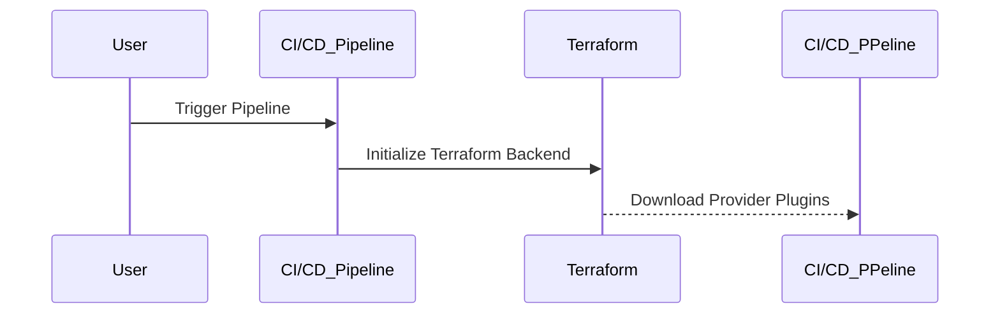
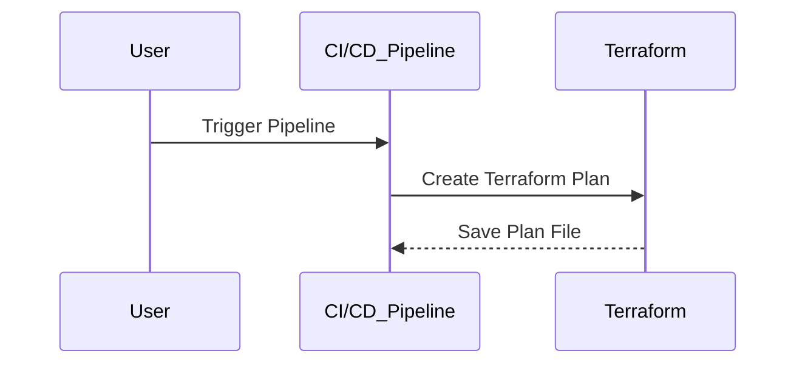
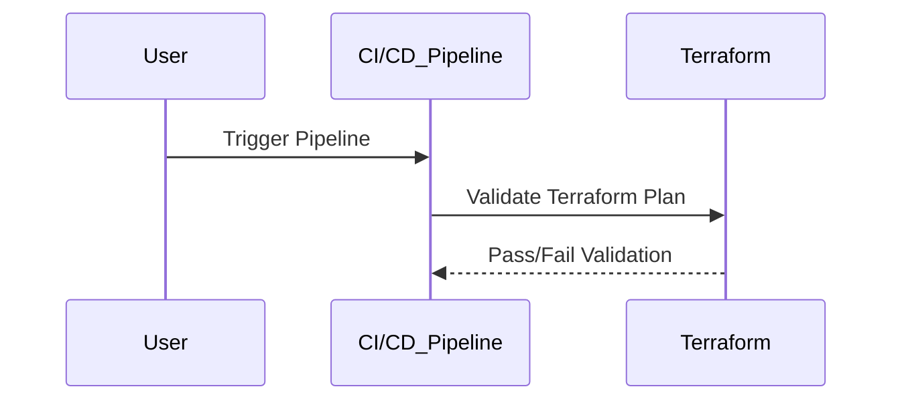
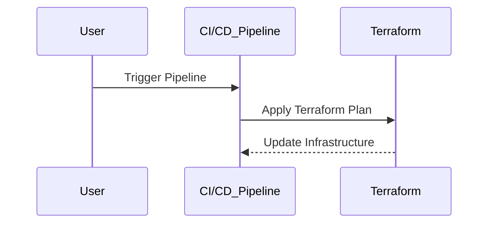

## Introduction to Infrastructure as Code (IaC) and GitOps for DevSecOps

Infrastructure as Code (IaC) is a practice where infrastructure is defined using code, rather than physical hardware configurations. This allows for automation, consistency, and version control of infrastructure changes. GitOps is a set of practices that uses Git as a single source of truth for all infrastructure and application configurations. By combining IaC and GitOps, organizations can achieve a robust and secure Continuous Integration and Continuous Deployment (CI/CD) pipeline for their infrastructure code.

### Background Theory

#### What is Infrastructure as Code (IaC)?

Infrastructure as Code (IaC) is the process of managing and provisioning computer data centers through machine-readable definition files, rather than physical hardware configuration or interactive configuration tools. This approach allows for:

- **Automation**: Infrastructure can be deployed and managed automatically, reducing human error.
- **Consistency**: The same definitions can be used across multiple environments, ensuring consistency.
- **Version Control**: Infrastructure changes can be tracked and rolled back if necessary.

Popular IaC tools include Terraform, Ansible, and CloudFormation.

#### What is GitOps?

GitOps is a set of practices that uses Git as a single source of truth for all infrastructure and application configurations. Key principles of GitOps include:

- **Declarative Configuration**: All infrastructure and application configurations are defined declaratively in Git.
- **Continuous Delivery**: Changes to the configuration are automatically applied to the live system.
- **Pull Requests**: Changes are proposed via pull requests, allowing for peer review and approval processes.
- **Automated Rollbacks**: In case of issues, the system can be rolled back to a previous known good state.

### Build CI/CD Pipeline for Infrastructure Code Using GitOps Principles

To build a CI/CD pipeline for infrastructure code using GitOps principles, we need to define and automate several stages. These stages typically include initialization, building, testing, and deploying the infrastructure.

#### Initialization Stage

The initialization stage is crucial for setting up the environment and downloading necessary dependencies. In the context of Terraform, this involves initializing the Terraform backend and downloading provider plugins.



**Configuration Example**

Here is an example of a CI/CD pipeline configuration for the initialization stage using GitLab CI/CD:

```yaml
stages:
  - init
  - build
  - test
  - deploy

init_terraform:
  stage: init
  script:
    - terraform init
  artifacts:
    paths:
      - .terraform/
      - .terraform.lock.hcl
```

**Explanation**

- `terraform init`: Initializes the Terraform backend and downloads provider plugins.
- `artifacts`: Specifies the paths to save the `.terraform` directory and the `.terraform.lock.hcl` file.

#### Build Stage

The build stage involves creating a Terraform plan file, which represents the desired state of the infrastructure. This plan file is then used in subsequent stages for deployment.



**Configuration Example**

Here is an example of a CI/CD pipeline configuration for the build stage using GitLab CI/CD:

```yaml
build_terraform_plan:
  stage: build
  script:
    - terraform plan -out=tfplan
  artifacts:
    paths:
      - tfplan
```

**Explanation**

- `terraform plan -out=tfplan`: Creates a Terraform plan file named `tfplan`.
- `artifacts`: Specifies the path to save the `tfplan` file.

#### Testing Stage

The testing stage involves validating the Terraform plan file to ensure it meets the desired state and does not introduce any unintended changes.



**Configuration Example**

Here is an example of a CI/CD pipeline configuration for the testing stage using GitLab CI/CD:

```yaml
test_terraform_plan:
  stage: test
  script:
    - terraform validate
  dependencies:
    - build_terraform_plan
```

**Explanation**

- `terraform validate`: Validates the Terraform configuration files.
- `dependencies`: Specifies that this job depends on the `build_terraform_plan` job.

#### Deploy Stage

The deploy stage involves applying the Terraform plan file to the live infrastructure. This stage should be carefully controlled to avoid unintended changes.



**Configuration Example**

Here is an example of a CI/CD pipeline configuration for the deploy stage using GitLab CI/CD:

```yaml
deploy_terraform:
  stage: deploy
  script:
    - terraform apply tfplan
  dependencies:
    - test_terraform_plan
```

**Explanation**

- `terraform apply tfplan`: Applies the Terraform plan file to the live infrastructure.
- `dependencies`: Specifies that this job depends on the `test_terraform_plan` job.

### Handling Artifacts and Caching

Artifacts and caching are essential for optimizing the CI/CD pipeline. Artifacts allow for sharing files between stages, while caching reduces the time required to download dependencies.

#### Artifacts

Artifacts are files that are produced during the CI/CD pipeline and can be shared between stages. In the context of Terraform, artifacts include the `.terraform` directory and the `.terraform.lock.hcl` file.

**Example**

```yaml
artifacts:
  paths:
    - .terraform/
    - .terraform.lock.hcl
```

#### Caching

Caching allows for storing and reusing dependencies between pipeline runs. In GitLab CI/CD, caching can be configured to store the `.terraform` directory and the `.terraform.lock.hcl` file.

**Example**

```yaml
cache:
  key: "$CI_COMMIT_REF_SLUG"
  paths:
    - .terraform/
    - .terraform.lock.hcl
```

### Real-World Examples and Recent Breaches

Recent breaches and vulnerabilities have highlighted the importance of secure CI/CD pipelines. For example, the SolarWinds breach in 2020 demonstrated the risks of supply chain attacks. In this case, attackers compromised the SolarWinds software update mechanism, allowing them to inject malicious code into legitimate updates.

To mitigate such risks, organizations should implement strict access controls, regular audits, and secure coding practices. For example, using signed and verified artifacts, and implementing multi-factor authentication for critical systems.

### How to Prevent / Defend

#### Detection

Detection involves monitoring the CI/CD pipeline for suspicious activities. This can be achieved through logging and alerting mechanisms. For example, using tools like Splunk or ELK Stack to monitor pipeline logs and trigger alerts for unusual activities.

#### Prevention

Prevention involves implementing secure coding practices and access controls. For example, using signed and verified artifacts, and implementing multi-factor authentication for critical systems.

#### Secure Coding Fixes

Here is an example of a vulnerable and secure version of a Terraform configuration:

**Vulnerable Version**

```hcl
provider "aws" {
  region = "us-east-1"
}

resource "aws_instance" "example" {
  ami           = "ami-0c55b159cbfafe1f0"
  instance_type = "t2.micro"
}
```

**Secure Version**

```hcl
provider "aws" {
  region = "us-east-1"
  profile = "default"
}

resource "aws_instance" "example" {
  ami           = "ami-0c55b159cbfafe1f0"
  instance_type = "t2.micro"
  tags = {
    Name = "secure-instance"
  }
}
```

**Explanation**

- `profile = "default"`: Specifies the AWS profile to use, which should be securely configured with limited permissions.
- `tags`: Adds descriptive tags to the resource, which can help with auditing and management.

### Conclusion

By combining Infrastructure as Code (IaC) and GitOps principles, organizations can achieve a robust and secure CI/CD pipeline for their infrastructure code. This approach allows for automation, consistency, and version control of infrastructure changes, while also providing mechanisms for detection and prevention of security threats.

### Hands-On Labs

For hands-on practice with IaC and GitOps, consider the following labs:

- **PortSwigger Web Security Academy**: Offers a variety of labs focused on web application security, including some that touch on IaC and GitOps principles.
- **OWASP Juice Shop**: A deliberately insecure web application for security training purposes, which can be used to practice securing CI/CD pipelines.
- **CloudGoat**: A series of labs designed to teach cloud security concepts, including IaC and GitOps.

These labs provide practical experience in implementing and securing CI/CD pipelines using IaC and GitOps principles.

---
<!-- nav -->
[[DevSecOps/DevSecOps Bootcamp/04-Infrastructure Security/02-IaC and GitOps for DevSecOps/Build CICD Pipeline for Infrastructure Code using GitOps Principles/02-Introduction to IaC and GitOps for DevSecOps|Introduction to IaC and GitOps for DevSecOps]] | [[DevSecOps/DevSecOps Bootcamp/04-Infrastructure Security/02-IaC and GitOps for DevSecOps/Build CICD Pipeline for Infrastructure Code using GitOps Principles/00-Overview|Overview]] | [[04-Introduction to Infrastructure as Code (IaC) and GitOps for DevSecOps|Introduction to Infrastructure as Code (IaC) and GitOps for DevSecOps]]
