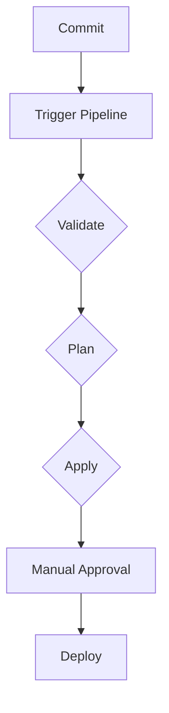

## Introduction to Infrastructure as Code (IaC) and GitOps

Infrastructure as Code (IaC) is a practice where infrastructure is defined and managed through machine-readable files, rather than manual processes. This approach allows for automation, consistency, and version control of infrastructure configurations. GitOps is an extension of this principle, where the desired state of the infrastructure is stored in a Git repository, and changes are made via pull requests, following the same principles used for application code.

### Background Theory

#### What is Infrastructure as Code?

Infrastructure as Code (IaC) involves treating infrastructure like software. Instead of manually configuring servers, databases, and other components, you define them in code. This code can then be version-controlled, tested, and deployed automatically. Tools like Terraform, Ansible, and CloudFormation are commonly used for IaC.

**Why Use IaC?**
- **Consistency**: Ensures that environments are consistently configured.
- **Automation**: Reduces manual errors and speeds up deployment.
- **Version Control**: Allows tracking changes and rollbacks.
- **Reproducibility**: Makes it easy to replicate environments.

#### What is GitOps?

GitOps extends IaC by using Git as the single source of truth for infrastructure. Changes to the infrastructure are made via pull requests, and the actual deployment is automated. This ensures that all changes are reviewed and audited, similar to how code changes are handled.

**Why Use GitOps?**
- **Auditability**: Every change is tracked via Git.
- **Collaboration**: Multiple team members can contribute to infrastructure changes.
- **Automated Deployment**: Continuous integration and continuous delivery (CI/CD) pipelines can automatically deploy changes.
- **Rollback Mechanism**: Easy to revert to previous states.

### Real-World Examples

#### Recent Breaches and CVEs

One notable breach involving IaC was the Capital One data breach in 2019. The breach occurred due to misconfigured AWS S3 buckets, which could have been prevented with proper IaC practices. By defining and managing infrastructure in code, such misconfigurations can be caught during code reviews and automated tests.

Another example is the Equifax breach in 2017, where a misconfigured Apache Struts server led to the exposure of sensitive data. Proper IaC and GitOps practices would have helped ensure that the server was correctly configured and that changes were audited.

### Setting Up a CI/CD Pipeline for IaC Using GitOps Principles

To build a CI/CD pipeline for infrastructure code using GitOps principles, we'll use Terraform as the IaC tool and GitLab as the CI/CD platform.

#### Step-by-Step Mechanics

1. **Define Infrastructure in Code**: Write Terraform configuration files to define your infrastructure.
2. **Store in Git Repository**: Store these configuration files in a Git repository.
3. **Set Up CI/CD Pipeline**: Configure a CI/CD pipeline in GitLab to automatically apply changes.
4. **Manage Secrets Securely**: Use environment variables to manage secrets securely.

### Detailed Example

#### Define Infrastructure in Code

Let's start by defining a simple AWS EC2 instance using Terraform:

```hcl
provider "aws" {
  region = var.region
}

resource "aws_instance" "example" {
  ami           = "ami-0c55b159cbfafe1f0"
  instance_type = "t2.micro"

  tags = {
    Name = "example-instance"
  }
}
```

#### Store in Git Repository

Push the above Terraform configuration to a Git repository. For example, you might have a `terraform` directory in your repository containing the `main.tf` file.

#### Set Up CI/CD Pipeline

In GitLab, you can set up a CI/CD pipeline to automatically apply Terraform changes. Here’s an example `.gitlab-ci.yml` file:

```yaml
stages:
  - validate
  - plan
  - apply

validate:
  stage: validate
  script:
    - terraform init
    - terraform validate

plan:
  stage: plan
  script:
    - terraform init
    - terraform plan -out=tfplan

apply:
  stage: apply
  script:
    - terraform init
    - terraform apply -auto-approve tfplan
  when: manual
```

This pipeline includes three stages:
- **Validate**: Checks the Terraform configuration.
- **Plan**: Generates a plan of the changes to be applied.
- **Apply**: Applies the changes manually.

#### Manage Secrets Securely

To manage secrets securely, you can use GitLab CI/CD variables. In the GitLab project settings, go to `Settings > CI/CD > Variables` and add the necessary variables:

- `AWS_ACCESS_KEY_ID`
- `AWS_SECRET_ACCESS_KEY`
- `AWS_DEFAULT_REGION`
- `GITLAB_RUNNER_TOKEN`

These variables will be available in the CI/CD pipeline without being exposed in the code.

### Full Raw HTTP Message Example

When setting up the CI/CD pipeline, you might interact with GitLab's API to manage variables. Here’s an example of a full HTTP request and response:

#### Request

```http
POST /api/v4/projects/:id/variables HTTP/1.1
Host: gitlab.com
Authorization: Bearer <your_access_token>
Content-Type: application/json

{
  "key": "AWS_ACCESS_KEY_ID",
  "value": "<your_aws_access_key_id>",
  "masked": true,
  "environment_scope": "*"
}
```

#### Response

```http
HTTP/1.1 201 Created
Content-Type: application/json

{
  "key": "AWS_ACCESS_KEY_ID",
  "value": "<redacted>",
  "variable_type": "env_var",
  "protected": false,
  "masked": true,
  "environment_scope": "*",
  "category": "custom",
  "raw_value": "<redacted>"
}
```

### Diagrams

#### Mermaid Diagram: CI/CD Pipeline Flow



### Common Pitfalls and How to Avoid Them

#### Pitfall: Hardcoding Secrets in Configuration Files

Hardcoding secrets in configuration files can lead to security vulnerabilities. Always use environment variables or secret management tools.

**Secure Fix**

Instead of hardcoding secrets:

```hcl
provider "aws" {
  access_key = "hardcoded_key"
  secret_key = "hardcoded_secret"
  region     = "us-west-2"
}
```

Use environment variables:

```hcl
provider "aws" {
  access_key = var.aws_access_key_id
  secret_key = var.aws_secret_access_key
  region     = var.aws_default_region
}
```

And define the variables in GitLab CI/CD settings.

### Detection and Prevention

#### Detection

Regularly audit your Git repository and CI/CD pipeline for hardcoded secrets. Tools like `trufflehog` can help detect secrets in your codebase.

#### Prevention

- **Use Environment Variables**: Store secrets in environment variables.
- **Secret Management Tools**: Use tools like HashiCorp Vault or AWS Secrets Manager.
- **Code Reviews**: Ensure all changes are reviewed for security issues.

### Secure Coding Fixes

#### Vulnerable Code

```hcl
provider "aws" {
  access_key = "hardcoded_key"
  secret_key = "hardcoded_secret"
  region     = "us-west-2"
}
```

#### Secure Code

```hcl
provider "aws" {
  access_key = var.aws_access_key_id
  secret_key = var.aws_secret_access_key
  region     = var.aws_default_region
}
```

### Hands-On Labs

For hands-on practice, consider the following labs:

- **PortSwigger Web Security Academy**: Focuses on web application security but also covers IaC and GitOps principles.
- **OWASP Juice Shop**: A deliberately insecure web application for practicing security skills.
- **DVWA (Damn Vulnerable Web Application)**: Another web application for learning security concepts.
- **WebGoat**: An interactive training application for learning about web application security.

### Conclusion

By implementing Infrastructure as Code and GitOps principles, you can significantly improve the security and reliability of your infrastructure. Properly managing secrets, automating deployments, and using version control can help prevent many common security issues. Regular audits and code reviews are essential to maintaining a secure environment.

---
<!-- nav -->
[[05-Introduction to Infrastructure as Code (IaC) and GitOps Part 1|Introduction to Infrastructure as Code (IaC) and GitOps Part 1]] | [[DevSecOps/DevSecOps Bootcamp/04-Infrastructure Security/02-IaC and GitOps for DevSecOps/Build CICD Pipeline for Infrastructure Code using GitOps Principles/00-Overview|Overview]] | [[07-Introduction to Infrastructure as Code (IaC) and GitOps|Introduction to Infrastructure as Code (IaC) and GitOps]]
