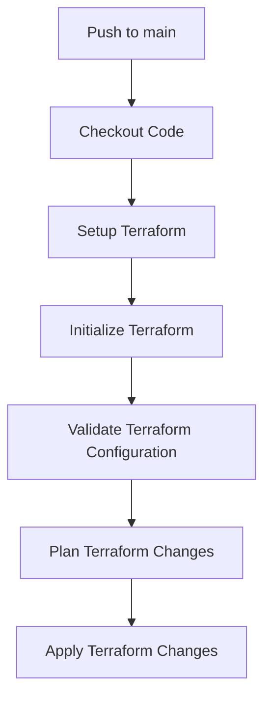

## Directory Structure

- `main.tf`: Main Terraform configuration file.
- `variables.tf`: Variables used in the Terraform configuration.
- `outputs.tf`: Outputs generated by the Terraform configuration.
```

```terraform
// main.tf
provider "aws" {
  region = var.region
}

resource "aws_instance" "example" {
  ami           = "ami-0c94855ba95b79819"
  instance_type = "t2.micro"

  tags = {
    Name = "example-instance"
  }
}
```

```terraform
// variables.tf
variable "region" {
  description = "The AWS region to deploy to."
  default     = "us-west-2"
}
```

```terraform
// outputs.tf
output "instance_id" {
  value = aws_instance.example.id
}
```

### Leveraging Git Workflows for IaC

Just like application code, infrastructure as code can leverage Git workflows such as pull requests and code reviews. This ensures that changes are thoroughly reviewed and tested before being deployed.

#### Example: Pull Request Workflow

1. **Create a Feature Branch**:
   ```bash
   git checkout -b feature/new-infra
   ```

2. **Make Changes**:
   Modify the Terraform configuration files as needed.

3. **Commit Changes**:
   ```bash
   git add .
   git commit -m "Add new infrastructure resource"
   ```

4. **Push to Remote Repository**:
   ```bash
   git push origin feature/new-infra
   ```

5. **Create a Pull Request**:
   Open a pull request in the GitHub repository for review.

6. **Code Review**:
   Other team members review the changes and provide feedback.

7. **Merge Pull Request**:
   Once the changes are approved, merge the pull request into the main branch.

### Creating a CI/CD Pipeline for IaC

To automate the deployment and management of infrastructure, we can create a CI/CD pipeline for our IaC changes. This pipeline will trigger whenever changes are pushed to the repository.

#### Example: CI/CD Pipeline with GitHub Actions

We can use GitHub Actions to create a CI/CD pipeline for our IaC project.

```yaml
# .github/workflows/ci-cd.yml
name: CI/CD Pipeline

on:
  push:
    branches:
      - main

jobs:
  build:
    runs-on: ubuntu-latest

    steps:
    - name: Checkout Code
      uses: actions/checkout@v2

    - name: Setup Terraform
      uses: hashicorp/setup-terraform@v1

    - name: Initialize Terraform
      run: terraform init

    - name: Validate Terraform Configuration
      run: terraform validate

    - name: Plan Terraform Changes
      run: terraform plan

    - name: Apply Terraform Changes
      run: terraform apply -auto-approve
```

### Mermaid Diagram: CI/CD Pipeline Flow



### Real-World Examples and CVEs

#### Example: CVE-2021-21277

In 2021, a critical vulnerability was discovered in Terraform (CVE-2021-21277). This vulnerability allowed attackers to execute arbitrary code on the host machine by manipulating the Terraform state file. This highlights the importance of securing your IaC and ensuring that your CI/CD pipeline includes security checks.

#### How to Prevent / Defend

1. **Secure Your State File**: Ensure that your Terraform state file is encrypted and securely stored.
2. **Use Secure Credentials**: Use secure methods to store and manage credentials, such as AWS Secrets Manager or HashiCorp Vault.
3. **Regular Security Audits**: Regularly audit your IaC and CI/CD pipeline for security vulnerabilities.
4. **Automated Security Checks**: Integrate security scanning tools into your CI/CD pipeline to detect and mitigate vulnerabilities.

### Complete Example: Vulnerable vs. Secure IaC

#### Vulnerable IaC

```terraform
// main.tf
provider "aws" {
  region = var.region
}

resource "aws_instance" "example" {
  ami           = "ami-0c94855ba95b79819"
  instance_type = "t2.micro"

  tags = {
    Name = "example-instance"
  }

  user_data = <<-EOF
              #!/bin/bash
              echo "Hello, World!" > /tmp/hello.txt
              EOF
}
```

#### Secure IaC

```terraform
// main.tf
provider "aws" {
  region = var.region
}

resource "aws_instance" "example" {
  ami           = "ami-0c94855ba95b79819"
  instance_type = "t2.micro"

  tags = {
    Name = "example-instance"
  }

  user_data = <<-EOF
              #!/bin/bash
              echo "Hello, World!" > /tmp/hello.txt
              chmod 600 /tmp/hello.txt
              EOF
}
```

### How to Prevent / Defend

1. **Secure User Data**: Ensure that user data is securely managed and does not expose sensitive information.
2. **Use IAM Roles**: Use IAM roles to grant permissions to EC2 instances instead of hardcoding credentials.
3. **Regular Security Audits**: Regularly audit your IaC and CI/CD pipeline for security vulnerabilities.
4. **Automated Security Checks**: Integrate security scanning tools into your CI/CD pipeline to detect and mitigate vulnerabilities.

### Hands-On Labs

For hands-on practice with IaC and GitOps, consider the following labs:

- **PortSwigger Web Security Academy**: Focuses on web application security but also covers IaC and GitOps principles.
- **OWASP Juice Shop**: A deliberately insecure web application for practicing security skills.
- **DVWA (Damn Vulnerable Web Application)**: Another web application for practicing security skills.
- **WebGoat**: An interactive training application for learning about web application security.

### Conclusion

By leveraging IaC and GitOps principles, teams can automate the provisioning and management of infrastructure, ensuring consistency, repeatability, and scalability. Integrating these practices into a CI/CD pipeline further enhances automation and security. By following best practices and regularly auditing your IaC and CI/CD pipeline, you can ensure that your infrastructure remains secure and reliable.

---
<!-- nav -->
[[07-Introduction to Infrastructure as Code (IaC) and GitOps|Introduction to Infrastructure as Code (IaC) and GitOps]] | [[DevSecOps/DevSecOps Bootcamp/04-Infrastructure Security/02-IaC and GitOps for DevSecOps/Build CICD Pipeline for Infrastructure Code using GitOps Principles/00-Overview|Overview]] | [[09-Implementing a CICD Pipeline for Infrastructure Code Using GitOps Principles|Implementing a CICD Pipeline for Infrastructure Code Using GitOps Principles]]
