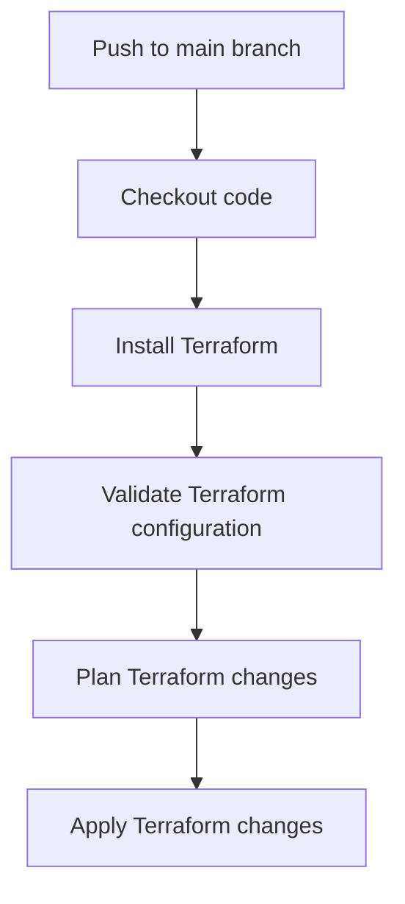

## Implementing a CI/CD Pipeline for Infrastructure Code Using GitOps Principles

### Setting Up the Environment

To implement a CI/CD pipeline for infrastructure code using GitOps principles, you need to set up the following components:

1. **Git Repository**: A central repository to store all infrastructure and application configurations.
2. **CI/CD Tool**: A tool to automate the build, test, and deployment processes.
3. **Infrastructure Provider**: A cloud provider or on-premises infrastructure to deploy the configurations.

#### Example Setup

Let's assume we are using the following tools:

- **Git Repository**: GitHub
- **CI/CD Tool**: GitHub Actions
- **Infrastructure Provider**: AWS

### Step-by-Step Implementation

#### 1. Initialize the Git Repository

First, create a new Git repository to store your infrastructure and application configurations.

```bash
# Create a new directory for your project
mkdir my-infrastructure-project
cd my-infrastructure-project

# Initialize a Git repository
git init

# Add a README file
echo "# My Infrastructure Project" >> README.md
git add README.md
git commit -m "Initial commit"
```

#### 2. Define Infrastructure as Code

Next, define your infrastructure using a tool like Terraform. Terraform is a popular IaC tool that allows you to define infrastructure in a declarative manner using HCL (HashiCorp Configuration Language).

```hcl
# main.tf
provider "aws" {
  region = "us-west-2"
}

resource "aws_instance" "example" {
  ami           = "ami-0c55b159cbfafe1f0"
  instance_type = "t2.micro"

  tags = {
    Name = "example-instance"
  }
}
```

Commit the Terraform configuration to your Git repository.

```bash
git add main.tf
git commit -m "Add Terraform configuration"
```

#### 3. Set Up GitHub Actions

GitHub Actions is a CI/CD platform that allows you to automate your build, test, and deployment processes. To set up GitHub Actions, create a `.github/workflows` directory in your repository and add a `ci.yml` file.

```yaml
# .github/workflows/ci.yml
name: CI/CD Pipeline

on:
  push:
    branches:
      - main
  pull_request:
    branches:
      - main

jobs:
  build:
    runs-on: ubuntu-latest

    steps:
    - name: Checkout code
      uses: actions/checkout@v2

    - name: Install Terraform
      run: |
        curl -fsSL https://apt.releases.hashicorp.com/gpg | sudo apt-key add -
        sudo apt-add-repository "deb [arch=amd64] https://apt.releases.hashicorp.com $(lsb_release -cs) main"
        sudo apt-get update && sudo apt-get install terraform

    - name: Validate Terraform configuration
      run: terraform validate

    - name: Plan Terraform changes
      run: terraform plan -out=tfplan

    - name: Apply Terraform changes
      run: terraform apply -auto-approve tfplan
```

Commit the GitHub Actions configuration to your Git repository.

```bash
git add .github/workflows/ci.yml
git commit -m "Add GitHub Actions configuration"
```

#### 4. Test and Deploy

Now that your CI/CD pipeline is set up, you can test and deploy your infrastructure changes. Any push to the `main` branch or pull request will trigger the pipeline, validating and deploying the changes.

### Mermaid Diagrams

#### CI/CD Pipeline Flow



### Real-World Examples

#### Recent Breaches and CVEs

One notable breach involving IaC was the Capital One data breach in 2019. The breach occurred due to misconfigured AWS S3 buckets, which were managed using IaC. This highlights the importance of proper configuration and validation of infrastructure as code.

#### Secure Coding Practices

To prevent such breaches, it is crucial to follow secure coding practices. For example, you should:

- **Use least privilege**: Ensure that your infrastructure configurations grant the minimum necessary permissions.
- **Validate configurations**: Regularly validate your infrastructure configurations to ensure they are secure.
- **Automate security checks**: Integrate security checks into your CI/CD pipeline to catch vulnerabilities early.

### How to Prevent / Defend

#### Detection

To detect misconfigurations and vulnerabilities, you can use tools like:

- **Terraform Validate**: Validates the syntax and structure of your Terraform configuration.
- **TFLint**: Lints Terraform configurations to identify potential issues.
- **Trivy**: Scans for vulnerabilities in your infrastructure configurations.

#### Prevention

To prevent misconfigurations and vulnerabilities, you can:

- **Use least privilege**: Ensure that your infrastructure configurations grant the minimum necessary permissions.
- **Validate configurations**: Regularly validate your infrastructure configurations to ensure they are secure.
- **Automate security checks**: Integrate security checks into your CI/CD pipeline to catch vulnerabilities early.

#### Secure-Coding Fixes

Here is an example of a vulnerable Terraform configuration and its secure counterpart:

**Vulnerable Configuration**

```hcl
resource "aws_s3_bucket" "example" {
  bucket = "my-bucket"
  acl    = "public-read"
}
```

**Secure Configuration**

```hcl
resource "aws_s3_bucket" "example" {
  bucket = "my-bucket"
  acl    = "private"
}
```

### Complete Example

#### Full HTTP Request and Response

Here is an example of a full HTTP request and response for a Terraform plan operation:

**HTTP Request**

```http
POST /terraform/plan HTTP/1.1
Host: api.example.com
Content-Type: application/json

{
  "configuration": {
    "bucket": "my-bucket",
    "acl": "private"
  }
}
```

**HTTP Response**

```http
HTTP/1.1 200 OK
Content-Type: application/json

{
  "status": "success",
  "message": "Terraform plan executed successfully"
}
```

### Common Mistakes and Pitfalls

#### Common Mistakes

- **Not validating configurations**: Failing to validate configurations can lead to misconfigurations and vulnerabilities.
- **Not automating security checks**: Not integrating security checks into your CI/CD pipeline can result in vulnerabilities going undetected.

#### Pitfalls

- **Over-provisioning permissions**: Granting more permissions than necessary can lead to security risks.
- **Ignoring validation errors**: Ignoring validation errors can result in misconfigurations and vulnerabilities.

### Hands-On Labs

For hands-on practice with IaC and GitOps, consider the following labs:

- **PortSwigger Web Security Academy**: Offers labs on web application security, including IaC and GitOps principles.
- **OWASP Juice Shop**: Provides a vulnerable web application for practicing security testing and IaC.
- **DVWA (Damn Vulnerable Web Application)**: Another vulnerable web application for practicing security testing and IaC.
- **WebGoat**: An interactive web application for learning about web security, including IaC and GitOps principles.

By following these steps and best practices, you can effectively implement a CI/CD pipeline for infrastructure code using GitOps principles, ensuring consistency, transparency, and security in your infrastructure management.

---
<!-- nav -->
[[08-Directory Structure|Directory Structure]] | [[DevSecOps/DevSecOps Bootcamp/04-Infrastructure Security/02-IaC and GitOps for DevSecOps/Build CICD Pipeline for Infrastructure Code using GitOps Principles/00-Overview|Overview]] | [[DevSecOps/DevSecOps Bootcamp/04-Infrastructure Security/02-IaC and GitOps for DevSecOps/Build CICD Pipeline for Infrastructure Code using GitOps Principles/10-Practice Questions & Answers|Practice Questions & Answers]]
